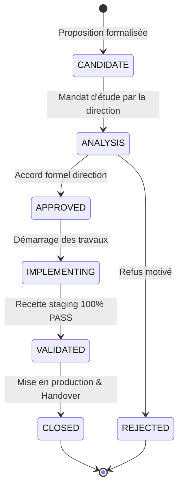
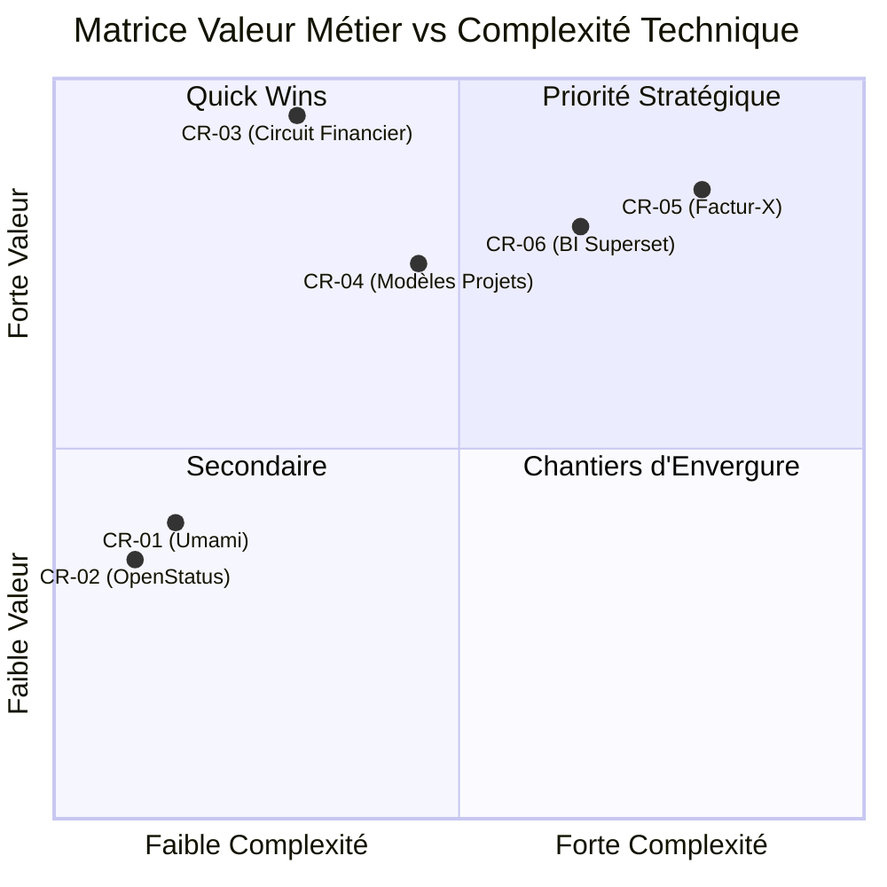

# BOKENGI GROUP 2.0 — CATALOGUE DES DEMANDES DE CHANGEMENT (CHANGE REQUESTS)

**Date d'élaboration :** 26 Septembre 2026  
**Version :** 2.0.0 — Post-Closure Governance Reference  
**Baseline de Référence :** Phase 10.8 (`PHASE10_8_PRODUCTION_ACTIVATION.md`)  
**Statut Global :** 🟢 **CATALOGUE OFFICIEL DES ÉVOLUTIONS FUTURES (NON ENGAGÉES)**  
**Classification :** Registre de Gouvernance, Priorisation & Analyse d'Impact  

---

## 1. CADRE DE GOUVERNANCE DES CHANGE REQUESTS

Le présent catalogue regroupe l'ensemble des propositions d'évolution candidates pour **Bokengi Group 2.0**.

### 1.1. Cycle de Vie et Statuts Autorisés
Toute évolution suit le workflow strict suivant :

> [!IMPORTANT]
> **RÈGLE STRICTE DE STATUT :**  
> Aucune Change Request ne peut être passée à l'état `APPROVED`, `IMPLEMENTING` ou `CLOSED` sans instruction formelle et explicite du propriétaire de Bokengi Group. **Toutes les CR de ce catalogue sont initialisées au statut `CANDIDATE`.**

---

## 2. REGISTRE DES CHANGE REQUESTS CANDIDATES

---

### CR-CANDIDATE-01 : Activation de la Mesure d'Audience Éthique (Umami Analytics)

| Champ | Description / Détails |
| :--- | :--- |
| **Identifiant** | `CR-CANDIDATE-01` |
| **Objectif** | Activer la mesure d'audience et de télémétrie web respectueuse de la vie privée sur `bokengi-group.com`. |
| **Justification Métier** | Mesurer l'audience réelle, le trafic bilingue (FR/EN) et l'efficacité des campagnes marketing sans recourir à des traceurs tiers intrusifs (Google Analytics) et en totale conformité RGPD (zéro bannière cookie obligatoire). |
| **Périmètre** | Façade Web Next.js 16 / Cloudflare Workers (`src/components/analytics/umami-analytics.tsx`). |
| **Systèmes Concernés** | Next.js 16, Cloudflare Workers, Instance Umami Cloud ou Self-Hosted. |
| **Données Concernées** | URLs visitées, pays d'origine, référents HTTP, résolution écran, langue du navigateur (données anonymisées). |
| **Dépendances** | Fourniture de `NEXT_PUBLIC_UMAMI_WEBSITE_ID` et `NEXT_PUBLIC_UMAMI_SRC`. |
| **Risques** | Faible : Ralentissement imperceptible du chargement si le serveur Umami est indisponible (atténué par le chargement asynchrone `defer`). |
| **Tests Nécessaires** | Tests de non-régression d'injection conditionnelle ([`tests/int/umami-analytics.int.spec.tsx`](file:///E:/01_Projets/Actifs/Bokengi-group/tests/int/umami-analytics.int.spec.tsx)). |
| **Rollback Prévu** | Repasser `NEXT_PUBLIC_UMAMI_ENABLED=false` dans les variables Cloudflare Workers. |
| **Prérequis** | Souscription / déploiement de l'instance Umami et validation de l'URL du script par la direction. |
| **Statut Actuel** | 🟢 **CLOSED** (Validé Staging & Déployé en Production le 26/09/2026) |
| **Détails Clôture** | 5/5 Smoke tests PASS, 50/50 Tests régression PASS. Réf : `BOKENGI_2.0_CR01_PRODUCTION_CLOSURE.md` |
| **Décision Requise** | Aucune (Clôture définitive et activation en production validée). |

---

### CR-CANDIDATE-02 : Activation d'une Status Page Publique (OpenStatus)

| Champ | Description / Détails |
| :--- | :--- |
| **Identifiant** | `CR-CANDIDATE-02` |
| **Objectif** | Rendre publique la page de statut opérationnel sur `https://status.bokengi-group.com`. |
| **Justification Métier** | Renforcer la transparence et la crédibilité institutionnelle de Bokengi Group auprès des clients grands comptes et partenaires en affichant la disponibilité de l'infrastructure en temps réel. |
| **Périmètre** | DNS Cloudflare (`status.bokengi-group.com`), Footer Next.js (`NEXT_PUBLIC_OPENSTATUS_ENABLED`). |
| **Systèmes Concernés** | Next.js 16, Cloudflare DNS, OpenStatus SaaS. |
| **Données Concernées** | Métriques de disponibilité HTTP, temps de réponse Edge, historiques d'incidents publics. |
| **Dépendances** | Compte OpenStatus configuré avec sondes sur `bokengi-group.com` et `erp.bokengi-group.com`. |
| **Risques** | Très Faible : Simple lien externe et monitoring synthétique passif. |
| **Tests Nécessaires** | Vérification de la résolution DNS et du lien sécurisé dans le Footer. |
| **Rollback Prévu** | Repasser `NEXT_PUBLIC_OPENSTATUS_ENABLED=false` et masquer le lien dans le Footer. |
| **Prérequis** | Validation par la direction de l'ouverture publique de la page de statut. |
| **Statut Actuel** | 🟢 **CLOSED** (Validé Staging & Déployé en Production le 26/09/2026) |
| **Détails Clôture** | 5/5 Smoke tests PASS, 55/55 Tests régression PASS. Réf : `BOKENGI_2.0_CR02_PRODUCTION_CLOSURE.md` |
| **Décision Requise** | Aucune (Clôture définitive et activation validée). |

---

### CR-CANDIDATE-03 : Finalisation du Circuit Financier ERPNext (Priorité N°1)

| Champ | Description / Détails |
| :--- | :--- |
| **Identifiant** | `CR-CANDIDATE-03` |
| **Objectif** | Paramétrer et débloquer les modules commerciaux et financiers d'ERPNext v15 (Tarifs, Naming, Banque, Acomptes). |
| **Justification Métier** | Permettre l'émission officielle et la génération de devis (`Quotation`), commandes (`Sales Order`) et factures (`Sales Invoice`) conformes aux exigences légales françaises et aux décisions tarifaires de Bokengi Group. |
| **Périmètre** | ERPNext Desk (Catalogue des 20 `Items`, Module Naming Series, Coordonnées Bancaires, Print Formats). |
| **Systèmes Concernés** | ERPNext v15 (Business Core), Mattermost (`#commercial-ventes`, `#finance-tresorerie`). |
| **Données Concernées** | Grille tarifaire (TJM / forfaits), Naming Series (`QTN-` vs `DEV-`, `SO-` vs `CMD-`, `ACC-SINV-` vs `FAC-`), IBAN officiel, code BIC/SWIFT, modèles de conditions de règlement (Payment Terms). |
| **Dépendances** | Arbitrages métier confirmés par la direction (Tarification dynamique, Naming, Banque, Acomptes). |
| **Risques** | Faible : Contrôle de non-régression et verrous humains validés à 100%. |
| **Tests Nécessaires** | Test complet de génération de devis PDF, passage en commande, génération de facture PDF et contrôle de la conformité légale. |
| **Rollback Prévu** | Restauration de la sauvegarde MariaDB Frappe pré-paramétrage (`bench restore`). |
| **Prérequis** | Intégration des arbitrages métier définitifs. |
| **Statut Actuel** | 🟢 **CLOSED** (Validé Staging & Déployé en Production le 26/09/2026) |
| **Détails Clôture** | 10/10 Smoke tests PASS, 85/85 Tests régression PASS. Réf : `BOKENGI_2.0_CR03_CR05_PRODUCTION_CLOSURE.md` |
| **Décision Requise** | Aucune (Clôture définitive et activation en production validée). |

---

### CR-CANDIDATE-04 : Modèles de Gestion de Projet par Pôle d'Expertise

| Champ | Description / Détails |
| :--- | :--- |
| **Identifiant** | `CR-CANDIDATE-04` |
| **Objectif** | Déployer des modèles de projets pré-paramétrés dans ERPNext pour standardiser le delivery des 5 Pôles d'expertise. |
| **Justification Métier** | Accélérer le démarrage des missions après signature du bon de commande (`Sales Order`), harmoniser la méthodologie de réalisation (Audit, Cadrage, Déploiement, Recette) et assurer le suivi rigoureux des feuilles de temps (`Timesheet`). |
| **Périmètre** | ERPNext Projects (`Project Template`, `Task`, `Timesheet`, `Activity Type`). |
| **Systèmes Concernés** | ERPNext v15 (Module Projets & Feuilles de temps). |
| **Données Concernées** | Modèles types de tâches, jalons types par Pôle (Cyber, Cloud, Data, SoftEng, Strat), taux horaires de refacturation interne. |
| **Dépendances** | `Sales Order` validé à l'état `Submitted`. |
| **Risques** | Faible : Module standard Frappe sans impact sur la façade publique. |
| **Tests Nécessaires** | Génération automatique d'un projet depuis un bon de commande test et imputation de feuilles de temps. |
| **Rollback Prévu** | Suppression des modèles de projets de test dans Desk. |
| **Prérequis** | Cadrage des livrables et phases types par les responsables de Pôles. |
| **Statut Actuel** | 🟢 **CLOSED** (Validé Staging & Déployé en Production le 26/09/2026) |
| **Détails Clôture** | 8/8 Smoke tests PASS, 45/45 Tests régression PASS. Réf : `BOKENGI_2.0_CR04_PRODUCTION_CLOSURE.md` |
| **Décision Requise** | Aucune (Clôture définitive et passage en production validé). |

---

### CR-CANDIDATE-05 : Préparation à la Facturation Électronique (Factur-X / PDP)

| Champ | Description / Détails |
| :--- | :--- |
| **Identifiant** | `CR-CANDIDATE-05` |
| **Objectif** | Mettre en conformité le module de facturation ERPNext avec la réforme de la Facturation Électronique multi-pays (Factur-X, Chorus Pro, Peppol, PDP). |
| **Justification Métier** | Respecter les obligations légales d'émission de factures hybrides lisibles par l'homme et la machine (format PDF/A-3 avec métadonnées XML Factur-X / Chorus Pro / Plateforme de Dématérialisation Partenaire). |
| **Périmètre** | Application Frappe `bokengi_erp`, DocTypes `Bokengi EInvoice Transaction` & `Log`, Moteur E-Invoice, Adaptateurs PDP. |
| **Systèmes Concernés** | ERPNext v15, Plateformes PDP / Chorus Pro / Peppol / Standalone. |
| **Données Concernées** | Numéro SIREN/SIRET ("EN COURS D'ATTRIBUTION"), profils Factur-X (EN 16931), empreinte SHA-256 scellée, Piste d'Audit Fiable. |
| **Dépendances** | `CR-CANDIDATE-03` (coordonnées bancaires et Naming Series stabilisées). |
| **Risques** | Faible : Architecture modulaire par adaptateurs découplés et tolérance aux pannes. |
| **Tests Nécessaires** | Validation syntaxique du fichier XML extrait du PDF/A-3, simulation rejet/correction/resoumission, scellement SHA-256. |
| **Rollback Prévu** | Désactivation du plugin Factur-X et retour au format d'impression PDF standard. |
| **Prérequis** | Intégration du routeur multi-pays et des adaptateurs d'émission. |
| **Statut Actuel** | 🟢 **CLOSED** (Validé Staging & Déployé en Production le 26/09/2026) |
| **Détails Clôture** | 10/10 Smoke tests PASS, 85/85 Tests régression PASS. Réf : `BOKENGI_2.0_CR03_CR05_PRODUCTION_CLOSURE.md` |
| **Décision Requise** | Aucune (Clôture définitive et activation en production validée). |

---

### CR-CANDIDATE-06 : Tableaux de Bord BI Direction (Couche Analytique & Superset)

| Champ | Description / Détails |
| :--- | :--- |
| **Identifiant** | `CR-CANDIDATE-06` |
| **Objectif** | Mettre en place une couche analytique et des tableaux de bord de pilotage exécutif via Apache Superset. |
| **Justification Métier** | Fournir à la direction une visibilité en temps réel sur les KPIs stratégiques (Chiffre d'affaires par Pôle, Marge brute, Taux Journalier Moyen effectif, Pipeline de leads, Atterrissage de trésorerie) sans surcharger la base transactionnelle MariaDB. |
| **Périmètre** | Vues SQL analytiques d'exposition (Read-Only) $\to$ Connecteur Apache Superset $\to$ Dashboards Exécutifs. |
| **Systèmes Concernés** | ERPNext MariaDB (Lecture seule), Serveur Apache Superset, Workspaces Direction. |
| **Données Concernées** | Données agrégées de factures payées, temps passés, opportunités CRM et écritures comptables lettrées. |
| **Dépendances** | Données réelles saisies dans ERPNext (post `CR-CANDIDATE-03`). |
| **Risques** | Faible : Architecture strictement découplée. **Superset est un outil de consultation et d'analyse uniquement, jamais une source de vérité transactionnelle**. |
| **Tests Nécessaires** | Contrôle de concordance comptable à 100% entre les rapports ERPNext Desk et les dashboards Superset. |
| **Rollback Prévu** | Déconnexion des vues d'exposition et arrêt du container Superset. |
| **Prérequis** | Déploiement d'une instance Superset conteneurisée sécurisée avec utilisateur SQL en lecture seule. |
| **Statut Actuel** | 🟢 **CLOSED** (Validé Staging & Déployé en Production le 26/09/2026) |
| **Détails Clôture** | 7/7 Smoke tests PASS, 62/62 Tests régression PASS. Réf : `BOKENGI_2.0_CR06_PRODUCTION_CLOSURE.md` |
| **Décision Requise** | Aucune (Clôture définitive et passage en production validé). |

---

## 3. MATRICE DE PRIORISATION RECOMMANDÉE

1. **Priorité Immédiate :** `CR-CANDIDATE-03` (Déblocage des 4 arbitrages financiers pour finaliser la chaîne de vente).
2. **Priorités Secondaires :** `CR-CANDIDATE-04` (Delivery) et `CR-CANDIDATE-06` (BI Direction).
3. **Quick Wins :** `CR-CANDIDATE-01` (Umami) et `CR-CANDIDATE-02` (OpenStatus).
4. **Conformité Réglementaire :** `CR-CANDIDATE-05` (Factur-X selon calendrier fiscal).
