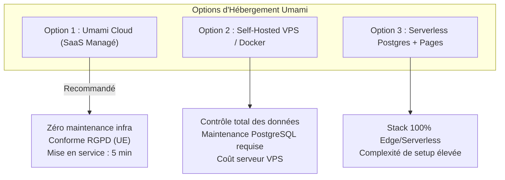

# BOKENGI GROUP 2.0 — AUDIT PRÉALABLE D'INTÉGRATION UMAMI (CR-01)

**Change Request :** `CR-01` — Activation de la Mesure d'Audience Éthique (Umami Analytics)  
**Date :** 26 Septembre 2026  
**Statut CR-01 :** 🟡 **CANDIDATE** (Audit Only — Aucun code ni déploiement engagé)  
**Baseline Canonique Préservée :** Phase 10.8  
**Classification :** Rapport d'Architecture & Analyse d'Impact Pré-Implémentation  

---

## 1. Contexte & Objectif de l'Audit

Cet audit a pour objectif exclusif d'évaluer la faisabilité technique, les dépendances et les options d'hébergement pour l'activation d'une mesure d'audience éthique (Umami) sur le site vitrine `bokengi-group.com`.

L'intégration doit respecter les principes fondamentaux de Bokengi Group :
- **Privacy-by-design & RGPD :** Mesure respectueuse de la vie privée, anonymisation native, 0 cookie tiers, conformité sans bannière intrusive.
- **Étanchéité totale :** Découplage strict avec ERPNext (Business Core) et les modules financiers.
- **Sécurité & Périmètre :** InfraPulse reste strictement exclu et aucune donnée sensible (CRM, devis, facturation) n'est transmise.

---

## 2. Analyse de l'Existant (Architecture Bokengi 2.0)

| Composant Système | État Actuel & Configuration | Impact / Relation Umami |
| :--- | :--- | :--- |
| **Façade Publique Next.js 16** | App Router bilingue (`/[locale]/*`), rendu Edge via Cloudflare Workers (`worker.ts`). | **Composant [`UmamiAnalytics.tsx`](file:///E:/01_Projets/Actifs/Bokengi-group/src/components/bokengi/UmamiAnalytics.tsx) déjà développé et intégré** dans le Layout global ([`layout.tsx`](file:///E:/01_Projets/Actifs/Bokengi-group/src/app/(frontend)/[locale]/layout.tsx#L152)). |
| **Mode Standby Actuel** | `NEXT_PUBLIC_UMAMI_ENABLED=false` (ou non défini). | **0 script injecté, 0 requête réseau générée, 0 cookie.** |
| **Tests d'Intégration** | Vitest suite dans [`tests/int/umami-analytics.int.spec.tsx`](file:///E:/01_Projets/Actifs/Bokengi-group/tests/int/umami-analytics.int.spec.tsx). | Suite complète validant le mode veille, le mode actif, le respect des props et l'étanchéité des secrets. |
| **Hébergement Umami** | **Inexistant dans l'infrastructure actuelle.** | Aucun serveur Umami ni base PostgreSQL analytique n'est actuellement instancié. |
| **ERPNext & MariaDB** | Dédié exclusivement au transactionnel métier (`erp.bokengi-group.com`). | Doit rester 100% isolé de la télémétrie web. |
| **Cloudflare DNS & Workers** | Gère le domaine `bokengi-group.com` et le routage Edge. | Peut accueillir soit les variables d'environnement Cloudflare, soit un CNAME / sous-domaine dédié. |

---

## 3. Ce qui Existe vs Ce qui Manque

### A. Ce qui Existe Déjà (100% Prêt côté Code)
1. **Composant UI/Script :** [`src/components/bokengi/UmamiAnalytics.tsx`](file:///E:/01_Projets/Actifs/Bokengi-group/src/components/bokengi/UmamiAnalytics.tsx) gère le chargement asynchrone non-bloquant (`strategy="afterInteractive"`), le data-auto-track et le nettoyage des variables d'environnement.
2. **Typage TypeScript :** [`src/environment.d.ts`](file:///E:/01_Projets/Actifs/Bokengi-group/src/environment.d.ts) déclare déjà les variables `NEXT_PUBLIC_UMAMI_*`.
3. **Tests de Non-Régression :** Tests d'étanchéité et d'injection conditionnelle validés.

### B. Ce qui Manque (Côté Infrastructure & Configuration)
1. **Instance Umami active :** Choix et instanciation du backend Umami (Collecteur + Interface de visualisation).
2. **Base de Données Analytique :** Base PostgreSQL requise par Umami (si option self-hosted).
3. **Identifiant de Site (`WEBSITE_ID`) :** UUID généré lors de la déclaration du site dans la console Umami.
4. **Variables de Production Cloudflare :** Renseignement des variables d'environnement dans `wrangler.jsonc` ou les secrets Cloudflare Workers.

---

## 4. Options d'Hébergement Identifiées

### Option 1 : Umami Cloud (SaaS Managé officiel) — ⭐ **RECOMMANDÉE**
- **Architecture :** Hébergement managé sur `cloud.umami.is` (serveurs situés dans l'Union Européenne).
- **Mise en œuvre :** Création du site sur le dashboard Umami Cloud $\to$ Récupération du `WEBSITE_ID`.
- **Script URL :** `https://analytics.umami.is/script.js` (valeur déjà configurée par défaut dans le composant).
- **Avantages :** Zéro maintenance, haute disponibilité garantie, sauvegardes automatiques, plan gratuit suffisant pour le démarrage (jusqu'à 10 000 événements/mois).
- **Inconvénients :** Dépendance vis-à-vis d'un service managé tiers (bien que strictement RGPD compliant et sans transfert de données personnelles).

### Option 2 : Self-Hosted Dédié (Docker Compose + PostgreSQL)
- **Architecture :** Instance Umami déployée sur un serveur VPS dédié sous `analytics.bokengi-group.com` avec une base PostgreSQL 15.
- **Mise en œuvre :** Provisionnement VM/VPS, configuration Docker, création du sous-domaine DNS Cloudflare et certificat SSL.
- **Script URL :** `https://analytics.bokengi-group.com/script.js`.
- **Avantages :** Souveraineté totale des données, hébergement 100% sous pavillon Bokengi Group.
- **Inconvénients :** Charge d'administration système, maintenance de la base PostgreSQL, monitoring et coûts de serveur additionnels.

---

## 5. Dépendances Minimales d'Activation

Pour passer CR-01 à l'état `APPROVED` puis `IMPLEMENTING`, les seules dépendances requises sont :

1. **Décision d'hébergement** par le propriétaire (Option 1 Cloud ou Option 2 Self-Hosted).
2. **Fourniture du `NEXT_PUBLIC_UMAMI_WEBSITE_ID`** (UUID à générer sur le compte Umami).
3. **Activation de la variable :** `NEXT_PUBLIC_UMAMI_ENABLED=true` dans les variables Cloudflare Workers.
4. *(Si Option 2)* : Déploiement préalable de l'instance serveur et du sous-domaine `analytics.bokengi-group.com`.

---

## 6. Analyse des Risques & Garanties de Sécurité

| Risque Potentiel | Niveau | Mesure d'Atténuation Validée |
| :--- | :---: | :--- |
| **Impact sur les Core Web Vitals / Performance** | Très Faible | Chargement asynchrone non-bloquant (`strategy="afterInteractive"`), script léger (< 5 Ko). |
| **Fuite de données personnelles / RGPD** | Nul | Umami ne collecte ni IP, ni cookies, ni données de formulaires. Les tests valident l'exclusion stricte des données CRM et financières. |
| **Indisponibilité du serveur Umami** | Nul | Si le collecteur est indisponible, le site `bokengi-group.com` continue de fonctionner sans aucune dégradation visible pour l'utilisateur. |
| **Impact sur ERPNext ou la Comptabilité** | Nul | Découplage strict. Aucune liaison avec MariaDB ni les APIs ERPNext. |
| **InfraPulse** | Nul | Totalement hors périmètre. |

---

## 7. Plan d'Implémentation Proposé (Post-Approbation)

Lorsque le mandat formel sera délivré par la direction :

1. **Étape 1 — Configuration Backend :**
   - Création du projet Umami (Cloud ou Self-Hosted) et génération du `WEBSITE_ID`.
2. **Étape 2 — Injection des Variables :**
   - Renseignement de `NEXT_PUBLIC_UMAMI_WEBSITE_ID` et `NEXT_PUBLIC_UMAMI_ENABLED=true` dans `wrangler.jsonc` (et variables d'environnement locales `.env.local`).
3. **Étape 3 — Validation Staging / Preview :**
   - Déploiement en prévisualisation Cloudflare et vérification de la bonne réception des événements sur le tableau de bord Umami.
4. **Étape 4 — Mise en Production & Clôture :**
   - Déploiement Workers en production et mise à jour du catalogue CR (`CR-01` $\to$ `CLOSED`).

---

## 8. Synthèse Finale & Décision Requise

- **EXISTANT :** Le composant Next.js, les types TypeScript, l'intégration layout et les tests Vitest sont **100% prêts et en veille sécurisée**.
- **MANQUANT :** Le compte/instance Umami et la clé `WEBSITE_ID`.
- **RISQUES :** 0 risque technique ou réglementaire identifié.
- **STATUT CR-01 :** Reste strictement 🟡 **`CANDIDATE`**.

### Décision Requise du Propriétaire :
> **La direction doit arbitrer entre :**
> 1. **Option 1 (Umami Cloud SaaS)** : Création d'un compte sur `cloud.umami.is` et fourniture du `WEBSITE_ID` pour activation rapide.
> 2. **Option 2 (Self-Hosted)** : Provisionnement d'un serveur dédié avec base PostgreSQL pour héberger l'instance Umami en propre.
