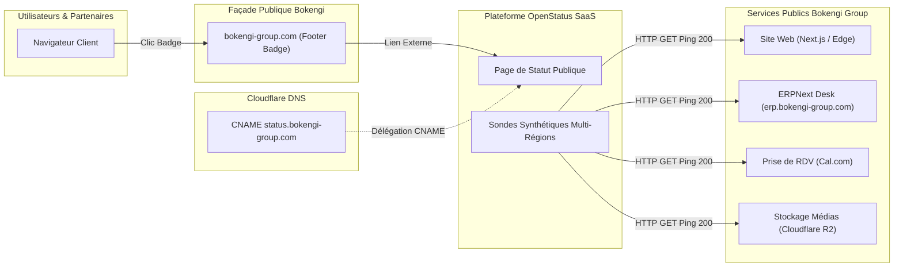

# BOKENGI GROUP 2.0 — AUDIT TECHNIQUE PRÉALABLE OPENSTATUS (CR-02)

**Demande de Changement :** `CR-02` — Activation d'une Status Page Publique (OpenStatus)  
**Date :** 26 Septembre 2026  
**Version :** 2.0.0 — Audit Only  
**Statut CR-02 :** 🟡 **CANDIDATE** (Aucune modification applicative ni de production effectuée)  
**Baseline Canonique Préservée :** Phase 10.8  
**Classification :** Rapport d'Audit & Cadrage d'Observabilité Publique  

---

## 1. Contexte & Objectifs de l'Audit

Cet audit technique examine la faisabilité, l'architecture d'hébergement, les dépendances et les frontières de sécurité pour l'activation d'une page de statut opérationnel publique pour **Bokengi Group** via OpenStatus sur `https://status.bokengi-group.com`.

### Règles d'Or et Périmètre
- **Audit exclusif :** Aucun code applicatif, configuration de production ou enregistrement DNS n'est modifié.
- **Étanchéité totale :** Séparation stricte avec le Business Core ERPNext et les modules financiers (**CR-03**).
- **Exclusion d'InfraPulse :** InfraPulse reste strictement et totalement hors périmètre.
- **Statut CR-02 :** Reste obligatoirement au statut 🟡 **`CANDIDATE`**.

---

## 2. Analyse de l'Existant dans le Repository

| Composant | Fichier / Emplacement | État Actuel |
| :--- | :--- | :--- |
| **Badge Frontend** | [`src/components/bokengi/OpenStatusBadge.tsx`](file:///E:/01_Projets/Actifs/Bokengi-group/src/components/bokengi/OpenStatusBadge.tsx) | **Prêt & Câblé** en mode Standby (`NEXT_PUBLIC_OPENSTATUS_ENABLED=false`). Rendu null par défaut, 0 coût de performance. |
| **Intégration Footer** | [`src/components/bokengi/Footer.tsx`](file:///E:/01_Projets/Actifs/Bokengi-group/src/components/bokengi/Footer.tsx#L100) | Badge intégré dans la barre inférieure du Footer, à côté du copyright et des mentions légales. |
| **Typage TypeScript** | [`src/environment.d.ts`](file:///E:/01_Projets/Actifs/Bokengi-group/src/environment.d.ts) | Déclaration des variables `NEXT_PUBLIC_OPENSTATUS_URL` et `NEXT_PUBLIC_OPENSTATUS_ENABLED`. |
| **Template d'Environnement** | [`.env.example`](file:///E:/01_Projets/Actifs/Bokengi-group/.env.example) | Présence des placeholders `https://status.bokengi-group.com` et `false`. |

---

## 3. Architecture d'Hébergement et Faisabilité DNS

### Faisabilité du Sous-Domaine `status.bokengi-group.com`
- **Résolution DNS :** Création d'un enregistrement CNAME dans la zone Cloudflare `bokengi-group.com` pointant vers le domaine cible fourni par OpenStatus.
- **Certificat SSL/TLS :** Certificat automatique via OpenStatus / Cloudflare Universal SSL.
- **Indépendance d'Incident :** Hébergée en SaaS externe, la page de statut reste 100% accessible même en cas d'indisponibilité totale du serveur ERPNext ou de l'Edge.

---

## 4. Périmètre d'Exposition & Informations Interdites

### A. Services Autorisés à Être Monitorés (Sondes Publiques)
1. **Façade Web Institutionnelle :** `https://bokengi-group.com` (Vérification 200 OK).
2. **Espace de Gestion ERPNext Desk :** `https://erp.bokengi-group.com` (Vérification de la page de login / health check).
3. **Agenda & Réservation :** `https://cal.com/bokengi-group` (Disponibilité service tiers).
4. **Passerelle d'Ingestion Webhooks :** Disponibilité de la route API publique.
5. **Distribution des Médias :** Bucket Cloudflare R2 (`bokengi-media`).

### B. Informations Strictement Interdites à la Publication
- ⛔ **InfraPulse :** Aucun composant, sonde, métrique ou nom lié à InfraPulse.
- ⛔ **Topologie Interne & Adresses IP :** Ne jamais publier les adresses IP privées/publiques du serveur MariaDB/VPS.
- ⛔ **Clés d'API & Secrets :** Aucune clé ERPNext, aucun secret HMAC Cal.com, aucun token Mattermost.
- ⛔ **Données Financières ou Métier :** Zéro donnée relative aux devis, factures, clients ou transactions.
- ⛔ **Logs Système / Stacktraces :** Les messages d'incident publics doivent être des synthèses rédigées à destination des utilisateurs, sans détails de débogage interne.

---

## 5. Méthode de Monitoring & Détection d'Incidents

1. **Sondes Périodiques Synthétiques :**
   - Requêtes `HTTP GET` toutes les 60 secondes depuis plusieurs nœuds géographiques (Europe de l'Ouest / Paris en priorité).
   - Seuils d'alerte : Statut $\neq 200$, temps de latence $> 2000$ ms, ou échec de négociation TLS.
2. **Gestion des Incidents :**
   - Dégradation signalée automatiquement après 2 échecs consécutifs.
   - Création et publication manuelle d'incidents (Maintenance planifiée, Incident en cours, Résolu) par l'administrateur Bokengi.

---

## 6. Dépendances Techniques & Credentials

| Dépendance | Nature | Gestion des Secrets |
| :--- | :--- | :--- |
| **Compte OpenStatus** | SaaS externe (openstatus.dev) | Identifiants administrateur gérés hors code dans le coffre-fort de la direction. |
| **CNAME Cloudflare** | Enregistrement DNS dans la zone `bokengi-group.com` | Aucune clé requise dans le repository. |
| **Variables Next.js** | `NEXT_PUBLIC_OPENSTATUS_ENABLED=true`, `NEXT_PUBLIC_OPENSTATUS_URL` | Variables publiques sans données sensibles. |

> [!IMPORTANT]
> Aucun credential ou secret fictif n'est généré ni stocké dans le repository.

---

## 7. Analyse des Risques

| Risque Identifié | Niveau | Mesure d'Atténuation |
| :--- | :---: | :--- |
| **Divulgation de vulnérabilités** | Nul | Sondes en simple HTTP GET sur des URLs déjà publiques. |
| **Impact sur les performances web** | Nul | Badge statique avec lien direct externe (0 script lourd injecté dans le client). |
| **Faux positifs de monitoring** | Faible | Configuration d'un double contrôle (2 sondes consécutives avant déclenchement). |
| **Impact sur ERPNext / Comptabilité** | Nul | Découplage complet, 0 requête d'écriture sur la base de données. |

---

## 8. Synthèse de l'Audit

### EXISTANT
- Composant [`src/components/bokengi/OpenStatusBadge.tsx`](file:///E:/01_Projets/Actifs/Bokengi-group/src/components/bokengi/OpenStatusBadge.tsx) développé, accessible et intégré au Footer.
- Typage TypeScript et variables d'environnement déclarés.

### MANQUANT
- Compte organisation OpenStatus configuré avec le workspace officiel Bokengi Group.
- Configuration des 4 sondes de monitoring sur les URLs publiques.
- Enregistrement DNS CNAME `status.bokengi-group.com` sur Cloudflare.
- Suite de tests unitaires dédiée `tests/unit/cr02-openstatus.test.ts`.

### RÉUTILISABLE
- Composant `OpenStatusBadge` et son intégration dans `Footer.tsx`.
- Zone DNS Cloudflare de `bokengi-group.com`.

### À CRÉER (Post-Approbation)
- Configuration OpenStatus (compte + sondes).
- Enregistrement CNAME `status`.
- Test unitaire `cr02-openstatus.test.ts`.
- Rapport d'implémentation et de validation.

### RISQUES & DÉPENDANCES
- Risques : Nuls.
- Dépendances : Création du compte OpenStatus et configuration du CNAME.

---

## 9. Décisions Requises du Propriétaire

Avant tout passage à l'étape d'implémentation :

1. **Validation formelle** de l'activation publique de la Status Page.
2. **Choix et souscription** du compte OpenStatus (SaaS officiel).
3. **Validation de la liste des sondes** (Façade, ERPNext, Cal.com, R2).

---

## 10. Recommandation d'Étape Suivante

Maintenir **CR-02** au statut 🟡 **`CANDIDATE`**.  
Attendre les arbitrages du propriétaire avant d'engager les étapes de configuration et de staging.

---

> **CONFIRMATION DE SÉCURITÉ :**  
> **AUCUNE MODIFICATION DE CODE OU DE PRODUCTION EFFECTUÉE.**
