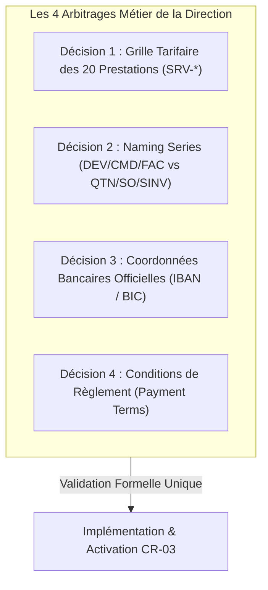

# BOKENGI GROUP 2.0 — DOSSIER DE DÉCISION MÉTIER DU CIRCUIT FINANCIER (CR-03)

**Change Request :** `CR-03` — Finalisation et Déblocage du Circuit Financier ERPNext  
**Date d'Émission :** 26 Septembre 2026  
**Version :** 2.0.0 — Business Decision Pack  
**Statut CR-03 :** 🟡 **CANDIDATE** (En attente des 4 arbitrages de la direction)  
**Baseline Canonique Préservée :** Phase 10.8  
**Classification :** Document Réservé à la Direction Générale & Financière  

---

## 1. Contexte & Objectif du Dossier

La gestion des projets (**CR-04**), la mesure d'audience (**CR-01**) et la page de statut public (**CR-02**) sont désormais **CLOSED & PRODUCTION READY**.

Le module commercial et financier ERPNext v15 (Devis $\to$ Commandes $\to$ Factures) est actuellement techniquement opérationnel mais scellé afin d'empêcher toute injection de données fictives.

Ce document rassemble de manière exhaustive et structurée les **4 décisions métier exclusives** nécessaires pour paramétrer le circuit financier réel de **Bokengi Group** en une seule intervention sans itérations inutiles.

> [!IMPORTANT]
> **RÈGLE DE CONFIANCE & D'INTÉGRITÉ COMPTABLE :**
> - Aucun tarif, IBAN ou condition financière n'a été inventé.
> - Le verrou anti-facturation automatique reste actif : même après le renseignement de ces paramètres, l'émission des factures demeurera un acte manuel et contrôlé dans ERPNext Desk.
> - InfraPulse demeure totalement exclu du périmètre.

---

## 2. Synthèse des 4 Décisions Métier Attendues



---

## 3. Fiche Décisionnelle 1 : Grille Tarifaire des 20 Prestations (`SRV-*`)

### A. État Actuel
- **Valeur en base :** `0.00 €` / Non valorisé.
- **Ce qui manque :** Le montant unitaire HT (Taux Journalier Moyen ou Forfait unitaire) pour chacune des prestations du catalogue officiel.

### B. Données Attendues de la Direction
Veuillez compléter le tableau ci-dessous avec les tarifs de référence (en € HT) :

| Code Article | Intitulé de la Prestation de Service | Pôle d'Expertise | Unité (Jour / Forfait) | Tarif HT Cible (€) |
| :--- | :--- | :--- | :---: | :---: |
| `SRV-CYBER-01` | Audit d'Architecture & Sécurité | Cybersécurité | *ex: Jour* | `[ À COMPLÉTER ]` |
| `SRV-CYBER-02` | Test d'Intrusion & Pentest | Cybersécurité | *ex: Jour / Forfait* | `[ À COMPLÉTER ]` |
| `SRV-CYBER-03` | Conformité & Gouvernance SSI (ISO 27001, NIS2) | Cybersécurité | *ex: Jour* | `[ À COMPLÉTER ]` |
| `SRV-CYBER-04` | Accompagnement SSI & SecOps | Cybersécurité | *ex: Jour* | `[ À COMPLÉTER ]` |
| `SRV-CLOUD-01` | Migration & Architecture Cloud | Cloud & DevOps | *ex: Jour* | `[ À COMPLÉTER ]` |
| `SRV-CLOUD-02` | Déploiement IaC & CI/CD Cloud | Cloud & DevOps | *ex: Jour* | `[ À COMPLÉTER ]` |
| `SRV-CLOUD-03` | Infogérance, Observabilité & SRE | Cloud & DevOps | *ex: Forfait mensuel* | `[ À COMPLÉTER ]` |
| `SRV-CLOUD-04` | Optimisation FinOps & Performance Cloud | Cloud & DevOps | *ex: Jour* | `[ À COMPLÉTER ]` |
| `SRV-DATA-01` | Ingénierie & Pipelines de Données | Data & IA | *ex: Jour* | `[ À COMPLÉTER ]` |
| `SRV-DATA-02` | Modélisation & Data Warehousing | Data & IA | *ex: Jour* | `[ À COMPLÉTER ]` |
| `SRV-DATA-03` | Tableaux de Bord & Business Intelligence | Data & IA | *ex: Jour* | `[ À COMPLÉTER ]` |
| `SRV-DATA-04` | Intégration IA, Machine Learning & LLM | Data & IA | *ex: Jour* | `[ À COMPLÉTER ]` |
| `SRV-SOFTE-01` | Développement Web Fullstack & Next.js | Software Eng. | *ex: Jour* | `[ À COMPLÉTER ]` |
| `SRV-SOFTE-02` | API & Architecture Microservices | Software Eng. | *ex: Jour* | `[ À COMPLÉTER ]` |
| `SRV-SOFTE-03` | Modernisation & Refactorisation Applicative | Software Eng. | *ex: Jour* | `[ À COMPLÉTER ]` |
| `SRV-SOFTE-04` | Intégration ERP & Automatisation des Flux | Software Eng. | *ex: Jour* | `[ À COMPLÉTER ]` |
| `SRV-STRAT-01` | Schéma Directeur SI & Transformation Numérique | Stratégie & Conseil | *ex: Jour* | `[ À COMPLÉTER ]` |
| `SRV-STRAT-02` | Conseil en Choix de Solutions & Cadrage | Stratégie & Conseil | *ex: Jour* | `[ À COMPLÉTER ]` |
| `SRV-STRAT-03` | Audit Organisationnel & Gouvernance IT | Stratégie & Conseil | *ex: Jour* | `[ À COMPLÉTER ]` |
| `SRV-STRAT-04` | Direction de Transition & PMO Stratégique | Stratégie & Conseil | *ex: Jour* | `[ À COMPLÉTER ]` |

*(Note : Si un TJM forfaitaire unique par Pôle est appliqué, par exemple 1 100 €/j pour Cyber et 950 €/j pour Cloud, l'indiquer directement).*

---

## 4. Fiche Décisionnelle 2 : Naming Series Officielles

### A. État Actuel
- **Valeur par défaut ERPNext :** Séquences anglophones standards (`QTN-.YYYY.-`, `SO-.YYYY.-`, `ACC-SINV-.YYYY.-`).
- **Ce qui manque :** L'arbitrage formel sur la codification des documents commerciaux et comptables.

### B. Options Soumises au Choix de la Direction

| Document | Option A (Standard ERPNext / International) | Option B (Convention France / Recommandée) | Choix Direction |
| :--- | :--- | :--- | :---: |
| **Devis commercial** | `QTN-2026-00001` | `DEV-2026-00001` | `[ Option A / B ]` |
| **Bon de commande** | `SO-2026-00001` | `CMD-2026-00001` | `[ Option A / B ]` |
| **Facture de vente** | `ACC-SINV-2026-00001` | `FAC-2026-00001` | `[ Option A / B ]` |

---

## 5. Fiche Décisionnelle 3 : Coordonnées Bancaires Officielles

### A. État Actuel
- **Valeur en base :** 0 coordonnée bancaire.
- **Ce qui manque :** Les coordonnées de l'entité légale de facturation à faire figurer sur les formats d'impression PDF officiels.

### B. Données Attendues de la Direction

```yaml
# COORDONNÉES BANCAIRES OFFICIELLES BOKENGI GROUP
Raison_Sociale: "BOKENGI GROUP"
Forme_Juridique: "SAS"
Capital_Social: "7 500 €" # À confirmer
Nom_de_la_Banque: "[ À RENSEIGNER ]"
Titulaire_du_Compte: "[ À RENSEIGNER ]"
IBAN: "[ FR76 ... À RENSEIGNER ]"
BIC_SWIFT: "[ À RENSEIGNER ]"
Domiciliation: "[ Ville / Agence ]"
```

---

## 6. Fiche Décisionnelle 4 : Conditions & Délais de Règlement (Payment Terms)

### A. État Actuel
- **Valeur en base :** Aucun modèle de règlement par défaut appliqué.
- **Ce qui manque :** La politique standard d'acompte et les délais légaux de règlement accordés aux clients.

### B. Options Types & Arbitrage Attendu

| Modèle | Description / Échéancier Type | Usage Prévu | Choix Défaut |
| :--- | :--- | :--- | :---: |
| **Modèle 1 (Standard Conseil)** | 30% à la commande (`Sales Order`), 70% solde à réception PV signé, paiement 30j net | Missions au forfait / Projets | `[ OUI / NON ]` |
| **Modèle 2 (Mission Courte)** | 50% à la commande, 50% à la livraison (PV signé) | Audits / Pentests courts | `[ OUI / NON ]` |
| **Modèle 3 (Régie Mensuelle)** | 100% terme échu fin de mois selon pointage Timesheet, 30j fin de mois | Assistance technique / Régie | `[ OUI / NON ]` |
| **Modèle 4 (Paiement Comptant)** | 100% à réception de facture | Formations / Prestations ponctuelles | `[ OUI / NON ]` |

---

## 7. Modalité de Transmission

Pour débloquer et engager l'implémentation de **CR-03**, la direction générale transmettra simplement les 4 blocs de réponses complétés :

```text
DÉCISION 1 (Tarifs) : [ Tableau ou TJM par Pôle ]
DÉCISION 2 (Naming) : [ Option A ou Option B ]
DÉCISION 3 (Banque) : [ Banque, Titulaire, IBAN, BIC, Capital ]
DÉCISION 4 (Règlement) : [ Modèle par défaut retenu ]
```

---

> **RAPPEL DE SÉCURITÉ :**  
> Aucun code, configuration ou document comptable n'a été altéré.  
> **CR-03 reste au statut 🟡 `CANDIDATE` jusqu'à réception écrite des 4 arbitrages.**
