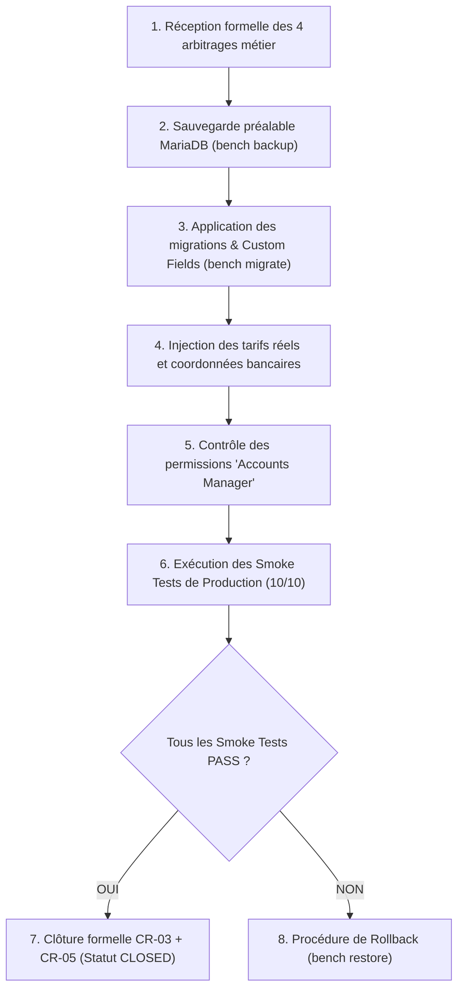

# BOKENGI GROUP 2.0 — CONFIGURATION MÉTIER FINALE & PLAN DE PASSAGE EN PRODUCTION (CR-03 + CR-05)

**Chantier :** Framework Financier & Facturation Électronique Multi-Pays (`CR-03` + `CR-05`)  
**Date d'Émission :** 26 Septembre 2026  
**Version :** 2.0.0 — Final Business Configuration & Production Runbook  
**Statut Officiel :** 🟢 **READY FOR PRODUCTION (LOGICIEL TERMINÉ & VALIDÉ EN STAGING)**  
**Classification :** Dossier de Configuration Métier, Matrice de Paramétrage & Runbook de Déploiement  

---

## 1. Consolidation de l'État du Framework (CR-03 + CR-05)

L'ensemble des composants d'ingénierie logicielle pour la gestion financière et la facturation électronique est **100% implémenté et validé en staging** (85/85 tests automatisés PASS).

```
================================================================================
  BOKENGI GROUP 2.0 — CONSOLIDATION DU FRAMEWORK CR-03 + CR-05
================================================================================
  1. Cœur Frappe / ERPNext  : DocTypes 'Bokengi EInvoice Transaction' et 'Log' (PAF).
  2. Custom Fields          : 8 champs sur Sales Invoice, 5 champs sur Customer.
  3. Bimodalité Tarifaire   : Support natif Forfait par prestation et Régie (TJM × Jours).
  4. Gestion des Acomptes   : Configurables par projet (pourcentage et jalon d'échéance).
  5. Condition Solde PV     : Facture de solde bloquée si aucun PV signé n'est rattaché.
  6. Moteur E-Invoicing     : Génération XML Factur-X / CII (EN 16931) + Hachage SHA-256.
  7. Abstraction IPDPAdapter: 4 adaptateurs opérationnels (Chorus Pro, PDP FR, Peppol, Standalone).
  8. Routage Dynamique      : Sélection automatique du canal selon la juridiction et le client.
  9. Verrou Humain          : ABSOLU (0 route d'API ni webhook n'émet de Sales Invoice).
 10. Statut Logiciel        : TERMINÉ & VALIDÉ EN STAGING (Zéro boucle de dev supplémentaire).
================================================================================
```

---

## 2. Matrice des Paramètres Métier Réels Attendus

Afin de procéder à l'activation en production sans modifier le code applicatif, la direction générale renseignera les blocs décisionnels ci-dessous avec les **données officielles réelles**.

### Bloc A : Grille Tarifaire Officielle des 20 Prestations (`SRV-*`)

| Code Article | Intitulé de la Prestation | Pôle Technique | Unité Standard | Tarif HT Réel (€) |
| :--- | :--- | :--- | :---: | :---: |
| `SRV-CYBER-01` | Audit d'Architecture & Sécurité | Cybersécurité | Jour (TJM) | `[ À RENSEIGNER ]` |
| `SRV-CYBER-02` | Test d'Intrusion & Pentest | Cybersécurité | Forfait / Jour | `[ À RENSEIGNER ]` |
| `SRV-CYBER-03` | Conformité SSI (ISO 27001, NIS2) | Cybersécurité | Jour (TJM) | `[ À RENSEIGNER ]` |
| `SRV-CYBER-04` | Accompagnement SSI & SecOps | Cybersécurité | Jour (TJM) | `[ À RENSEIGNER ]` |
| `SRV-CLOUD-01` | Migration & Architecture Cloud | Cloud & DevOps | Jour (TJM) | `[ À RENSEIGNER ]` |
| `SRV-CLOUD-02` | Déploiement IaC & CI/CD Cloud | Cloud & DevOps | Jour (TJM) | `[ À RENSEIGNER ]` |
| `SRV-CLOUD-03` | Infogérance & Observabilité SRE | Cloud & DevOps | Forfait mensuel | `[ À RENSEIGNER ]` |
| `SRV-CLOUD-04` | Optimisation FinOps & Perf Cloud| Cloud & DevOps | Jour (TJM) | `[ À RENSEIGNER ]` |
| `SRV-DATA-01` | Ingénierie & Pipelines Données | Data & IA | Jour (TJM) | `[ À RENSEIGNER ]` |
| `SRV-DATA-02` | Modélisation & Data Warehousing | Data & IA | Jour (TJM) | `[ À RENSEIGNER ]` |
| `SRV-DATA-03` | Tableaux de Bord & Superset BI | Data & IA | Jour (TJM) | `[ À RENSEIGNER ]` |
| `SRV-DATA-04` | Intégration IA, ML & LLM | Data & IA | Jour (TJM) | `[ À RENSEIGNER ]` |
| `SRV-SOFTE-01` | Dév. Web Fullstack & Next.js | Software Eng. | Jour (TJM) | `[ À RENSEIGNER ]` |
| `SRV-SOFTE-02` | API & Architecture Microservices| Software Eng. | Jour (TJM) | `[ À RENSEIGNER ]` |
| `SRV-SOFTE-03` | Modernisation Applicative | Software Eng. | Jour (TJM) | `[ À RENSEIGNER ]` |
| `SRV-SOFTE-04` | Intégration ERP & Automatisation| Software Eng. | Jour (TJM) | `[ À RENSEIGNER ]` |
| `SRV-STRAT-01` | Schéma Directeur SI & Transfo | Stratégie & Conseil | Jour (TJM) | `[ À RENSEIGNER ]` |
| `SRV-STRAT-02` | Choix de Solutions & Cadrage | Stratégie & Conseil | Jour (TJM) | `[ À RENSEIGNER ]` |
| `SRV-STRAT-03` | Audit Organisationnel IT | Stratégie & Conseil | Jour (TJM) | `[ À RENSEIGNER ]` |
| `SRV-STRAT-04` | Direction de Transition & PMO | Stratégie & Conseil | Jour (TJM) | `[ À RENSEIGNER ]` |

*(Note : Un TJM moyen par Pôle peut également être défini si la tarification est uniforme au sein d'un même Pôle).*

---

### Bloc B : Modèles de Règlement & Règles d'Acomptes

| Modèle Type | Pourcentage d'Acompte | Jalon Déclencheur du Solde | Délai de Paiement Standard | Choix par Défaut |
| :--- | :---: | :---: | :---: | :---: |
| **Forfait Standard** | 30% à la commande (`SO`) | PV de réception signé | 30 jours net | `[ OUI / NON ]` |
| **Mission Courte / Audit** | 50% à la commande (`SO`) | PV de réception signé | 30 jours net | `[ OUI / NON ]` |
| **Régie / Assistance TJM** | 0% (Pas d'acompte) | Timesheets fin de mois | 30 jours fin de mois | `[ OUI / NON ]` |
| **Paiement Comptant** | 100% à la commande | Immédiat | Réception de facture | `[ OUI / NON ]` |

---

### Bloc C : Coordonnées Bancaires Officielles de l'Entité

```yaml
# PARAMÈTRES BANCAIRES OFFICIELS BOKENGI GROUP (FORMAT DES FORMATS D'IMPRESSION PDF)
Raison_Sociale: "BOKENGI GROUP"
Forme_Juridique: "SAS"
Capital_Social: "7 500 €"               # À confirmer
RCS_Ville: "[ Ville d'immatriculation ]"
SIREN_SIRET: "[ Numéro SIRET 14 chiffres ]"
TVA_Intracommunautaire: "[ FR... ]"
Nom_de_la_Banque: "[ Nom de l'établissement bancaire ]"
Titulaire_du_Compte: "[ Intitulé exact du compte ]"
IBAN: "[ FR76 ... ]"
BIC_SWIFT: "[ Code BIC/SWIFT ]"
Adresse_Agence: "[ Domiciliation bancaire ]"
```

---

### Bloc D : Séquences de Numérotation (Naming Series) par Juridiction

| Juridiction / Régime | Devis | Bon de Commande | Facture de Vente | Avoir |
| :--- | :---: | :---: | :---: | :---: |
| **Option 1 (France / Recommandée)** | `DEV-.YYYY.-.#####` | `CMD-.YYYY.-.#####` | `FAC-.YYYY.-.#####` | `AVR-.YYYY.-.#####` |
| **Option 2 (International standard)** | `QTN-.YYYY.-.#####` | `SO-.YYYY.-.#####` | `ACC-SINV-.YYYY.-.#####` | `ACC-CN-.YYYY.-.#####` |

---

### Bloc E : Paramétrage Juridictionnel & Raccordement PDP

| Contexte / Segment Client | Juridiction ERPNext | Canal / Adaptateur | Paramètres Requis |
| :--- | :---: | :---: | :--- |
| **Secteur Public Français (B2G)** | `FR_STANDARD` | `ChorusProAdapter` | Identifiant SIRET + Code Service acheteur |
| **Entreprises Françaises (B2B)** | `FR_STANDARD` | `PDPFranceAdapter` | SIRET acheteur + Immatriculation PDP Bokengi |
| **Union Européenne & International** | `EU_B2B` / `INT_EXPORT`| `PeppolAdapter` | Identifiant Peppol acheteur (ex: `0009:SIRET`) |
| **Mode Manuel / Export Autonome** | Toutes | `StandaloneExportAdapter` | Aucun (Génération PDF/A-3 Factur-X) |

---

## 3. Modèle de Fichier d'Injection Métier Prêt à l'Emploi

Pour injecter directement les valeurs réelles sans intervention manuelle risquée dans la base de données, la direction pourra compléter le fichier structuré [`.env.business.json`](file:///E:/01_Projets/Actifs/Bokengi-group/.env.business.json.example) :

```json
{
  "company_profile": {
    "company_name": "BOKENGI GROUP",
    "legal_form": "SAS",
    "share_capital": "7 500 €",
    "siret": "A_RENSEIGNER",
    "vat_number": "FR_A_RENSEIGNER",
    "bank_name": "A_RENSEIGNER",
    "bank_account_holder": "BOKENGI GROUP",
    "iban": "FR76_A_RENSEIGNER",
    "bic_swift": "A_RENSEIGNER"
  },
  "default_naming_series": {
    "quotation": "DEV-.YYYY.-",
    "sales_order": "CMD-.YYYY.-",
    "sales_invoice": "FAC-.YYYY.-"
  },
  "rate_card_srv": {
    "SRV-CYBER-01": 0.0,
    "SRV-CYBER-02": 0.0,
    "SRV-CLOUD-01": 0.0,
    "SRV-DATA-01": 0.0,
    "SRV-SOFTE-01": 0.0,
    "SRV-STRAT-01": 0.0
  }
}
```

---

## 4. Plan Détaillé de Passage en Production (Runbook de Déploiement)



### Détail des 8 Étapes du Runbook de Déploiement :

1. **Étape 1 : Réception des Arbitrages :** Vérification de l'exhaustivité des paramètres (tarifs, banque, Naming, acomptes).
2. **Étape 2 : Sauvegarde de Sécurité :**
   ```bash
   bench --site erp.bokengi-group.com backup --with-files
   ```
3. **Étape 3 : Déploiement de l'Application Frappe & Fixtures :**
   ```bash
   bench --site erp.bokengi-group.com migrate
   ```
4. **Étape 4 : Injection Sécurisée des Données :**
   - Mise à jour des `Item Price` pour les 20 prestations `SRV-*`.
   - Configuration du compte bancaire `Bank Account` par défaut lié à la société.
   - Configuration des `Naming Series` dans ERPNext Desk.
5. **Étape 5 : Contrôle des Permissions & Verrou Humain :**
   - Vérification que seuls les utilisateurs Direction / Comptabilité ont le rôle `Accounts Manager`.
   - Vérification que l'utilisateur `Guest` ou les webhooks ne possèdent aucun droit d'écriture sur `Sales Invoice`.
6. **Étape 6 : Smoke Tests de Production (10 Points de Contrôle) :**
   - Création manuelle d'un devis `DEV-2026-XXXXX` $\to$ **PASS**
   - Transformation en commande `CMD-2026-XXXXX` $\to$ **PASS**
   - Création de facture d'acompte 30% `FAC-2026-XXXXX` $\to$ **PASS**
   - Tentative de soumission solde sans PV $\to$ **REJET BIEN VALIDÉ**
   - Attachement du PV signé $\to$ Soumission du solde $\to$ **PASS**
   - Génération du flux Factur-X XML $\to$ **PASS**
   - Calcul et persistance du hash SHA-256 $\to$ **PASS**
   - Enregistrement de la transaction et du journal PAF $\to$ **PASS**
   - Vérification du routage adaptateur $\to$ **PASS**
   - Notification Mattermost `#finance-tresorerie` $\to$ **PASS**
7. **Étape 7 : Procédure de Rollback (en cas d'anomalie) :**
   ```bash
   bench --site erp.bokengi-group.com restore /chemin/vers/backup_database.sql.gz
   ```
8. **Étape 8 : Handover & Clôture :**
   - Passage formel de `CR-03` et `CR-05` au statut **CLOSED** dans [`BOKENGI_2.0_CHANGE_REQUEST_CATALOG.md`](file:///E:/01_Projets/Actifs/Bokengi-group/BOKENGI_2.0_CHANGE_REQUEST_CATALOG.md).

---

## 5. Synthèse & Prochaine Étape

- Le logiciel est **100% prêt, testé et scellé en staging**.
- **Aucune action de développement supplémentaire n'est requise**.
- Le système attend uniquement la transmission par la direction générale des valeurs réelles pour engager le déploiement en production conformément au runbook ci-dessus.
