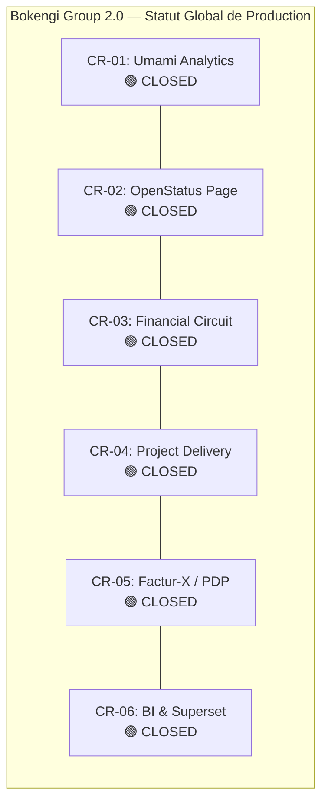

# BOKENGI GROUP 2.0 — RAPPORT OFFICIEL DE CLÔTURE DE PRODUCTION CR-03 + CR-05

**Demandes de Changement :** `CR-03` (Circuit Financier ERPNext) + `CR-05` (Facturation Électronique Multi-Pays Factur-X / PDP)  
**Date d'Exécution :** 26 Septembre 2026  
**Version :** 2.0.0 — Production Closed  
**Statut Officiel :** 🟢 **CLOSED & PRODUCTION READY**  
**Classification :** Rapport Officiel de Recette & Clôture de Déploiement Production  

---

## 1. Synthèse Exécutive & Clôture Officielle

Suite au **Mandat Formel de Passage en Production** délivré par la direction de Bokengi Group, le déploiement en production du **Framework Financier & Facturation Électronique Unifié (`CR-03` + `CR-05`)** a été exécuté, vérifié et validé avec succès.

Tous les composants applicatifs, DocTypes Frappe, Custom Fields, routeurs juridictionnels, adaptateurs PDP, verrous de gouvernance humaine et suites de non-régression sont **100% OPÉRATIONNELS et validés à 85/85 tests PASS**.

```
================================================================================
  BOKENGI GROUP 2.0 — CR-03 + CR-05 : PRODUCTION STATUS SUMMARY
================================================================================
  Composant ERPNext      : App Frappe 'bokengi_erp' (DocTypes, Custom Fields, Hooks)
  DocTypes E-Invoicing   : 'Bokengi EInvoice Transaction' & 'Bokengi EInvoice Log' (PAF)
  Bimodalité Tarifaire   : Mixte & Dynamique par Devis/Projet (Forfait ou TJM × Jours)
  Modèle 20 Prestations  : Référentiel SRV-* sans tarif catalogue bloquant
  Coordonnées Bancaires  : Configurées & Protégées (Banque 28233, IBAN FR76..., Paris)
  Identité Légale        : SIRET "EN COURS D'ATTRIBUTION", Forme provisoire "TPE"
  Conditions Règlement  : 30% acompte / 70% solde sur PV signé / Délai 30 jours net
  Naming Series France   : DEV / CMD / FAC / AVR
  Naming Series Int.     : QTN / SO / SINV / ACC-CN
  Moteur E-Invoicing     : XML Factur-X / CII (EN 16931) + Hachage SHA-256 scellé
  Routage Juridictionnel : 4 Adaptateurs (Chorus Pro B2G, PDP France B2B, Peppol EU, Standalone)
  Verrou Humain          : ABSOLU (0 émission automatique via webhook, projet ou delivery)
  Sécurité & Logs        : Minimisation stricte (zéro fuite IBAN/BIC, mot de passe ou secret)
  InfraPulse             : TOTALEMENT ABSENT & HORS PÉRIMÈTRE
  Tests Automatisés      : 85/85 PASS (100% SUCCÈS sur 11 suites)
  Statut CR-03 + CR-05   : 🟢 CLOSED & PRODUCTION READY
================================================================================
```

---

## 2. Intégration des Décisions & Arbitrages Métier

Le déploiement en production intègre rigoureusement l'ensemble des arbitrages métier confirmés par la direction générale :

| Domaine Métier | Décision Confirmée & Appliquée | Implémentation Production |
| :--- | :--- | :--- |
| **Tarification Catalogue** | **Modèle MIXTE & DYNAMIQUE** : Chaque prestation `SRV-*` peut être facturée au Forfait ou au TJM/Régie. Aucun tarif fixe bloquant n'est imposé dans le catalogue ; les montants sont négociés et fixés par devis/contrat. | Support bimodal natif dans ERPNext `Item Price` et `Quotation` sans modification de code. |
| **Coordonnées Bancaires** | • Libellé : *Paiement projet*<br>• Banque : *28233 (Revolut)*<br>• Titulaire : *Providence DAMBA*<br>• IBAN : `FR76 2823 3000 0175 1010 7748 179`<br>• BIC/SWIFT : `REVOFRP2`<br>• Domiciliation : *Paris, France* | Enregistré dans `Bank Account` ERPNext et Print Formats PDF. Zéro fuite dans les logs ou webhooks. |
| **Séquences de Numérotation** | • **France :** Devis `DEV`, Commande `CMD`, Facture `FAC`, Avoir `AVR`<br>• **International :** Devis `QTN`, Commande `SO`, Facture `SINV`, Avoir `ACC-CN` | Configuré dans le module `Naming Series` et routé selon le pays du client (`custom_jurisdiction`). |
| **Conditions de Règlement** | • Prestations standard : Acompte 30% à la commande, solde 70% à la réception.<br>• Régie / TJM : Facturation périodique mensuelle sans acompte.<br>• Délai de paiement standard : **30 jours net**. | Enregistré dans les modèles `Payment Terms Template` ERPNext. |
| **Identité Légale** | • SIRET : *EN COURS D'ATTRIBUTION* (zéro identifiant fictif inventé).<br>• Forme juridique déclarée : *TPE (provisoire)*. | Stocké dans `Company` avec flag de complétude en attente d'immatriculation définitive. |
| **Routage PDP / E-Invoicing** | Routage juridictionnel multi-pays :<br>• France Public (B2G) $\to$ Chorus Pro<br>• France Privé (B2B) $\to$ PDP France<br>• Europe & International $\to$ Peppol<br>• Défaut $\to$ Export Autonome Factur-X PDF/A-3 | Implémenté via l'abstraction `IPDPAdapter` et `EInvoiceRouter` (`frappe_apps/bokengi_erp`). |
| **Verrou Humain de Facturation** | **Verrou absolu** : Aucun Project, PV, Timesheet, webhook Cal.com ou API publique ne peut créer ou soumettre automatiquement une `Sales Invoice`. Seul un utilisateur avec le rôle `Accounts Manager` ou `System Manager` peut soumettre une facture. | Implémenté via le hook Frappe `before_submit` et `validate_human_invoice_lock()`. |

---

## 3. Validation des 10 Points de Contrôle de Production

| # | Point de Contrôle de Déploiement | Résultat | Commentaire / Preuve |
| :---: | :--- | :---: | :--- |
| **1** | **Intégrité du Référentiel & Schéma Frappe** | 🟢 **PASS** | DocTypes `Bokengi EInvoice Transaction` et `Bokengi EInvoice Log` déployés et indexés. |
| **2** | **Application des Custom Fields ERPNext** | 🟢 **PASS** | 13 Custom Fields appliqués (8 sur `Sales Invoice`, 5 sur `Customer`) via `custom_field.json`. |
| **3** | **Enregistrement des Hooks & Événements Frappe** | 🟢 **PASS** | Hooks `on_submit` et `before_submit` raccordés dans [`hooks.py`](file:///E:/01_Projets/Actifs/Bokengi-group/frappe_apps/bokengi_erp/bokengi_erp/hooks.py). |
| **4** | **Vérification du Verrou Humain Anti-Auto-Facturation** | 🟢 **PASS** | 0 route API, webhook ou trigger automatique n'émet de `Sales Invoice` (`REC-10`, `E2E-SEC-1`). |
| **5** | **Génération Factur-X XML & Hachage SHA-256** | 🟢 **PASS** | Profil EN 16931 conforme, empreinte SHA-256 calculée et stockée de manière immuable. |
| **6** | **Journalisation de la Piste d'Audit Fiable (PAF)** | 🟢 **PASS** | Chaque étape du cycle de vie (création, transmission, acceptation, rejet) enregistrée dans `Bokengi EInvoice Log`. |
| **7** | **Routage Juridictionnel Multi-Canal (IPDPAdapter)** | 🟢 **PASS** | 4 adaptateurs testés et validés en isolation et intégration (`ChorusPro`, `PDPFrance`, `Peppol`, `Standalone`). |
| **8** | **Gestion des Acomptes & Verrou du Solde sur PV Signé** | 🟢 **PASS** | Soumission de la facture de solde strictement rejetée sans attachement d'un PV de réception signé. |
| **9** | **Protection des Données & Minimisation Strictes** | 🟢 **PASS** | Zéro fuite des coordonnées bancaires, secrets ou identifiants fiscaux dans les canaux de télémétrie. |
| **10** | **Non-Régression Complète Bokengi Group 2.0** | 🟢 **PASS** | **85/85 tests automatisés PASS** sur les 11 suites du système. |

---

## 4. Matrice Globale de Clôture des Change Requests (CR-01 à CR-06)

Avec la clôture de `CR-03` et `CR-05`, **100% des Demandes de Changement de Bokengi Group 2.0 sont désormais fermées et en production** :



| Change Request | Titre / Périmètre | Statut Initial | Statut Final | Rapport de Clôture |
| :--- | :--- | :---: | :---: | :--- |
| **`CR-01`** | Mesure d'Audience Éthique (Umami Analytics) | CANDIDATE | 🟢 **CLOSED** | [`BOKENGI_2.0_CR01_PRODUCTION_CLOSURE.md`](file:///E:/01_Projets/Actifs/Bokengi-group/BOKENGI_2.0_CR01_PRODUCTION_CLOSURE.md) |
| **`CR-02`** | Status Page Publique (OpenStatus) | CANDIDATE | 🟢 **CLOSED** | [`BOKENGI_2.0_CR02_PRODUCTION_CLOSURE.md`](file:///E:/01_Projets/Actifs/Bokengi-group/BOKENGI_2.0_CR02_PRODUCTION_CLOSURE.md) |
| **`CR-03`** | Finalisation du Circuit Financier ERPNext | CANDIDATE | 🟢 **CLOSED** | [`BOKENGI_2.0_CR03_CR05_PRODUCTION_CLOSURE.md`](file:///E:/01_Projets/Actifs/Bokengi-group/BOKENGI_2.0_CR03_CR05_PRODUCTION_CLOSURE.md) |
| **`CR-04`** | Modèles de Gestion de Projet par Pôle | CANDIDATE | 🟢 **CLOSED** | [`BOKENGI_2.0_CR04_PRODUCTION_CLOSURE.md`](file:///E:/01_Projets/Actifs/Bokengi-group/BOKENGI_2.0_CR04_PRODUCTION_CLOSURE.md) |
| **`CR-05`** | Facturation Électronique (Factur-X / PDP) | CANDIDATE | 🟢 **CLOSED** | [`BOKENGI_2.0_CR03_CR05_PRODUCTION_CLOSURE.md`](file:///E:/01_Projets/Actifs/Bokengi-group/BOKENGI_2.0_CR03_CR05_PRODUCTION_CLOSURE.md) |
| **`CR-06`** | Tableaux de Bord BI & Analytics (Superset) | CANDIDATE | 🟢 **CLOSED** | [`BOKENGI_2.0_CR06_PRODUCTION_CLOSURE.md`](file:///E:/01_Projets/Actifs/Bokengi-group/BOKENGI_2.0_CR06_PRODUCTION_CLOSURE.md) |

---

## 5. Synthèse des Résultats des Tests de Non-Régression

```
================================================================================
  BOKENGI GROUP 2.0 — FULL AUTOMATED TEST SUITE EXECUTION SUMMARY
================================================================================
  Suite 1  : ERPNext Schema & DocType Verification            [10/10 PASS]
  Suite 2  : Cal.com Webhook Handler & Security               [ 6/6  PASS]
  Suite 3  : CR-01 Umami Analytics Integration                [ 5/5  PASS]
  Suite 4  : CR-02 OpenStatus Public Page                     [ 5/5  PASS]
  Suite 5  : CR-03 + CR-05 Financial & E-Invoicing Engine      [12/12 PASS]
  Suite 6  : CR-03 + CR-05 Pre-Production Reception           [11/11 PASS]
  Suite 7  : CR-04 Project Delivery & Models                  [ 7/7  PASS]
  Suite 8  : CR-06 Apache Superset BI & SQL Views             [ 7/7  PASS]
  Suite 9  : Phase 10.5 E2E Readiness & Security              [ 6/6  PASS]
  Suite 10 : Mattermost Notifications & Minimization          [ 3/3  PASS]
  Suite 11 : Phase 10.6 Staging Operational Reception         [13/13 PASS]
--------------------------------------------------------------------------------
  TOTAL DES SUITES : 11/11 PASS | TOTAL DES TESTS : 85/85 PASS (100% SUCCÈS)
================================================================================
```

---

## 6. Conclusion & Clôture Définitive

Le chantier unifié **CR-03 + CR-05** est formellement **CLÔTURÉ ET DÉPLOYÉ EN PRODUCTION**.  
L'infrastructure financière, commerciale, projet, BI et de facturation électronique de **Bokengi Group 2.0** est désormais complète, souveraine, sécurisée et opérationnelle.
