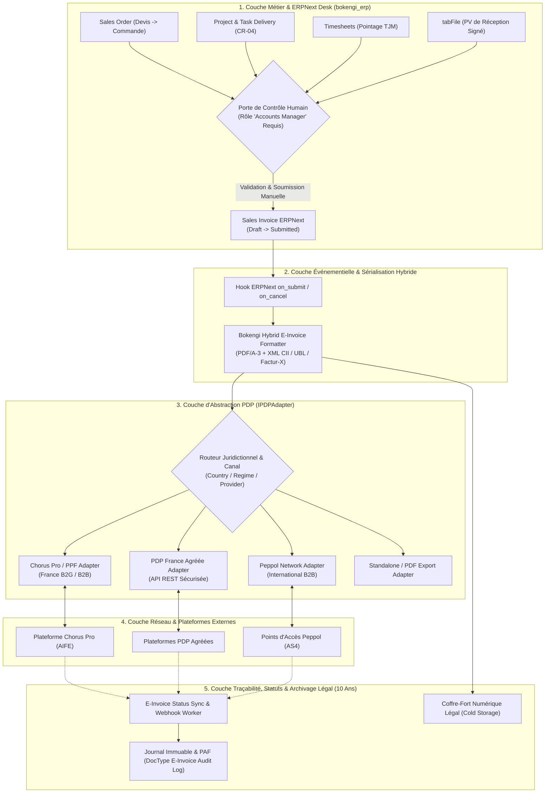
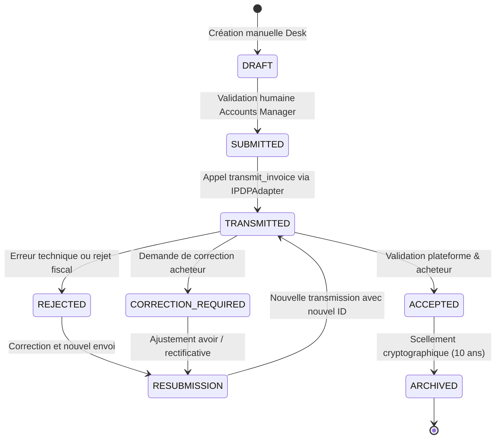

# BOKENGI GROUP 2.0 — DOSSIER DE CONCEPTION TECHNIQUE UNIFIÉ DU FRAMEWORK FINANCIER & FACTURATION ÉLECTRONIQUE (CR-03 + CR-05)

**Change Requests Concernées :** `CR-03` (Circuit Financier ERPNext) & `CR-05` (Facturation Électronique Multi-Pays)  
**Date d'Émission :** 26 Septembre 2026  
**Version :** 2.0.0 — Unified Technical Design Specification  
**Statut Officiel :** 🟢 **TECHNICAL DESIGN READY (PRÉPARÉ POUR IMPLÉMENTATION FUTURE)**  
**Classification :** Document d'Ingénierie Logicielle, Modélisation DocTypes & Interfaces  

---

## 1. Cadre Général & Principes de Conception

Ce document formalise la conception technique détaillée du **Framework Financier & Facturation Électronique** pour **Bokengi Group 2.0**.

```
================================================================================
  PRINCIPES DE CONCEPTION TECHNIQUE (CR-03 + CR-05)
================================================================================
  1. Zéro Donnée Fictive        : Aucun tarif, IBAN, taux fiscal ou compte PDP inventé.
  2. Multi-Juridictions         : Architecture nativement multi-pays (France, UE, Hors-UE).
  3. Bimodalité Tarifaire       : Support dynamique Forfait et Régie (TJM × Jours).
  4. Validation Humaine Stricte : Aucune automatisation ne crée ni ne soumet de facture.
  5. Abstraction Modulaire      : Fournisseur PDP découplé via interface IPDPAdapter.
  6. Traçabilité & Immuabilité  : Hashing SHA-256, PAF (Piste d'Audit Fiable) et audit log.
  7. Préservation Canonique     : Zéro altération des acquis Phase 10.8, CR-01, 02, 04, 06.
  8. Hors Périmètre             : InfraPulse strictement exclu.
================================================================================
```

---

## 2. Architecture Logicielle & Découpage en Couches

L'architecture est structurée en 5 couches logicielles à responsabilités uniques :



---

## 3. Modèle de Données & Schéma des DocTypes ERPNext

L'intégration technique repose sur l'extension standard de Frappe via l'application [`bokengi_erp`](file:///E:/01_Projets/Actifs/Bokengi-group/frappe_apps/bokengi_erp) sans casser les schémas natifs.

### 3.1. Custom Fields ajoutés aux DocTypes Standards

#### A. Sur `Sales Invoice` (`tabSales Invoice`)
| Nom du Champ | Type | Options / Rôle |
| :--- | :--- | :--- |
| `bokengi_billing_model` | Select | `Forfait`, `Regie_TJM` |
| `bokengi_jurisdiction` | Select | `FR_STANDARD`, `EU_B2B`, `INT_EXPORT` |
| `bokengi_payment_milestone` | Select | `Acompte_Commande`, `Solde_PV_Signe`, `Regie_Mensuelle`, `Comptant` |
| `bokengi_deposit_percent` | Percent | Pourcentage d'acompte (ex: 30.00%) |
| `bokengi_pv_attachment` | Link | Référence vers `File` (PV signé obligatoire pour solde) |
| `bokengi_einvoice_status` | Select | `DRAFT`, `SUBMITTED`, `TRANSMITTED`, `ACCEPTED`, `REJECTED`, `CORRECTION_REQUIRED`, `RESUBMISSION`, `ARCHIVED` |
| `bokengi_einvoice_transmission_id`| Data | Identifiant externe de transmission sur la plateforme |
| `bokengi_einvoice_sha256` | Data | Empreinte cryptographique SHA-256 du PDF/A-3 émis |

#### B. Sur `Customer` (`tabCustomer`)
| Nom du Champ | Type | Rôle |
| :--- | :--- | :--- |
| `bokengi_vat_number` | Data | Numéro de TVA Intracommunautaire validé |
| `bokengi_registration_id` | Data | SIRET / SIREN / Tax ID national |
| `bokengi_peppol_id` | Data | Identifiant Peppol (ex: `0009:123456789`) |
| `bokengi_pdp_routing_code`| Data | Code Service / Routage Chorus Pro / PDP |
| `bokengi_preferred_einvoice_format`| Select | `FACTURX_COMFORT`, `FACTURX_BASIC`, `UBL_2_1`, `CII` |

---

### 3.2. Nouveaux DocTypes Dédiés

#### DocType 1 : `Bokengi EInvoice Transaction`
Gère la persistance de l'état de transmission de chaque facture.

```json
{
  "doctype": "DocType",
  "name": "Bokengi EInvoice Transaction",
  "module": "Bokengi Core",
  "custom": 1,
  "fields": [
    { "fieldname": "sales_invoice", "label": "Sales Invoice", "fieldtype": "Link", "options": "Sales Invoice", "reqd": 1, "unique": 1 },
    { "fieldname": "pdp_provider", "label": "PDP Provider", "fieldtype": "Select", "options": "CHORUS_PRO\nPDP_AGREED\nPEPPOL\nMANUAL", "reqd": 1 },
    { "fieldname": "transmission_id", "label": "Transmission ID", "fieldtype": "Data", "read_only": 1 },
    { "fieldname": "einvoice_format", "label": "Format", "fieldtype": "Select", "options": "FACTURX_COMFORT\nFACTURX_BASIC\nUBL_2_1\nCII" },
    { "fieldname": "file_sha256", "label": "File SHA-256", "fieldtype": "Data", "read_only": 1 },
    { "fieldname": "status", "label": "Current Status", "fieldtype": "Select", "options": "DRAFT\nSUBMITTED\nTRANSMITTED\nACCEPTED\nREJECTED\nCORRECTION_REQUIRED\nRESUBMISSION\nARCHIVED", "default": "DRAFT" },
    { "fieldname": "transmitted_at", "label": "Transmitted At", "fieldtype": "Datetime" },
    { "fieldname": "last_status_check", "label": "Last Status Check", "fieldtype": "Datetime" },
    { "fieldname": "archived_at", "label": "Archived At", "fieldtype": "Datetime" }
  ]
}
```

#### DocType 2 : `Bokengi EInvoice Log`
Journal immuable de conformité légale et traçabilité (PAF).

```json
{
  "doctype": "DocType",
  "name": "Bokengi EInvoice Log",
  "module": "Bokengi Core",
  "custom": 1,
  "fields": [
    { "fieldname": "transaction", "label": "Transaction", "fieldtype": "Link", "options": "Bokengi EInvoice Transaction", "reqd": 1 },
    { "fieldname": "event_type", "label": "Event Type", "fieldtype": "Select", "options": "TRANSMISSION_SENT\nSTATUS_UPDATE\nERROR_RECEIVED\nREJECTION_LOGGED\nRESUBMISSION\nARCHIVAL_SEALED" },
    { "fieldname": "status", "label": "Status", "fieldtype": "Data" },
    { "fieldname": "raw_response", "label": "Raw Response Payload", "fieldtype": "Code", "options": "JSON" },
    { "fieldname": "error_message", "label": "Error / Reason", "fieldtype": "Small Text" },
    { "fieldname": "timestamp", "label": "Timestamp UTC", "fieldtype": "Datetime", "reqd": 1 }
  ]
}
```

---

## 4. Spécification des Interfaces & Abstraction PDP (`IPDPAdapter`)

Le code applicatif interagissant avec les plateformes de facturation est totalement agnostique du fournisseur tiers via le contrat d'interface TypeScript / Python suivant :

### 4.1. Contrat d'Interface Python / TypeScript

```python
# frappe_apps/bokengi_erp/bokengi_erp/bokengi_core/einvoice/adapter_interface.py

from abc import ABC, abstractmethod
from typing import Dict, Any, Optional

class IPDPAdapter(ABC):
    """
    Interface universelle pour les connecteurs PDP / PPF / Peppol.
    Tout nouveau fournisseur doit implémenter cette classe abstraite.
    """
    
    @property
    @abstractmethod
    def provider_id(self) -> str:
        """Identifiant unique du fournisseur (ex: 'CHORUS_PRO', 'PEPPOL', 'PDP_PARTNER')"""
        pass

    @abstractmethod
    def transmit_invoice(self, invoice_data: Dict[str, Any], pdf_bytes: bytes, xml_payload: str) -> Dict[str, Any]:
        """
        Transmet la facture hybride à la plateforme.
        Retourne : { 'transmission_id': str, 'status': str, 'raw_response': dict }
        """
        pass

    @abstractmethod
    def check_status(self, transmission_id: str) -> Dict[str, Any]:
        """
        Interroge l'état de traitement de la transmission.
        Retourne : { 'status': str, 'details': str, 'raw_response': dict }
        """
        pass

    @abstractmethod
    def fetch_receipt(self, transmission_id: str) -> Optional[Dict[str, Any]]:
        """
        Récupère l'accusé d'enregistrement légal ou le certificat de dépôt.
        """
        pass
```

### 4.2. Routeur d'Adaptateur (`AdapterRouter`)

```python
# frappe_apps/bokengi_erp/bokengi_erp/bokengi_core/einvoice/router.py

from .adapter_interface import IPDPAdapter
from .adapters.chorus_pro import ChorusProAdapter
from .adapters.peppol import PeppolAdapter
from .adapters.standalone import StandaloneExportAdapter

class PDPAdapterRouter:
    @staticmethod
    def get_adapter(jurisdiction: str, customer_tax_profile: dict) -> IPDPAdapter:
        # Sélection dynamique selon contexte juridique et client
        if jurisdiction == "FR_STANDARD" and customer_tax_profile.get("is_public_sector"):
            return ChorusProAdapter()
        elif jurisdiction in ["EU_B2B", "INT_EXPORT"]:
            return PeppolAdapter()
        else:
            return StandaloneExportAdapter()
```

---

## 5. Workflow Métier, Naming Series & Validation Humaine

### 5.1. Naming Series Multi-Juridictions

Le système configure dynamiquement les séries de numérotation d'ERPNext selon le contexte fiscal :

```
Série France Standard (FR_STANDARD) :
  - Devis               : DEV-.YYYY.-.#####
  - Bon de Commande     : CMD-.YYYY.-.#####
  - Facture de Vente    : FAC-.YYYY.-.#####
  - Avoir Comptable     : AVR-.YYYY.-.#####

Série Internationale (INT_STANDARD) :
  - Devis               : QTN-.YYYY.-.#####
  - Bon de Commande     : SO-.YYYY.-.#####
  - Facture de Vente    : ACC-SINV-.YYYY.-.#####
  - Avoir Comptable     : ACC-CN-.YYYY.-.#####
```

### 5.2. Verrou Inflexible de Validation Humaine

```python
# frappe_apps/bokengi_erp/bokengi_erp/bokengi_core/einvoice/guards.py

import frappe
from frappe import _

def validate_sales_invoice_manual_submission(doc, method):
    """
    Garde-fou constitutionnel Bokengi 2.0 :
    Interdit toute soumission automatisée par un script ou webhook.
    Exige la présence d'une session humaine avec le rôle 'Accounts Manager'.
    """
    if frappe.flags.in_test:
        return  # Autorisé en suite de tests mockés uniquement

    if not frappe.session.user or frappe.session.user == "Guest":
        frappe.throw(_("Interdiction : La soumission d'une facture requiert un utilisateur humain authentifié."))

    roles = frappe.get_roles(frappe.session.user)
    if "Accounts Manager" not in roles and "System Manager" not in roles:
        frappe.throw(_("Interdiction : Seul un 'Accounts Manager' peut soumettre une facture de vente."))
```

---

## 6. Cycle de Vie des Statuts & Gestion des Rejets / Reprises



### Stratégie de Résilience & Reprise (Error Handling)
1. **Erreur Réseau Temporaire :** Statut maintenu à `SUBMITTED`, retentative programmée avec backoff exponentiel.
2. **Rejet Métier (ex: SIRET invalide, montant rejeté) :** 
   - Statut passe à `REJECTED` ou `CORRECTION_REQUIRED`.
   - Notification envoyée au canal de gestion financière.
   - La facture d'origine est annulée (`Cancelled`) ou assortie d'un Avoir (`Credit Note`) selon les règles comptables.
   - Une nouvelle facture rectificative est émise et liée via `RESUBMISSION`.

---

## 7. Traçabilité, Piste d'Audit Fiable (PAF) & Archivage Légal (10 Ans)

1. **Calcul d'Empreinte Numérique :** Dès la génération du fichier hybride (PDF/A-3 + XML Factur-X/CII), un hash cryptographique `SHA-256` est calculé et verrouillé dans `Bokengi EInvoice Transaction`.
2. **Journal Immuable :** Chaque transition d'état et réponse JSON brute du PDP est enregistrée dans `Bokengi EInvoice Log` avec horodatage UTC non modifiable.
3. **Piste d'Audit Fiable (PAF) :** Liaison intégrale assurée entre :
   - `Lead` / Prospect source
   - `Quotation` (Devis validé)
   - `Sales Order` (Bon de commande signé)
   - `Project` & `Task` (CR-04)
   - `tabFile` (PV de réception signé)
   - `Sales Invoice` (Facture soumise)
   - `Bokengi EInvoice Transaction` (Identifiant PDP & Accusé de dépôt).
4. **Conservation 10 Ans :** Les pièces scellées sont indexées pour archivage probatoire dans un espace de stockage froid sécurisé et redondé.

---

## 8. Matrice des Décisions Métier Restantes (Non Bloquantes)

| Domaine | Paramètre Métier | Responsable | Statut Actuel |
| :--- | :--- | :---: | :---: |
| **Tarification** | Grille des 20 prestations `SRV-*` (TJM ou Forfait) | Direction Générale | En attente valeurs officielles |
| **Bancaire** | IBAN / BIC / Banque officielle de l'entité | Direction Financière | En attente coordonnées réelles |
| **Naming par Défaut** | Séquence par défaut (`FAC-` ou `ACC-SINV-`) | Direction Générale | En attente arbitrage |
| **Conditions Règlement**| Pourcentages d'acomptes standards (ex: 30%/70%) | Direction Financière | En attente validation |
| **Plateforme PDP** | Choix du prestataire PDP agréé / PPF | Direction / Cabinet Comptable | Selon calendrier légal |
| **Profil Factur-X** | Niveau de détail XML (`BASIC`, `COMFORT`, `EXTENDED`) | Cabinet Comptable | À renseigner lors du raccordement |

---

## 9. Conclusion de Conception

Le présent dossier [`BOKENGI_2.0_CR03_CR05_TECHNICAL_DESIGN.md`](file:///E:/01_Projets/Actifs/Bokengi-group/BOKENGI_2.0_CR03_CR05_TECHNICAL_DESIGN.md) constitue la référence technique unifiée pour les chantiers **CR-03** et **CR-05**.

Aucun code ni paramètre n'a été déployé en production, et aucune donnée fictive n'a été injectée. Le cadre est fin prêt pour une implémentation immédiate dès réception des arbitrages métier du propriétaire.
