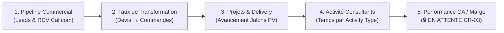

# BOKENGI GROUP 2.0 — DOSSIER DE DÉCISION MÉTIER BI & SUPERSET (CR-06)

**Change Request :** `CR-06` — Tableaux de Bord BI Direction (Couche Analytique & Apache Superset)  
**Date d'Émission :** 26 Septembre 2026  
**Version :** 2.0.0 — Business Decision Pack  
**Statut CR-06 :** 🟡 **CANDIDATE** (En attente formelle des arbitrages du propriétaire)  
**Baseline Canonique Préservée :** Phase 10.8  
**Classification :** Document Décisionnel Réservé à la Direction Générale  

---

## 1. Contexte & Objectif du Dossier

À la suite de l'audit technique préalable ([`BOKENGI_2.0_CR06_SUPERSET_AUDIT.md`](file:///E:/01_Projets/Actifs/Bokengi-group/BOKENGI_2.0_CR06_SUPERSET_AUDIT.md)), ce dossier formalise les **4 choix stratégiques** nécessaires pour encadrer et dimensionner la future couche de pilotage décisionnel (Business Intelligence) de **Bokengi Group**.

> [!IMPORTANT]
> **RÈGLES D'ÉTANCHÉITÉ ET D'INTÉGRITÉ :**
> - **Lecture Seule Stricte :** Apache Superset est un visualiseur passif. Il ne possède aucun droit d'écriture sur MariaDB et ne deviendra jamais une source de vérité transactionnelle.
> - **Indépendance CR-03 / CR-06 :** Les indicateurs CRM et Delivery peuvent être modélisés immédiatement. Les indicateurs financiers restent scellés jusqu'à la transmission des 4 arbitrages de **CR-03**.
> - **InfraPulse :** Totalement absent et hors périmètre.
> - **Sécurité :** Zéro mot de passe, clé API, token ou compte bancaire détaillé n'est exposé.

---

## 2. Proposition des 5 KPIs Exécutifs du Premier Dashboard

Pour garantir une lisibilité optimale sans surcharge cognitive, nous proposons 5 indicateurs stratégiques couvrant l'ensemble de la chaîne de valeur :



### Détail des 5 Indicateurs Proposés

| N° | Nom du KPI | Définition & Calcul | Source ERPNext | Niveau d'Agrégation | Utilité Décisionnelle |
| :---: | :--- | :--- | :--- | :--- | :--- |
| **1** | **Pipeline Commercial & Ingestion** | Nombre de nouveaux leads qualifiés + réservations Cal.com confirmées sur le mois en cours. | `tabLead`, `custom_booking_uid` | Mensuel / Global | Mesurer l'attractivité du site et l'efficacité des canaux d'acquisition. |
| **2** | **Taux de Transformation Commerciale** | Ratio entre le volume de devis émis et les bons de commande validés (`Sales Order Submitted`). | `tabQuotation`, `tabSales Order` | Mensuel / Par Pôle | Évaluer la performance commerciale et le taux de concrétisation par expertise. |
| **3** | **Santé du Delivery & Jalons PV** | Nombre de projets en cours par Pôle, taux de tâches complétées et conformité des PV de recette signés rattachés. | `tabProject`, `tabTask`, `tabFile` | Hebdomadaire / Par Pôle | Anticiper les dérives de planning, sécuriser les livrables et la satisfaction client. |
| **4** | **Répartition du Temps & Productivité** | Volume d'heures déclarées réparties par type d'activité (`ACT-CADRAGE`, `ACT-INGENIERIE`, `ACT-AVANTVENTE`, etc.). | `tabTimesheet`, `tabTimesheet Detail` | Mensuel / Par Pôle & Activité | Mesurer le taux d'occupation effectif et le ratio facturable vs non facturable. |
| **5** | **Performance Financière & CA** 🔒 *(EN ATTENTE CR-03)* | Chiffre d'affaires HT facturé et marge brute estimée par Pôle d'expertise. | `tabSales Invoice` *(Post CR-03)* | Mensuel / Trimestriel | Pilotage de la rentabilité et atterrissage de chiffre d'affaires. |

---

## 3. Options d'Hébergement de la Plateforme Superset

| Option d'Hébergement | Description Technique | Avantages | Contraintes / Arbitrage |
| :--- | :--- | :--- | :--- |
| **Option A : VPS Dédié Conteneurisé (Recommandée)** | Instance Docker autonome (Superset + PostgreSQL métadonnées + Redis cache) sur un serveur d'infrastructure Bokengi. | Isolation totale des performances, souveraineté complète des métadonnées, connexion directe réseau interne MariaDB. | Nécessite un serveur VPS avec au moins 4 Go de RAM. |
| **Option B : Co-hébergement Conteneurisé sur Infra Existante** | Conteneur Docker déployé sur le même serveur que l'instance de développement/staging ERPNext. | Zéro coût d'infrastructure additionnel, déploiement rapide. | Partage des ressources CPU/RAM avec l'instance ERPNext. |

---

## 4. Politique d'Accès et Gouvernance RBAC

- **Rôles Applicatifs Autorisés :**
  - `Direction Générale` : Accès complet en consultation sur l'ensemble des 5 Pôles.
  - `Direction Financière` : Accès consultation CRM, Delivery et KPIs financiers.
- **Principe de Sécurité :**
  - Aucun accès direct des consultants ou du delivery à Superset.
  - Authentification forte et session chiffrée HTTPS.
  - **Zéro compte créé à ce stade** : la liste nominative sera fournie par le propriétaire.

---

## 5. Architecture Technique Validée

```
[ ERPNext MariaDB ] 
        ↓  (SELECT exclusif)
[ Vues SQL view_bi_* ] 
        ↓  (Utilisateur superset_ro en READ-ONLY)
[ Apache Superset (Cache Redis) ] 
        ↓  (HTTPS)
[ Tableaux de Bord Direction ]
```

---

## 6. Formulaire de Décision Métier à Compléter par le Propriétaire

Pour valider l'orientation de **CR-06**, le propriétaire complétera le formulaire ci-dessous :

```text
==============================================================================
CR-06 — ARBITRAGES PROPRIÉTAIRE BOKENGI GROUP
==============================================================================

1. VALIDATION DES 5 KPIS :
   [ ] Validé tel quel (Pipeline, Transformation, Delivery, Temps, CA post-CR03)
   [ ] Ajustements souhaités : ..............................................

2. MODE D'HÉBERGEMENT RETENU :
   [ ] Option A : VPS Dédié Conteneurisé (Recommandé)
   [ ] Option B : Co-hébergement Conteneurisé sur Infra Existante

3. COMPTES UTILISATEURS AUTORISÉS (DIRECTION) :
   - Utilisateur 1 (Email) : .................................................
   - Utilisateur 2 (Email) : .................................................

4. PÉRIMÈTRE DU LOT INITIAL :
   [ ] Lot 1 immédiat : CRM + Delivery + Temps (Indépendant de CR-03)
   [ ] Lot Complet : Attendre la finalisation de CR-03 pour tout activer en une fois

==============================================================================
```

---

## 7. Statut de Gouvernance

- **Statut CR-06 :** 🟡 **`CANDIDATE`** (En attente formelle du retour de la direction sur le formulaire ci-dessus).
- **Interdictions en vigueur :** Aucun déploiement, aucune création de base/table, aucun code modifié.
