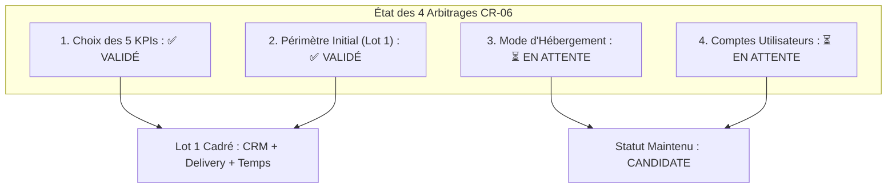

# BOKENGI GROUP 2.0 — REGISTRE DE DÉCISION MÉTIER CR-06 (DECISION RECORD)

**Demande de Changement :** `CR-06` — Tableaux de Bord BI Direction (Couche Analytique & Apache Superset)  
**Date d'Enregistrement :** 26 Septembre 2026  
**Version :** 2.0.0 — Decision Record  
**Statut CR-06 :** 🟡 **CANDIDATE** (En attente des décisions 3 et 4)  
**Baseline Canonique Préservée :** Phase 10.8  
**Classification :** Registre Officiel de Cadrage Décisionnel  

---

## 1. Synthèse du Cadrage Décisionnel

Le présent registre consigne officiellement les premiers arbitrages rendus par la direction générale de **Bokengi Group** pour la mise en place de la solution de Business Intelligence (Apache Superset).

---

## 2. Décisions Confirmées et Validées

### A. Décision 1 : Validation des KPIs du Premier Tableau de Bord (✅ VALIDÉ)
Les 5 indicateurs stratégiques sont officiellement arrêtés :
1. **Pipeline Commercial & Ingestion :** Volume de leads qualifiés et réservations Cal.com sur le mois.
2. **Taux de Transformation Commerciale :** Ratio devis émis $\to$ bons de commande validés par Pôle.
3. **Santé du Delivery & Jalons PV :** Projets en cours, avancement des tâches et conformité des PV signés ([`CR-04`](file:///E:/01_Projets/Actifs/Bokengi-group/CR04_PRODUCTION_CLOSURE.md)).
4. **Répartition du Temps & Productivité :** Heures saisies par type d'activité (`ACT-CADRAGE`, `ACT-INGENIERIE`, `ACT-VALIDATION`, etc.).
5. **Performance CA / Marge :** 🔒 **Scellé & En Attente Formelle de CR-03**.

### B. Décision 2 : Périmètre Initial Autorisé (✅ VALIDÉ)
- **Lot 1 Autorisé :** Cadrage analytique circonscrit exclusivement à **CRM + Delivery + Temps**.
- **Périmètre Financier Exclu :** La partie Chiffre d'Affaires et Marge Brute reste **bloquée sous Financial Governance Hold** jusqu'aux arbitrages de **CR-03**.

---

## 3. Décisions Encore Manquantes (En Attente Direction)

| Décision | Objet | Statut Actuel | Donnée Attendue de la Direction |
| :---: | :--- | :---: | :--- |
| **3** | **Mode d'Hébergement** | ⏳ `À FOURNIR` | Arbitrage entre : • **Option A :** VPS Dédié Conteneurisé • **Option B :** Co-hébergement conteneurisé sur infra existante |
| **4** | **Comptes Utilisateurs Autorisés** | ⏳ `À FOURNIR` | Liste nominative des adresses e-mails de la Direction Générale et Financière à habiliter. |

*(Règle absolue : Aucune valeur n'a été inventée pour ces deux points).*

---

## 4. Garanties d'Architecture & Sécurité

> [!IMPORTANT]
> **VERROUS ET RÈGLES STRICTES MAINTENUS :**
> - **Aucune implémentation réalisée :** 0 conteneur déployé, 0 vue SQL créée dans MariaDB, 0 utilisateur `superset_ro` créé.
> - **READ-ONLY Absolu :** Superset sera configuré exclusivement en lecture seule et ne deviendra jamais une source de vérité transactionnelle.
> - **InfraPulse :** Totalement absent, exclu et hors périmètre Bokengi.
> - **Baseline 10.8 :** Intacte et préservée.

---

## 5. Statut Global de CR-06

- **Statut Actuel :** 🟡 **`CANDIDATE`**
- **Condition de Passage à APPROVED / IMPLEMENTING :** Réception écrite formelle de l'arbitrage Hébergement (Point 3) et des Comptes Utilisateurs (Point 4).
