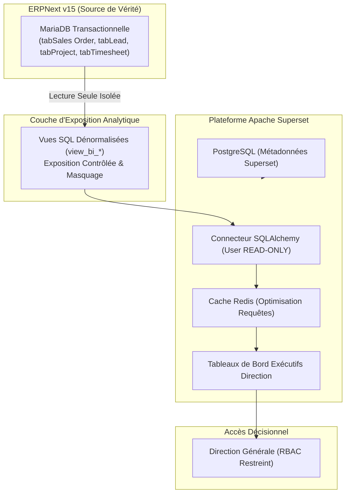

# BOKENGI GROUP 2.0 — AUDIT TECHNIQUE PRÉALABLE BI & APACHE SUPERSET (CR-06)

**Change Request :** `CR-06` — Tableaux de Bord BI Direction (Couche Analytique & Apache Superset)  
**Date d'Émission :** 26 Septembre 2026  
**Version :** 2.0.0 — Audit Only  
**Statut CR-06 :** 🟡 **CANDIDATE** (Aucune modification applicative ni de production effectuée)  
**Baseline Canonique Préservée :** Phase 10.8  
**Classification :** Cadrage Stratégique & Architecture Analytique  

---

## 1. Contexte & Objectifs de l'Audit

Cet audit technique examine les conditions d'intégration d'une couche d'informatique décisionnelle (Business Intelligence) dédiée à la direction générale de **Bokengi Group** via **Apache Superset**.

### Règles d'Or et Frontières
- **READ-ONLY STRICT :** Superset est un outil de visualisation et d'analyse passive. Il n'est en aucun cas une source de vérité transactionnelle et ne dispose d'aucun droit d'écriture sur MariaDB/ERPNext.
- **Étanchéité Financière :** CR-03 demeure au statut `CANDIDATE` (Financial Governance Hold). Aucun paramètre financier réel n'est altéré.
- **Statut des autres chantiers :** CR-01, CR-02 et CR-04 demeurent `CLOSED`.
- **Exclusion d'InfraPulse :** InfraPulse reste strictement et totalement hors périmètre.

---

## 2. Architecture Cible Imposée



---

## 3. Analyse de l'Existant vs Manquant

### A. EXISTANT
- **Modèle de Données ERPNext :** Schémas Frappe stabilisés (CRM Leads, Projets avec jalons PV, Feuilles de temps avec 6 `Activity Types`, Devis, Commandes, Factures).
- **Isolation Réseau :** Base MariaDB sécurisée non exposée publiquement.

### B. MANQUANT
- **Instance Apache Superset :** Aucun conteneur Superset ni base PostgreSQL de métadonnées n'est actuellement instancié.
- **Vues SQL Analytiques :** Les vues d'exposition (`view_bi_*`) doivent être formalisées et déployées dans MariaDB.
- **Utilisateur Base de Données Dédié :** Utilisateur SQL `superset_ro` restreint à `GRANT SELECT` sur les seules vues analytiques.

### C. RÉUTILISABLE
- Les structures de données des 5 Pôles d'expertise et modèles de delivery ([`CR-04`](file:///E:/01_Projets/Actifs/Bokengi-group/CR04_PRODUCTION_CLOSURE.md)).
- La chaîne de traçabilité des prospects et conversions issues de la façade web et de Cal.com.

---

## 4. Données Exposables vs Données Strictement Non Exposables

### A. DONNÉES EXPOSABLES (Indicateurs & KPIs Direction)
1. **Pipeline Commercial & CRM :**
   - Volume de leads ingérés, qualification, taux de conversion RDV Cal.com $\to$ Devis.
   - Montant pondéré des devis en cours d'arbitrage.
2. **Activité & Production par Pôle (Delivery) :**
   - Nombre de projets actifs par Pôle (`Cyber`, `Cloud`, `Data`, `SoftEng`, `Strat`).
   - Progression des tâches et taux de complétion des jalons (PV de recette).
3. **Consommation des Temps & Productivité :**
   - Heures imputées par `Activity Type` (`ACT-CADRAGE`, `ACT-INGENIERIE`, `ACT-VALIDATION`, etc.).
   - Ratio heures facturables vs non-facturables (avant-vente).
4. **Indicateurs Financiers Agrégés (Post-Activation CR-03) :**
   - Chiffre d'affaires facturé / encaissé global et par Pôle.
   - Taux Journalier Moyen (TJM) moyen constaté et marge brute estimée par prestation.

### B. DONNÉES STRICTEMENT NON EXPOSABLES
- ⛔ **InfraPulse :** Totalement absent de tout dashboard, filtre ou requête.
- ⛔ **Mots de Passe & Secrets d'Authentification :** Tables système Frappe (`tabUser`, tokens API, clés de session).
- ⛔ **Coordonnées Bancaires Détaillées :** Aucun numéro de compte bancaire client ou IBAN dans les visualisations générales.
- ⛔ **Données Nominatives Protégées :** Anonymisation / agrégation des données personnelles des prospects dans les graphiques publics.

---

## 5. Exigences RBAC & Sécurité

1. **Étanchéité SQL :**
   - Création d'un utilisateur SQL avec droits limités au strict minimum :
     ```sql
     CREATE USER 'superset_ro'@'%' IDENTIFIED BY '***';
     GRANT SELECT ON bokengi_erp.view_bi_% TO 'superset_ro'@'%';
     FLUSH PRIVILEGES;
     ```
2. **Contrôle d'Accès Applicatif :**
   - Accès aux dashboards réservé aux profils `Direction Générale` et `Direction Financière`.
   - Authentification forte avec session sécurisée (HTTPS obligatoire).
3. **Isolation de Performance :**
   - Utilisation du cache Redis de Superset pour éviter de réinterroger MariaDB à chaque consultation de tableau de bord.
   - Requêtes analytiques avec `timeout` strict (10 secondes max) pour éviter tout blocage transactionnel.

---

## 6. Analyse des Risques & Dépendances

| Risque Identifié | Niveau | Mesure d'Atténuation Validée |
| :--- | :---: | :--- |
| **Surcharge de MariaDB par des requêtes BI lourdes** | Faible | Utilisation exclusive de vues pré-agrégées (`view_bi_*`) et mise en cache Redis. |
| **Fuite de données financières sensibles** | Faible | Utilisateur SQL restreint aux seules vues dédiées ; RBAC Superset strict. |
| **Altération involontaire de données transactionnelles** | Nul | Verrou SQL absolu (`GRANT SELECT` exclusif, 0 permission d'écriture/update). |
| **Dépendance à CR-03** | Moyen | Les dashboards financiers nécessitent l'arbitrage préalable des 4 décisions de CR-03. Les dashboards CRM et Delivery peuvent être préparés immédiatement. |

---

## 7. Décisions Requises du Propriétaire

Avant tout passage à l'implémentation de **CR-06** :

1. **Validation du périmètre des 5 KPIs prioritaires** pour le premier tableau de bord exécutif :
   - *Proposition :* (1) Pipeline commercial, (2) Projets actifs par Pôle, (3) Temps consommés par type d'activité, (4) Jalons de recette validés, (5) CA par Pôle (post-CR03).
2. **Choix de l'environnement d'hébergement Superset :** Déploiement sur serveur VPS interne dédié ou instance conteneurisée.
3. **Liste des utilisateurs autorisés :** Définition des comptes administrateurs décisionnels.

---

## 8. Prochaine Étape Recommandée

Maintenir **CR-06** au statut 🟡 **`CANDIDATE`**.  
Attendre les orientations de la direction sur les KPIs prioritaires avant d'engager la rédaction des scripts SQL de vues d'exposition.

---

> **CONFIRMATION DE SÉCURITÉ :**  
> **AUCUNE MODIFICATION DE CODE OU DE PRODUCTION EFFECTUÉE.**
