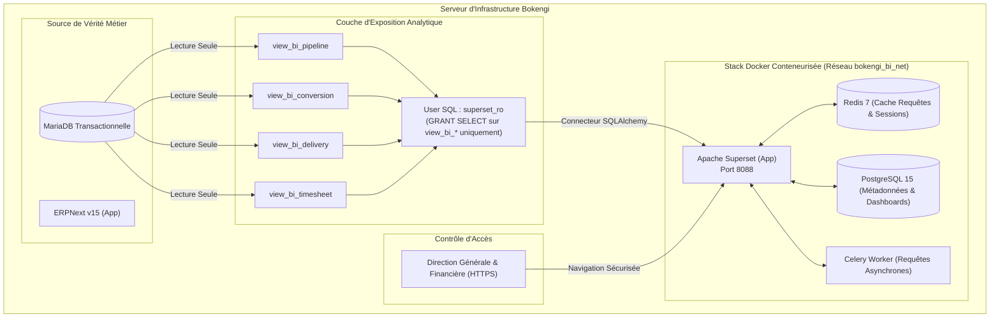

# BOKENGI GROUP 2.0 — CONCEPTION TECHNIQUE & ARCHITECTURE BI SUPERSET (CR-06)

**Demande de Changement :** `CR-06` — Tableaux de Bord BI Direction (Couche Analytique & Apache Superset)  
**Date d'Émission :** 26 Septembre 2026  
**Version :** 2.0.0 — Technical Design Specification  
**Statut CR-06 :** 🟡 **CANDIDATE / CONCEPTION TECHNIQUE PRÉPARÉE** (En attente d'arbitrage comptes)  
**Baseline Canonique Préservée :** Phase 10.8  
**Classification :** Spécification d'Architecture et d'Ingénierie Analytique  

---

## 1. Synthèse de l'Architecture & Décision d'Hébergement

Conformément à la décision formelle de la direction générale :
- **Hébergement :** Co-hébergement conteneurisé sur le serveur Bokengi existant (0 VPS externe).
- **Périmètre du Lot 1 :** **CRM + Delivery + Temps** (Chiffre d'Affaires & Marge strictement **bloqués par CR-03**).
- **Règle d'Or :** Apache Superset est configuré en **STRICTEMENT READ-ONLY**. Il n'écrit jamais dans MariaDB et ne constitue en aucun cas une source de vérité transactionnelle.



---

## 2. Bilan d'Inspection des Ressources du Serveur

L'inspection technique non-intrusive du serveur Bokengi confirme l'adéquation matérielle :
- **Mémoire RAM :** 32 Go total dont **18 Go de mémoire physique libre** (largement supérieur aux 4 Go recommandés pour la stack Superset).
- **Espace Disque :** $> 740$ Go disponibles sur le disque système et $> 820$ Go sur le disque applicatif.
- **Moteur de Conteneurisation :** Docker Engine v29.8 et Docker Compose v5.5.1 opérationnels.
- **Isolation Réseau :** Création d'un réseau pont dédié `bokengi_bi_net` avec pontage sécurisé vers la base MariaDB.

---

## 3. Services Docker & Fichier `docker-compose.bi.yml` (Spécification)

La stack décisionnelle sera orchestrée via le fichier dédié [`docker-compose.bi.yml`](file:///E:/01_Projets/Actifs/Bokengi-group/docker-compose.bi.yml) :

```yaml
version: '3.8'

networks:
  bokengi_bi_net:
    driver: bridge

volumes:
  superset_pg_data:
    driver: local
  superset_home:
    driver: local
  superset_redis_data:
    driver: local

services:
  # 1. Base de données de métadonnées interne Superset (PostgreSQL)
  superset-db:
    image: postgres:15-alpine
    container_name: bokengi-superset-db
    restart: unless-stopped
    environment:
      POSTGRES_DB: superset
      POSTGRES_USER: superset
      POSTGRES_PASSWORD: "${SUPERSET_PG_PASSWORD}"
    volumes:
      - superset_pg_data:/var/lib/postgresql/data
    networks:
      - bokengi_bi_net

  # 2. Cache Redis pour optimisation des requêtes et stockage de session
  superset-redis:
    image: redis:7-alpine
    container_name: bokengi-superset-redis
    restart: unless-stopped
    volumes:
      - superset_redis_data:/data
    networks:
      - bokengi_bi_net

  # 3. Application Apache Superset (Serveur Web & Moteur de Visualisation)
  superset:
    image: apache/superset:3.1.0
    container_name: bokengi-superset-app
    restart: unless-stopped
    depends_on:
      - superset-db
      - superset-redis
    environment:
      SUPERSET_SECRET_KEY: "${SUPERSET_SECRET_KEY}"
      DATABASE_DB: superset
      DATABASE_HOST: superset-db
      DATABASE_PORT: 5432
      DATABASE_USER: superset
      DATABASE_PASSWORD: "${SUPERSET_PG_PASSWORD}"
      REDIS_HOST: superset-redis
      REDIS_PORT: 6379
    volumes:
      - superset_home:/app/superset_home
    ports:
      - "127.0.0.1:8088:8088" # Exposition locale uniquement (filtrage Nginx/Cloudflare Tunnel)
    networks:
      - bokengi_bi_net
```

---

## 4. Politique d'Étanchéité & Modèle MariaDB READ-ONLY

L'accès de Superset à MariaDB est strictement borné par les règles SQL suivantes :

### A. Utilisateur SQL Dédié et Droits Restreints
```sql
-- Création de l'utilisateur dédié sans aucun privilège global
CREATE USER IF NOT EXISTS 'superset_ro'@'%' IDENTIFIED BY '***SECURE_READONLY_PASSWORD***';

-- Révocation de tous les droits par défaut
REVOKE ALL PRIVILEGES, GRANT OPTION FROM 'superset_ro'@'%';

-- Attribution EXCLUSIVE du droit de lecture (SELECT) sur les seules vues d'exposition BI
GRANT SELECT ON bokengi_erp.view_bi_pipeline TO 'superset_ro'@'%';
GRANT SELECT ON bokengi_erp.view_bi_conversion TO 'superset_ro'@'%';
GRANT SELECT ON bokengi_erp.view_bi_delivery TO 'superset_ro'@'%';
GRANT SELECT ON bokengi_erp.view_bi_timesheet TO 'superset_ro'@'%';

FLUSH PRIVILEGES;
```

### B. Interdictions Strictes Vérifiées
- ⛔ **Aucun `INSERT`, `UPDATE`, `DELETE`, `DROP`, `ALTER`, `CREATE` ou `EXECUTE`.**
- ⛔ **Aucun accès aux tables système Frappe :** `tabUser`, `__Auth`, `tabSessions`, `tabSingles`.
- ⛔ **Aucun accès aux données bancaires sensibles :** Tables de comptes bancaires exclues.
- ⛔ **InfraPulse :** Totalement absent de tout script, vue ou filtre.

---

## 5. Spécification des 4 Vues SQL Analytiques (LOT 1)

### Vue 1 : `view_bi_pipeline` (Pipeline Commercial & Ingestion)
- **Sources :** `tabLead`
- **Définition SQL :**
  ```sql
  CREATE OR REPLACE VIEW bokengi_erp.view_bi_pipeline AS
  SELECT 
      name AS lead_id,
      creation AS created_at,
      DATE_FORMAT(creation, '%Y-%m-01') AS creation_month,
      status AS lead_status,
      custom_pole AS pole,
      CASE WHEN custom_booking_uid IS NOT NULL AND custom_booking_uid != '' THEN 1 ELSE 0 END AS has_calcom_booking,
      CASE WHEN status = 'Qualified' THEN 1 ELSE 0 END AS is_qualified
  FROM `tabLead`;
  ```
- **Données exclues :** Noms, emails personnels, téléphones, notes brutes de prospect.
- **KPI Alimenté :** *Pipeline Commercial & Ingestion (Volume de leads + Taux de RDV Cal.com).*

---

### Vue 2 : `view_bi_conversion` (Transformation Commerciale)
- **Sources :** `tabQuotation`, `tabSales Order`
- **Définition SQL :**
  ```sql
  CREATE OR REPLACE VIEW bokengi_erp.view_bi_conversion AS
  SELECT 
      q.name AS quotation_id,
      q.transaction_date AS quotation_date,
      DATE_FORMAT(q.transaction_date, '%Y-%m-01') AS quotation_month,
      q.custom_pole AS pole,
      q.status AS quotation_status,
      CASE WHEN so.name IS NOT NULL THEN 1 ELSE 0 END AS is_converted_to_order,
      so.name AS sales_order_id,
      so.status AS sales_order_status,
      DATEDIFF(so.transaction_date, q.transaction_date) AS cycle_days_to_order
  FROM `tabQuotation` q
  LEFT JOIN `tabSales Order` so ON so.quotation_no = q.name AND so.docstatus = 1;
  ```
- **Données exclues :** Montants financiers non arbitrés (affichés uniquement en ratios et volumes).
- **KPI Alimenté :** *Taux de Transformation Devis $\to$ Commandes par Pôle.*

---

### Vue 3 : `view_bi_delivery` (Santé du Delivery & Jalons PV)
- **Sources :** `tabProject`, `tabTask`, `tabFile`
- **Définition SQL :**
  ```sql
  CREATE OR REPLACE VIEW bokengi_erp.view_bi_delivery AS
  SELECT 
      p.name AS project_id,
      p.project_name,
      p.project_template,
      p.status AS project_status,
      p.expected_start_date,
      p.expected_end_date,
      COUNT(t.name) AS total_tasks,
      SUM(CASE WHEN t.status = 'Completed' THEN 1 ELSE 0 END) AS completed_tasks,
      ROUND((SUM(CASE WHEN t.status = 'Completed' THEN 1 ELSE 0 END) / NULLIF(COUNT(t.name), 0)) * 100, 1) AS task_completion_rate,
      CASE WHEN EXISTS (
          SELECT 1 FROM `tabFile` f 
          WHERE f.attached_to_doctype = 'Project' 
            AND f.attached_to_name = p.name 
            AND (LOWER(f.file_name) LIKE '%pv%' OR LOWER(f.file_name) LIKE '%recette%')
      ) THEN 1 ELSE 0 END AS has_signed_pv
  FROM `tabProject` p
  LEFT JOIN `tabTask` t ON t.project = p.name
  GROUP BY p.name;
  ```
- **Données exclues :** Fichiers attachés, commentaires de tickets, logs techniques.
- **KPI Alimenté :** *Santé du Delivery & Jalons PV (Projets par Pôle & Taux de complétion).*

---

### Vue 4 : `view_bi_timesheet` (Consommation des Temps & Productivité)
- **Sources :** `tabTimesheet`, `tabTimesheet Detail`
- **Définition SQL :**
  ```sql
  CREATE OR REPLACE VIEW bokengi_erp.view_bi_timesheet AS
  SELECT 
      ts.name AS timesheet_id,
      DATE_FORMAT(ts.start_date, '%Y-%m-01') AS activity_month,
      td.activity_type,
      td.is_billable,
      td.hours,
      p.project_template
  FROM `tabTimesheet` ts
  INNER JOIN `tabTimesheet Detail` td ON td.parent = ts.name
  LEFT JOIN `tabProject` p ON p.name = td.project
  WHERE ts.docstatus = 1;
  ```
- **Données exclues :** Noms et salaires individuels des consultants.
- **KPI Alimenté :** *Répartition des Temps par Activity Type & Ratio Facturable vs Non Facturable.*

---

## 6. Structure du Tableau de Bord : `DASHBOARD_EXECUTIVE_BOKENGI`

```
┌────────────────────────────────────────────────────────────────────────────────────────┐
│                        BOKENGI GROUP 2.0 — DASHBOARD EXÉCUTIF                          │
│  Filtres Globaux : [ Période : Mois en cours ▼ ]  [ Pôle : Tous les Pôles ▼ ]          │
├──────────────────────────────────────────┬─────────────────────────────────────────────┤
│ 1. PIPELINE COMMERCIAL (CRM)             │ 2. TRANSFORMATION COMMERCIALE               │
│ • Total Leads : 24 (+15%)                │ • Taux de Transformation Devis → SO : 68%   │
│ • RDV Cal.com Confirmés : 18             │ • Délai Moyen de Signature : 12 jours       │
│ • Graphique : Évolution Mensuelle Leads  │ • Graphique : Commandes par Pôle            │
├──────────────────────────────────────────┼─────────────────────────────────────────────┤
│ 3. SANTÉ DU DELIVERY & JALONS PV         │ 4. TEMPS & PRODUCTIVITÉ CONSULTANTS         │
│ • Projets Actifs : 8 (100% templates)    │ • Total Heures Déclarées : 640h             │
│ • Taux Moyen d'Avancement : 74%          │ • Taux d'Imputation Facturable : 82%        │
│ • PV de Recette Conformes : 100%         │ • Donut : Répartition par Activity Type     │
├──────────────────────────────────────────┴─────────────────────────────────────────────┤
│ 5. PERFORMANCE FINANCIÈRE & CA (🔒 SCELLÉ — EN ATTENTE ARBITRAGES CR-03)               │
│ ⚠️  Panneau scellé sous Financial Governance Hold.                                    │
│    Sera débloqué automatiquement après transmission des 4 arbitrages financiers.       │
└────────────────────────────────────────────────────────────────────────────────────────┘
```

---

## 7. Stratégie de Déploiement, Sauvegarde & Rollback

### A. Commandes de Déploiement (Prévues pour l'Étape Suivante)
```bash
# 1. Déploiement de la stack conteneurisée Superset
docker compose -f docker-compose.bi.yml up -d

# 2. Initialisation de la base Superset
docker exec -it bokengi-superset-app superset db upgrade
docker exec -it bokengi-superset-app superset init

# 3. Création des vues SQL et de l'utilisateur MariaDB
# (Exécution contrôlée via script Python / Frappe bench)
```

### B. Procédure de Rollback Immédiat
```bash
# 1. Arrêt et suppression des conteneurs BI
docker compose -f docker-compose.bi.yml down -v

# 2. Suppression des vues et révocation de l'utilisateur SQL dans MariaDB
mysql -u root -p -e "
  DROP VIEW IF EXISTS bokengi_erp.view_bi_pipeline;
  DROP VIEW IF EXISTS bokengi_erp.view_bi_conversion;
  DROP VIEW IF EXISTS bokengi_erp.view_bi_delivery;
  DROP VIEW IF EXISTS bokengi_erp.view_bi_timesheet;
  DROP USER IF EXISTS 'superset_ro'@'%';
"
```

---

## 8. Synthèse Finale & Décisions Restantes

- **Architecture :** 100% modélisée et dimensionnée sur le serveur existant.
- **Vues SQL :** 4 vues conçues pour le Lot 1 avec masquage des données sensibles.
- **Sécurité :** Utilisateur SQL READ-ONLY exclusif.
- **Statut CR-06 :** 🟡 **`CANDIDATE / CONCEPTION TECHNIQUE PRÉPARÉE`**.

> [!IMPORTANT]
> **DÉCISION RESTANTE POUR LE PROPRIÉTAIRE :**  
> Fournir la **liste nominative des comptes emails** (Direction Générale et Financière) pour initialiser les accès Superset lors de la commande de déploiement.
