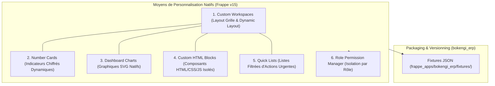
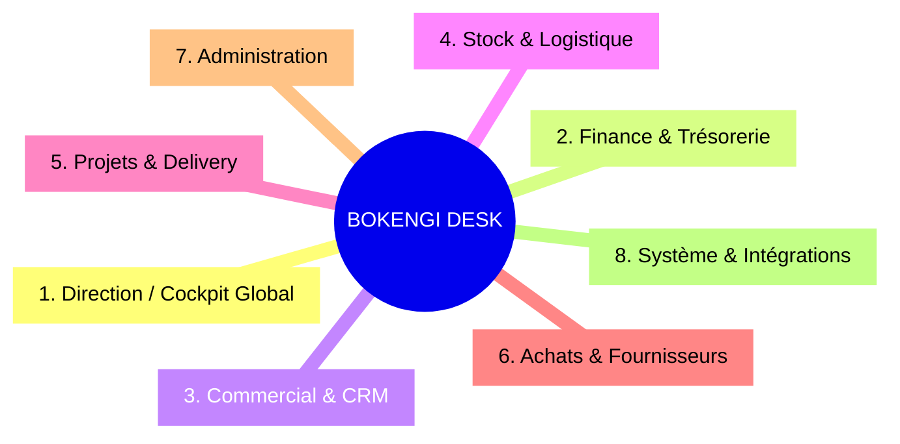
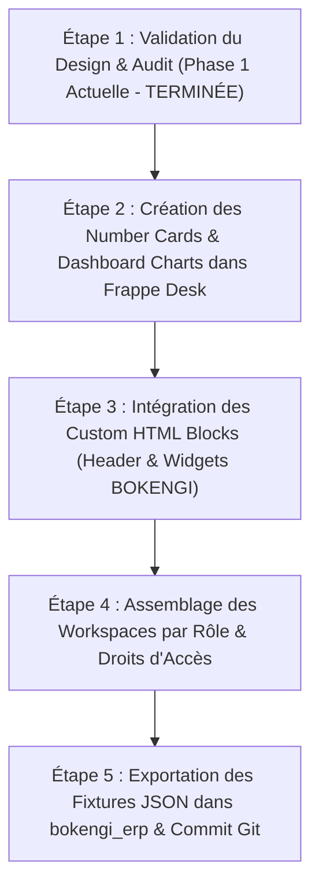

# BOKENGI GROUP — CONCEPTION DU DASHBOARD ENTERPRISE ERPNext (REDESIGN UX/UI)

**Projet :** BOKENGI 2.0 — Redesign UX/UI ERPNext Desk & Enterprise Cockpit  
**Date d'Élaboration :** 26 Septembre 2026  
**Version :** 2.0.0 — Design & Architecture Blueprint  
**Statut de l'Intervention :** PHASE 1 — AUDIT ET CONCEPTION UNIQUEMENT (0 Modification de Code ou de Système)  
**Objectif :** Transformer l'interface standard ERPNext Desk en un véritable **BOKENGI GROUP ENTERPRISE DASHBOARD** (Sobriété, Élégance, Décisionnel, 100% Natif Frappe v15).

---

## 1. ÉTAT ACTUEL DE L'INTERFACE ERPNext DESK

L'interface actuellement accessible sur `https://gestion.bokengi-group.com` utilise la configuration d'accueil par défaut du framework Frappe v15.

### Diagnostique UX/UI Constaté
1. **Aspect Générique :** Absence d'identité visuelle forte BOKENGI Group (couleurs neutres standard Frappe Gray/Blue, logo générique, absence de bannière institutionnelle).
2. **Surcharge d'Information :** Présence de nombreux raccourcis et modules secondaires non pertinents pour la prise de décision de la Direction et des Responsables Métiers.
3. **Absence de Vue Synthétique Global (Cockpit) :** Les KPI financiers, commerciaux, de stock et de projets sont dispersés dans des sous-modules distincts au lieu d'être consolidés sur un tableau de bord unique.
4. **Hiérarchie Visuelle Inadaptée :** Les cartes d'information manquent de contraste et de densité visuelle optimisée pour les écrans de travail desktop.

---

## 2. AUDIT DES POSSIBILITÉS NATIVES ERPNEXT / FRAPPE (0 HACK CORE)

Avant toute proposition de design, un audit exhaustif des mécanismes de personnalisation natifs de Frappe Framework v15 a été réalisé. **Toutes les propositions ci-dessous sont 100% réalisables sans modifier une seule ligne du code source du cœur de Frappe ou d'ERPNext.**



### Mécanismes Natifs Exploités
1. **Custom Workspaces (`Workspace` DocType) :** Permet d'organiser visuellement la page d'accueil et les espaces de travail secondaires avec des sections, des lignes, des colonnes, des cartes d'accès rapide, des raccourcis et des liens.
2. **Number Cards (`Number Card` DocType) :** Widgets natifs affichant une métrique agrégée (Somme, Compte, Moyenne) sur n'importe quel champ de n'importe quel DocType, avec indicateur de tendance et couleur conditionnelle.
3. **Dashboard Charts (`Dashboard Chart` DocType) :** Graphiques natifs (Barres, Lignes, Camembert, Donut) alimentés directement par les requêtes sur MariaDB ou par des méthodes Python dédiées.
4. **Custom HTML Blocks (`Custom HTML Block` DocType - Nouveauté Frappe v14/v15) :** Permet d'injecter du code HTML/CSS/JS responsive entièrement personnalisé dans les Workspaces, autorisant la création de composants haut de gamme (Header Cockpit BOKENGI, bannières d'alerte, barres de statut) avec une parfaite isolation Sandbox.
5. **Quick Lists (Listes d'Actions) :** Affichage direct des 5 derniers éléments nécessitant une intervention (Factures à traiter, Tâches en retard, Leads non assignés).
6. **Role Permission Manager & Desk Settings :** Masquage automatique des Workspaces et des widgets selon les rôles attribués à l'utilisateur connecté.
7. **Exportation en Fixtures (`hooks.py`) :** Tous ces objets de configuration créés via l'interface Desk sont exportables au format JSON dans `frappe_apps/bokengi_erp/fixtures/`, garantissant un déploiement 100% automatisé et pérenne sur le dépôt Git.

---

## 3. CHARTE GRAPHIQUE ET IDENTITÉ VISUELLE BOKENGI

Pour transformer ERPNext en **BOKENGI Enterprise Cockpit**, le design appliquera la charte visuelle officielle de BOKENGI Group :

### Palette de Couleurs
- **Bokengi Navy Primary (Dominante Direction & Structure) :** `#0A192F` / `#003366`
- **Bokengi Emerald / Green (Indicateurs Positifs & Validation) :** `#059669` / `#10B981`
- **Bokengi Amber / Gold (Alertes & Attente) :** `#D97706` / `#F59E0B`
- **Bokengi Crimson (Alertes Critiques & Ruptures) :** `#DC2626`
- **Slate Gray (Textes & Bordures Sobres) :** `#334155` / `#64748B`
- **Background Slate Light (Fond de Cockpit) :** `#F8FAFC`

### Principes de Design UX
- **Sobriété et Élégance :** Zéro gadget visuel, zéro animation superflue.
- **Densité d'Information Optimisée :** Conçu prioritairement pour les écrans Desktop (1080p, 1440p et 4K) avec alignement strict sur grille 12 colonnes.
- **Lisibilité Haute Performance :** Typographie système propre (`Inter`, `System UI`), contrastes respectant les normes WCAG AA.

---

## 4. ARCHITECTURE UI DU DASHBOARD : BOKENGI ENTERPRISE COCKPIT

Le Dashboard principal d'accueil sera structuré en 5 zones fonctionnelles complémentaires :

```text
┌──────────────────────────────────────────────────────────────────────────────────────────────────┐
│  BOKENGI GROUP 2.0 — ENTERPRISE COCKPIT                       Recherche Globale / Profil Rôle  │
├──────────────────────────────────────────────────────────────────────────────────────────────────┤
│                                                                                                  │
│ ┌──────────────────┐ ┌──────────────────┐ ┌──────────────────┐ ┌──────────────────┐            │
│ │ CA du Mois       │ │ Créances Client  │ │ Solde Trésorerie │ │ Commandes Actives│            │
│ │ 145 000 €        │ │ 32 400 €         │ │ 210 500 €        │ │ 12               │            │
│ │ ↗ +12% vs M-1    │ │ ⚠ 3 en retard    │ │ 🟢 Solide        │ │ 📦 En cours      │            │
│ └──────────────────┘ └──────────────────┘ └──────────────────┘ └──────────────────┘            │
│                                                                                                  │
├──────────────────────────────────────────────────────────────────────────────────────────────────┤
│                                                                                                  │
│  PERFORMANCE COMMERCIALE & FINANCIÈRE                                                            │
│  ┌──────────────────────────────────────────────┐ ┌──────────────────────────────────────────┐  │
│  │ Dashboard Chart : Évolution Ventes (12 mois) │ │ Quick List : Factures en Attente (Action)│  │
│  │ [ Bar / Line Chart Frappe Native ]           │ │ • INV-2026-0042 — Client ACME (4 500 €)  │  │
│  │                                              │ │ • INV-2026-0045 — Client TECH (12 000 €) │  │
│  └──────────────────────────────────────────────┘ └──────────────────────────────────────────┘  │
│                                                                                                  │
├──────────────────────────────────────────────────────────────────────────────────────────────────┤
│                                                                                                  │
│  STOCK, LOGISTIQUE & PROJETS                          ACTIONS URGENTES & APPROBATIONS            │
│  ┌──────────────────────────────────────────────┐ ┌──────────────────────────────────────────┐  │
│  │ Stock & Projets en cours                     │ │ Workflows & Valideurs                    │  │
│  │ • 4 Articles en seuil critique               │ │ • 2 Devis à valider (> 10k €)            │  │
│  │ • 8 Projets actifs (1 en retard)             │ │ • 3 Approbations de dépenses             │  │
│  └──────────────────────────────────────────────┘ └──────────────────────────────────────────┘  │
│                                                                                                  │
├──────────────────────────────────────────────────────────────────────────────────────────────────┤
│  RACCOURCIS RAPIDES METIER :  [+ Nouveau Lead]  [+ Nouveau Devis]  [+ Saisie Temps]  [Rapports]  │
└──────────────────────────────────────────────────────────────────────────────────────────────────┘
```

---

## 5. RATIONALISATION DE LA NAVIGATION PAR DOMAINE MÉTIER

Pour éviter la surcharge visuelle du menu latéral (Sidebar Frappe Desk), la navigation sera restructurée en **8 Espaces de Travail (Workspaces) métier distincts** :



### Contenu et Portée de chaque Workspace
1. **Direction / Cockpit Global (Accueil par défaut) :** Vue consolidée synthétique (CA, Trésorerie, Ventes, Créances, Risques, Projets stratégiques).
2. **Finance & Trésorerie :** Factures clients, Factures fournisseurs, Journal des encaissements, Suivi du recouvrement, Rapprochements bancaires, Registre E-Invoicing.
3. **Commercial & CRM :** Pipeline de Leads (Next.js / Cal.com), Opportunités, Devis, Commandes clients, Fiches Clients & Contacts.
4. **Stock & Logistique :** État du stock par entrepôt, Valeur du stock, Seuils de réapprovisionnement, Mouvements de stock, Articles.
5. **Projets & Delivery :** Projets actifs, Modèles de projets (`TEMPLATE-*`), Tâches, Feuilles de temps (Timesheets), Livrables.
6. **Achats & Fournisseurs :** Demandes d'achat, Commandes d'achat, Réceptions, Référentiel Fournisseurs.
7. **Administration :** Gestion des utilisateurs, Attributs des rôles, Organigramme, Paramètres BOKENGI Group (`Bokengi Settings`).
8. **Système & Intégrations :** Logs Mattermost, Statut des Webhooks Cal.com, Télémétrie Cloudflare Workers, Logs d'erreurs Frappe.

---

## 6. STRATÉGIE ET PERSONNALISATION PAR RÔLE

L'accès aux Workspaces et aux widgets du Dashboard sera rigoureusement filtré selon le rôle de l'utilisateur :

| Rôle Utilisateur | Workspace d'Accueil | Widgets Visible sur le Cockpit | Restrictions d'Accès Strictes |
| :--- | :--- | :--- | :--- |
| **Direction (Executive / CEO)** | Direction / Enterprise Cockpit | Vue 100% complète : CA, Trésorerie, Marge, Leads, Projets, Stock. | Accès complet en consultation et validation finale. |
| **Responsable Financier (Accounts Manager)** | Finance & Trésorerie | CA, Créances, Factures à traiter, Encaissements, Statut E-Invoicing. | Aucune modification des paramètres système ou des pipelines de dev. |
| **Ingénieur Commercial (Sales User / Manager)** | Commercial & CRM | Leads reçus, RDV Cal.com, Devis en cours, Taux de conversion. | Zéro accès aux métriques de trésorerie globale ou bancaires. |
| **Chef de Projet / Delivery Lead** | Projets & Delivery | Projets actifs, Avancement des tâches, Feuilles de temps, PV de livraison. | Masquage des montants financiers et des marges globales. |
| **Gestionnaire de Stock (Stock User)** | Stock & Logistique | Niveaux de stock, Articles critiques, Entrées/Sorties, Commandes d'achat. | Aucun accès au CRM ou à la comptabilité générale. |
| **Administrateur Système (System Manager)** | Système & Administration | Santé du serveur, Logs d'erreurs, Utilisateurs, Intégrations API. | Accès technique intégral. |

---

## 7. MATRICE COMPLÈTE DES DATA SOURCES & KPI (100% NATIVE ERPNEXT)

Chaque KPI présenté sur le tableau de bord est adossé aux données réelles préexistantes dans MariaDB via ERPNext v15 :

| Nom du KPI | DocType Source | Champs & Calculs Requis | Type Widget Frappe | Fréquence MàJ | Rôles Autorisés | Difficulté Impl. |
| :--- | :--- | :--- | :--- | :---: | :--- | :---: |
| **Chiffre d'Affaires Mensuel** | `Sales Invoice` | `SUM(grand_total)` WHERE `docstatus = 1` AND `posting_date = CURRENT_MONTH` | `Number Card` | Temps réel | Direction, Finance | Simple |
| **Créances Clients À Recouvrer** | `Sales Invoice` | `SUM(outstanding_amount)` WHERE `docstatus = 1` AND `outstanding_amount > 0` | `Number Card` | Temps réel | Direction, Finance | Simple |
| **Solde Trésorerie Réel** | `GL Entry` | `SUM(debit - credit)` pour les comptes de classe 512/Banque | `Number Card` | Temps réel | Direction, Finance | Moyen |
| **Commandes Clients Actives** | `Sales Order` | `COUNT(name)` WHERE `status IN ('To Deliver and Bill', 'To Bill')` | `Number Card` | Temps réel | Direction, Commerce | Simple |
| **Leads Non Qualifiés** | `Lead` | `COUNT(name)` WHERE `status = 'Open'` | `Number Card` | Temps réel | Direction, Commerce | Simple |
| **RDV Cal.com Programmés** | `Lead` | `COUNT(name)` WHERE `custom_payload_id IS NOT NULL` AND `status = 'Open'` | `Number Card` | Temps réel | Direction, Commerce | Simple |
| **Articles en Rupture / Critique** | `Bin` | `COUNT(item_code)` WHERE `projected_qty <= reorder_level` | `Number Card` | 5 minutes | Direction, Stock | Simple |
| **Projets Actifs en Cours** | `Project` | `COUNT(name)` WHERE `status = 'Open'` | `Number Card` | Temps réel | Direction, Delivery | Simple |
| **Évolution des Ventes (12M)** | `Sales Invoice` | Graphique temporel par mois sur `grand_total` | `Dashboard Chart` | 1 heure | Direction, Finance | Simple |
| **Pipeline Commercial** | `Opportunity` | Graphique par étape (`Prospecting`, `Quotation`, `Converting`) | `Dashboard Chart` | 15 minutes | Direction, Commerce | Simple |

---

## 8. SPÉCIFICATION TECHNIQUE DES CUSTOM HTML BLOCKS

Pour garantir un rendu d'exception tout en restant 100% natif Frappe, des **Custom HTML Blocks** seront intégrés dans le Workspace principal.

### Exemple de Custom HTML Block : Header Cockpit BOKENGI Group
Ce composant injectera dynamiquement le logo, la date système et le statut opérationnel de la plateforme :

```html
<div class="bokengi-cockpit-header" style="background: linear-gradient(135deg, #0A192F 0%, #003366 100%); padding: 20px 24px; border-radius: 12px; color: #FFFFFF; display: flex; justify-content: space-between; align-items: center; margin-bottom: 20px; box-shadow: 0 4px 12px rgba(10, 25, 47, 0.15);">
    <div style="display: flex; align-items: center; gap: 16px;">
        <div style="background: rgba(255, 255, 255, 0.1); padding: 10px; border-radius: 8px; font-weight: bold; font-size: 20px; letter-spacing: 1px;">
            BOKENGI GROUP
        </div>
        <div>
            <h2 style="margin: 0; font-size: 18px; font-weight: 600; color: #FFFFFF;">ENTERPRISE COCKPIT 2.0</h2>
            <p style="margin: 4px 0 0 0; font-size: 12px; color: #94A3B8;">Vue Consolidée de la Direction & des Opérations</p>
        </div>
    </div>
    <div style="text-align: right;">
        <span style="display: inline-flex; align-items: center; gap: 6px; background: rgba(16, 185, 129, 0.2); color: #34D399; padding: 4px 12px; border-radius: 20px; font-size: 12px; font-weight: 500;">
            <span style="width: 8px; height: 8px; background: #10B981; border-radius: 50%;"></span> Système Opérationnel
        </span>
    </div>
</div>
```

---

## 9. FICHIERS DE CONFIGURATION CONCERNÉS (APP `bokengi_erp`)

L'implémentation de cette conception s'effectuera intégralement dans l'application Frappe sur mesure `bokengi_erp` sans altérer le cœur de Frappe.

### Emplacements des Fichiers et Exportations
- **Exportation des Workspaces :** `frappe_apps/bokengi_erp/bokengi_erp/fixtures/workspace.json`
- **Exportation des Number Cards :** `frappe_apps/bokengi_erp/bokengi_erp/fixtures/number_card.json`
- **Exportation des Dashboard Charts :** `frappe_apps/bokengi_erp/bokengi_erp/fixtures/dashboard_chart.json`
- **Exportation des Custom HTML Blocks :** `frappe_apps/bokengi_erp/bokengi_erp/fixtures/custom_html_block.json`
- **Mise à jour des Fixtures dans `hooks.py` :**

```python
# frappe_apps/bokengi_erp/bokengi_erp/hooks.py

fixtures = [
    {"dt": "Workspace", "filters": [["module", "=", "Bokengi ERP"]]},
    {"dt": "Number Card", "filters": [["name", "like", "Bokengi %"]]},
    {"dt": "Dashboard Chart", "filters": [["name", "like", "Bokengi %"]]},
    {"dt": "Custom HTML Block", "filters": [["name", "like", "Bokengi %"]]}
]
```

---

## 10. RISQUES ET STRATÉGIE DE MAINTENANCE

| Risque UX/UI | Cause Potential | Mesure Préventive & Architecture |
| :--- | :--- | :--- |
| **Dégradation des Performances MariaDB** | Requêtes SQL trop fréquentes pour calculer les Number Cards en direct. | Configuration d'une fréquence de rafraîchissement raisonnable (ex: 15 min / 1h) et indexation des champs de recherche. |
| **Incompatibilité lors des mises à jour Frappe** | Modification des classes CSS internes de Frappe Desk. | Utilisation stricte des composants natifs (`Custom HTML Block`) avec styles inline et conteneurs autonomes scoped. |
| **Fuite d'Information Financière entre Rôles** | Mauvaise attribution des cartes de Dashboard aux utilisateurs. | Filtrage strict via le champ `roles` natif des `Number Card` et `Workspace`. |

---

## 11. PLAN D'IMPLÉMENTATION PAR ÉTAPES (POST-AUDIT)

Une fois la Phase 1 d'audit validée par la Direction, le déploiement du redesign s'effectuera selon les 5 étapes suivantes :



### Contenu des Étapes à Venir (Soumis à Validation Explicite)
1. **Étape 2 (Cartes & Graphiques) :** Instanciation des 10 `Number Card` et 4 `Dashboard Chart` sur l'environnement ERPNext Staging/Production.
2. **Étape 3 (Composants HTML BOKENGI) :** Injection des blocs HTML sur mesure pour la bannière de marque et le tableau d'actions d'urgence.
3. **Étape 4 (Workspaces & Rôles) :** Structuration de la barre de navigation et assignation des accès par rôle (Executive, Finance, Commerce, Stock, Delivery).
4. **Étape 5 (Pérennisation & Exportation) :** Lancement de la commande Bench `bench export-fixtures` pour figer l'ensemble des JSON dans `frappe_apps/bokengi_erp/fixtures/` et commit sur le dépôt GitHub.
