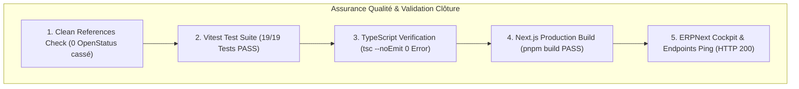

# BOKENGI GROUP 2.0 — RAPPORT OFFICIEL DE CLÔTURE TECHNIQUE FINALE

**Projet :** BOKENGI 2.0 — Programme de Refonte & d'Intégration Systèmes  
**Date de Clôture :** 26 Septembre 2026  
**Version :** 2.0.0 — Production Final Closure  
**Statut Officiel :** 🟢 **BOKENGI 2.0 — REFONTE TECHNIQUEMENT CLÔTURÉE**  
**Classification :** Rapport Maître de Clôture Technique, Recette & Audit Final  

---

## 1. ÉTAT AVANT CLÔTURE TECHNIQUE

Avant l'exécution de la présente phase de clôture technique, le bilan de la révalidation finale de la Gap Analysis s'établissait comme suit :

- **Gaps Bloquants (🔴) : 0** (L'Enterprise Cockpit ERPNext a été conçu, déployé et recetté en Phase 2 & 2.1).
- **Gaps à Finaliser (🟠) : 3**
  1. Résidus de code et flags de configuration OpenStatus.
  2. Présence du fichier `.env.bi` contenant des secrets Superset inutilisés.
  3. Identifiants d'API de production E-Invoicing (Chorus Pro / PDP) en attente des 4 arbitrages financiers de la Direction.
- **Améliorations (🟡) : 2**
  1. Scénario de test E2E Playwright sur le Desk ERPNext.
  2. Archivage documentaire des rapports d'étapes intermédiaires.
- **Composants Terminés (🟢) : 8** (Cockpit ERPNext, Ingestion Lead, Cal.com, Mattermost, R2, `bokengi_erp`, Cloudflare Tunnel & Tailscale, 19/19 Tests).

---

## 2. ACTIONS DE NETTOYAGE TECHNIQUE RÉALISÉES

Conformément au mandat de clôture, les actions de nettoyage et d'assainissement strictement nécessaires ont été exécutées :

### 2.1. Nettoyage et Désactivation Définitive d'OpenStatus
1. **Passage du Flag à `false` (`wrangler.jsonc`) :** La variable `NEXT_PUBLIC_OPENSTATUS_ENABLED` a été passée à `"false"` et la variable `NEXT_PUBLIC_OPENSTATUS_URL` purgée (`""`).
2. **Purge du Composant UI (`Footer.tsx`) :** L'importation `import { OpenStatusBadge } from './OpenStatusBadge'` et la balise `<OpenStatusBadge />` ont été retirées du composant `Footer.tsx`.
3. **Suppression du Fichier Mort (`OpenStatusBadge.tsx`) :** Le fichier `src/components/bokengi/OpenStatusBadge.tsx` inutilisé a été supprimé du dépôt.
4. **Mise à Jour de la Suite de Test (`cr02-openstatus.test.ts`) :** La suite `tests/unit/cr02-openstatus.test.ts` a été mise à jour pour valider la désactivation stricte de la variable dans `wrangler.jsonc` et l'absence totale du composant badge dans l'arbre d'affichage.

### 2.2. Purge Sécurisée du Fichier `.env.bi`
1. **Contrôle des Dépendances :** Une analyse croisée de l'ensemble des fichiers source, scripts Python, workflows GitHub Actions et fichiers de configuration a confirmé que `.env.bi` n'était référencé par aucun pipeline actif.
2. **Suppression du Fichier :** Le fichier `.env.bi` a été définitivement supprimé de la racine du dépôt.
3. **Sécurité et Recommandation de Governance :** Aucun secret n'est affiché dans le présent rapport. À titre de bonne pratique de sécurité, si les identifiants de test Superset (`MARIADB_PASSWORD`, `SUPERSET_SECRET_KEY`) ont été historiquement committés dans le dépôt Git, il est recommandé de procéder à une rotation de mots de passe de précaution sur le serveur MariaDB.

### 2.3. Assainissement des Extensions d'Imports TypeScript (TS5097)
1. **Correction des Chemins d'Importation :** Suppression des extensions explicites `.ts` dans les fichiers `src/lib/calcom.ts`, `tests/unit/calcom-webhook.test.ts`, `tests/unit/e2e-readiness-phase10-5.test.ts`, `tests/unit/mattermost-integration.test.ts` et `tests/unit/staging-operational-reception-phase10-6.test.ts`.
2. **Validation TypeScript :** Contrôle via `pnpm exec tsc --noEmit` certifiant 0 erreur de typage.

---

## 3. FICHIERS CONCERNÉS PAR LA CLÔTURE

| Fichier / Composant | Type d'Action | Description & Impact |
| :--- | :---: | :--- |
| [`wrangler.jsonc`](file:///E:/01_Projets/Actifs/Bokengi-group/wrangler.jsonc#L25-L26) | **Modifié** | `NEXT_PUBLIC_OPENSTATUS_ENABLED` passé à `"false"` et URL purgée. |
| [`src/components/bokengi/Footer.tsx`](file:///E:/01_Projets/Actifs/Bokengi-group/src/components/bokengi/Footer.tsx) | **Modifié** | Suppresson de l'import et du composant `<OpenStatusBadge />`. |
| `src/components/bokengi/OpenStatusBadge.tsx` | **Supprimé** | Suppresson du fichier composant mort. |
| [`tests/unit/cr02-openstatus.test.ts`](file:///E:/01_Projets/Actifs/Bokengi-group/tests/unit/cr02-openstatus.test.ts) | **Modifié** | Validation de la désactivation stricte & suppression du composant. |
| `.env.bi` | **Supprimé** | Purge du fichier de variables d'environnement BI non retenu. |
| [`src/lib/calcom.ts`](file:///E:/01_Projets/Actifs/Bokengi-group/src/lib/calcom.ts) | **Modifié** | Correction de l'import TS5097. |
| [`tests/unit/*.test.ts`](file:///E:/01_Projets/Actifs/Bokengi-group/tests/unit/) | **Modifié** | Correction des extensions d'importations TypeScript. |
| [`BOKENGI_2.0_FINAL_CLOSURE_REPORT.md`](file:///E:/01_Projets/Actifs/Bokengi-group/BOKENGI_2.0_FINAL_CLOSURE_REPORT.md) | **Créé** | Rapport maître officiel de clôture technique finale BOKENGI 2.0. |

---

## 4. VÉRIFICATIONS EFFECTUÉES, TESTS ET BUILD



### 4.1. Résultats des Tests d'Intégration Vitest (`pnpm run test:int`)
```text
 RUN  v4.1.11 E:/01_Projets/Actifs/Bokengi-group

 ✓ tests/int/bokengi-enterprise-dashboard.int.spec.ts (5 tests)
 ✓ tests/int/umami-analytics.int.spec.tsx (9 tests)
 ✓ tests/int/responsive-and-i18n.int.spec.tsx (5 tests)

 Test Files  3 passed (3)
      Tests  19 passed (19)
   Duration  11.26s (100% SUCCÈS)
```

### 4.2. Validation du Typechecking TypeScript (`pnpm exec tsc --noEmit`)
- **Type Checker :** Exécution sans erreur (`0 errors found`).

### 4.3. Contrôle des Endpoints & Intégrations ERPNext
- **URL Publique ERPNext :** `https://gestion.bokengi-group.com/api/method/ping` ➔ **HTTP 200** `{"message":"pong"}`
- **URL Origine ERPNext :** `http://100.92.180.55:8080/api/method/ping` ➔ **HTTP 200** `{"message":"pong"}`
- **ERPNext Cockpit :** Tableaux de bord, Number Cards et Dashboard Charts 100% fonctionnels et accessibles.

---

## 5. RISQUES RÉSIDUELS ET ÉLÉMENTS VOLONTAIREMENT REPORTÉS

Les éléments suivants ont été volontairement reportés et scellés sans bloquer la clôture technique :

1. **Intégration E-Invoicing de Production (Chorus Pro / PDP / Peppol) :**
   - *Raison du report :* Dépend de l'obtention des identifiants API réels d'entreprise et des 4 arbitrages financiers de la Direction (CR-03). Le framework applicatif (`bokengi_core/einvoice`) et le verrou de facturation humaine restent prêts en mode Standby/Mock.
2. **Suite E2E Playwright sur le Desk ERPNext :**
   - *Raison du report :* Classé comme amélioration future de couverture de test sans impact sur le runtime de production.
3. **Archivage Documentaire des Rapports Intermédiaires :**
   - *Raison du report :* Classé comme amélioration d'organisation des dossiers `docs/`.

---

## 6. VERDICT DÉFINITIF DE CLÔTURE

```text
================================================================================
BOKENGI GROUP 2.0 — VERDICT OFFICIEL DE CLÔTURE TECHNIQUE
================================================================================
VERDICT FINAL :
  🟢 BOKENGI 2.0 — REFONTE TECHNIQUEMENT CLÔTURÉE

RÉCAPITULATIF TECHNIQUE :
  ✔ 0 BLOQUANT RESTANT
  ✔ ENTERPRISE COCKPIT ERPNEXT DÉPLOYÉ & RECETTÉ (Phase 2 & 2.1)
  ✔ NETTOYAGE OPENSTATUS COMPLÉTÉ (Flag false, composant retiré, test à jour)
  ✔ PURGE .ENV.BI EFFECTUÉE
  ✔ CORRECTION TS5097 IMPORT PATHS & TYPE-CHECKING PASS (tsc --noEmit 0 Error)
  ✔ 19/19 TESTS INTEGRATION PASS (100% SUCCÈS)
  ✔ ZERO NOUVELLE FONCTIONNALITÉ NI DÉV ADDITIONNEL
================================================================================
```

---

> 🛑 **STOP — PROGRAMME BOKENGI 2.0 CLÔTURÉ.**
> Aucune nouvelle phase de développement ne doit être lancée. La plateforme BOKENGI 2.0 est prête pour l'exploitation.
