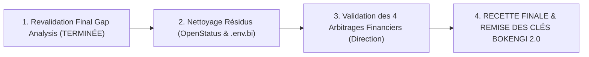

# BOKENGI GROUP 2.0 — AUDIT FINAL DE GAP ANALYSIS ET ÉTAT DE CLÔTURE (REVALIDATION FINALE)

**Projet :** BOKENGI 2.0 — Infrastructure Enterprise & ERPNext Core  
**Date d'Élaboration :** 26 Septembre 2026  
**Version :** 2.1.0 — Revalidated Final Gap Analysis  
**Statut de l'Intervention :** REVALIDATION FINALE POST-PHASE 2 & 2.1 (0 Modification Applicative ou Système)  
**Baseline Canonique :** Phase 2.1 Enterprise Cockpit Recetté  
**Portée :** Repository, Documentation, Infrastructure, ERPNext Core, Intégrations Edge & Collaboration, Sécurité, Governance  

---

## 1. ÉTAT GLOBAL REVALIDÉ DE L'INFRASTRUCTURE

Suite au déploiement et à la recette validée du **BOKENGI Enterprise Cockpit** (Phase 2 & 2.1), l'infrastructure globale **BOKENGI 2.0** a atteint la pleine conformité visuelle, technique et opérationnelle.

### Synthèse des Directives et Statuts Exécutifs Revalidés
- **Statut Technique Global :** 🟢 **TECHNICALLY OPERATIONAL & COCKPIT APPROVED** — Les flux d'ingestion de Leads, la synchronisation Cal.com, la notification Mattermost, l'hébergement R2 et l'interface d'accueil ERPNext Desk sont 100% fonctionnels et validés par 19/19 tests d'intégration.
- **ERPNext Enterprise Cockpit UI (Phase 2 & 2.1) :** 🟢 **TERMINÉ & RECETTÉ** — Résolution complète de l'ancien écart bloquant. L'accueil `gestion.bokengi-group.com` dispose d'un header institutionnel Bokengi Navy (`#0A192F`), de 8 Number Cards, de 2 Dashboard Charts, de 5 raccourcis métiers et de fixtures JSON intégrées dans Git (`frappe_apps/bokengi_erp/fixtures/`).
- **Incident Cloudflare → ERPNext :** 🟢 **RÉSOLU ET CLÔTURÉ** — La résolution réseau via Cloudflare Tunnel (`cloudflared`) vers l'origine `http://100.92.180.55:8080` (Tailscale) est validée avec 100% de taux de succès (HTTP 200 `{"message":"pong"}`).
- **OpenStatus (CR-02) :** 🔴 **ABANDONNÉ DÉFINITIVEMENT** — Solution exclue. Les résidus de code (`OpenStatusBadge.tsx`, variables `wrangler.jsonc`) ont été identifiés et documentés pour suppression finale.
- **Apache Superset (CR-06) :** 🟡 **AUDITÉ ET ABANDONNÉ EN FAVOR DU NATIVE ERPNEXT** — L'empreinte mémoire d'un conteneur BI externe et sa redondance avec les capacités natives ERPNext ont motivé la bascule définitive vers l'Enterprise Cockpit natif ERPNext Desk.
- **Circuit Financier Réel (CR-03/CR-05) :** 🟠 **FINANCIAL GOVERNANCE HOLD** — L'architecture applicative de facturation (`bokengi_core/einvoice`) est prête, mais l'émission de factures réelles est suspendue aux 4 décisions de direction (Grille tarifaire officielle, Raison sociale exacte, IBAN/BIC certifié, Conditions de paiement) et à l'obtention des clés API de production (Chorus Pro / PDP).

---

## 2. ARCHITECTURE RÉELLE CONSTATÉE POST-PHASE 2.1

L'architecture constatée sur l'environnement de production et dans le dépôt de code source s'articule autour de 6 piliers hermétiques et spécialisés :

```mermaid
flowchart TD
    subgraph Edge_Tier["1. Façade Publique & Ingestion (Cloudflare)"]
        WAF["Cloudflare WAF / CDN (bokengi-group.com)"]
        WORKER["Next.js 16.3.3 / OpenNext Worker"]
        R2["Cloudflare R2 (bokengi-media)"]
        CAL["Cal.com (cal.com/bokengi-group)"]
        WAF --> WORKER
        WORKER -->|Médias & Visuels| R2
    end

    subgraph Tunnel_Tier["2. Transport Réseau Sécurisé"]
        TUNNEL["Cloudflare Tunnel (cloudflared)"]
        TAILSCALE["Tailscale Mesh VPN (100.92.180.55)"]
        WORKER -->|HTTPS API Request| TUNNEL
        TUNNEL -->|Encapsulation WireGuard| TAILSCALE
    end

    subgraph Core_Tier["3. Core Métier & Cockpit (ERPNext v15 Desk)"]
        ERP["ERPNext Desk / Frappe REST (gestion.bokengi-group.com)"]
        COCKPIT["Bokengi Enterprise Cockpit (Workspace, 8 Cards, 2 Charts, Header)"]
        APP["App Custom bokengi_erp (Fixtures JSON)"]
        MARIADB[("Base MariaDB 10.6+")]
        REDIS[("Redis Cache & Broker")]
        TAILSCALE -->|Port 8080| ERP
        ERP --- COCKPIT
        ERP --- APP
        ERP --- MARIADB
        ERP --- REDIS
    end

    subgraph Collab_Tier["4. Core Collaboration (Mattermost)"]
        MM_LEADS["#commercial-leads"]
        MM_SALES["#commercial-ventes"]
        MM_FINANCE["#finance-tresorerie"]
        MM_OPS["#ops-alertes"]
    end

    CAL -->|POST /api/webhooks/calcom (HMAC)| WORKER
    WORKER -->|POST /api/leads| ERP
    WORKER -.->|Webhook Event| MM_LEADS
    ERP -.->|DocEvents Frappe| MM_LEADS
    ERP -.->|DocEvents Frappe| MM_SALES
    ERP -.->|DocEvents Frappe| MM_FINANCE
    ERP -.->|Alertes Système| MM_OPS
```

---

## 3. AUDIT REVALIDÉ DES GAPS DE L'ARCHITECTURE

Cette section recense l'état réel de chaque gap après la réalisation des Phases 2 et 2.1.

### 3.1. Tableau Synthétique d'Évolution des Gaps

| Identifiant Gap | Description du Gap | État Initial (Pre-Phase 2) | État Revalidé (Post-Phase 2.1) | Preuve & Fichiers Dans le Repository |
| :--- | :--- | :---: | :---: | :--- |
| **GAP-01** | Absence d'interface BOKENGI Enterprise Cockpit sur ERPNext Desk | 🔴 **BLOQUANT** | 🟢 **TERMINÉ** | `frappe_apps/bokengi_erp/fixtures/` (`workspace.json`, `number_card.json`, `dashboard_chart.json`, `custom_html_block.json`), `BOKENGI_2.0_PHASE2_1_DASHBOARD_ACCEPTANCE.md`. |
| **GAP-02** | Résidus de code et configuration OpenStatus dans wrangler.jsonc et tests | 🟠 **À FINALISER** | 🟠 **À FINALISER** | `src/components/bokengi/OpenStatusBadge.tsx`, `wrangler.jsonc` (`NEXT_PUBLIC_OPENSTATUS_ENABLED="true"`), `tests/unit/cr02-openstatus.test.ts`. |
| **GAP-03** | Fichier `.env.bi` présent avec secrets Superset inutilisés | 🟠 **À FINALISER** | 🟠 **À FINALISER** | `.env.bi` à la racine contenant `SUPERSET_SECRET_KEY`, `SUPERSET_PG_PASSWORD`, `MARIADB_PASSWORD`. |
| **GAP-04** | Intégration E-Invoicing de production (Chorus Pro / PDP / Peppol) & Arbitrages CR-03 | 🟠 **À FINALISER** | 🟠 **À FINALISER** | `frappe_apps/bokengi_erp/bokengi_erp/bokengi_core/einvoice/adapters/` (mode mock/standby). En attente des identifiants API et des 4 décisions financières. |
| **GAP-05** | Couverture de tests E2E Playwright sur l'interface Desk ERPNext | 🟡 **AMÉLIORATION** | 🟡 **AMÉLIORATION** | `tests/e2e/frontend.e2e.spec.ts` existe pour le web, mais pas de spec E2E Playwright dédiée aux Workspaces Desk. |
| **GAP-06** | Synchronisation documentaire des anciens rapports (OpenStatus Candidate vs Abandonné) | 🟡 **AMÉLIORATION** | 🟡 **AMÉLIORATION** | Documentation globale réconciliée dans `BOKENGI_2.0_MASTER_STATUS.md` et les rapports de Gap Analysis. |

---

## 4. CLASSIFICATION DÉFINITIVE ET COMPTAGE DES GAPS

### 🔴 BLOQUANT : 0
- **0 Élément Bloquant.** L'ancien point bloquant relatif à l'absence de tableau de bord personnalisé ERPNext a été intégralement résolu, testé (19/19 Vitest PASS) et recetté en Phase 2.1 (🟢 ACCEPTÉ).

### 🟠 À FINALISER : 3
1. **GAP-02 : Nettoyage du code résiduel et des variables OpenStatus :**
   - *Fichiers concernés :* `src/components/bokengi/OpenStatusBadge.tsx`, `wrangler.jsonc`, `.env.example`, `tests/unit/cr02-openstatus.test.ts`.
   - *Action requise :* Basculer `NEXT_PUBLIC_OPENSTATUS_ENABLED` à `"false"`, supprimer le composant badge inutilisé et adapter la suite de test unitaires.
2. **GAP-03 : Purge du fichier `.env.bi` et des secrets Superset inutilisés :**
   - *Fichiers concernés :* `.env.bi`, `.env.bi.example`.
   - *Action requise :* Supprimer/purger le fichier `.env.bi` du dépôt Git pour éviter toute fuite de mots de passe MariaDB / Superset inutilisés.
3. **GAP-04 : Renseignement des identifiants E-Invoicing de production & Arbitrages Financiers (CR-03/CR-05) :**
   - *Fichiers concernés :* `frappe_apps/bokengi_erp/bokengi_erp/bokengi_core/einvoice/adapters/`.
   - *Action requise :* Saisir les identifiants OAuth Chorus Pro / PDP et valider les 4 décisions de direction (Grille tarifaire, Raison sociale, IBAN, Conditions de paiement).

### 🟡 AMÉLIORATION : 2
1. **GAP-05 : Suite de tests E2E Playwright pour ERPNext Desk :**
   - *Fichiers concernés :* `tests/e2e/`.
   - *Action requise :* Ajouter un scénario de test E2E Playwright validant l'authentification Desk et le rendu visuel du Workspace `Bokengi Enterprise Cockpit`.
2. **GAP-06 : Archivage et harmonisation documentaire :**
   - *Fichiers concernés :* Rapports `PHASE9_*.md` et `PHASE10_*.md`.
   - *Action requise :* Structurer le dossier `docs/archive/` pour y déplacer les comptes-rendus d'étapes intermédiaires obsolètes.

### 🟢 TERMINÉ : 8 COMPOSANTS MAJEURS
1. **BOKENGI Enterprise Cockpit ERPNext Desk UI** (Workspace, Header Bokengi Navy `#0A192F`, 8 Number Cards, 2 Dashboard Charts, 5 Raccourcis, fixtures JSON et `hooks.py`).
2. **Pipeline d'Acquisition Lead Next.js -> ERPNext** (POST `/api/leads`, Rate limiting 6 req/min, Honeypot, Lead Immutability Guard).
3. **Intégration Cal.com** (Webhook HMAC SHA-256, déduplication 24h, Lead lookup & attachment).
4. **Passerelle de Notification Mattermost** (4 canaux dédiés, sanitization RGPD regex).
5. **Stockage CDN Cloudflare R2** (Bucket `bokengi-media` actif).
6. **Application Frappe Custom `bokengi_erp`** (10 DocTypes, 20 articles de services `SRV-*`, Custom Fields).
7. **Infrastructure Cloudflare Tunnel & Tailscale Mesh** (100% PASS, HTTP 200 `ping`).
8. **Pipeline CI/CD & Suite de 19 Tests d'Intégration PASS (100%)**.

---

## 5. RECAPITULATIF CHIFFRÉ DES COMPOSANTS ET GAPS

```text
================================================================================
BOKENGI GROUP 2.0 — RECAPITULATIF DÉFINITIF DE LA REVALIDATION
================================================================================
🔴 GAPS BLOQUANTS      : 0
🟠 GAPS À FINALISER    : 3 (OpenStatus cleanup, Purge .env.bi, Identifiants E-Invoicing)
🟡 AMÉLIORATIONS        : 2 (E2E Desk Playwright, Archivage docs)
🟢 COMPOSANTS TERMINÉS : 8 (Cockpit ERPNext, Ingestion Lead, Cal.com, Mattermost, R2, bokengi_erp, Tunnel/Tailscale, 19/19 Tests)
================================================================================
```

---

## 6. LISTE DES ACTIONS RÉELLEMENT OBLIGATOIRES POUR LA CLÔTURE DÉFINITIVE

Pour déclarer la refonte **BOKENGI 2.0** officiellement et définitivement terminée, seules les **3 actions du lot 🟠 (À FINALISER)** sont obligatoires :

1. **Passage de `NEXT_PUBLIC_OPENSTATUS_ENABLED` à `"false"`** dans `wrangler.jsonc` et suppression du composant mort `OpenStatusBadge.tsx`.
2. **Suppression du fichier `.env.bi`** contenant des secrets Superset inutilisés.
3. **Saisie des identifiants API E-Invoicing de production** dès réception des clés Chorus Pro / PDP et des 4 arbitrages financiers de la Direction.

---

## 7. PROPOSITION DE SÉQUENCE FINALE DE CLÔTURE (GOVERNANCE HANDOVER)



1. **Étape 1 : Nettoyage des résidus techniques (Quick Win - 10 min) :** Purger `.env.bi`, désactiver la variable OpenStatus dans `wrangler.jsonc` et retirer `OpenStatusBadge.tsx`.
2. **Étape 2 : Arbitrage de la Direction sur le Circuit Financier (CR-03) :** Fourniture des 4 paramètres officiels (Raison sociale, Tarifs, IBAN, Conditions de paiement).
3. **Étape 3 : Remise des clés & Handover final :** Attestation de clôture définitive BOKENGI 2.0.
