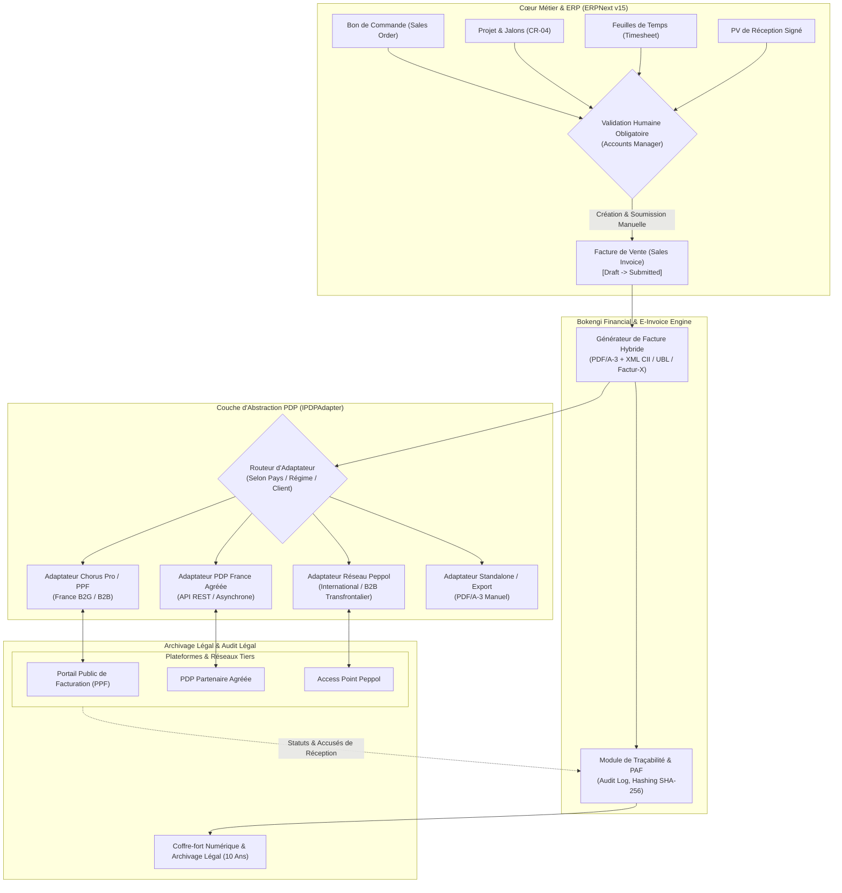
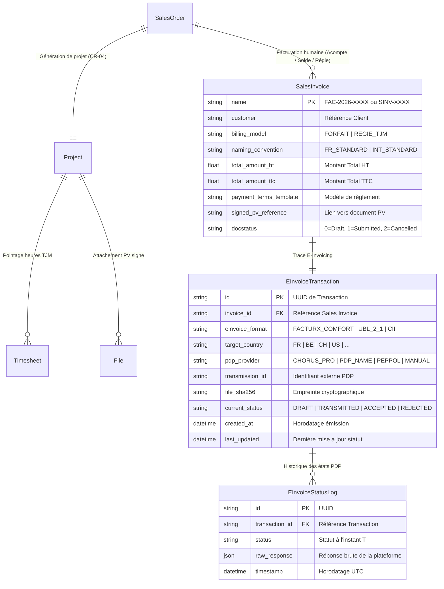
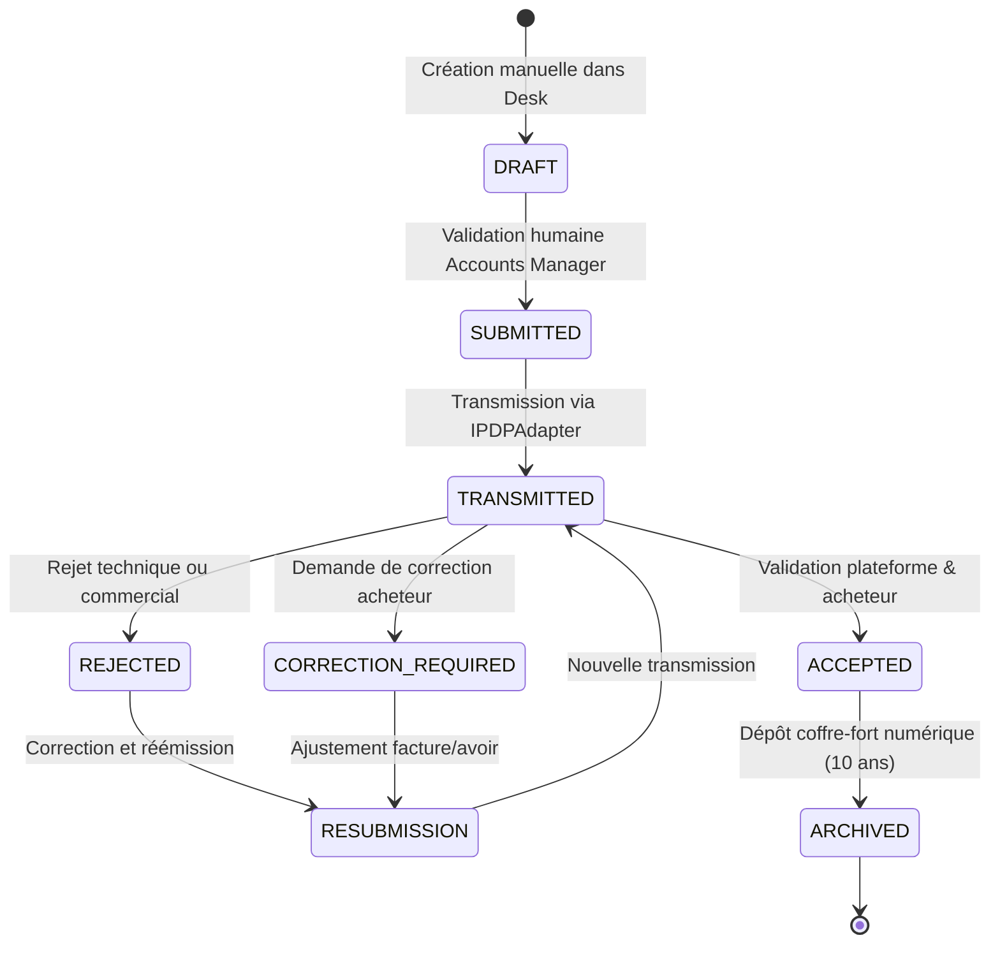

# BOKENGI GROUP 2.0 — CADRE UNIFIÉ DU CIRCUIT FINANCIER & DE FACTURATION ÉLECTRONIQUE (CR-03 + CR-05)

**Chantier :** Framework Unifié `CR-03` (Circuit Financier ERPNext) + `CR-05` (Facturation Électronique / PDP)  
**Date d'Élaboration :** 26 Septembre 2026  
**Version :** 2.0.0 — Unified Framework Specification  
**Statut Officiel :** 🟡 **CANDIDATE / SPECIFICATION STAGE (AUCUN DÉPLOIEMENT SANS MANDAT)**  
**Classification :** Spécification d'Architecture, Modélisation Métier & Gouvernance  

---

## 1. Contexte, Objectifs & Principes Directeurs

Ce document fusionne conceptuellement les chantiers **CR-03** (Circuit Financier ERPNext) et **CR-05** (Facturation Électronique / Plateforme de Dématérialisation Partenaire) en une architecture unifiée, modulaire, multi-pays et évolutive.

```
================================================================================
  CADRE DE GOUVERNANCE UNIFIÉ BOKENGI 2.0 (CR-03 + CR-05)
================================================================================
  1. Zéro Donnée Fictive        : Aucun tarif, IBAN, taxe ou identifiant PDP inventé.
  2. Validation Humaine Stricte : 0 projet, 0 PV, 0 webhook ne génère ni ne soumet
                                  de facture de manière automatisée.
  3. Modèles Tarifaires Mixtes  : Support natif du Forfait et de la Régie (TJM × Jours).
  4. Naming Paramétrable        : Non figé, adaptable par pays, client et régime fiscal.
  5. Acomptes Configurables     : Pourcentage, jalon déclencheur et conditions par projet.
  6. Abstraction PDP Agnostique : Découplage complet du fournisseur de facturation élec.
  7. Traçabilité & Archivage    : Piste d'audit fiable (PAF) et cycle d'états complet.
  8. Découplage Absolu          : InfraPulse strictement hors périmètre.
================================================================================
```

---

## 2. Architecture Cible Découplée

L'architecture est structurée en couches étanches afin de garantir qu'aucun changement de réglementation ou de prestataire PDP n'impacte le cœur transactionnel d'ERPNext.



---

## 3. Modèle de Données Financier & E-Invoicing

Le modèle de données étend les DocTypes standards d'ERPNext via l'application `bokengi_erp` sans altérer le schéma d'origine.



---

## 4. Les Deux Modèles Tarifaires Pris en Charge

Le framework permet de sélectionner dynamiquement le modèle tarifaire au niveau du devis (`Quotation`), de la commande (`Sales Order`) et de la facture (`Sales Invoice`).

### Modèle A : Forfait par Prestation
- **Principe :** Facturation d'un montant global déterminé pour la prestation `SRV-*` (ex: Pack Pentest, Schéma Directeur).
- **Déclenchement standard :**
  - Facture d'acompte (ex: 30% ou 50%) à l'émission du bon de commande (`Sales Order`).
  - Facture de solde (ex: 70% ou 50%) après validation du livrable et dépôt du **PV de réception signé** (`tabFile`).

### Modèle B : Régie / Temps Passé (TJM × Quantité)
- **Principe :** Facturation calculée selon la formule :
  $$\text{Montant HT} = \text{Nombre de Jours (ou Heures / 8)} \times \text{TJM applicable}$$
- **Déclenchement standard :**
  - Facturation périodique (mensuelle à terme échu) sur la base des `Timesheet` validées dans ERPNext pour le projet concerné.

---

## 5. Naming Series & Conformité Fiscale Multi-Pays

Les séquences de numérotation ne sont pas figées et sont configurables selon le profil de facturation :

| Contexte / Régime | Préfixe Devis | Préfixe Commande | Préfixe Facture | Préfixe Avoir |
| :--- | :---: | :---: | :---: | :---: |
| **Convention France (Recommandée FR)** | `DEV-.YYYY.-` | `CMD-.YYYY.-` | `FAC-.YYYY.-` | `AVR-.YYYY.-` |
| **Convention Internationale / Anglophone** | `QTN-.YYYY.-` | `SO-.YYYY.-` | `ACC-SINV-.YYYY.-` | `ACC-CN-.YYYY.-` |
| **Convention Personnalisée par Entité** | Configurable | Configurable | Configurable | Configurable |

> [!IMPORTANT]
> **Règle de Chronologie Comptable :**  
> Quelle que soit la Naming Series choisie, la numérotation des factures soumises (`Submitted`) est continue, séquentielle, chronologique et sans rupture, conformément aux exigences de l'administration fiscale.

---

## 6. Politique des Acomptes & Jalons Financiers

Les acomptes sont paramétrables projet par projet dans les `Payment Terms` :

1. **Activation de l'acompte :** Optionnelle par contrat / bon de commande (0%, 30%, 50%, etc.).
2. **Facture d'Acompte :**
   - Émise manuellement par le service comptable à la confirmation du `Sales Order`.
   - Porte la mention légale de facture d'acompte.
3. **Facture de Solde :**
   - Impute l'acompte déjà perçu.
   - Conditionnée à la vérification préalable de la présence d'un **PV de réception signé** attaché au projet.
4. **Délais de Paiement :** Configurables (Paiement comptant, 30 jours net, 45 jours fin de mois, 60 jours net).

---

## 7. Règle Fondamentale de Validation Humaine

```
================================================================================
  VERROU STRICT DE CONTRÔLE COMPTABLE BOKENGI 2.0
================================================================================
  [X] AUCUNE facture de vente (Sales Invoice) n'est créée automatiquement.
  [X] AUCUN webhook (Cal.com, Mattermost, etc.) ne peut créer ou soumettre de facture.
  [X] AUCUNE signature de PV ne déclenche de génération automatique de facture.
  [X] TOUTE facture doit être initiée, contrôlée et soumise par un utilisateur humain
      possédant le rôle habilité "Accounts Manager" dans ERPNext Desk.
================================================================================
```

---

## 8. Abstraction PDP & Cycle de Vie E-Invoicing

### 8.1. Interface d'Abstraction `IPDPAdapter`

Le raccordement technique vers les plateformes de dématérialisation repose sur un contrat d'interface générique :

```typescript
export interface IPDPAdapter {
  readonly providerId: string;
  readonly supportedFormats: string[]; // ['FACTURX', 'UBL', 'CII']

  /** Transmet la facture électronique signée à la plateforme */
  transmitInvoice(payload: EInvoicePayload): Promise<TransmissionResult>;

  /** Interroge le statut de traitement d'une transmission existante */
  checkStatus(transmissionId: string): Promise<StatusUpdateResult>;

  /** Récupère l'accusé de réception légal ou le motif de rejet */
  fetchReceipt(transmissionId: string): Promise<LegalReceipt>;
}
```

### 8.2. Cycle de Vie des Statuts & Transitions



### 8.3. Définition des Statuts

| Statut | Description | Action Possible |
| :--- | :--- | :--- |
| **`DRAFT`** | Brouillon en cours de saisie dans ERPNext. | Modification, annulation. |
| **`SUBMITTED`** | Facture validée comptablement et scellée. | Prête pour génération e-invoice. |
| **`TRANSMITTED`** | Payload e-invoice envoyé au PDP / Chorus Pro. | Attente de l'accusé plateforme. |
| **`ACCEPTED`** | Facture acceptée par la plateforme et l'acheteur. | Verrouillage final. |
| **`REJECTED`** | Facture rejetée (SIRET invalide, non-conformité XML). | Analyse d'erreur, émission d'avoir/rectificative. |
| **`CORRECTION_REQUIRED`** | L'acheteur demande une précision sur le montant/service. | Ajustement concerté. |
| **`RESUBMISSION`** | Facture rectifiée retransmise avec nouvel identifiant. | Suivi du nouveau cycle. |
| **`ARCHIVED`** | Facture scellée et archivée légalement pour 10 ans. | Consultation et audit uniquement. |

---

## 9. Traçabilité, Piste d'Audit Fiable (PAF) & Archivage Légal

1. **Empreinte Cryptographique :** Chaque fichier émis (PDF/A-3 + XML) génère une clé de contrôle SHA-256 stockée dans `EInvoiceTransaction`.
2. **Journal des Événements :** Tous les échanges avec le PDP (requête, réponse HTTP, accusé d'enregistrement, statut de distribution) sont consignés avec horodatage UTC immuable.
3. **Archivage Réglementaire :** Les factures émises et leurs pièces justificatives (devis, bon de commande, PV signé, accusé de réception PDP) sont indexées pour conservation légale pendant la durée requise (10 ans selon droit comptable français).

---

## 10. Matrice des Décisions Restantes

Pour passer de cette spécification à l'implémentation effective, les arbitrages suivants seront requis au moment opportun sans bloquer l'architecture globale :

### Bloc A : Décisions Financières Internes (ex-CR-03 — Propriétaire)
- [ ] Grille tarifaire officielle des 20 prestations `SRV-*` (TJM ou forfaits).
- [ ] Choix de la Naming Series par défaut (`FAC-` vs `ACC-SINV-`).
- [ ] Coordonnées bancaires réelles (Banque, Titulaire, IBAN, BIC/SWIFT).
- [ ] Modèles types de conditions de règlement (pourcentages d'acompte et délais).

### Bloc B : Décisions Réglementaires & E-Invoicing (ex-CR-05 — Selon Pays/Client)
- [ ] Sélection du PDP ou raccordement PPF / Chorus Pro selon le calendrier légal et le cabinet comptable.
- [ ] Choix du profil Factur-X standard (`MINIMUM`, `BASIC`, `COMFORT`, `EXTENDED`).
- [ ] Paramétrage des identifiants fiscaux de l'acheteur (SIRET, Numéro de TVA intracommunautaire, Code Service / Référence Engagement).

---

## 11. Conclusion & Non-Régression

Cette spécification unifiée offre à **Bokengi Group 2.0** :
- Une architecture financière claire et pérenne ;
- Un découplage total évitant tout enfermement propriétaire vis-à-vis d'un PDP ;
- Le respect strict de la gouvernance : zéro donnée financière inventée, validation humaine intégrale et isolation complète d'InfraPulse.
