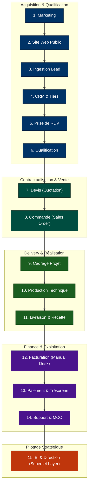
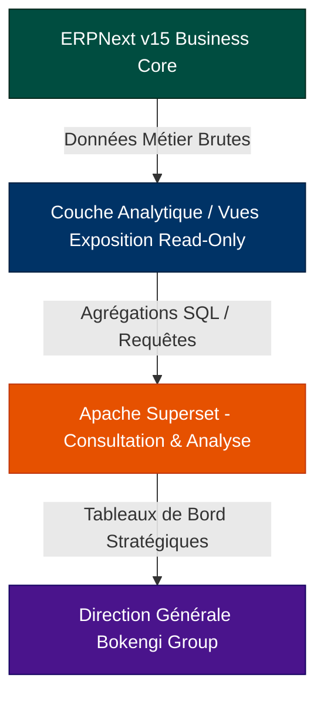
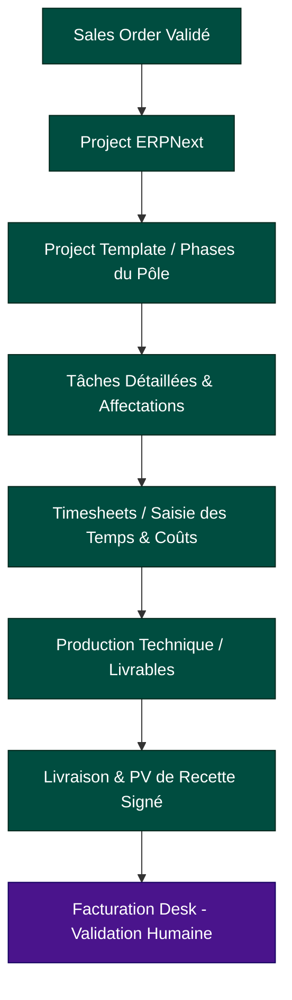

# BOKENGI GROUP 2.0 — CARTOGRAPHIE FONCTIONNELLE DES FLUX BOUT-EN-BOUT & MODÉLISATION MÉTIER

**Date d'élaboration :** 26 Septembre 2026  
**Version :** 2.1.0 — Post-Closure Architecture Consolidation  
**Baseline de Référence :** Phase 10.8 (`PHASE10_8_PRODUCTION_ACTIVATION.md`)  
**Statut Global :** 🟢 **RÉFÉRENCE FONCTIONNELLE FIGÉE (POST-CLOSURE)**  
**Classification :** Architecture d'Entreprise, Cartographie des Processus & Flux de Données  

---

## 1. VISION D'ENSEMBLE DU CYCLE DE VIE MÉTIER

Le cycle de vie de la valeur au sein de **Bokengi Group 2.0** s'articule autour de 15 étapes séquentielles, étanches et gouvernées par la règle d'or de la source unique de vérité (**ERPNext v15**) et du contrôle humain absolu sur les opérations financières :

> [!IMPORTANT]
> **RÈGLES DE GOUVERNANCE IMMUABLES :**
> 1. **InfraPulse est formellement exclu** de tous les flux, schémas, dépendances et architectures de Bokengi Group.
> 2. **ERPNext v15 est la source unique de vérité métier** (CRM, catalogue, commandes, projets, comptabilité).
> 3. **Verrou anti-facturation automatique :** Aucune `Sales Invoice` ne peut être émise sans validation humaine explicite dans ERPNext Desk.
> 4. **Minimisation RGPD :** Aucun IBAN, code BIC, secret, mot de passe ou document d'identité ne transite dans Mattermost.

---

## 2. CARTOGRAPHIE DÉTAILLÉE DES 15 ÉTAPES FONCTIONNELLES

---

### Étape 1 : Marketing (Campagnes, SEO, Réseaux & Acquisition)
- **Système Source :** Canaux Marketing Publics (LinkedIn, SEO, Relations Presse, Réseaux professionnels).
- **Système Cible :** Next.js (Façade Publique) & Module Analytics (Umami).
- **Donnée Produite :** URL enrichie avec balises de tracking (`utm_source`, `utm_medium`, `utm_campaign`), référents HTTP.
- **Donnée Consommée :** Paramètres d'URL et headers de requête HTTP.
- **Direction du Flux :** Externe $\to$ Next.js (Unidirectionnel).
- **Automatisation Autorisée :** **Oui** (Routage dynamique, attribution marketing, rendu Edge).
- **Validation Humaine Requise :** Non.
- **Niveau de Sensibilité :** Public / Anonymisé (Conforme RGPD, zéro cookie tiers intrusif).
- **API / Webhook Éventuel :** Requête HTTP standard / Balises Schema.org & OpenGraph.
- **Dépendances :** DNS Cloudflare, CDN Edge.
- **Responsabilités :** Pôle Marketing & Communication Bokengi Group.

---

### Étape 2 : Site Web Public (Portail Institutionnel & Vitrine d'Expertise)
- **Système Source :** ERPNext v15 (CMS Headless) & Cloudflare R2 (Médias immuables).
- **Système Cible :** Navigateur du Visiteur / Prospect.
- **Donnée Produite :** Pages web compilées bilingues (FR/EN) : Pôles d'expertise, 20 services, études de cas, articles de blog.
- **Donnée Consommée :** Objets DocTypes `Bokengi *` publiés (`is_published = 1`) et médias CDN (`bokengi-media`).
- **Direction du Flux :** ERPNext / R2 $\to$ Next.js $\to$ Visiteur (Lectures publiques).
- **Automatisation Autorisée :** **Oui** (Génération statique SSG et revalidation incrémentale ISR).
- **Validation Humaine Requise :** Oui (Cocher `Published` dans ERPNext Desk avant exposition).
- **Niveau de Sensibilité :** Public.
- **API / Webhook Éventuel :** API REST Frappe (`GET /api/v2/document/Bokengi *`) & URLs Cloudflare R2.
- **Dépendances :** Base MariaDB ERPNext et Bucket R2 `bokengi-media`.
- **Responsabilités :** Équipe Web & Pôle Communication.

---

### Étape 3 : Ingestion Lead (Captation & Sécurisation Edge)
- **Système Source :** Façade Web Next.js (Formulaire de contact `/contact`).
- **Système Cible :** Passerelle Edge Next.js (`POST /api/leads`).
- **Donnée Produite :** Payload JSON validé (`firstname`, `lastname`, `company`, `email`, `phone`, `pole`, `requestType`, `message`).
- **Donnée Consommée :** Saisie utilisateur du formulaire.
- **Direction du Flux :** Formulaire Web $\to$ API Edge `/api/leads`.
- **Automatisation Autorisée :** **Oui** (Contrôle Rate Limiting 6 req/min/IP + Honeypot anti-spam `website`).
- **Validation Humaine Requise :** Non (Ingestion automatisée sous filtre anti-robot).
- **Niveau de Sensibilité :** Données Personnelles (RGPD - Sensible).
- **API / Webhook Éventuel :** `POST /api/leads` (Next.js Edge API Route).
- **Dépendances :** Cloudflare Workers Edge Runtime.
- **Responsabilités :** Ingénierie Web / SecOps.

---

### Étape 4 : CRM & Référentiel Tiers (Centralisation Business Core)
- **Système Source :** Passerelle Next.js `/api/leads`.
- **Système Cible :** ERPNext v15 (DocType `Lead`) & Mattermost (`#commercial-leads`).
- **Donnée Produite :** Fiche `Lead` persistée dans Frappe avec `custom_payload_id` unique et message d'alerte Markdown.
- **Donnée Consommée :** Payload assaini transmis par `/api/leads`.
- **Direction du Flux :** Next.js $\to$ ERPNext REST $\to$ Mattermost Webhook.
- **Automatisation Autorisée :** **Oui** (Création de fiche et notification asynchrone non-bloquante).
- **Validation Humaine Requise :** Non pour l'ingestion / Oui pour la modification ultérieure.
- **Niveau de Sensibilité :** Confidentiel Entreprise & RGPD.
- **API / Webhook Éventuel :** `submitLeadToERPNext` (`POST /api/v2/document/Lead`) + Webhook Mattermost (`NEW_LEAD`).
- **Dépendances :** Clés d'API Frappe `bokengi-api-user` et base MariaDB.
- **Responsabilités :** Administrateur ERPNext / Équipe Commerciale.

---

### Étape 5 : Prise de RDV & Agenda (Visioconférence Cal.com)
- **Système Source :** Cal.com (Module de réservation public).
- **Système Cible :** Next.js Edge (`POST /api/webhooks/calcom`) $\to$ ERPNext (`Lead`) $\to$ Mattermost (`#commercial-leads`).
- **Donnée Produite :** `booking.uid`, créneau validé (fuseau Europe/Paris), notes de cadrage, notification agenda.
- **Donnée Consommée :** Événement webhook `BOOKING_CREATED` signé par Cal.com.
- **Direction du Flux :** Cal.com $\to$ Next.js Edge $\to$ ERPNext Lead & Mattermost.
- **Automatisation Autorisée :** **Oui sous contrôle cryptographique** (Vérification HMAC SHA-256 + Idempotence 24h).
- **Validation Humaine Requise :** Non pour le traitement webhook / Oui pour la tenue de l'entretien.
- **Niveau de Sensibilité :** Confidentiel (Agenda & Données personnelles).
- **API / Webhook Éventuel :** `POST /api/webhooks/calcom` avec entête `X-Cal-Signature-256`.
- **Dépendances :** Secret partagé `CALCOM_WEBHOOK_SECRET`.
- **Responsabilités :** Équipe Commerciale & Consultants Experts.

---

### Étape 6 : Qualification Commerciale & Cadrage Technique
- **Système Source :** ERPNext Desk (Action de l'équipe commerciale).
- **Système Cible :** ERPNext v15 (DocType `Opportunity`) & Mattermost (`#commercial-leads`).
- **Donnée Produite :** Statut de qualification (`Qualified` / `Lost`), compte-rendu d'entretien, estimation budgétaire initiale.
- **Donnée Consommée :** Fiche `Lead` et notes de cadrage Cal.com.
- **Direction du Flux :** ERPNext Desk $\to$ DocEvents Frappe $\to$ Mattermost (`QUALIFIED_LEAD`).
- **Automatisation Autorisée :** **Interdite pour la décision** / **Autorisée pour la notification**.
- **Validation Humaine Requise :** **OUI OBLIGATOIRE** (Action explicite du chargé d'affaires dans Desk).
- **Niveau de Sensibilité :** Confidentiel Commercial.
- **API / Webhook Éventuel :** Hook Frappe `mattermost_events.py` (`on_update` sur `Lead`).
- **Dépendances :** Rôle `Sales User` / `Sales Manager` dans ERPNext.
- **Responsabilités :** Responsable Commercial & Direction des Opérations.

---

### Étape 7 : Chiffrage & Devis (Quotation)
- **Système Source :** ERPNext Desk (Module Ventes).
- **Système Cible :** Client Destinataire (Devis PDF officiel) & Mattermost (`#commercial-ventes`).
- **Donnée Produite :** Devis `Quotation` (`naming_series`, prestations parmi les 20 `Items`, taux TJM/forfait, montant total HT/TTC).
- **Donnée Consommée :** Catalogue de services ERPNext (`SRV-*`), grille tarifaire ou tarif ad hoc.
- **Direction du Flux :** ERPNext Desk $\to$ Mattermost (`QUOTATION_DRAFT`, `QUOTATION_SUBMITTED`) $\to$ Client.
- **Automatisation Autorisée :** **STRICTEMENT INTERDITE** (Saisie ad hoc tant que la politique tarifaire n'est pas arbitrée).
- **Validation Humaine Requise :** **OUI OBLIGATOIRE** (Création `Draft` docstatus 0 puis Clic "Submit" docstatus 1 par `Sales Manager`).
- **Niveau de Sensibilité :** Secret d'Affaires / Commercial Critique.
- **API / Webhook Éventuel :** DocEvents Frappe sur `Quotation` (`on_update` / `on_submit`).
- **Dépendances :** Arbitrages Direction sur la grille tarifaire et Naming Series.
- **Responsabilités :** Responsable des Ventes & Direction Générale.

---

### Étape 8 : Commande Client (Sales Order & Engagement Contractuel)
- **Système Source :** ERPNext Desk (Validation du bon de commande).
- **Système Cible :** ERPNext v15 (DocType `Sales Order` & `Customer`) & Mattermost (`#commercial-ventes`).
- **Donnée Produite :** Commande ferme enregistrée (`Sales Order`), création du compte `Customer`, notification de signature.
- **Donnée Consommée :** Devis signé et accord formel du client.
- **Direction du Flux :** ERPNext Desk $\to$ Mattermost (`SALES_ORDER_SUBMITTED`).
- **Automatisation Autorisée :** **STRICTEMENT INTERDITE**.
- **Validation Humaine Requise :** **OUI OBLIGATOIRE** (Enregistrement de la commande ferme par le responsable commercial).
- **Niveau de Sensibilité :** Contractuel & Juridique.
- **API / Webhook Éventuel :** DocEvents Frappe sur `Sales Order` (`on_submit`).
- **Dépendances :** Devis validé et engagement juridique du client.
- **Responsabilités :** Direction Commerciale.

---

### Étape 9 : Cadrage Projet & Planification
- **Système Source :** ERPNext v15 (DocType `Sales Order`).
- **Système Cible :** ERPNext v15 (DocType `Project`, `Task`, `Project Template`).
- **Donnée Produite :** Structure de projet, jalons de delivery, tâches découpées, affectation des consultants, budget d'heures.
- **Donnée Consommée :** Lignes de commande du `Sales Order` et modèles de projet types.
- **Direction du Flux :** `Sales Order` $\to$ `Project` (Génération assistée dans Desk).
- **Automatisation Autorisée :** **Partielle** (Création assistée de la structure projet, planification humaine).
- **Validation Humaine Requise :** Oui (Validation du planning et du staffing par le Lead Consultant).
- **Niveau de Sensibilité :** Interne Opérationnel.
- **API / Webhook Éventuel :** Méthodes natives ERPNext Projects.
- **Dépendances :** `Sales Order` à l'état `Submitted`.
- **Responsabilités :** Chef de Projet / Directeur Technique.

---

### Étape 10 : Production & Réalisation Technique
- **Système Source :** Consultants Experts (Outils d'ingénierie, GitHub, Cloudflare, environnements techniques).
- **Système Cible :** ERPNext v15 (DocType `Timesheet`) & Dépôts de code / Livrables.
- **Donnée Produite :** Livrables techniques, rapports d'audit, feuilles de temps validées, code source certifié.
- **Donnée Consommée :** Spécifications du projet et tâches assignées.
- **Direction du Flux :** Consultant $\to$ ERPNext Timesheet / Dépôts de code.
- **Automatisation Autorisée :** **Interdite pour la production intellectuelle**.
- **Validation Humaine Requise :** Oui (Validation hebdomadaire des feuilles de temps et revues de code).
- **Niveau de Sensibilité :** Confidentiel Technique / Propriété Intellectuelle.
- **API / Webhook Éventuel :** API REST Timesheet ou saisie manuelle Desk.
- **Dépendances :** Accès sécurisés et convention de service active.
- **Responsabilités :** Consultants & Lead Architects des Pôles d'expertise.

---

### Étape 11 : Livraison & Recette Client
- **Système Source :** Chef de Projet & Client.
- **Système Cible :** ERPNext v15 (DocType `Delivery Note` / PV de Recette).
- **Donnée Produite :** Procès-verbal de recette signé, levée des réserves, validation de conformité des livrables.
- **Donnée Consommée :** Livrables finaux et rapports de fin de mission.
- **Direction du Flux :** Chef de projet $\to$ Client $\to$ ERPNext.
- **Automatisation Autorisée :** **STRICTEMENT INTERDITE**.
- **Validation Humaine Requise :** **OUI OBLIGATOIRE** (Signature du PV de recette par le client et le chef de projet).
- **Niveau de Sensibilité :** Contractuel & Juridique.
- **API / Webhook Éventuel :** Gestion documentaire Frappe File.
- **Dépendances :** Finalisation de l'ensemble des jalons du projet.
- **Responsabilités :** Chef de Projet & Direction des Opérations.

---

### Étape 12 : Facturation (Sales Invoice) — SOUS VERROU STRICT
- **Système Source :** Direction Financière Bokengi Group dans ERPNext Desk.
- **Système Cible :** Client Destinataire (Facture PDF officielle) & Mattermost (`#finance-tresorerie`).
- **Donnée Produite :** Facture de vente `Sales Invoice` (`naming_series`, montant HT/TTC, TVA 20%, échéance, mentions légales, coordonnées bancaires officielles).
- **Donnée Consommée :** `Sales Order` validé et/ou PV de recette signé.
- **Direction du Flux :** ERPNext Desk $\to$ Mattermost (`SALES_INVOICE_SUBMITTED`) $\to$ Client.
- **Automatisation Autorisée :** 🔴 **STRICTEMENT INTERDITE (0 AUTOMATISATION)**.
- **Validation Humaine Requise :** 🔴 **VALIDATION HUMAINE EXCLUSIVE PAR LA DIRECTION / FINANCE**.
- **Niveau de Sensibilité :** **TRÈS ÉLEVÉ (Comptable, Fiscal & Légal)**.
- **API / Webhook Éventuel :** DocEvents Frappe sur `Sales Invoice` (`on_submit`).
- **Dépendances :** Arbitrage officiel des coordonnées bancaires, conditions de règlement et Naming Series.
- **Responsabilités :** Direction Générale / Contrôleur Financier.

---

### Étape 13 : Paiement & Rapprochement Bancaire
- **Système Source :** Établissement Bancaire Officiel de Bokengi Group.
- **Système Cible :** ERPNext v15 (DocType `Payment Entry` & `Bank Transaction`) $\to$ Grand Livre.
- **Donnée Produite :** Écriture de règlement lettrée, solde de compte mis à jour, clôture de créance client.
- **Donnée Consommée :** Relevé bancaire officiel et facture de vente soumise.
- **Direction du Flux :** Banque $\to$ ERPNext (Import relevé / Saisie `Payment Entry`).
- **Automatisation Autorisée :** **Interdite pour l'écriture définitive / Rapprochement assisté**.
- **Validation Humaine Requise :** **OUI OBLIGATOIRE** (Lettrage et validation de l'écriture par la direction financière).
- **Niveau de Sensibilité :** **CRITIQUE (Bancaire & Trésorerie)**.
- **API / Webhook Éventuel :** Import bancaire manuel / futur connecteur DSP2 sécurisé.
- **Dépendances :** Facture de vente à l'état `Submitted` (`docstatus: 1`).
- **Responsabilités :** Direction Financière.

---

### Étape 14 : Support & Maintien en Conditions Opérationnelles (MCO)
- **Système Source :** Client Sous Contrat / Utilisateur Support.
- **Système Cible :** ERPNext v15 (DocType `Issue` / `Maintenance Visit`) & Mattermost (`#ops-alertes`).
- **Donnée Produite :** Ticket d'incident, niveau de sévérité, temps de résolution, compte-rendu d'intervention.
- **Donnée Consommée :** Description de l'anomalie et contrat de maintenance associé.
- **Direction du Flux :** Client $\to$ ERPNext `Issue` $\to$ Mattermost `#ops-alertes`.
- **Automatisation Autorisée :** **Autorisée pour la création de ticket / Résolution humaine**.
- **Validation Humaine Requise :** Oui (Qualification et clôture du ticket par l'équipe support).
- **Niveau de Sensibilité :** Confidentiel Technique.
- **API / Webhook Éventuel :** API REST Frappe Issues & Webhook Mattermost.
- **Dépendances :** Contrat de MCO ou garantie de projet active.
- **Responsabilités :** Responsable Support & Astreinte Technique.

---

### Étape 15 : Business Intelligence & Pilotage de la Direction
- **Système Source :** ERPNext v15 (Source unique de données métier).
- **Système Cible :** Couche Analytique / Exposition $\to$ **Apache Superset** $\to$ Direction Générale.
- **Donnée Produite :** Tableaux de bord de marge brute, TJM effectif, rentabilité par Pôle, atterrissage de chiffre d'affaires, prévisionnel de trésorerie.
- **Donnée Consommée :** Écritures de journal, factures payées, feuilles de temps, opportunités commerciales.
- **Direction du Flux :** ERPNext Core $\to$ Couche Analytique / Exposition $\to$ Apache Superset $\to$ Direction.
- **Automatisation Autorisée :** **Oui** (Calcul automatique des agrégations et rafraîchissement des dashboards).
- **Validation Humaine Requise :** Non (Lecture analytique et décisions stratégiques par les dirigeants).
- **Niveau de Sensibilité :** **SECRET DIRECTION / STRATÉGIQUE**.
- **API / Webhook Éventuel :** Vues SQL analytiques en lecture seule / Connecteur Superset Read-Only.
- **Dépendances :** Qualité et lettrage des écritures comptables dans ERPNext.
- **Responsabilités :** Direction Générale & Contrôle de Gestion.

---

## 3. MODÉLISATION DU SOUS-FLUX DELIVERY & PRODUCTION (CR-04)

Le delivery de projets s'organise selon un pipeline rigoureusement tracé de la signature à la facturation :

---

## 4. TABLEAU RÉCAPITULATIF DES FLUX & RÈGLES DE CONTRÔLE

| # | Étape Métier | Système Source | Système Cible | Automatisation | Validation Humaine | Sensibilité |
| :---: | :--- | :--- | :--- | :---: | :---: | :---: |
| **01** | **Marketing** | Canaux Publics | Next.js / Umami | **Oui** | Non | Public / RGPD |
| **02** | **Site Web** | ERPNext / R2 | Visiteurs | **Oui** (SSG/ISR) | Oui (Publication) | Public |
| **03** | **Ingestion Lead** | Formulaire Web | Next.js API Edge | **Oui** (Anti-spam) | Non | Données Personnelles |
| **04** | **CRM & Tiers** | Next.js API | ERPNext / MM | **Oui** (Ingestion/Notif) | Non | Confidentiel Entreprise |
| **05** | **Prise de RDV** | Cal.com | Next.js / ERP / MM | **Oui** (HMAC/Idempotence) | Non | Confidentiel |
| **06** | **Qualification** | Commercial Desk | ERPNext / MM | Notification seule | **OUI OBLIGATOIRE** | Confidentiel Commercial |
| **07** | **Devis** | Commercial Desk | Client / MM | Notification seule | **OUI OBLIGATOIRE** | Secret d'Affaires |
| **08** | **Commande** | Commercial Desk | ERPNext / MM | Notification seule | **OUI OBLIGATOIRE** | Contractuel & Juridique |
| **09** | **Cadrage Projet** | Sales Order | ERPNext Projects | Assistée | **OUI OBLIGATOIRE** | Interne Opérationnel |
| **10** | **Production** | Consultants | Timesheet / Git | Non | **OUI OBLIGATOIRE** | Propriété Intellectuelle |
| **11** | **Livraison** | Chef de Projet | Client / Desk | Non | **OUI OBLIGATOIRE** (PV signé) | Contractuel |
| **12** | **Facturation** | Direction Finance | Client / MM | 🔴 **INTERDITE (0 AUTO)** | 🔴 **OUI EXCLUSIVE DIRECTION** | **Très Élevé (Fiscal/Légal)** |
| **13** | **Paiement** | Banque | ERPNext GL | Assistée | **OUI OBLIGATOIRE** | **Critique (Bancaire)** |
| **14** | **Support** | Client | ERPNext / MM | Création seule | **OUI OBLIGATOIRE** | Confidentiel Technique |
| **15** | **BI Direction** | ERPNext Core | Superset / Direction | **Oui** (Calculs) | Non (Lecture) | **Secret Direction** |
