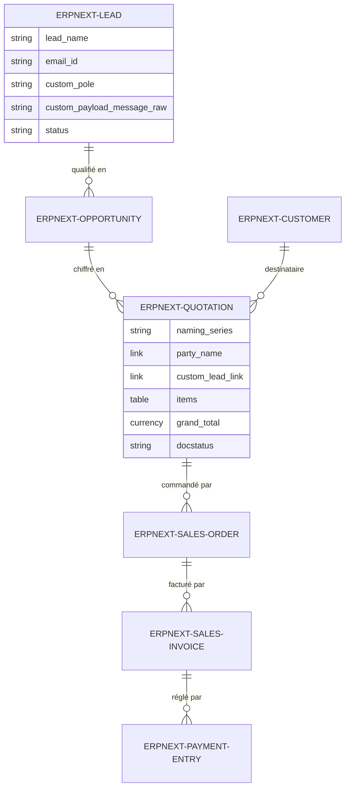
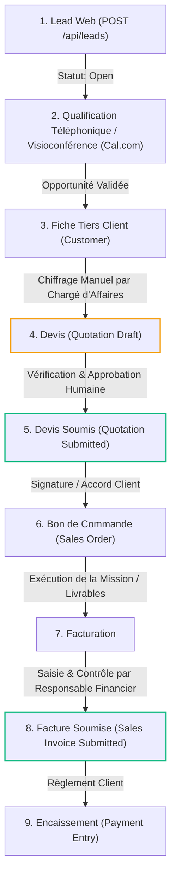

# BOKENGI GROUP 2.0 — ARCHITECTURE GLOBALE D'INTÉGRATION DU SYSTÈME D'INFORMATION
**Référence :** `BOKENGI_2.0_GLOBAL_INTEGRATION_ARCHITECTURE.md`  
**Date :** 26 Septembre 2026  
**Version :** 2.0.0 — Production Target Architecture  
**Statut :** 🟢 **ARCHITECTURE CIBLE VALIDÉE — AUCUNE IMPLÉMENTATION DE CODE EN COURS**  

---

## 1. VISION D'ENSEMBLE & CADRE DE GOUVERNANCE

Le système d'information de **Bokengi Group 2.0** repose sur une architecture découplée, modulaire et hautement sécurisée, structurée autour de 6 piliers spécialisés :

1. **ERPNext v15 :** *Business Core* — Source de vérité unique pour les données métier, financières, CRM, contractuelles et les contenus institutionnels.
2. **Mattermost :** *Collaboration Core* — Hub de communication interne, notifications opérationnelles asynchrones et coordination d'équipe.
3. **Next.js 16 / Cloudflare Workers :** *Façade Publique* — Portail web institutionnel haute performance, multilingue (FR/EN), acquisition de prospects et présentation des expertises.
4. **Cal.com :** *Module de Réservation* — Prise de rendez-vous et planification d'échanges techniques/commerciaux en visioconférence.
5. **Cloudflare R2 :** *Stockage Objet* — Hébergement immuable des médias, visuels, captures d'études de cas et documents publics.
6. **GitHub :** *Forge & CI/CD* — Gestion de version, revues de code, automatisation des builds et déploiements contrôlés.

> [!IMPORTANT]
> **Règle d'exclusion :** Le projet *InfraPulse* est totalement **HORS PÉRIMÈTRE** de Bokengi Group et n'intervient dans aucun schéma, flux de données, API ou processus métier du Groupe.

---

## 2. MATRICE DES RESPONSABILITÉS PAR SYSTÈME

```mermaid
flowchart TD
    subgraph Public_Tier["Façade Publique & Acquisition (Edge)"]
        WEB["Next.js 16 / Cloudflare Workers (Site Vitrine)"]
        CAL["Cal.com (Agenda & Visioconférence)"]
        R2["Cloudflare R2 (Stockage Médias bokengi-media)"]
    end

    subgraph Business_Tier["Cœur Métier & Données (Business Core)"]
        ERP["ERPNext v15 (Source Unique de Vérité)"]
    end

    subgraph Collaboration_Tier["Coordination Interne & Ops"]
        MM["Mattermost (Collaboration & Alertes)"]
    end

    subgraph Devops_Tier["Gouvernance Code & Déploiement"]
        GH["GitHub (Forge & CI/CD Pipeline)"]
    end

    WEB -->|POST /api/leads| ERP
    WEB -->|Lectures statiques / SSR| ERP
    WEB -->|Assets / Images| R2
    CAL -.->|Webhook Réservation (Optionnel)| ERP
    ERP -->|Webhooks Événements Métier / Notifications| MM
    GH -->|Deploy Worker| WEB
    GH -->|Deploy Schemas / Fixtures| ERP
```

| Système | Rôle Principal | Responsabilités Exclusives | Ce qu'il NE FAIT PAS (Limites) |
| :--- | :--- | :--- | :--- |
| **ERPNext v15** | **Business Core** | • Référentiel des Leads, Clients, Contacts<br>• Gestion des devis (`Quotation`), commandes (`Sales Order`), factures (`Sales Invoice`)<br>• Comptabilité, TVA, grand livre, rapprochement bancaire<br>• CMS Headless pour les Pôles, Services, Articles, Réalisations | • N'expose aucun endpoint d'écriture public sans proxy sécurisé<br>• Ne stocke pas les fichiers médias bruts lourds (délégués à R2) |
| **Mattermost** | **Collaboration Core** | • Réception des alertes commerciales (nouveau prospect, devis émis)<br>• Discussion interne entre chargés d'affaires et consultants<br>• Télémétrie opérationnelle | • **NE FAIT PAS office de CRM ou de base de données**<br>• **NE FAIT AUCUN calcul financier ou comptable**<br>• Ne stocke aucune donnée juridique définitive |
| **Next.js 16 (Cloudflare)** | **Façade Publique** | • Rendu SSR/SSG ultra-rapide des pages bilingues<br>• Interface utilisateur institutionnelle (Design System V4)<br>• Sécurisation des formulaires (Honeypot, Rate Limiting)<br>• Proxy étanche vers ERPNext (`/api/leads`, `/api/access-requests`) | • **NE GÉNÈRE AUCUNE facture ou devis**<br>• Ne stocke aucune donnée sensible ou bancaire<br>• Ne contient aucune grille tarifaire interne |
| **Cal.com** | **Réservation** | • Gestion des disponibilités de cadrage technique<br>• Planification d'entretiens en visioconférence<br>• Envoi des rappels d'agenda aux prospects | • Ne gère pas la relation client contractuelle<br>• Ne qualifie pas juridiquement les projets |
| **Cloudflare R2** | **Stockage Objet** | • Distribution CDN des images et médias (`bokengi-media`)<br>• Hébergement des livrables téléchargeables publics | • N'exécute aucune logique applicative |
| **GitHub** | **Forge & CI/CD** | • Hébergement du code source (`KxlSys/Bokengi-Group`)<br>• Pipeline d'intégration et déploiement continu vers Cloudflare | • N'héberge aucun secret en clair dans le code |

---

## 3. PÉRIMÈTRE DES DONNÉES & SOURCES DE VÉRITÉ



### 3.1. Données dont ERPNext est la Source Unique de Vérité
1. **Données d'Entreprise :** Dénomination (`Bokengi Group`), forme juridique (`TPE`), capital (`7 500 €`), siège social (`Paris, France`), coordonnées officielles.
2. **Données CRM & Tiers :** Prospects (`Lead`), Demandes d'accès, Comptes clients (`Customer`), Interlocuteurs (`Contact`), Adresses postales et fiscales (`Address`).
3. **Données Commerciales & Comptables :** Devis (`Quotation`), Commandes (`Sales Order`), Factures de vente (`Sales Invoice`), Règlements (`Payment Entry`), Écritures de journal, Taux de TVA.
4. **Catalogue de Services :** Les 20 prestations de services (`Item` `SRV-*`) et les 5 Pôles d'expertise (`Bokengi Pole`).
5. **Contenus Éditoriaux :** Études de cas (`Bokengi Case Study`), Articles de blog (`Bokengi Post`), Paramètres du site (`Bokengi Site Settings`).

### 3.2. Données Autorisées à être Exposées à Mattermost
Pour respecter la stricte confidentialité et le principe de minimisation des données (RGPD) :
- **Autorisé :**
  - Notification synthétique de nouveau lead : Nom du demandeur, Société, Pôle d'expertise sollicité, Type de demande (`devis`, `cadrage`, `partenariat`).
  - Alertes de statut commercial : ID du devis soumis, montant global HT/TTC, chargé d'affaires assigné.
  - Alertes de paiement : Référence de facture soldée, devise de règlement.
  - Liens profonds sécurisés vers ERPNext Desk (`https://erp.bokengi-group.com/app/lead/LEAD-XXXXX`).
- **Strictement Interdit dans Mattermost :**
  - Numéros de comptes bancaires complets (IBAN/BIC), coordonnées bancaires de tiers.
  - Pièces d'identité, documents juridiques confidentiels ou données sensibles de santé/sécurité.
  - Mots de passe, clés d'API ou tokens d'authentification.

---

## 4. FLUX D'INTÉGRATION, WEBHOOKS & ÉVÉNEMENTS MÉTIER

| Événement Métier | Système Source | Déclencheur | Système Cible | Protocole & Payload | Action Exécutée |
| :--- | :--- | :--- | :--- | :--- | :--- |
| **Capture Prospect** | Frontend Next.js | Soumission formulaire Contact/Devis | **ERPNext** | `POST /api/leads` (HTTPS REST)<br>Headers : Auth Token | Création DocType `Lead` (Statut: `Open`, tag de pôle, message brut). |
| **Demande d'Habilitation** | Frontend Next.js | Soumission formulaire Demande d'Accès | **ERPNext** | `POST /api/access-requests` (HTTPS REST)<br>Headers : Auth Token | Création DocType `Lead` qualifié en demande d'accès interne. |
| **Notification Commerciale** | ERPNext | `after_insert` sur DocType `Lead` | **Mattermost** | Webhook entrant HTTPS POST<br>JSON Formatté Markdown | Alerte dans le canal `#commercial-leads` avec lien vers ERPNext Desk. |
| **Planification RDV** | Cal.com | Confirmation de réservation | **Mattermost / ERPNext** | Webhook HTTPS Cal.com | Notification dans le canal `#agenda-cadrage` / Note d'activité rattachée au prospect. |
| **Émission Devis Officiel** | ERPNext | `on_submit` sur DocType `Quotation` | **Mattermost** | Webhook sortant ERPNext | Notification dans `#commercial-ventes` (Montant, validité 30 jours, client). |
| **Encaissement Règlement** | ERPNext | `on_submit` sur `Payment Entry` | **Mattermost** | Webhook sortant ERPNext | Notification de validation financière dans `#finance-tresorerie`. |

---

## 5. RÈGLES DE SÉCURITÉ, AUTHENTIFICATION & SÉPARATION DES RESPONSABILITÉS

```mermaid
flowchart LR
    subgraph Browser["Visiteur Public (Navigateur)"]
        CL["Client Web"]
    end

    subgraph Edge["Périmètre Edge Cloudflare (Zero-Trust)"]
        PROXY["Next.js API Route Proxy\n- Rate Limit: 6 req/min\n- Anti-Bot Honeypot\n- Input Sanitization"]
    end

    subgraph Protected_Backend["Périmètre Privé Authentifié"]
        ERP_API["ERPNext REST Engine\n- HTTPS TLS 1.3\n- Header: token api_key:api_secret\n- Role: Bokengi Migration Service"]
    end

    CL -->|POST Form Data (Non Authentifié)| PROXY
    PROXY -->|Requête Contrôlée & Assainie| ERP_API
```

1. **Isolation Stricte Client / Serveur :**
   - Aucun credential ERPNext (`ERPNEXT_API_KEY`, `ERPNEXT_API_SECRET`) ni URL d'administration n'est accessible au navigateur client.
   - Les routes API Next.js jouent le rôle de passerelle mandataire assainissante (*sanitizing reverse proxy*).
2. **Principe du Moindre Privilège :**
   - Le compte de service API utilisé par le frontend ne dispose que des droits `create` sur `Lead` et `read` sur les contenus publiés. Les permissions de modification comptable (`submit`, `cancel`, `amend` sur `Sales Invoice`) lui sont **strictement révoquées**.
3. **Stratégie Anti-Duplication & Idempotence :**
   - Chaque lead ou document synchronisé porte un identifiant canonique (`custom_payload_id` / hash d'unicité) empêchant les soumissions en doublon lors de renvois réseau.
4. **Traçabilité & Piste d'Audit :**
   - Chaque modification dans ERPNext conserve son journal des versions Frappe (*Version Log* & *Activity Timeline*), incluant l'auteur, l'adresse IP et l'horodatage ISO 8601.

---

## 6. RÈGLE DE SÉCURITÉ COMMERCIALE ABSOLUE (LEAD → FACTURATION)



> [!CAUTION]
> **VERROU D'IMMUTABILITÉ FINANCIÈRE :**
> - **AUCUNE FACTURE NE PEUT ÊTRE ÉMISE AUTOMATIQUEMENT.**
> - Tout passage de l'état `Draft` à `Submitted` sur un document comptable (`Quotation`, `Sales Order`, `Sales Invoice`) requiert obligatoirement une validation humaine authentifiée dans ERPNext Desk.
> - Une facture soumise (`Submitted`) devient légalement immuable : aucune correction directe n'est possible (obligation d'émettre une Note de Crédit / *Credit Note*).

---

## 7. PLAN D'IMPLÉMENTATION PAR PHASES DE L'INTÉGRATION GLOBALE

| Phase | Étape d'Intégration | Périmètre & Description | Prérequis & Dépendances | Statut de Readiness |
| :--- | :--- | :--- | :--- | :---: |
| **Phase 10.1** | **Finalisation Commerciale ERPNext** | Application des 4 arbitrages métier dans ERPNext Desk (Tarifs, Naming Series, Banque, Conditions de règlement). | Arbitrage formel du propriétaire | 🟡 `REQUIRES BUSINESS DECISION` |
| **Phase 10.2** | **Matérialisation des Print Formats** | Finalisation des gabarits PDF Devis et Factures aux couleurs Bokengi avec mentions bancaires réelles. | Phase 10.1 (Coordonnées bancaires) | 🟡 `REQUIRES BUSINESS DECISION` |
| **Phase 10.3** | **Passerelle Webhooks Mattermost** | Configuration des webhooks sortants ERPNext vers les canaux Mattermost (`#commercial-leads`, `#finance-tresorerie`). | Instance Mattermost active & URL webhook | 🟢 `READY` |
| **Phase 10.4** | **Intégration Avancée Cal.com CRM** | Capture automatique de l'événement de réservation Cal.com pour rattachement au Lead ERPNext. | Phase 10.3 | 🟢 `READY` |
| **Phase 10.5** | **Recette Globale de Bout en Bout** | Simulation complète du cycle : *Visiteur → Lead web → Alerte Mattermost → RDV Cal.com → Devis PDF → Facture supervisée*. | Phases 10.1 à 10.4 | 🔴 `BLOCKED` *(dépendant de 10.1)* |

---

## 8. DÉCISIONS MÉTIER BLOQUANTES REQUISES AVANT ACTIVATION DU MODULE COMMERCIAL

Pour permettre l'exécution de la **Phase 10.1** et l'activation du cycle commercial complet, les 4 décisions suivantes doivent être formellement transmises :

1. **Politique Tarifaire :**
   - Confirmer le choix entre :
     - (A) Grille tarifaire forfaitaire / TJM par défaut pour les 20 articles `Item` (`SRV-*`).
     - (B) Tarification libre établie sur-mesure lors de l'établissement de chaque devis (`standard_rate = 0.00`).
2. **Séries de Numérotation Légale (`Naming Series`) :**
   - Arbitrer les préfixes officiels :
     - Devis : `QTN-.YYYY.-.#####` (standard) **OU** `DEV-.YYYY.-.#####` (francophone).
     - Commandes : `SO-.YYYY.-.#####` (standard) **OU** `CMD-.YYYY.-.#####` (francophone).
     - Factures : `ACC-SINV-.YYYY.-.#####` (standard) **OU** `FAC-.YYYY.-.#####` (francophone).
3. **Coordonnées Bancaires Officielles :**
   - Fournir les informations à imprimer sur les factures : *Titulaire du compte, Établissement bancaire, IBAN, Code BIC/SWIFT*.
4. **Conditions & Échéancier de Règlement :**
   - Définir la politique standard d'acompte à la commande, échéances intermédiaires et délai légal de paiement.
