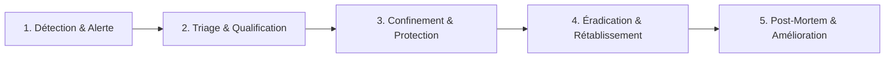
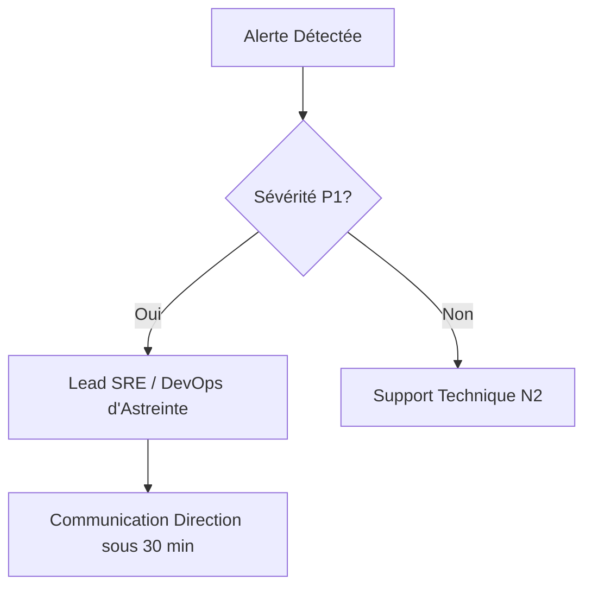

# BOKENGI GROUP 2.0 — PLAN DE RÉPONSE AUX INCIDENTS & REPRISE D'ACTIVITÉ

**Date :** 26 Septembre 2026  
**Version :** 2.0.0 — Production  
**Classification :** Procédure Opérationnelle Critique (SRE / SecOps)  

---

## 1. CLASSIFICATION DES SÉVÉRITÉS & ENGAGEMENTS DE SERVICE (SLA)

| Sévérité | Description & Impact Métier | Exemples d'Incidents | Temps de Prise en Compte | Temps Cible de Résolution |
| :---: | :--- | :--- | :---: | :---: |
| **P1 — Critique** | Indisponibilité totale du site public ou de la collecte de leads. Risque de perte d'opportunités majeures ou incident de sécurité avéré. | • Panne générale Cloudflare Worker<br>• ERPNext Desk inaccessible<br>• Attaque DDoS saturant l'API | **< 15 minutes** | **< 2 heures** |
| **P2 — Majeur** | Dégradation d'un service critique sans arrêt complet. Contournement partiel existant. | • Échec récurrent des webhooks Cal.com<br>• Retard d'indexation CMS Headless<br>• Panne isolée du canal Mattermost | **< 1 heure** | **< 6 heures** |
| **P3 — Mineur** | Problème cosmétique ou anomalie non bloquante n'affectant pas le parcours utilisateur principal. | • Problème de rendu visuel CSS sur un composant secondaire<br>• Caractère spécial erroné | **< 4 heures** | **< 24 heures** |
| **P4 — Demande** | Demande d'évolution ou question opérationnelle courante. | • Demande d'ajout d'un tag technique<br>• Demande d'export de données | **< 24 heures** | Planifié au sprint |

---

## 2. CYCLE DE GESTION D'UN INCIDENT



---

## 3. PLAYBOOKS D'INTERVENTION SPÉCIFIQUES

### 3.1. Playbook 1 : Indisponibilité d'ERPNext (Erreur 503 / Timeout)
1. **Symptôme :** Les formulaires `/api/leads` renvoient un ID `offline-*` et les webhooks Cal.com renvoient HTTP `503`.
2. **Actions immédiates :**
   ```bash
   # Se connecter au serveur ERPNext
   ssh root@erp.bokengi-group.com
   
   # Vérifier l'état des services Frappe
   sudo supervisorctl status
   
   # Redémarrer les workers et le serveur web Frappe si nécessaire
   sudo supervisorctl restart all
   sudo systemctl restart mariadb redis-server nginx
   ```
3. **Vérification :** Tester l'appel REST `GET https://erp.bokengi-group.com/api/v2/method/frappe.ping`.
4. **Reprise :** Cal.com relance automatiquement les webhooks en attente grâce au statut 503 retourné.

### 3.2. Playbook 2 : Rejet Webhook Cal.com (Signature Invalide / HTTP 401)
1. **Symptôme :** Alertes dans `#ops-alertes` indiquant `Signature verification failed`.
2. **Diagnostic :**
   - Le secret dans Cal.com Dashboard a-t-il été régénéré ?
   - Le secret dans Cloudflare Worker `CALCOM_WEBHOOK_SECRET` correspond-il ?
3. **Résolution :**
   - Synchroniser le secret dans Cloudflare Workers :
     ```bash
     npx wrangler secret put CALCOM_WEBHOOK_SECRET --env production
     ```
   - Déclencher un événement de test depuis l'interface Cal.com.

### 3.3. Playbook 3 : Défaillance de la Passerelle Mattermost
1. **Symptôme :** Les leads sont créés dans ERPNext mais aucun message n'apparaît sur les canaux Mattermost.
2. **Diagnostic :**
   - Le serveur Mattermost est-il en ligne (`chat.bokengi-group.com`) ?
   - L'URL du webhook entrant a-t-elle été révoquée ?
3. **Résolution :**
   - L'incident est **non-bloquant** pour l'acquisition : le parcours utilisateur et l'enregistrement CRM continuent de fonctionner.
   - Régénérer le webhook dans Mattermost (*System Console > Integrations > Incoming Webhooks*).
   - Mettre à jour la variable `MATTERMOST_WEBHOOK_LEADS`.

### 3.4. Playbook 4 : Détection d'une Tentative d'Attaque / Ingestion Spam
1. **Symptôme :** Rafale anormale de requêtes sur `/api/leads`.
2. **Mécanisme de défense actif :** Le rate limiting bloque à 6 req/min/IP et le honeypot piège les robots silencieusement.
3. **Escalade :**
   - Activer le mode *Under Attack* sur Cloudflare WAF si le trafic sature le réseau Edge.
   - Bannir temporairement le range d'IPs suspectes au niveau du pare-feu Cloudflare.

---

## 4. MATRICE D'ESCALADE & CONTACTS D'URGENCE



1. **Astreinte Technique N1/N2 :** support@bokengi-group.com / Canal `#ops-alertes`.
2. **Lead Architecte / Responsable Sécurité :** escalation-secops@bokengi-group.com.
3. **Direction Générale :** Information immédiate pour tout incident P1 affectant l'intégrité des données.

---

## 5. PROCESSUS DE POST-MORTEM

Pour tout incident P1 ou P2 :
1. Rédaction d'un rapport post-mortem sous 48 heures ouvrées.
2. Structure obligatoire : Chronologie des faits, Cause racine (5 Pourquoi), Impact réel, Actions correctives et préventives avec dates d'engagement.
