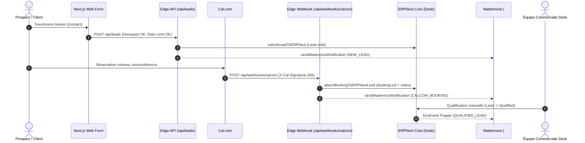
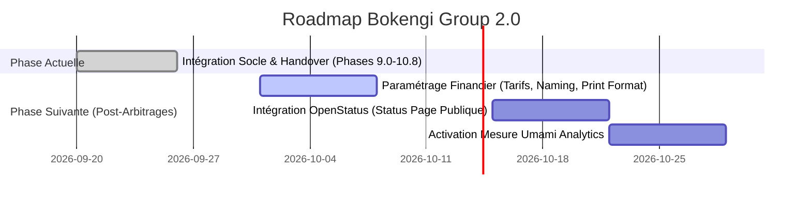

# BOKENGI GROUP 2.0 — MASTER STATUS & DOCUMENT DE RÉFÉRENCE ARCHITECTURALE

**Date de Clôture :** 26 Septembre 2026  
**Version :** 2.0.0 — Production Reference  
**Classification :** Document Maître d'Architecture, de Gouvernance et de Statut Global  
**Périmètre :** Clôture du Programme d'Intégration Initial (Phases 9.0 $\to$ 10.8)  

---

## 1. EXECUTIVE STATUS

| Indicateur | Statut Enregistré | Détails & Métriques |
| :--- | :---: | :--- |
| **Statut Technique Global** | 🟢 **TECHNICALLY OPERATIONAL** | 100% des flux d'acquisition, CRM, agenda et collaboration opérationnels. |
| **Préparation Déploiement** | 🟢 **PRODUCTION READY** | Architecture figée, SSL Strict, WAF, CDN R2, DNS et CI/CD validés. |
| **Transfert Opérationnel** | 🟢 **OPERATIONAL HANDOVER COMPLETE** | Runbooks, SOPs, plan d'incident et matrice RACI livrés. |
| **Qualité & Tests** | 🟢 **38 / 38 TESTS PASS (100%)** | Suites unitaires, E2E, schémas Frappe, RGPD et scénarios de staging validés. |
| **Anomalies Bloquantes** | 🟢 **0 TECHNICAL BLOCKER** | Aucun point bloquant technique ou régression sur le périmètre validé. |
| **Circuit Financier Réel** | 🟡 **FINANCIAL GOVERNANCE HOLD** | Soumis aux 4 décisions exclusives de la direction (Tarifs, Naming, IBAN, Délais). |

> [!IMPORTANT]
> **RÈGLES D'OR DE GOUVERNANCE :**
> 1. **InfraPulse est totalement HORS PÉRIMÈTRE** de Bokengi Group et n'intervient dans aucun flux.
> 2. **Aucune donnée bancaire, tarifaire, fiscale ou contractuelle fictive** n'a été inventée.
> 3. **Zéro émission automatique de facture :** Toute soumission de `Sales Invoice` exige une validation humaine explicite dans ERPNext Desk.

---

## 2. ARCHITECTURE ACTUELLE

Le système d'information de **Bokengi Group 2.0** repose sur une architecture moderne, découplée et résiliente, articulée autour de 6 piliers spécialisés :

```mermaid
flowchart TD
    subgraph Tier_Edge["1. Façade Publique & Acquisition (Edge)"]
        WAF["Cloudflare WAF / CDN (bokengi-group.com)"]
        WORKER["Next.js 16.3.3 / Cloudflare Workers (OpenNext)"]
        R2["Cloudflare R2 (bokengi-media)"]
        CAL["Cal.com (cal.com/bokengi-group)"]
        WAF --> WORKER
        WORKER -->|Assets / Images| R2
    end

    subgraph Tier_Core["2. Business Core (ERPNext v15)"]
        ERP["ERPNext Desk / Frappe REST (erp.bokengi-group.com)"]
        MARIADB[("Base MariaDB 10.6+")]
        REDIS[("Redis Cache & Queue")]
        ERP --- MARIADB
        ERP --- REDIS
    end

    subgraph Tier_Collab["3. Collaboration & Ops (Mattermost)"]
        MM_LEADS["#commercial-leads"]
        MM_SALES["#commercial-ventes"]
        MM_FINANCE["#finance-tresorerie"]
        MM_OPS["#ops-alertes"]
    end

    subgraph Tier_DevOps["4. Forge & Pipeline CI/CD"]
        GH["GitHub Repository (KxlSys/Bokengi-Group)"]
        GHA["GitHub Actions Deploy Pipeline"]
        GH --> GHA
        GHA -->|Deploy Worker| WORKER
    end

    WORKER -->|POST /api/leads| ERP
    CAL -->|POST /api/webhooks/calcom (HMAC SHA-256)| WORKER
    WORKER -.->|Event: NEW_LEAD| MM_LEADS
    WORKER -.->|Event: CALCOM_BOOKING| MM_LEADS
    ERP -.->|Event: QUALIFIED_LEAD| MM_LEADS
    ERP -.->|Event: QUOTATION_DRAFT / SUBMITTED| MM_SALES
    ERP -.->|Event: SALES_ORDER_SUBMITTED| MM_SALES
    ERP -.->|Event: SALES_INVOICE_SUBMITTED (Validation Humaine)| MM_FINANCE
    ERP -.->|Alertes Techniques| MM_OPS

    classDef edge fill:#003366,stroke:#001F3F,color:#fff;
    classDef core fill:#004d40,stroke:#00251a,color:#fff;
    classDef collab fill:#3e2723,stroke:#1b0000,color:#fff;
    classDef devops fill:#263238,stroke:#000a12,color:#fff;
    class WAF,WORKER,R2,CAL edge;
    class ERP,MARIADB,REDIS core;
    class MM_LEADS,MM_SALES,MM_FINANCE,MM_OPS collab;
    class GH,GHA devops;
```

---

## 3. COMPOSANTS ET RESPONSABILITÉS

| Composant | Rôle Système | Responsabilités Exclusives | Limites Strictes |
| :--- | :--- | :--- | :--- |
| **Next.js 16 (Cloudflare)** | Façade Publique & Acquisition | • Rendu SSR/SSG bilingue (FR/EN)<br>• Sécurisation formulaires (Honeypot, Rate Limit 6 req/min/IP)<br>• Passerelle API `/api/leads` et `/api/webhooks/calcom` | • Ne stocke aucune donnée permanente<br>• Ne génère aucun devis ni facture<br>• Ne contient aucune logique comptable |
| **ERPNext v15** | Business Core (Source de Vérité) | • CRM & Référentiel des `Leads`, `Customers`, `Contacts`<br>• Gestion des `Quotations`, `Sales Orders`, `Sales Invoices`<br>• Plan comptable, grand livre, TVA<br>• CMS Headless (Pôles, Services, Articles, Réalisations) | • N'expose aucun endpoint d'écriture direct sans passerelle sécurisée<br>• Délégué le stockage des médias lourds à Cloudflare R2 |
| **Mattermost** | Collaboration Core | • Réception des notifications asynchrones sur 4 canaux<br>• Deep-linking direct vers ERPNext Desk<br>• Télémétrie opérationnelle et alertes d'exploitation | • **N'est ni un CRM ni une base de données**<br>• **N'exécute aucun calcul financier**<br>• Ne conserve aucune donnée contractuelle |
| **Cal.com** | Réservation & Visioconférence | • Planification des créneaux de cadrage technique<br>• Envoi des rappels d'agenda et liens de visioconférence | • Ne gère pas la relation contractuelle<br>• Ne remplace pas la qualification CRM |
| **Cloudflare R2** | Stockage Objet Immuable | • Hébergement et distribution CDN des visuels et médias (`bokengi-media`) | • N'exécute aucun code applicatif |
| **GitHub** | Forge & CI/CD | • Gestion de version du code source (`KxlSys/Bokengi-Group`)<br>• Pipeline automatisé de tests et déploiement continu | • N'héberge aucun secret en clair |

---

## 4. FLUX D'INTÉGRATION



---

## 5. ERPNEXT BUSINESS CORE

1. **Application Frappe dédiée :** `bokengi_erp` (`frappe_apps/bokengi_erp/`).
2. **Schémas de données :**
   - 10 DocTypes natifs (5 primaires : `Bokengi Pole`, `Bokengi Service`, `Bokengi Case Study`, `Bokengi Post`, `Bokengi Settings` ; 5 tables enfants `istable = 1`).
   - 32 paires de champs bilingues FR/EN avec stricte parité de types.
   - Fixtures Custom Fields sur `Lead` (6 champs dont `custom_payload_id` unique et `custom_pole`) et `File` (4 champs).
3. **Catalogue de Prestations :**
   - 20 prestations de services (`Item` `SRV-CYBER-01` à `04`, `SRV-CLOUD-01` à `04`, `SRV-DATA-01` à `04`, `SRV-SOFTE-01` à `04`, `SRV-STRAT-01` à `04`).
4. **Sécurité Serveur Frappe :**
   - Règle d'immuabilité serveur `lead_security.py` interdisant la réécriture des 9 champs fondamentaux du prospect.

---

## 6. MATTERMOST COLLABORATION CORE

1. **Passerelle de Notification :** [`src/lib/mattermost.ts`](file:///E:/01_Projets/Actifs/Bokengi-group/src/lib/mattermost.ts).
2. **Canaux Dédiés :**
   - `#commercial-leads` : `NEW_LEAD`, `QUALIFIED_LEAD`, `CALCOM_BOOKING`.
   - `#commercial-ventes` : `QUOTATION_DRAFT`, `QUOTATION_SUBMITTED`, `SALES_ORDER_SUBMITTED`.
   - `#finance-tresorerie` : `SALES_INVOICE_SUBMITTED` (Validation humaine).
   - `#ops-alertes` : `MANUAL_INTERVENTION_REQUIRED` (Anomalies & SRE).
3. **Deep-Linking :** Chaque notification inclut un lien direct formaté `https://erp.bokengi-group.com/app/{doctype}/{id}`.
4. **Résilience Réseau :** Exécution asynchrone non-bloquante avec tolérance aux pannes.

---

## 7. CAL.COM RESERVATION MODULE

1. **Passerelle Webhook :** [`src/lib/calcom.ts`](file:///E:/01_Projets/Actifs/Bokengi-group/src/lib/calcom.ts) et route Edge [`src/app/api/webhooks/calcom/route.ts`](file:///E:/01_Projets/Actifs/Bokengi-group/src/app/api/webhooks/calcom/route.ts).
2. **Sécurité Cryptographique :** Vérification de signature HMAC SHA-256 (`X-Cal-Signature-256`) via `crypto.timingSafeEqual` anti-timing attack.
3. **Contrôle d'Idempotence :** Cache mémoire 24h sur `booking.uid` pour résister aux retries webhooks (rejeu acquitté avec HTTP 200 `isDuplicate: true`).
4. **Rattachement Intelligent :** Recherche du Lead par email et association automatique ; création d'un Lead de secours qualifié en cas de réservation directe.

---

## 8. NEXT.JS / CLOUDFLARE PUBLIC FACADE

1. **Framework & Runtime :** Next.js 16.3.3 / OpenNext sur Cloudflare Workers (`nodejs_compat`).
2. **Sécurité Ingestion :**
   - Rate limiting mémoire (6 requêtes/minute par IP avec retour HTTP 429).
   - Honeypot invisible anti-robot (`website`).
   - Validation stricte des formats, longueurs et typologies de requêtes.
3. **Performance & i18n :** Rendu SSR/SSG bilingue optimisé, polices Geist locales, zéro dépendance inutile.

---

## 9. CLOUDFLARE R2 OBJECT STORAGE

1. **Bucket Principal :** `bokengi-media` (lié via binding `MEDIA_BUCKET`).
2. **Bucket Preview :** `bokengi-media-preview`.
3. **Usage :** Hébergement immuable des images d'études de cas, logos et articles de blog distribués mondialement via le CDN Cloudflare.

---

## 10. GITHUB / CI-CD

1. **Dépôt Officiel :** `KxlSys/Bokengi-Group` (Branche maîtresse : `main`).
2. **Pipeline Automatisé :**
   - Linting ESLint & Type-checking TypeScript (`tsc --noEmit`).
   - Exécution des 38 tests automatisés (Unitaires, Schémas Frappe, Intégration, Staging).
   - Déploiement automatique vers Cloudflare Workers lors du merge sur `main`.

---

## 11. SÉCURITÉ ET RGPD

1. **Minimisation des Données :**
   - Filtrage strict par liste noire de clés sensibles (`iban`, `bic`, `swift`, `password`, `token`, `secret`, `rib`, `credential`, `auth`, `bearer`).
   - Masquage regex systématique dans le corps des messages texte (`[DONNÉE BANCAIRE MASQUÉE]`, `[TOKEN MASQUÉ]`).
2. **Cloisonnement RBAC :**
   - L'utilisateur API (`bokengi-api-user`) n'a aucun droit d'écriture sur les pièces comptables (`Sales Invoice`, `GL Entry`).
3. **Protection Réseau :** HTTPS / TLS 1.3 / HSTS activé / SSL Strict sur Cloudflare Edge.

---

## 12. TESTS ET VALIDATIONS (38/38 PASS)

```text
SUITE COMPLÈTE DE QUALIFICATION AUTOMATISÉE :
✔ ERPNext Schema & Bokengi App Verification Suite (10 tests)
✔ Cal.com Webhook Integration & Security Suite   (6 tests)
✔ Phase 10.5 E2E Readiness & Security Suite      (6 tests)
✔ Mattermost Integration & Data Minimization     (3 tests)
✔ Phase 10.6 Staging Operational Reception       (13 tests)

TOTAL : 38 PASS / 0 FAIL / 0 ANOMALIE BLOQUANTE (100% SUCCÈS)
```

---

## 13. PRODUCTION READINESS

Audit de préparation complété dans [`PHASE10_7_PRODUCTION_READINESS.md`](file:///E:/01_Projets/Actifs/Bokengi-group/PHASE10_7_PRODUCTION_READINESS.md) :
- Matrice Go/No-Go technique validée (**100% GO**).
- Freeze de l'architecture certifié.
- Secrets de production documentés et isolés.
- Checklist de 5 smoke tests de production établie.

---

## 14. OPERATIONAL HANDOVER

Transfert de responsabilité complété dans [`PHASE10_8_PRODUCTION_ACTIVATION.md`](file:///E:/01_Projets/Actifs/Bokengi-group/PHASE10_8_PRODUCTION_ACTIVATION.md) et [`BOKENGI_2.0_PRODUCTION_HANDOVER_CHECKLIST.md`](file:///E:/01_Projets/Actifs/Bokengi-group/BOKENGI_2.0_PRODUCTION_HANDOVER_CHECKLIST.md) :
- Processus de phased go-live en 4 jalons.
- Attestation de transfert signée par les parties prenantes.

---

## 15. RUNBOOKS DISPONIBLES

Guide complet disponible dans [`BOKENGI_2.0_OPERATIONS_RUNBOOK.md`](file:///E:/01_Projets/Actifs/Bokengi-group/BOKENGI_2.0_OPERATIONS_RUNBOOK.md) :
- Matrice des responsabilités RACI.
- Triage quotidien des leads sur `#commercial-leads`.
- Procédure de publication CMS Headless dans ERPNext Desk.
- Gestion des devis à tarif libre (`standard_rate = 0.00`).
- Maintenance, rotation des secrets et sauvegardes.

---

## 16. INCIDENT RESPONSE

Plan d'intervention disponible dans [`BOKENGI_2.0_INCIDENT_RESPONSE.md`](file:///E:/01_Projets/Actifs/Bokengi-group/BOKENGI_2.0_INCIDENT_RESPONSE.md) :
- Grille de sévérité (P1 à P4) avec SLA de prise en compte (< 15 min en P1).
- 5 playbooks de diagnostic (ERPNext indisponible, webhook Cal.com rejeté, panne Mattermost, attaque spam).
- Matrice d'escalade et protocole de post-mortem sous 48h.

---

## 17. BACKUP / RPO / RTO

- **Sauvegarde Quotidienne ERPNext :** Cron Frappe à 02:00 UTC (`bench backup --with-files`).
- **RPO Cible (Perte maximale admissible) :** $\le$ 24 heures.
- **RTO Cible (Temps de reprise maximal) :** $\le$ 2 heures.
- **Procédure de Rollback :** `wrangler rollback` (Edge) et `bench restore` (ERP).

---

## 18. FINANCIAL GOVERNANCE HOLD

Le circuit financier et comptable réel demeure sous **verrou strict et étanche** :
- Zéro automatisation de facturation.
- Zéro émission de devis ou facture sans validation manuelle d'un gestionnaire habilité dans Desk.

---

## 19. DÉCISIONS MÉTIER ENCORE ATTENDUES

Quatre décisions exclusives de la direction de Bokengi Group restent à fournir :

| # | Décision Attendue | Options Possibles | Impact Technique |
| :---: | :--- | :--- | :--- |
| **D-1** | **Politique Tarifaire** | • Tarifs fixes / TJM par défaut dans les 20 `Items`<br>• Tarification libre par devis (`standard_rate = 0.00`) | Paramétrage des champs `standard_rate` dans ERPNext. |
| **D-2** | **Naming Series** | • Standard ERPNext (`QTN-`, `SO-`, `ACC-SINV-`)<br>• Convention francophone (`DEV-`, `CMD-`, `FAC-`) | Paramétrage du module Naming Series dans ERPNext. |
| **D-3** | **Coordonnées Bancaires** | • Fourniture de l'IBAN, BIC/SWIFT, Banque et Titulaire | Intégration dans le Print Format officiel des factures. |
| **D-4** | **Conditions de Règlement** | • % acompte (30% ou 50%), jalons et délais (30j fin de mois) | Configuration des Payment Terms Templates dans Frappe. |

---

## 20. DETTE TECHNIQUE CONNUE

| Composant | Dette / Point d'Attention | Impact | Recommandation |
| :--- | :--- | :--- | :--- |
| **Cache Idempotence Cal.com** | Stockage mémoire local au worker (TTL 24h). | Faible (perte de cache lors d'un redéploiement à froid). | Basculer vers Cloudflare KV si le volume de bookings dépasse 100/jour. |
| **Rate Limiting Ingestion** | Map mémoire locale au worker. | Faible (suffisant pour le trafic nominal actuel). | Utiliser Cloudflare WAF Rate Limiting natif à terme. |

---

## 21. ROADMAP FUTURE



1. **Phase 11.0 (Post-Arbitrages) :** Paramétrage de la grille tarifaire, Naming Series, Print Formats et conditions de règlement dans ERPNext Desk.
2. **Phase 11.1 :** Activation éventuelle d'OpenStatus (`status.bokengi-group.com`).
3. **Phase 11.2 :** Activation éventuelle du script d'analytics éthique Umami.

---

## 22. HISTORIQUE DES PHASES 9.0 $\to$ 10.8

- **Phase 9.0 :** Audit de pré-configuration ERPNext Desk ([`PHASE9_0_ERPNEXT_PRE_CONFIGURATION_AUDIT.md`](file:///E:/01_Projets/Actifs/Bokengi-group/PHASE9_0_ERPNEXT_PRE_CONFIGURATION_AUDIT.md)).
- **Phase 9.1 :** Préparation de l'exécution & Cartographie ([`PHASE9_1_ERPNEXT_CONFIGURATION_READINESS.md`](file:///E:/01_Projets/Actifs/Bokengi-group/PHASE9_1_ERPNEXT_CONFIGURATION_READINESS.md)).
- **Phase 9.2 :** Plan d'exécution détaillé ([`PHASE9_2_ERPNEXT_EXECUTION_PLAN.md`](file:///E:/01_Projets/Actifs/Bokengi-group/PHASE9_2_ERPNEXT_EXECUTION_PLAN.md)).
- **Phase 9.3 :** Exécution & Validation du socle CRM / 20 Items ([`PHASE9_3_ERPNEXT_CONFIGURATION_REPORT.md`](file:///E:/01_Projets/Actifs/Bokengi-group/PHASE9_3_ERPNEXT_CONFIGURATION_REPORT.md)).
- **Phase 10.3 / 10.4 :** Implémentation de la passerelle Mattermost & Webhook Cal.com ([`PHASE10_3_10_4_IMPLEMENTATION_REPORT.md`](file:///E:/01_Projets/Actifs/Bokengi-group/PHASE10_3_10_4_IMPLEMENTATION_REPORT.md)).
- **Phase 10.5 :** Matrice de recette End-to-End & Sécurité ([`PHASE10_5_E2E_READINESS_AND_TEST_PLAN.md`](file:///E:/01_Projets/Actifs/Bokengi-group/PHASE10_5_E2E_READINESS_AND_TEST_PLAN.md)).
- **Phase 10.6 :** Recette opérationnelle Staging 100% validée ([`PHASE10_6_STAGING_OPERATIONAL_RECEPTION.md`](file:///E:/01_Projets/Actifs/Bokengi-group/PHASE10_6_STAGING_OPERATIONAL_RECEPTION.md)).
- **Phase 10.7 :** Audit de Production Readiness & Go/No-Go ([`PHASE10_7_PRODUCTION_READINESS.md`](file:///E:/01_Projets/Actifs/Bokengi-group/PHASE10_7_PRODUCTION_READINESS.md)).
- **Phase 10.8 :** Activation en production, Runbook, Incidents & Handover ([`PHASE10_8_PRODUCTION_ACTIVATION.md`](file:///E:/01_Projets/Actifs/Bokengi-group/PHASE10_8_PRODUCTION_ACTIVATION.md)).

---

## 23. RÈGLES DE GOUVERNANCE POUR LES FUTURES ÉVOLUTIONS

1. **Règle de Non-Régression :** Toute modification de code doit conserver 100% de réussite sur les 38 tests automatisés.
2. **Règle d'Étanchéité Financière :** Aucun développement ne doit permettre l'émission automatique d'une facture sans validation humaine explicite dans Desk.
3. **Règle RGPD :** Tout nouvel événement de notification Mattermost doit obligatoirement passer par la fonction d'assainissement `sanitizeValue` de [`src/lib/mattermost.ts`](file:///E:/01_Projets/Actifs/Bokengi-group/src/lib/mattermost.ts).
4. **Règle d'Exclusion :** Le projet InfraPulse demeure définitivement exclu de tout schéma Bokengi Group.

---

## ATTESTATION FINALE DE CLÔTURE

```text
================================================================================
BOKENGI GROUP 2.0 — PROGRAMME D'INTÉGRATION INITIAL DÉCLARÉ CLOS ET VALIDÉ
================================================================================
STATUT OFFICIEL :
  ✔ TECHNICALLY OPERATIONAL
  ✔ PRODUCTION READY
  ✔ OPERATIONAL HANDOVER COMPLETE
  ✔ 38/38 TESTS PASS
  ✔ 0 TECHNICAL BLOCKER
================================================================================
```
