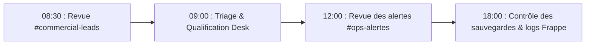

# BOKENGI GROUP 2.0 — RUNBOOK D'EXPLOITATION & GUIDE OPÉRATIONNEL

**Date :** 26 Septembre 2026  
**Version :** 2.0.0 — Production  
**Classification :** Document Interne d'Exploitation & de Maintenance  

---

## 1. CARTOGRAPHIE DES RESPONSABILITÉS (MATRICE RACI)

| Composant & Rôle | Façade Web (Next.js / CF) | Business Core (ERPNext) | Collaboration (Mattermost) | Agenda (Cal.com) | Stockage (Cloudflare R2) |
| :--- | :---: | :---: | :---: | :---: | :---: |
| **Ingestion Lead Web** | **R / A** | **C** | **I** | - | - |
| **Réservation Visioconférence** | **C** | **C** | **I** | **R / A** | - |
| **Qualification Commerciale** | - | **R / A** | **I** | - | - |
| **Chiffrage & Devis (Quotation)**| - | **R / A** | **I** | - | - |
| **Validation Facture (Manual)** | - | **R / A** | **I** | - | - |
| **Gestion des Médias & Visuels** | **C** | **C** | - | - | **R / A** |
| **Sauvegardes & Rétablissement** | **C** | **R / A** | **C** | - | **C** |

*Légende : R = Réalisateur (Responsible), A = Approbateur / Responsable final (Accountable), C = Consulté (Consulted), I = Informé (Informed).*

---

## 2. PROCÉDURES OPÉRATIONNELLES QUOTIDIENNES



### 2.1. Traitement des Nouveaux Prospects (Matin & Fil de l'eau)
1. **Canal Mattermost :** Surveiller les notifications arrivant sur `#commercial-leads`.
2. **Consultation Desk :** Cliquer sur le deep-link `[Accéder au dossier dans ERPNext Desk →]`.
3. **Qualification :**
   - Vérifier les champs `custom_pole` et `custom_payload_message_raw`.
   - Passer le statut du `Lead` à `Qualified` si le besoin relève des compétences de Bokengi Group.
   - En cas de spam ou de non-pertinence, passer le statut à `Do Not Contact` ou `Lost`.

### 2.2. Gestion des Réservations Cal.com
1. La réservation apparaît automatiquement sur `#commercial-leads` avec l'icône `:calendar:`.
2. Le `booking.uid` est rattaché au `Lead`. En cas de rendez-vous sans fiche existante, un Lead provisoire est créé automatiquement pour l'interlocuteur.
3. Préparer le cadrage technique avant la visioconférence.

---

## 3. PROCÉDURE DE PUBLICATION DE CONTENU (CMS HEADLESS)

ERPNext v15 sert de CMS Headless pour les articles de blog et études de cas affichés sur le site web public.

### 3.1. Publier une nouvelle Étude de Cas (`Bokengi Case Study`)
1. Naviguer dans Desk : **Bokengi Core > Bokengi Case Study > Ajouter Bokengi Case Study**.
2. Renseigner les champs obligatoires bilingues :
   - `title_fr` / `title_en`
   - `client_fr` / `client_en`
   - `summary_fr` / `summary_en`
   - `challenge_fr` / `challenge_en`
   - `solution_fr` / `solution_en`
   - `results_fr` / `results_en`
3. Téléverser les visuels dans Cloudflare R2 (`bokengi-media`) et coller les URLs publiques.
4. Cocher la case **Published** (`is_published = 1`).
5. Enregistrer. Le contenu est instantanément disponible via l'API publique `/api/bokengi/case-studies`.

---

## 4. PROCÉDURE DE GESTION DES DEVIS (TARIF LIBRE)

Tant que la politique tarifaire catalogue n'est pas arbitrée :
1. Ouvrir le Lead qualifié dans ERPNext Desk.
2. Cliquer sur **Create > Quotation**.
3. Sélectionner le service parmi les 20 `Items` du catalogue (`SRV-CYBER-01`, `SRV-CLOUD-01`, etc.).
4. Saisir le taux journalier / forfait convenu dans le champ **Rate** (`standard_rate = 0.00` par défaut).
5. Enregistrer à l'état `Draft` (`docstatus: 0`).
6. Une notification apparaît sur `#commercial-ventes`.
7. Après revue par la direction, cliquer sur **Submit** (`docstatus: 1`) pour générer le devis officiel à transmettre au client.

---

## 5. MAINTENANCE & TÂCHES PÉRIODIQUES

### 5.1. Contrôle Quotidien des Sauvegardes
- Vérifier la présence des fichiers de backup dans le répertoire `/home/frappe/frappe-bench/sites/erp.bokengi-group.com/private/backups/`.
- Vérifier que la taille du dump `.sql.gz` est cohérente (> 0 Ko).

### 5.2. Rotation des Secrets (Trimestrielle)
1. Générer de nouveaux secrets API Frappe pour `bokengi-api-user`.
2. Mettre à jour les secrets Cloudflare :
   ```bash
   npx wrangler secret put ERPNEXT_API_SECRET --env production
   ```
3. Mettre à jour le secret webhook Cal.com si renouvelé :
   ```bash
   npx wrangler secret put CALCOM_WEBHOOK_SECRET --env production
   ```
4. Déclencher un smoke test pour valider la communication.

---

## 6. PROCÉDURE DE DÉPLOIEMENT EN PRODUCTION

Le déploiement est entièrement orchestré via le pipeline GitHub Actions :
1. Toute modification doit être validée par revue de code sur une branche de feature (`git pull request`).
2. Les tests automatisés unitaires et de schémas (38 tests) doivent passer à 100% sur la CI.
3. Le merge sur la branche `main` déclenche le déploiement automatique sur Cloudflare Workers via OpenNext.
4. Exécuter immédiatement les 5 smoke tests de production (`SMOKE-01` à `SMOKE-05`).
