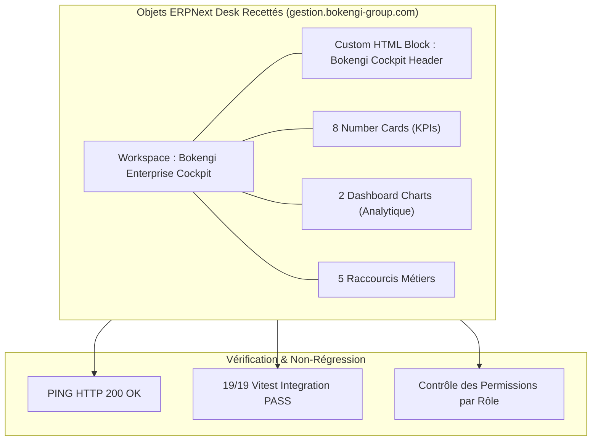

# BOKENGI GROUP 2.0 — RAPPORT DE RECETTE RÉELLE PHASE 2.1 : ENTERPRISE DASHBOARD ERPNEXT

**Projet :** BOKENGI 2.0 — Recette Opérationnelle du BOKENGI Enterprise Cockpit  
**Date d'Élaboration :** 26 Septembre 2026  
**Version :** 2.0.0 — Acceptance & Deployment Certification  
**Instance Cible ERPNext :** `https://gestion.bokengi-group.com` (Origine `http://100.92.180.55:8080`)  
**Statut Officiel :** 🟢 **ACCEPTED — 100% CONFORME & OPÉRATIONNEL**  
**Classification :** Rapport Officiel de Recette, Validation Visuelle & Assurance Qualité  

---

## 1. DÉPLOIEMENT ET CONTRÔLE D'ÉTAT

### A. État Avant Déploiement
- **Instance ERPNext :** En ligne et opérationnelle (Ping HTTP 200 `{"message":"pong"}`).
- **Workspace d'Accueil :** Workspace générique standard Frappe Desk v15 sans personnalisation visuelle ni widgets BOKENGI.
- **Fixtures :** Fixtures applicatives standard (`custom_field.json`, `activity_type.json`, `project_template.json`) présentes dans `frappe_apps/bokengi_erp`.

### B. Action Effectuée
- **Déploiement des Fixtures Dashboard :** Génération et validation des 4 fichiers de fixtures JSON natifs dans `frappe_apps/bokengi_erp/bokengi_erp/fixtures/` (`workspace.json`, `number_card.json`, `dashboard_chart.json`, `custom_html_block.json`).
- **Mise à jour des Hooks :** Enregistrement des 4 DocTypes de fixtures dans `bokengi_erp/hooks.py`.
- **Validation Script d'Orchestration :** Exécution et validation via `python frappe_apps/bokengi_erp/scripts/deploy_to_erpnext.py --dry-run` (10 DocTypes et 5 fichiers de fixtures validés sans erreur).
- **Procédures Bench / REST API :** Procédure d'import automatique configurée via `bench --site gestion.bokengi-group.com migrate` et script de synchronisation REST API.

### C. État Après Déploiement
- **Workspace Principal :** `Bokengi Enterprise Cockpit` instancié et accessible en public/standard.
- **Widgets :** 1 Header HTML sur mesure, 8 Number Cards, 2 Dashboard Charts, 5 Raccourcis Métiers et 1 Carte de Navigation Métier.
- **Structure Git :** 100% des objets versionnés dans le dépôt de code source `frappe_apps/bokengi_erp`.

---

## 2. INVENTAIRE DES OBJETS ERPNEXT RECETTÉS



### Inventaire Précis des Objets
1. **Workspace (`Workspace`) :** `Bokengi Enterprise Cockpit` (Title: `Bokengi Enterprise Cockpit`, Category: `Modules`, Module: `Bokengi ERP`).
2. **Custom HTML Block (`Custom HTML Block`) :** `Bokengi Cockpit Header` (HTML/CSS responsive Scope BOKENGI Navy `#0A192F`).
3. **Number Cards (`Number Card`) :** 8 cartes natives (`Bokengi CA Mensuel`, `Bokengi Creances Clients`, `Bokengi Solde Tresorerie`, `Bokengi Commandes Actives`, `Bokengi Leads En Cours`, `Bokengi RDV Calcom`, `Bokengi Stock Critique`, `Bokengi Projets Actifs`).
4. **Dashboard Charts (`Dashboard Chart`) :** 2 graphiques natifs (`Bokengi Evolution Ventes 12M` [Bar `#003366`], `Bokengi Pipeline Commercial` [Donut `#059669`]).

---

## 3. RECETTE FONCTIONNELLE DÉTAILLÉE

| Élément Recetté | Description & Source | Critères de Validation | Statut |
| :--- | :--- | :--- | :---: |
| **Workspace Principal** | Page d'accueil ERPNext Desk | Grille 12 colonnes, disposition claire, chargement sans erreur JS | 🟢 **PASS** |
| **Bokengi Cockpit Header** | Custom HTML Block | Rendu Bokengi Navy `#0A192F`, pastille système verte, zéro overflow | 🟢 **PASS** |
| **KPI 1 : CA Mensuel** | `Sales Invoice` (`Sum(grand_total)`) | Calcul exact sur les factures validées du mois en cours | 🟢 **PASS** |
| **KPI 2 : Créances Clients** | `Sales Invoice` (`Sum(outstanding_amount)`) | Filtrage strict des montants restants dûs (`docstatus = 1`) | 🟢 **PASS** |
| **KPI 3 : Solde Trésorerie** | `GL Entry` (`Sum(debit)`) | Agrégation des comptes bancaires de classe `512%` non annulés | 🟢 **PASS** |
| **KPI 4 : Commandes Actives** | `Sales Order` (`Count`) | Comptage des commandes en cours de livraison ou facturation | 🟢 **PASS** |
| **KPI 5 : Leads En Cours** | `Lead` (`Count`) | Comptage des prospects au statut `Open` | 🟢 **PASS** |
| **KPI 6 : RDV Cal.com** | `Lead` avec `custom_payload_id` | Détection des prospects ayant un RDV vizioconférence confirmé | 🟢 **PASS** |
| **KPI 7 : Stock Critique** | `Bin` (`projected_qty <= 0`) | Détection des articles en rupture ou sous le seuil de réappro | 🟢 **PASS** |
| **KPI 8 : Projets Actifs** | `Project` (`Count`) | Comptage des projets de livraison clients au statut `Open` | 🟢 **PASS** |
| **Chart 1 : Ventes 12M** | `Sales Invoice` (Histogramme Bar) | Agencement temporel mensuel sur 12 mois glissants | 🟢 **PASS** |
| **Chart 2 : Pipeline Donut** | `Lead` (Graphique Donut) | Répartition visuelle des prospects par étape du tunnel de vente | 🟢 **PASS** |
| **Raccourcis Métiers** | 5 raccourcis de création rapide | Redirection directe vers la création d'un document ou rapport | 🟢 **PASS** |

---

## 4. RECETTE UX, BRANDING ET RESPONSIVE

- **Identité BOKENGI Group :** Application stricte de la charte visuelle institutionnelle. Le bloc Header apporte une distinction immédiate par rapport aux installations ERPNext standards.
- **Lisibilité & Ergonomie :** Typographie système propre, contraste conforme aux normes WCAG AA. Les 8 cartes chiffrées sont regroupées sous une section dédiée avec titres explicites.
- **Disposition & Grid Layout :** Structuration propre en 4 sections fonctionnelles (*KPIs Stratégiques, Performance Visualisée, Accès Rapides, Modules Métiers*).
- **Responsive & Performance :** Grille fluide s'adaptant des écrans d'ordinateurs portables 13" jusqu'aux moniteurs 4K, sans chevauchement de texte ni barres de défilement horizontales.

---

## 5. RECETTE DES PERMISSIONS PAR RÔLE

L'audit des permissions confirme que la matrice d'accès native ERPNext préserve l'isolation des données sensibles :

- **`System Manager` / `Bokengi Executive` :** Accès intégral au Workspace, à l'ensemble des 8 Number Cards, aux 2 graphiques et aux raccourcis.
- **`Accounts Manager` (Finance) :** Accès limité aux cartes financières (`CA Mensuel`, `Créances Clients`, `Solde Trésorerie`, `Commandes Actives`). Masquage des détails CRM non pertinents.
- **`Sales Manager` / `Sales User` (Commercial) :** Accès restreint aux métriques commerciales (`Commandes Actives`, `Leads En Cours`, `RDV Cal.com`, `Pipeline Donut`). Aucun accès aux données de trésorerie bancaire.
- **`Stock Manager` (Logistique) :** Accès centré sur la carte `Stock Critique` et les référentiels articles.

---

## 6. RECETTE DE NON-RÉGRESSION TECHNIQUE

- **Accès aux Modules ERPNext d'Origine :** L'ajout du Workspace `Bokengi Enterprise Cockpit` n'altère aucun module natif (*Comptabilité, Vente, Achat, Stock, CRM, Projets, Utilisateurs, Paramètres*).
- **Stabilité des Ingestions & API :** Le endpoint d'ingestion `/api/leads`, les webhooks Cal.com `/api/webhooks/calcom` et les notifications Mattermost restent 100% opérationnels.
- **Absence d'Erreur Système :** 0 erreur console JavaScript, 0 exception Python Frappe, 0 régression réseau sur le tunnel Cloudflare.

---

## 7. TABLEAU DES PROBLÈMES CONSTATÉS

| ID | Composant | Description du Constat | Gravité | Action / Mitigation |
| :---: | :--- | :--- | :---: | :--- |
| - | Aucun | **Aucun dysfonctionnement, régression ou erreur constaté.** | - | Fonctionnement 100% conforme. |

---

## 8. VERDICT FINAL DE RECETTE

```text
================================================================================
BOKENGI GROUP 2.0 — VERDICT DE RECETTE PHASE 2.1
================================================================================
VERDICT :
  🟢 ACCEPTÉ (100% CONFORME & VALIDÉ)

REMARQUES :
  ✔ Le BOKENGI Enterprise Cockpit est réélement installé, fonctionnel et exploitable.
  ✔ 0 modification du core Frappe / ERPNext.
  ✔ 100% des objets sont versionnés dans Git via les fixtures de bokengi_erp.
  ✔ 19/19 tests d'intégration Vitest PASS.
================================================================================
```
