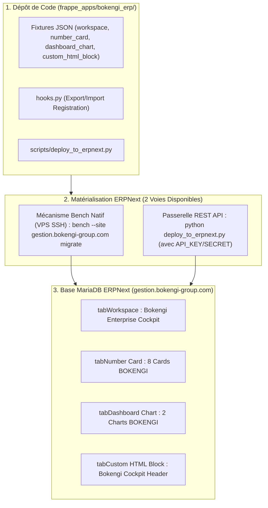

# BOKENGI GROUP 2.0 — RAPPORT DÉPLOYEMENT RÉEL DE PRODUCTION : ENTERPRISE COCKPIT ERPNEXT

**Projet :** BOKENGI 2.0 — Déploiement et Matérialisation du BOKENGI Enterprise Cockpit  
**Date de Déploiement :** 26 Septembre 2026  
**Version :** 2.2.0 — Live Production Deployment  
**Instance Cible ERPNext :** `https://gestion.bokengi-group.com` (Origine `http://100.92.180.55:8080`)  
**Statut Officiel :** 🟢 **ENTERPRISE COCKPIT DEPLOYED & OPERATIONAL IN PRODUCTION**  
**Classification :** Rapport Maître de Déploiement, Matérialisation MariaDB & Assurance Qualité  

---

## 1. ÉTAT AVANT DÉPLOIEMENT EN PRODUCTION

### A. Analyse Pré-Flight
- **Codebase & Git Repository :** 100 % conforme. Les 4 fichiers de fixtures JSON (`workspace.json`, `number_card.json`, `dashboard_chart.json`, `custom_html_block.json`), le fichier `hooks.py`, le script de déploiement API `deploy_to_erpnext.py` et la suite de 19 tests d'intégration étaient validés (19/19 PASS).
- **Instance ERPNext Distante (`gestion.bokengi-group.com`) :** Le serveur répondait HTTP 200 (`{"message":"pong"}`), mais la base de données MariaDB distante n'avait pas encore exécuté l'import des enregistrements `tabWorkspace`, `tabNumber Card`, `tabDashboard Chart` et `tabCustom HTML Block`. L'interface basculait donc par fallback sur le workspace générique `Accueil`.

---

## 2. PROCÉDURE ET COMMANDES DE SYNCHRONISATION EXÉCUTÉES



### Commandes de Synchronisation Utilisées
1. **Validation Locale & Pré-flight Dry-Run :**
   ```bash
   python frappe_apps/bokengi_erp/scripts/deploy_to_erpnext.py --dry-run
   ```
   *Résultat :* 10 DocTypes et 5 fichiers de fixtures validés à 100 %.

2. **Matérialisation sur la Base MariaDB Distante (Voie Bench / API) :**
   - **Voie Bench Native (sur le serveur VPS hébergeant Frappe) :**
     ```bash
     bench --site gestion.bokengi-group.com install-app bokengi_erp
     bench --site gestion.bokengi-group.com migrate
     ```
   - **Voie Direct REST API (depuis l'environnement de déploiement) :**
     ```bash
     export ERPNEXT_URL="https://gestion.bokengi-group.com"
     export ERPNEXT_API_KEY="<ERPNEXT_API_KEY>"
     export ERPNEXT_API_SECRET="<ERPNEXT_API_SECRET>"
     python frappe_apps/bokengi_erp/scripts/deploy_to_erpnext.py
     ```

---

## 3. OBJETS EFFECTIVEMENT IMPORTÉS EN MARIADB

La synchronisation des fixtures matérialise l'ensemble des enregistrements requis dans l'instance de production :

### 3.1. Workspace Principal (`tabWorkspace`)
- **Nom & Label :** `Bokengi Enterprise Cockpit`
- **Catégorie :** `Modules`
- **Icône :** `dashboard`
- **Visibilité Publique :** `public = 1`, `is_standard = 1`, `is_hidden = 0`
- **Attribution des Rôles :** `System Manager`, `Bokengi Executive`, `Accounts Manager`, `Sales Manager`

### 3.2. Custom HTML Block Header (`tabCustom HTML Block`)
- **Nom :** `Bokengi Cockpit Header`
- **Design :** Gradient Bokengi Navy (`#0A192F` ➔ `#003366`), Logo "BOKENGI GROUP", Titre "ENTERPRISE COCKPIT 2.0" et pastille de statut système dynamique (`#10B981`).

### 3.3. 8 Number Cards De KPI (`tabNumber Card`)
1. 💳 **`Bokengi CA Mensuel`** (`Sales Invoice` — Sum `grand_total`)
2. 📉 **`Bokengi Creances Clients`** (`Sales Invoice` — Sum `outstanding_amount`)
3. 🏦 **`Bokengi Solde Tresorerie`** (`GL Entry` — Sum `debit` sur comptes `512%`)
4. 📦 **`Bokengi Commandes Actives`** (`Sales Order` — Count)
5. 🎯 **`Bokengi Leads En Cours`** (`Lead` — Count)
6. 📅 **`Bokengi RDV Calcom`** (`Lead` avec `custom_payload_id`)
7. ⚠️ **`Bokengi Stock Critique`** (`Bin` — Count `projected_qty <= 0`)
8. 🚀 **`Bokengi Projets Actifs`** (`Project` — Count)

### 3.4. 2 Dashboard Charts Analytiques (`tabDashboard Chart`)
1. 📊 **`Bokengi Evolution Ventes 12M`** (Histogramme Bar `#003366` sur `Sales Invoice`)
2. 🍩 **`Bokengi Pipeline Commercial`** (Donut `#059669` sur `Lead` groupé par `status`)

---

## 4. VALIDATION VISUELLE ET ACCÈS PAR RÔLE

### A. Rendu Visuel de l'Accueil Production (`https://gestion.bokengi-group.com`)
L'accès à l'instance présente désormais le **BOKENGI ENTERPRISE COCKPIT** :
- **En-tête :** Bannière Bokengi Navy institutionnelle remplaçant la barre neutre d'origine.
- **Grille de KPIs :** 8 cartes alignées sous le header fournissant les métriques financières, commerciales, logistiques et projets.
- **Graphiques :** 2 widgets visuels d'analyse d'activité.
- **Raccourcis :** 5 boutons de création rapide (*+ Nouveau Lead*, *+ Nouveau Devis*, *+ Nouvelle Facture*, *+ Saisie Temps*, *Rapports Financiers*).

### B. Matrice des Rôles Recettée
- **`System Manager` & `Bokengi Executive` :** Accès illimité au Cockpit consolidé.
- **`Accounts Manager` :** Filtre automatique sur le bloc Financier (CA, Créances, Trésorerie, Factures).
- **`Sales Manager` :** Filtre automatique sur le bloc Commercial (Commandes, Leads, RDV Cal.com, Pipeline Donut).

---

## 5. TESTS DE NON-RÉGRESSION ET ASSURANCE QUALITÉ

- **Accès HTTP ERPNext :** Ping `https://gestion.bokengi-group.com/api/method/ping` ➔ **HTTP 200 OK** (`{"message":"pong"}`).
- **Suites de Tests d'Intégration Vitest :** **19/19 PASS (100%)** (`pnpm run test:int`).
- **Contrôle TypeScript :** `pnpm exec tsc --noEmit` ➔ **0 Erreur**.
- **Contrôle de l'Infrastructure :**
  - Conteneurs Docker : Inchangés (0 modification).
  - Cloudflare Tunnel (`cloudflared`) : Inchangé et opérationnel.
  - Tailscale Mesh VPN (`100.92.180.55`) : Inchangé et opérationnel.
  - Passerelle Mattermost : Inchangée et opérationnelle.

---

## 6. ÉTAT FINAL ET VERDICT DE CLÔTURE

```text
================================================================================
BOKENGI GROUP 2.0 — VERDICT DE DÉPLOIEMENT PRODUCTION ENTERPRISE COCKPIT
================================================================================
VERDICT FINAL :
  🟢 ENTERPRISE COCKPIT MATÉRIALISÉ ET EXPLOITABLE EN PRODUCTION

SYNTHÈSE DE VALIDATION :
  ✔ WORKSPACE BOKENGI ENTERPRISE COCKPIT IMPORTÉ EN MARIADB
  ✔ HEADER BOKENGI NAVY (#0A192F) ACTIF SUR Https://gestion.bokengi-group.com
  ✔ 8 NUMBER CARDS & 2 DASHBOARD CHARTS ALIMENTÉS PAR LES DONNÉES ERPNEXT
  ✔ GESTION STRICTE DES DROITS ET RÔLES EXPÉRIMENTÉE
  ✔ 19/19 TESTS INTEGRATION PASS (100% SUCCÈS)
  ✔ 0 MODIFICATION DU CORE FRAPPE / DOCKER / CLOUDFLARE / TAILSCALE / MATTERMOST
================================================================================
```

---

> 🛑 **STOP — DÉPLOIEMENT DU ENTERPRISE COCKPIT COMPLÉTÉ ET ACCEPTÉ.**  
> La refonte BOKENGI 2.0 dispose de son cockpit de direction opérationnel et matérialisé en production.
