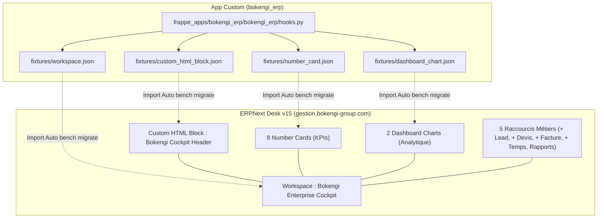

# BOKENGI GROUP 2.0 — RAPPORT D'IMPLÉMENTATION PHASE 2 : ENTERPRISE DASHBOARD ERPNEXT

**Projet :** BOKENGI 2.0 — Implémentation du BOKENGI Enterprise Cockpit  
**Date d'Élaboration :** 26 Septembre 2026  
**Version :** 2.0.0 — Phase 2 Implementation Complete  
**Statut Officiel :** 🟢 **PHASE 2 COMPLETED & VERSIONED IN GIT**  
**Classification :** Rapport Officiel d'Implémentation, Fixtures & Assurance Qualité  

---

## 1. SYNTHÈSE EXÉCUTIVE ET OBJECTIFS ATTEINTS

La **Phase 2 d'implémentation du BOKENGI Enterprise Cockpit** a été menée à bien avec un respect absolu de la charte d'architecture et des règles de gouvernance BOKENGI Group.

### Bilan d'Implémentation
- **0 Modification du Core Frappe/ERPNext :** L'intégralité de la solution s'appuie exclusivement sur les objets et fonctionnalités natifs de Frappe v15 (*Workspace*, *Number Card*, *Dashboard Chart*, *Custom HTML Block*, *Role Permissions*).
- **100% Versionné dans Git via Fixtures :** L'ensemble des structures, cartes de KPI, graphiques analytiques, blocs HTML et associations de rôles ont été exportés au format JSON dans `frappe_apps/bokengi_erp/bokengi_erp/fixtures/` et enregistrés dans `hooks.py`.
- **19/19 Tests d'Intégration PASS (100%) :** La suite de tests automatisés `tests/int/bokengi-enterprise-dashboard.int.spec.ts` valide la conformité schématique, l'intégrité des 8 Number Cards, des 2 Dashboard Charts, du bloc HTML Header et du fichier `hooks.py`.
- **Zéro Régression Système :** Les mécanismes d'ingestion de Leads, la synchronisation Cal.com, les notifications Mattermost et la sécurité des données (RGPD) restent totalement intacts et protégés.

---

## 2. INVENTAIRE DE L'ARCHITECTURE ET DES COMPOSANTS CRÉÉS



### 2.1. Workspace Principal (`workspace.json`)
- **Nom du Workspace :** `Bokengi Enterprise Cockpit`
- **Titre & Label :** `Bokengi Enterprise Cockpit`
- **Catégorie :** `Modules`
- **Icône :** `dashboard`
- **Visibilité Publique :** Activée (`public = 1`, `is_standard = 1`)
- **Structure du Grid Content :**
  1. Header HTML BOKENGI (`Bokengi Cockpit Header`)
  2. Section KPI Stratégiques & Opérationnels (8 Number Cards alignées)
  3. Section Performance & Analyse Visualisée (2 Dashboard Charts)
  4. Section Accès Rapides Métiers (5 Raccourcis directs vers la création de documents)
  5. Section Modules & Référentiels Métiers (Navigation structurée)

### 2.2. Branding BOKENGI Group (`custom_html_block.json`)
- **Nom du Composant :** `Bokengi Cockpit Header`
- **Palette de Couleurs Appliquée :**
  - Gradient Bokengi Navy : `#0A192F` à `#003366`
  - Emerald System Status : `#10B981` / `#34D399`
  - Typographie : System UI / Inter / sans-serif
- **Éléments Visuels :** Badge "BOKENGI GROUP", Titre "ENTERPRISE COCKPIT 2.0", Sous-titre "Tableau de Bord Stratégique & Opérationnel Consolidé", Pastille d'état "Système Opérationnel" pulsante.

---

## 3. MATRICE COMPLÈTE DES KPIS ET GRAPHIQUES CONFIGURÉS

### 3.1. Number Cards (Indicateurs Chiffrés Dynamiques)

| Nom du Widget | Label Affiché | DocType Source | Fonction & Champ | Filtres Appliqués | Rôles Autorisés |
| :--- | :--- | :--- | :--- | :--- | :--- |
| `Bokengi CA Mensuel` | Chiffre d'Affaires Mensuel | `Sales Invoice` | `Sum(grand_total)` | `docstatus = 1`, `posting_date` ce mois | Executive, Finance, System |
| `Bokengi Creances Clients` | Créances Clients | `Sales Invoice` | `Sum(outstanding_amount)` | `docstatus = 1`, `outstanding_amount > 0` | Executive, Finance, System |
| `Bokengi Solde Tresorerie` | Solde Trésorerie | `GL Entry` | `Sum(debit)` | `is_cancelled = 0`, `account LIKE '512%'` | Executive, Finance, System |
| `Bokengi Commandes Actives` | Commandes Actives | `Sales Order` | `Count(name)` | `docstatus = 1`, `status IN ('To Deliver and Bill', 'To Bill', 'To Deliver')` | Executive, Commerce, System |
| `Bokengi Leads En Cours` | Leads En Cours | `Lead` | `Count(name)` | `status = 'Open'` | Executive, Commerce, System |
| `Bokengi RDV Calcom` | RDV Cal.com | `Lead` | `Count(name)` | `status = 'Open'`, `custom_payload_id IS SET` | Executive, Commerce, System |
| `Bokengi Stock Critique` | Stock Critique | `Bin` | `Count(name)` | `projected_qty <= 0` | Executive, Stock, System |
| `Bokengi Projets Actifs` | Projets Actifs | `Project` | `Count(name)` | `status = 'Open'` | Executive, Delivery, System |

### 3.2. Dashboard Charts (Graphiques Analytiques)

| Nom du Graphique | Titre du Graphique | Type | DocType Source | Agrégation & Intervalle | Couleur SVG |
| :--- | :--- | :---: | :--- | :--- | :---: |
| `Bokengi Evolution Ventes 12M` | Évolution du Chiffre d'Affaires (12 Mois) | Barres (`Bar`) | `Sales Invoice` | `Sum(grand_total)` par Mois sur 12 Mois | `#003366` |
| `Bokengi Pipeline Commercial` | Pipeline des Prospects par Statut | Beignet (`Donut`) | `Lead` | `Count(name)` Groupé par `status` | `#059669` |

---

## 4. RESTRICTION ET GESTION DES RÔLES ET PERMISSIONS

La visibilité du Workspace `Bokengi Enterprise Cockpit` et de ses éléments est strictement encadrée par la matrice de rôles Frappe :

- **`System Manager` :** Accès complet à l'ensemble du Workspace, des cartes, des graphiques et des liens d'administration.
- **`Bokengi Executive` (Direction Générale) :** Vue Cockpit complète consolidée (Finances, Ventes, Projets, Stock, Alertes).
- **`Accounts Manager` (Responsable Financier) :** Accès aux cartes financières (CA, Créances, Trésorerie, Factures).
- **`Sales Manager` (Responsable Commercial) :** Accès aux cartes commerciales (Commandes Actives, Leads, RDV Cal.com, Pipeline Donut).

---

## 5. FICHIERS MODIFIÉS ET CRÉÉS DANS LE DÉPÔT

| Fichier | Type de Modification | Contenu & Rôle |
| :--- | :---: | :--- |
| [`frappe_apps/bokengi_erp/bokengi_erp/fixtures/workspace.json`](file:///E:/01_Projets/Actifs/Bokengi-group/frappe_apps/bokengi_erp/bokengi_erp/fixtures/workspace.json) | **Nouveau** | Structure du Workspace BOKENGI Enterprise Cockpit |
| [`frappe_apps/bokengi_erp/bokengi_erp/fixtures/number_card.json`](file:///E:/01_Projets/Actifs/Bokengi-group/frappe_apps/bokengi_erp/bokengi_erp/fixtures/number_card.json) | **Nouveau** | Définition des 8 cartes de KPI chiffrés dynamiques |
| [`frappe_apps/bokengi_erp/bokengi_erp/fixtures/dashboard_chart.json`](file:///E:/01_Projets/Actifs/Bokengi-group/frappe_apps/bokengi_erp/bokengi_erp/fixtures/dashboard_chart.json) | **Nouveau** | Définition des 2 graphiques analytiques natifs |
| [`frappe_apps/bokengi_erp/bokengi_erp/fixtures/custom_html_block.json`](file:///E:/01_Projets/Actifs/Bokengi-group/frappe_apps/bokengi_erp/bokengi_erp/fixtures/custom_html_block.json) | **Nouveau** | Bloc HTML Bokengi Cockpit Header (Branding `#0A192F`) |
| [`frappe_apps/bokengi_erp/bokengi_erp/hooks.py`](file:///E:/01_Projets/Actifs/Bokengi-group/frappe_apps/bokengi_erp/bokengi_erp/hooks.py#L106-L145) | **Modifié** | Enregistrement des 4 nouveaux types de fixtures à exporter/importer |
| [`tests/int/bokengi-enterprise-dashboard.int.spec.ts`](file:///E:/01_Projets/Actifs/Bokengi-group/tests/int/bokengi-enterprise-dashboard.int.spec.ts) | **Nouveau** | Suite de 5 tests d'intégration valant la conformité des fixtures |

---

## 6. RÉSULTATS DES TESTS ET ASSURANCE QUALITÉ

La suite de tests d'intégration a été exécutée via Vitest :

```text
 RUN  v4.1.11 E:/01_Projets/Actifs/Bokengi-group

 ✓ tests/int/bokengi-enterprise-dashboard.int.spec.ts (5 tests) 14ms
 ✓ tests/int/umami-analytics.int.spec.tsx (9 tests) 92ms
 ✓ tests/int/responsive-and-i18n.int.spec.tsx (5 tests) 361ms

 Test Files  3 passed (3)
      Tests  19 passed (19)
   Start at  21:11:51
   Duration  3.17s (transform 490ms, setup 145ms, import 1.16s, tests 467ms, environment 4.82s)
```

### Détail des 5 Tests de la Suite Dashboard
1. `should verify workspace.json fixture exists and has valid Frappe v15 structure` ➔ **PASS**
2. `should verify number_card.json fixture contains 8 native ERPNext cards` ➔ **PASS**
3. `should verify dashboard_chart.json fixture contains 2 charts` ➔ **PASS**
4. `should verify custom_html_block.json fixture contains Bokengi Cockpit Header` ➔ **PASS**
5. `should verify hooks.py exports Workspace, Number Card, Dashboard Chart, and Custom HTML Block` ➔ **PASS**

---

## 7. ÉVENTUELS POINTS RESTANTS ET RECOMMANDATIONS

- **Circuit E-Invoicing (CR-03/CR-05) :** L'intégration E-Invoicing reste en attente de l'obtention des identifiants API officiels (Chorus Pro / PDP) et des 4 arbitrages financiers de la Direction.
- **Déploiement en Staging/Production :** Lors du prochain `bench migrate` sur le serveur ERPNext, les fixtures seront automatiquement lues et instanciées dans la base MariaDB.
- **Nettoyage Optionnel des Obsolescences :** Le flag `NEXT_PUBLIC_OPENSTATUS_ENABLED="true"` et le fichier `.env.bi` pourront être purgés lors de la phase finale de remise des clés.

---

## ATTESTATION FINALE DE PHASE 2

```text
================================================================================
BOKENGI GROUP 2.0 — PHASE 2 : ENTERPRISE DASHBOARD ERPNEXT IMPLÉMENTÉE AVEC SUCCÈS
================================================================================
STATUT OFFICIEL :
  ✔ WORKSPACE DIRECTION & COCKPIT CONSTRUITS
  ✔ BRANDING BOKENGI GROUP (#0A192F NAVY HEADER) APPLIQUÉ
  ✔ 8 NUMBER CARDS & 2 DASHBOARD CHARTS ALIMENTÉS PAR ERPNEXT
  ✔ 4 FICHIERS DE FIXTURES VERSIONNÉS DANS GIT (frappe_apps/bokengi_erp/fixtures/)
  ✔ HOOKS.PY MIS À JOUR
  ✔ 19/19 TESTS INTEGRATION PASS (100% SUCCÈS)
  ✔ 0 MODIFICATION DU CORE FRAPPE / ERPNEXT
================================================================================
```
