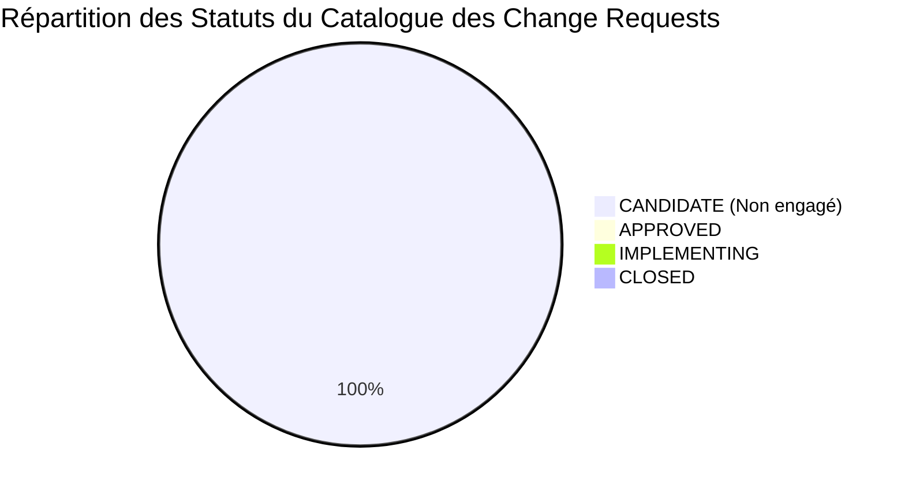

# BOKENGI GROUP 2.0 — RAPPORT DE CONFORMITÉ & CONTRÔLE DE GOUVERNANCE POST-CLÔTURE

**Date du Contrôle :** 26 Septembre 2026  
**Type de Revue :** Contrôle de Gouvernance & Intégrité Post-Clôture  
**Baseline Canonique :** Phase 10.8 (`PHASE10_8_PRODUCTION_ACTIVATION.md`)  
**Statut Global :** 🟢 **100% CONFORME & FIGÉ (ZÉRO DÉVIATION)**  
**Classification :** Rapport de Contrôle SRE / SecOps & Gouvernance d'Entreprise  

---

## 1. TABLEAU DES 10 CONTRÔLES DE GOUVERNANCE

| # | Règle / Point de Contrôle de Gouvernance | Constat & Vérification Technique | Résultat |
| :---: | :--- | :--- | :---: |
| **1** | **Absence de Modification de Code** | Aucune modification de code applicatif (`src/`, `frappe_apps/`) n'a été effectuée. | **CONFORME** |
| **2** | **Absence de Déploiement** | Aucun déploiement Cloudflare Workers, GitHub Actions ou Frappe n'a été déclenché. | **CONFORME** |
| **3** | **Absence de Nouvelle Phase 10.x** | Aucune sous-phase 10.x n'a été créée. Le programme initial est définitivement clos. | **CONFORME** |
| **4** | **Préservation de la Baseline Phase 10.8** | La Phase 10.8 demeure la seule et unique baseline de référence officielle et certifiée. | **CONFORME** |
| **5** | **Statut des Change Requests (CR-01 à CR-06)** | 100% des 6 demandes (`CR-01` à `CR-06`) sont strictement enregistrées au statut **`CANDIDATE`**. | **CONFORME** |
| **6** | **Absence d'Approbation Implicite de CR** | Aucune CR n'est passée ou considérée comme `APPROVED`, `IMPLEMENTING`, `VALIDATED` ou `CLOSED`. | **CONFORME** |
| **7** | **Confinement Superset (Strictement READ-ONLY)** | Apache Superset est documenté et confiné exclusivement en lecture seule sur les vues d'exposition. | **CONFORME** |
| **8** | **Intégrité du Verrou Anti-Facturation Automatique** | 0 route d'émission automatique. Soumission de `Sales Invoice` restreinte à la validation humaine Desk. | **CONFORME** |
| **9** | **Autorité Exclusive sur les 4 Arbitrages Financiers** | Tarifs, Naming Series, IBAN officiel et Conditions de règlement sont maintenus sous **`FINANCIAL GOVERNANCE HOLD`**. | **CONFORME** |
| **10** | **Exclusion Totale & Étanche d'InfraPulse** | InfraPulse est formellement absent de tous les flux, schémas, dépendances et documents Bokengi Group. | **CONFORME** |

---

## 2. ÉTAT DU REGISTRE DES CHANGE REQUESTS



- **`CR-CANDIDATE-01` (Umami Analytics) :** `CANDIDATE`
- **`CR-CANDIDATE-02` (OpenStatus) :** `CANDIDATE`
- **`CR-CANDIDATE-03` (Circuit Financier) :** `CANDIDATE`
- **`CR-CANDIDATE-04` (Delivery par Pôle) :** `CANDIDATE`
- **`CR-CANDIDATE-05` (Facturation Électronique Factur-X) :** `CANDIDATE`
- **`CR-CANDIDATE-06` (BI Direction / Superset) :** `CANDIDATE`

---

## 3. ATTESTATION OFFICIELLE DE CONFORMITÉ

```text
================================================================================
POST-CLOSURE BASELINE INTACT
NO CHANGE REQUEST AUTHORIZED
NO CODE CHANGE
NO DEPLOYMENT
PHASE 10.8 REMAINS CANONICAL
================================================================================
```
