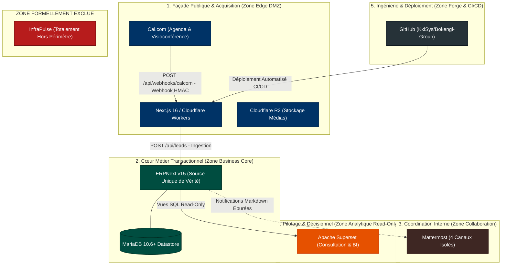

# BOKENGI GROUP 2.0 — FRONTIÈRES APPLICATIVES & MATRICE DES RESPONSABILITÉS

**Date d'élaboration :** 26 Septembre 2026  
**Version :** 2.0.0 — Post-Closure Architecture Governance  
**Baseline de Référence :** Phase 10.8 (`PHASE10_8_PRODUCTION_ACTIVATION.md`)  
**Statut :** 🟢 **CADRE D'ÉTANCHÉITÉ & FRONTIÈRES FIGÉES**  
**Classification :** Architecture d'Entreprise & Règles d'Isolation des Systèmes  

---

## 1. CARTOGRAPHIE DES FRONTIÈRES DU SYSTÈME D'INFORMATION

Le système d'information de **Bokengi Group 2.0** repose sur des frontières strictes d'étanchéité garantissant qu'aucun composant ne déborde de ses prérogatives métier ou techniques :

---

## 2. DÉFINITION DES FRONTIÈRES ET INTERDICTIONS PAR COMPOSANT

---

### 2.1. ERPNext v15 — Business Core (Source de Vérité)
- **Ce qu'il possède (Owner) :**
  - Référentiel complet des Tiers : Prospects (`Lead`), Demandes d'accès, Clients (`Customer`), Contacts (`Contact`), Adresses.
  - Pièces Commerciales & Comptables : Devis (`Quotation`), Commandes (`Sales Order`), Factures de vente (`Sales Invoice`), Écritures de règlement (`Payment Entry`), Grand Livre, TVA.
  - Catalogue des 20 Prestations de services (`Item` `SRV-*`) et 5 Pôles d'expertise (`Bokengi Pole`).
  - Projets, Tâches et Feuilles de temps (`Timesheet`).
  - CMS Headless pour les articles de blog et études de cas.
- **Ce qu'il consomme (Consumer) :**
  - Données d'ingestion Lead relayées par l'API Edge Next.js (`POST /api/leads`).
  - Données de réservation d'agenda Cal.com rattachées par le webhook.
- **Ce qu'il ne doit JAMAIS faire (Interdictions Absolues) :**
  - 🔴 **N'émet ni ne soumet JAMAIS de `Sales Invoice` de façon automatisée sans validation humaine dans Desk.**
  - N'expose aucun endpoint public en écriture sans proxy d'authentification API sécurisé.
  - Ne stocke pas de fichiers médias bruts lourds (délégués à Cloudflare R2).

---

### 2.2. Next.js 16 / Cloudflare Workers — Façade Publique & Acquisition
- **Ce qu'il possède (Owner) :**
  - Code de rendu des pages institutionnelles bilingues (FR/EN).
  - Logique de sécurisation Edge des formulaires (Rate limiting mémoire 6 req/min/IP, Honeypot anti-spam `website`).
  - Logique de vérification cryptographique des webhooks Cal.com (HMAC SHA-256 avec `timingSafeEqual`).
- **Ce qu'il consomme (Consumer) :**
  - Contenus publics exposés par l'API REST ERPNext (filtrés sur `is_published = 1`).
  - Images et médias distribués par Cloudflare R2 (`bokengi-media`).
- **Ce qu'il ne doit JAMAIS faire (Interdictions Absolues) :**
  - 🔴 **Ne contient AUCUNE logique financière, comptable ou de facturation.**
  - Ne stocke aucune donnée client persistante dans son runtime Edge.
  - Ne transmet aucune donnée bancaire ou secrète aux navigateurs des visiteurs.

---

### 2.3. Mattermost — Collaboration Core & Notifications
- **Ce qu'il possède (Owner) :**
  - Historique des discussions internes et coordination des équipes opérationnelles.
  - Canaux spécialisés (`#commercial-leads`, `#commercial-ventes`, `#finance-tresorerie`, `#ops-alertes`).
- **Ce qu'il consomme (Consumer) :**
  - Événements opérationnels synthétiques et alertes système transmis par ERPNext et Next.js.
- **Ce qu'il ne doit JAMAIS faire (Interdictions Absolues) :**
  - 🔴 **N'est JAMAIS une source de vérité, ni un CRM, ni une base de données légale.**
  - 🔴 **Une notification Mattermost n'est JAMAIS une autorisation comptable.**
  - 🔴 **Ne reçoit AUCUN IBAN, code BIC/SWIFT, mot de passe, token API ou pièce d'identité (filtrage strict RGPD obligatoire).**

---

### 2.4. Cal.com — Module de Réservation & Visioconférence
- **Ce qu'il possède (Owner) :**
  - Disponibilités des consultants et calendrier de prise de rendez-vous de cadrage technique.
- **Ce qu'il consomme (Consumer) :**
  - Saisie du créneau par le prospect sur `cal.com/bokengi-group`.
- **Ce qu'il ne doit JAMAIS faire (Interdictions Absolues) :**
  - Ne qualifie pas juridiquement ni financièrement les prospects.
  - N'intervient pas dans la contractualisation ou l'émission de devis.

---

### 2.5. Cloudflare R2 — Stockage Objet Immuable
- **Ce qu'il possède (Owner) :**
  - Fichiers binaires médias, visuels, captures d'études de cas et documents publics (`bokengi-media`).
- **Ce qu'il consomme (Consumer) :**
  - Fichiers téléversés par l'équipe via Desk ou script d'import.
- **Ce qu'il ne doit JAMAIS faire (Interdictions Absolues) :**
  - N'exécute aucun code applicatif ni traitement logique.

---

### 2.6. Apache Superset — Pilotage BI & Décisionnel (Zone Analytique)
- **Ce qu'il possède (Owner) :**
  - Définitions de tableaux de bord, graphiques analytiques, métriques calculées et dashboards exécutifs.
- **Ce qu'il consomme (Consumer) :**
  - Vues SQL d'exposition en lecture seule (`Read-Only`) sur la base ERPNext.
- **Ce qu'il ne doit JAMAIS faire (Interdictions Absolues) :**
  - 🔴 **N'est JAMAIS une source de vérité transactionnelle.**
  - 🔴 **N'exécute AUCUNE écriture, modification ou suppression dans la base de données ERPNext.**

---

### 2.7. InfraPulse — Hors Périmètre Formel
- **Statut :** **TOTALEMENT HORS PÉRIMÈTRE**.
- **Règle absolue :** N'intervient dans aucun schéma de données, aucune route API, aucun webhook, aucune dépendance technique ni aucun processus métier de Bokengi Group 2.0.

---

## 3. MATRICE SYNTHÉTIQUE DES RESPONSABILITÉS

| Responsabilité Métier / Technique | ERPNext v15 | Next.js (CF) | Mattermost | Cal.com | R2 | Superset BI |
| :--- | :---: | :---: | :---: | :---: | :---: | :---: |
| **Source Unique de Vérité (Master Data)** | **OUI (100%)** | Non | Non | Non | Non | Non |
| **Ingestion Formulaire Web** | Récepteur final | **Passerelle Edge** | Récepteur notif | - | - | - |
| **Prise de Rendez-vous** | Récepteur | Passerelle HMAC | Récepteur notif | **Émetteur** | - | - |
| **Qualification Commerciale** | **Desk (Humain)** | - | Notification | - | - | - |
| **Chiffrage & Devis (Quotation)** | **Desk (Humain)** | - | Notification | - | - | - |
| **Engagement Commande (Sales Order)** | **Desk (Humain)** | - | Notification | - | - | - |
| **Planification Projet & Timesheet** | **Desk (Projets)** | - | - | - | - | - |
| **Facturation (Sales Invoice)** | **Desk (Humain)** | 🔴 Interdit | Notification | 🔴 Interdit | - | 🔴 Interdit |
| **Rapprochement Bancaire** | **Desk (Finance)** | - | - | - | - | - |
| **Tableaux de Bord Stratégiques** | Données sources | - | - | - | - | **Restitution** |
