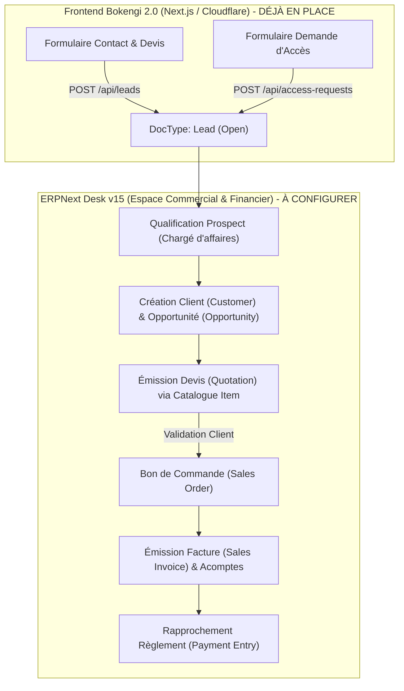

# BOKENGI 2.0 — RAPPORT D'ÉTAT & REPRISE DU PLAN ERPNEXT MÉTIER
**Référence :** `ERPNext_NEXT_PHASE_AUDIT.md`  
**Date :** 26 Septembre 2026  
**Commit de référence codebase :** `e9d79ad`  
**Statut du socle technique :** 🟢 **TERMINÉ, VALIDÉ ET DÉPLOYÉ EN PRODUCTION**  

---

## 1. SOMMAIRE EXÉCUTIF & OBJECTIF DE L'AUDIT

Le socle technique de **Bokengi Group 2.0** (Next.js 16 App Router bilingue, client REST ERPNext v15, Cloudflare R2, formulaires sécurisés, Cal.com actif, CI/CD GitHub Actions → Cloudflare Workers) est intégralement déployé et validé en production (commits `29db89a`, `f28dd61`, `eda8685`, `e9d79ad`).

Cet audit a pour objectif exclusif de **cartographier l'état exact du plan ERPNext métier**, de comparer les réalisations avec les engagements initiaux (notamment le flux commercial *Lead → Qualification/Opportunité → Devis commercial → Facturation*), d'identifier les étapes restantes et les dépendances, et de proposer le prochain jalon ordonné, **sans modifier le code source, sans altérer la production et sans inventer de décision métier**.

---

## 2. ÉTAT ACTUEL DU SOCLE ERPNEXT (CE QUI EST DÉJÀ VALIDÉ)

L'inventaire technique et fonctionnel démontre que les fondations ERPNext sont entièrement stabilisées :

| Composant / Fonctionnalité | Implémentation / Fichier source | Preuve & Commit de validation | Statut |
| :--- | :--- | :--- | :---: |
| **Client REST ERPNext v15** | [`src/lib/erpnext-client.ts`](file:///E:/01_Projets/Actifs/Bokengi-group/src/lib/erpnext-client.ts) | Typage TypeScript strict, gestion des headers d'authentification API Token, injection Cloudflare Context (`Symbol.for('__cloudflare-context__')`), fallback résilient. | ✅ Validé en prod |
| **DocTypes Headless CMS (Contenus)** | [`frappe_apps/bokengi_erp/`](file:///E:/01_Projets/Actifs/Bokengi-group/frappe_apps/bokengi_erp/) & [`tests/erpnext-schema-verification.test.ts`](file:///E:/01_Projets/Actifs/Bokengi-group/tests/erpnext-schema-verification.test.ts) | 10 DocTypes modélisés (`bokengi_pole`, `bokengi_service`, `bokengi_case_study`, `bokengi_post`, `bokengi_settings` + 5 child tables) avec parité bilingue stricte FR/EN. | ✅ Validé en prod |
| **Capture & Ingestion des Leads CRM** | [`src/app/api/leads/route.ts`](file:///E:/01_Projets/Actifs/Bokengi-group/src/app/api/leads/route.ts) | Rate-limiting (6 req/min/IP), honeypot anti-bot invisible, transmission directe au DocType standard `Lead` d'ERPNext, notification email asynchrone (commit `bc4c246`). | ✅ Validé en prod |
| **Demandes d'accès sécurisées** | [`src/app/api/access-requests/route.ts`](file:///E:/01_Projets/Actifs/Bokengi-group/src/app/api/access-requests/route.ts) & [`docs/PHASE7_6_ACCESS_REQUESTS_ERPNEXT.md`](file:///E:/01_Projets/Actifs/Bokengi-group/docs/PHASE7_6_ACCESS_REQUESTS_ERPNEXT.md) | Formulaire `/[locale]/demande-acces`, protection contre l'escalade de privilèges (`super-admin`), routage vers le DocType `Lead` sous qualification d'habilitation interne (commit `14c0e96`). | ✅ Validé en prod |
| **Custom Fields ERPNext** | [`scripts/erpnext/custom_fields.json`](file:///E:/01_Projets/Actifs/Bokengi-group/scripts/erpnext/custom_fields.json) & [`frappe_apps/bokengi_erp/bokengi_erp/fixtures/custom_field.json`](file:///E:/01_Projets/Actifs/Bokengi-group/frappe_apps/bokengi_erp/bokengi_erp/fixtures/custom_field.json) | Définition des champs personnalisés pour `Lead`, `File`, `Quotation`, `Sales Invoice` (`custom_payload_id`, `custom_pole`, `custom_lead_link`, `custom_invoice_number`). | ✅ Spécifié & packagé |
| **Cadrage du flux commercial 7.7** | [`docs/PHASE7_7_COMMERCIAL_FLOW_ERPNEXT.md`](file:///E:/01_Projets/Actifs/Bokengi-group/docs/PHASE7_7_COMMERCIAL_FLOW_ERPNEXT.md) | Définition formelle du cycle `Lead → Opportunity → Customer → Quotation → Sales Order → Sales Invoice → Payment Entry` avec interdiction de facturation automatique non supervisée (commit `ea55d3e`). | ✅ Cadré & documenté |
| **Décommissionnement Payload CMS** | [`docs/PAYLOAD_TO_ERPNEXT_FINAL_DECOMMISSIONING_AUDIT.md`](file:///E:/01_Projets/Actifs/Bokengi-group/docs/PAYLOAD_TO_ERPNEXT_FINAL_DECOMMISSIONING_AUDIT.md) | 0 dépendance Payload / Neon / Hyperdrive résiduelle. | ✅ Validé en prod |
| **Fallback SSG & Données Seed** | [`src/data/bokengi-seed-data.ts`](file:///E:/01_Projets/Actifs/Bokengi-group/src/data/bokengi-seed-data.ts) | Pré-rendu statique autonome résilient en environnement de build sans DNS externe (commit `e321263`). | ✅ Validé en prod |

---

## 3. CORRESPONDANCE AVEC LE PLAN HISTORIQUE

| Phase / Étape | Intitulé dans le plan | Statut Réel | Preuve Documentaire |
| :--- | :--- | :---: | :--- |
| **Phases 1 à 6** | Décommissionnement Payload → ERPNext | **100% Terminé** | `docs/PAYLOAD_TO_ERPNEXT_PHASE*.md` |
| **Phase 7.1** | CRM Leads & Notifications Email | **100% Terminé** | `docs/PHASE7_1_LEAD_EMAIL_NOTIFICATIONS.md` |
| **Phase 7.2** | Intégration Cal.com | **100% Terminé** | `docs/PHASE7_2_CALCOM_INTEGRATION.md` + commit `f28dd61` |
| **Phase 7.3** | Monitoring OpenStatus (Standby) | **100% Prêt** | `docs/PHASE7_3_OPENSTATUS_MONITORING.md` |
| **Phase 7.4** | Analytics Umami (Standby) | **100% Prêt** | `docs/PHASE7_4_UMAMI_ANALYTICS.md` |
| **Phase 7.5** | SEO Avancé (Sitemap Dynamique & Robots.txt) | **100% Terminé** | `docs/PHASE7_5_ADVANCED_SEO.md` |
| **Phase 7.6** | Demandes d'accès connectées à ERPNext | **100% Terminé** | `docs/PHASE7_6_ACCESS_REQUESTS_ERPNEXT.md` |
| **Phase 7.7** | Cadrage du Tunnel Commercial Quotation → Invoice | **Cadré (Documenté)** | `docs/PHASE7_7_COMMERCIAL_FLOW_ERPNEXT.md` |
| **Phase 8.0 / 8.1** | Audit Pré-production, Coordonnées & Déploiement | **100% Terminé** | `docs/PHASE8_0_PRE_PRODUCTION_AUDIT.md`, commits `29db89a` / `e9d79ad` |

---

## 4. FONCTIONNALITÉS RESTANTES DU PLAN ERPNEXT MÉTIER

Si le **câblage technique frontend/API** et le **cadrage théorique (Phase 7.7)** sont achevés, les étapes d'**initialisation et de configuration métier effective dans ERPNext Desk** constituent les éléments restants :

### 4.1. Configuration de la Société & Paramètres Fiscaux (ERPNext Desk)
- **Création de la société légale :** `Bokengi Group` (Forme juridique : `TPE`, Capital social : `7 500 €`, Siège : `Paris, France`).
- **Plan de comptes (Chart of Accounts) :** Comptes de produits pour prestations intellectuelles et informatiques.
- **TVA & Taxes :** Modèles de taxes selon le régime fiscal applicable.
- **Devises :** Configuration des devises autorisées : Euro (`EUR`), Franc CFA (`XAF`), Dollar US (`USD`).

### 4.2. Configuration du Catalogue d'Articles (`Item`)
- **Instanciation des 20 services Bokengi sous forme d'articles standards ERPNext :**
  - Pôle IT & Sécurité : `SRV-IT-*` (Audit de sécurité, Infogérance, Architecture cloud, etc.)
  - Pôle Digital & Web : `SRV-DIG-*` (Développement Next.js, API & ERP, UX/UI, etc.)
  - Pôle Business Operations : `SRV-BUS-*` (Assistance opérationnelle, Gestion documentaire, etc.)
  - Pôle Conseil & Stratégie : `SRV-CON-*` (Schéma directeur, Audit SI, AMOA, etc.)
  - Pôle Événements & Médias : `SRV-EVT-*` (Régie technique, Digitalisation, etc.)

### 4.3. Modèles d'Impression Officiels (Print Formats PDF)
- **Print Format pour `Quotation` (Devis officiel) :**
  - En-tête avec logo officiel Bokengi Group.
  - Coordonnées officielles : `contact@bokengi-group.com`, `+33 7 58 88 84 34`.
  - Mentions légales : Paris, France, Capital 7 500 €, forme TPE.
  - Durée de validité standard (30 jours) et conditions de règlement (ex. 40% acompte, 30% étape, 30% solde).
- **Print Format pour `Sales Invoice` (Facture de vente) :**
  - Numérotation légale séquentielle immuable (`FAC-YYYY-XXXXX`).
  - Coordonnées bancaires (IBAN/BIC) de Bokengi Group.
  - Mentions légales et fiscales obligatoires.

### 4.4. Séries de Numérotation (`Naming Series`)
- Devis : `DEV-.YYYY.-.#####` ou `QTN-.YYYY.-.#####`
- Factures de vente : `FAC-.YYYY.-.#####` ou `SINV-.YYYY.-.#####`
- Commandes : `CMD-.YYYY.-.#####` ou `SO-.YYYY.-.#####`

---

## 5. DÉPENDANCES & MATRICE DE RESPONSABILITÉ

### Dépendances Bokengi Frontend :
- **AUCUNE NOUVELLE DÉVELOPPEMENT REQUIS SUR LE FRONTEND :** Conformément à la règle de sécurité et au cadrage Phase 7.7, aucun tunnel de facturation direct ou automatique n'est exposé côté public. Le frontend alimente le DocType `Lead`, ce qui est déjà opérationnel en production.

### Dépendances ERPNext Backend :
- Déploiement des `Custom Fields` de liaison (`custom_lead_link`, `custom_invoice_number`) sur `Quotation` et `Sales Invoice` via l'API ou l'app Frappe.
- Paramétrage de la société, des articles, des séries et des modèles d'impression.

---

## 6. ANALYSE DES RISQUES & GARDE-FOUS

| Risque identifié | Niveau de gravité | Mesure de mitigation / Règle stricte |
| :--- | :---: | :--- |
| **Génération automatique de factures sans contrôle humain** | **CRITIQUE** | **Interdiction absolue :** Toute émission de devis ou de facture doit être manuellement créée, vérifiée et soumise (`Submitted`) par un gestionnaire habilité dans ERPNext Desk. |
| **Incohérence des informations institutionnelles sur les devis/factures** | **ÉLEVÉ** | Les modèles d'impression ERPNext doivent reprendre strictement la source de vérité validée (Bokengi Group, TPE, Capital 7 500 €, Paris France, `contact@bokengi-group.com`, `+33 7 58 88 84 34`). |
| **Altération des pièces comptables après soumission** | **ÉLEVÉ** | Verrouillage standard Frappe/ERPNext : une `Sales Invoice` soumise est immuable et ne peut faire l'objet que d'un `Credit Note`. |
| **Exposition de secrets financiers côté client** | **CRITIQUE** | Aucun compte bancaire, grille tarifaire interne ou token de paiement n'est présent dans le code source Next.js. |

---

## 7. POINTS D'ARBITRAGE : « À VALIDER PAR LE PROPRIÉTAIRE »

Conformément à la règle de gouvernance interdisant d'inventer des décisions métier, les éléments suivants doivent être formellement fournis ou arbitrés par le propriétaire du projet :

1. **Grille tarifaire de référence du catalogue `Item` :**
   - Tarifs forfaits ou Taux Journaliers Moyens (TJM) par pôle/service pour le catalogue `Item` (ou choix d'un prix libre/personnalisé par devis).
   - `[À VALIDER PAR LE PROPRIÉTAIRE]`

2. **Format exact de la numérotation des pièces commerciales :**
   - Préfixe souhaité pour les devis (ex: `DEV-2026-XXXXX` vs `QTN-2026-XXXXX`).
   - Préfixe souhaité pour les factures (ex: `FAC-2026-XXXXX` vs `SINV-2026-XXXXX`).
   - `[À VALIDER PAR LE PROPRIÉTAIRE]`

3. **Coordonnées bancaires pour les factures de vente :**
   - Titulaire du compte, Banque, IBAN, BIC / SWIFT à afficher sur les modèles d'impression PDF.
   - `[À VALIDER PAR LE PROPRIÉTAIRE]`

4. **Conditions générales de vente & d'acompte :**
   - Échéancier type (ex: Acompte 40% commande, 30% livraison intermédiaire, 30% recette finale) ou conditions personnalisées.
   - `[À VALIDER PAR LE PROPRIÉTAIRE]`

---

## 8. PROPOSITION DE PROCHAINE PHASE : PHASE 9.0

Compte tenu de l'état actuel (socle technique et frontend 100% opérationnels en production) :

> ### **PHASE 9.0 — CONFIGURATION & INITIALISATION DU MODULE COMMERCIAL DANS ERPNEXT DESK**
> 
> **Objectifs :**
> 1. Déployer les `Custom Fields` de liaison commerciale (`Quotation` et `Sales Invoice`) sur l'instance ERPNext.
> 2. Configurer la Société légale `Bokengi Group` avec ses données institutionnelles validées.
> 3. Créer les 20 articles de services (`Item`) du catalogue Bokengi Group par pôle.
> 4. Créer les modèles d'impression officiels (Print Formats Devis & Factures) aux couleurs et coordonnées du Groupe.
> 5. Réaliser un test de bout en bout dans ERPNext Desk : *Lead web reçu → Conversion en Opportunité/Client → Création Devis PDF → Simulation Commande & Facture*.
