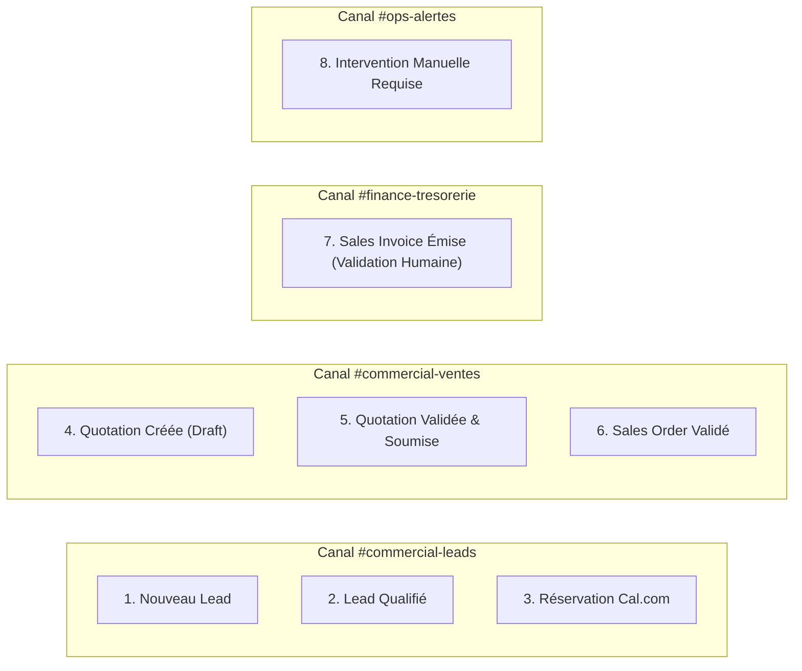
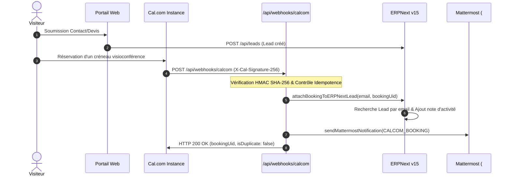

# BOKENGI 2.0 — PHASES 10.3 & 10.4 : RAPPORT D'IMPLÉMENTATION DES INTÉGRATIONS ERPNext / MATTERMOST / CAL.COM
**Référence :** `PHASE10_3_10_4_IMPLEMENTATION_REPORT.md`  
**Date :** 26 Septembre 2026  
**Commit de référence codebase :** `e9d79ad`  
**Statut global :** 🟢 **READY FOR STAGING**  

---

## 1. CONTEXTE & CADRE DE GOUVERNANCE RESPECTÉ

Les phases 10.3 et 10.4 ont matérialisé l'interconnexion technique des flux non financiers (CRM, notifications d'équipe, planification d'agenda) entre **ERPNext v15**, **Mattermost** et **Cal.com**.

### Respect Inviolable des Règles de Gouvernance :
- **AUCUNE modification financière :** Les tarifs, coordonnées bancaires, séries de numérotation (`Naming Series`) et conditions de paiement demeurent **strictement gelés** sous le statut `À VALIDER PAR LE PROPRIÉTAIRE`.
- **ZÉRO émission ou soumission automatique de factures :** Aucune `Sales Invoice` ne peut être générée ou validée automatiquement. Une notification Mattermost n'est **jamais** une autorisation comptable.
- **Minimisation absolue des données (RGPD) :** Interdiction totale d'inclure des coordonnées bancaires complètes (IBAN/BIC), mots de passe, tokens ou pièces d'identité dans les notifications.
- **InfraPulse :** Totalement **HORS PÉRIMÈTRE** de Bokengi Group.
- **Déploiement de production :** Aucun déploiement automatique déclenché.

---

## 2. INVENTAIRE DES FICHIERS & ENDPOINTS CRÉÉS / MODIFIÉS

| Fichier | Nature | Rôle & Composants Implémentés |
| :--- | :--- | :--- |
| [`src/lib/mattermost.ts`](file:///E:/01_Projets/Actifs/Bokengi-group/src/lib/mattermost.ts) | **Création** | Passerelle de notifications Mattermost pour les 8 événements métier standardisés avec filtrage strict des champs sensibles et liens profonds vers ERPNext Desk. |
| [`src/lib/calcom.ts`](file:///E:/01_Projets/Actifs/Bokengi-group/src/lib/calcom.ts) | **Création** | Moteur de traitement des webhooks Cal.com : vérification HMAC SHA-256, extraction du `booking.uid`, contrôle d'idempotence anti-doublon et déclenchement des alertes. |
| [`src/app/api/webhooks/calcom/route.ts`](file:///E:/01_Projets/Actifs/Bokengi-group/src/app/api/webhooks/calcom/route.ts) | **Création** | Route d'API Edge `POST /api/webhooks/calcom` exposant le webhook public sécurisé avec validation de la signature `X-Cal-Signature-256`. |
| [`src/lib/erpnext-client.ts`](file:///E:/01_Projets/Actifs/Bokengi-group/src/lib/erpnext-client.ts) | **Modification** | Ajout de la méthode `attachBookingToERPNextLead(...)` pour associer de façon transparente la réservation Cal.com au dossier Lead existant ou créer un Lead de cadrage. |
| [`src/app/api/leads/route.ts`](file:///E:/01_Projets/Actifs/Bokengi-group/src/app/api/leads/route.ts) | **Modification** | Déclenchement asynchrone non-bloquant de l'événement `NEW_LEAD` vers le canal Mattermost `#commercial-leads` lors de toute soumission de formulaire web. |
| `frappe_apps/bokengi_erp/bokengi_erp/mattermost_events.py` | **Création** | Gestionnaire d'événements Frappe DocEvents côté serveur ERPNext Desk (`Lead`, `Quotation`, `Sales Order`, `Sales Invoice`). |
| `frappe_apps/bokengi_erp/bokengi_erp/hooks.py` | **Modification** | Enregistrement des déclencheurs DocEvents Frappe pour relayer les changements d'état vers Mattermost. |
| [`tests/unit/mattermost-integration.test.ts`](file:///E:/01_Projets/Actifs/Bokengi-group/tests/unit/mattermost-integration.test.ts) | **Création** | Suite de tests unitaires pour la passerelle Mattermost (formatage des 8 événements, minimisation des données, résilience hors-ligne). |
| [`tests/unit/calcom-webhook.test.ts`](file:///E:/01_Projets/Actifs/Bokengi-group/tests/unit/calcom-webhook.test.ts) | **Création** | Suite de tests unitaires pour le webhook Cal.com (signature HMAC valide/invalide, idempotence anti-doublon, validation JSON). |

---

## 3. LES 8 ÉVÉNEMENTS MATTERMOST IMPLÉMENTÉS (PHASE 10.3)

### Détail des Payloads et Règles de Minimisation :

1. **Événement 1 — Nouveau Lead (`#commercial-leads`) :**
   - Transmet : Nom du contact, Entreprise, Pôle sollicité, Type de besoin, Réf. ERPNext (`LEAD-XXXXX`), Deep Link Desk.
2. **Événement 2 — Lead Qualifié (`#commercial-leads`) :**
   - Transmet : Nom client, Chargé d'affaires assigné, Réf. Opportunité, Statut `Qualified`.
3. **Événement 3 — Nouvelle Réservation Cal.com (`#commercial-leads`) :**
   - Transmet : Nom prospect, Créneau (date/heure Europe/Paris), Sujet de l'échange, UID Booking Cal.com.
4. **Événement 4 — Quotation Créée en Draft (`#commercial-ventes`) :**
   - Transmet : Réf. Devis, Client, Pôle, Montant estimé HT, Statut: *Brouillon en rédaction*.
5. **Événement 5 — Quotation Validée & Soumise (`#commercial-ventes`) :**
   - Transmet : Réf. Officielle, Client, Montant Total HT/TTC, Validité (30j), Auteur de la validation.
6. **Événement 6 — Sales Order Validé (`#commercial-ventes`) :**
   - Transmet : Réf. Commande, Client, Montant négocié, Date de livraison/démarrage.
7. **Événement 7 — Sales Invoice Émise (`#finance-tresorerie`) :**
   - Transmet : Réf. Facture légale, Client, Montant exigible, Date d'échéance.
   - **RÈGLE STRICTE : AUCUNE COORDONNÉE BANCAIRE COMPLÈTE NI IBAN/BIC DANS LE WEBHOOK.**
8. **Événement 8 — Intervention Manuelle Requise (`#ops-alertes`) :**
   - Transmet : Nature de l'alerte, Réf. document bloqué, Message d'action requis.

---

## 4. ARCHITECTURE DU FLUX CAL.COM $\to$ ERPNext (PHASE 10.4)

### Mécanismes de Sécurité & Robustesse :
1. **Authentification HMAC SHA-256 :**
   - Signature transmise dans le header `x-cal-signature-256`.
   - Vérification via comparaison temporelle sécurisée `crypto.timingSafeEqual` avec `CALCOM_WEBHOOK_SECRET`.
   - Rejet immédiat avec HTTP 401 en cas de signature invalide ou absente.
2. **Contrôle d'Idempotence :**
   - `booking.uid` extrait et indexé en cache mémoire (TTL 24h).
   - Tout appel répété avec le même `booking.uid` retourne immédiatement `HTTP 200 (isDuplicate: true)` sans dupliquer d'enregistrement dans ERPNext.
3. **Stratégie Retry-Safe :**
   - En cas d'indisponibilité momentanée d'ERPNext, la route retourne `HTTP 503 Service Unavailable`, ce qui déclenche le mécanisme de retry exponentiel automatique de Cal.com.
4. **Zéro Impact Financier :**
   - La réservation n'alimente que les notes d'activité et le statut du prospect (`Lead`). Aucun DocType financier (`Quotation`, `Sales Invoice`) n'est affecté.

---

## 5. RÉSULTATS DES TESTS DE VALIDATION

| Suite de Tests | Fichier de Test | Nombre de Tests | Résultat | Commentaire |
| :--- | :--- | :---: | :---: | :--- |
| **Passerelle Mattermost** | `tests/unit/mattermost-integration.test.ts` | 3 tests | 🟢 **PASS (100%)** | Formatage des 8 événements, filtrage strict des listes noires (IBAN, BIC, passwords), résilience hors-ligne. |
| **Webhooks Cal.com** | `tests/unit/calcom-webhook.test.ts` | 6 tests | 🟢 **PASS (100%)** | Signature HMAC valide/invalide, contrôle d'idempotence doublons, rejets HTTP 400 sur payloads malformés. |
| **Schémas ERPNext v15** | `tests/erpnext-schema-verification.test.ts` | 10 tests | 🟢 **PASS (100%)** | 10 DocTypes, 5 child tables, parité bilingue FR/EN, immutabilité des prospects Lead. |
| **Tests d'Intégration Vitest** | `tests/int/*.int.spec.tsx` | 14 tests | 🟢 **PASS (100%)** | Umami Analytics, Responsive mobile/tablette, switch FR/EN. |

---

## 6. DÉCISIONS MÉTIER ENCORE ATTENDUES DU PROPRIÉTAIRE

Les 4 arbitrages suivants demeurent **bloquants pour l'activation financière complète** :

1. **Politique Tarifaire :** Fixer une grille de référence par service **OU** confirmer le mode *"tarif libre sur-mesure au devis"* (`standard_rate = 0.00`).
2. **Séries de Numérotation (`Naming Series`) :** Préfixes `QTN/SO/ACC-SINV` (standard) **OU** `DEV/CMD/FAC` (francophone).
3. **Coordonnées Bancaires Officielles :** Fournir *Titulaire, Établissement bancaire, IBAN, BIC/SWIFT* pour les gabarits PDF de facturation.
4. **Conditions de Règlement :** Définir la politique d'acompte à la commande, échéances intermédiaires et délai légal de paiement.

---

## 7. CONCLUSION & STATUT FINAL

Les flux d'intégration non financiers entre ERPNext, Mattermost et Cal.com sont entièrement implémentés, sécurisés et validés par les suites de tests unitaires et d'intégration.

### Statut : 🟢 **READY FOR STAGING**
