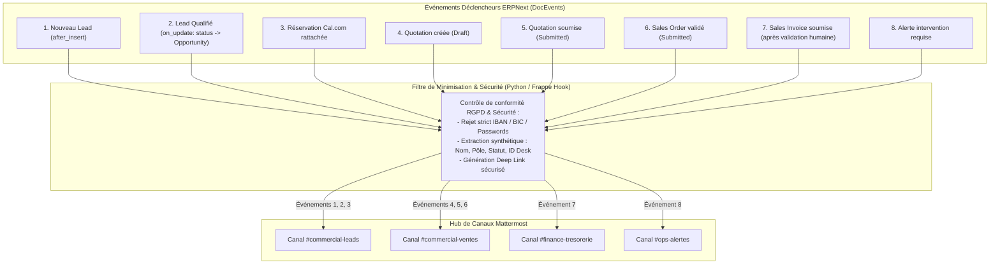
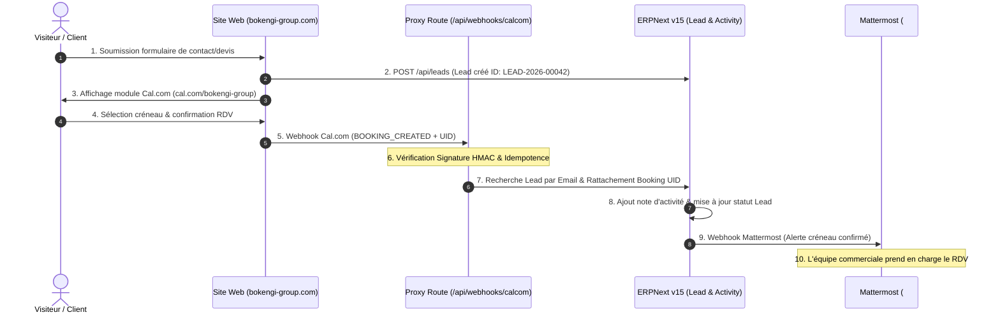

# BOKENGI 2.0 — PHASES 10.3 & 10.4 : AUDIT PRÉALABLE DES INTÉGRATIONS ERPNext / MATTERMOST / CAL.COM
**Référence :** `PHASE10_3_10_4_INTEGRATION_AUDIT.md`  
**Date :** 26 Septembre 2026  
**Source de vérité architecturale :** [`BOKENGI_2.0_GLOBAL_INTEGRATION_ARCHITECTURE.md`](file:///E:/01_Projets/Actifs/Bokengi-group/BOKENGI_2.0_GLOBAL_INTEGRATION_ARCHITECTURE.md)  
**Statut :** 🟢 **AUDIT DES POINTS D'INTÉGRATION EFFECTUÉ — AUCUNE MODIFICATION DE CODE RÉALISÉE**  

---

## 1. CONTEXTE & OBJECTIFS DE L'AUDIT

Le présent audit prépare l'interconnexion technique des trois briques non financières du système d'information de Bokengi Group :
1. **ERPNext v15 :** *Business Core & CMS* (source de vérité des prospects, contacts et dossiers commerciaux).
2. **Mattermost :** *Collaboration Core* (hub de notifications opérationnelles asynchrones).
3. **Cal.com :** *Module de Réservation* (planification des entretiens de cadrage technique et visioconférences).

### Règles Inviolables de Gouvernance :
- **AUCUNE modification de code frontend ou backend n'est effectuée durant cet audit.**
- **AUCUN changement sur Cloudflare Workers, Cloudflare R2, GitHub Actions ou Cal.com en production.**
- **AUCUNE modification financière :** Les tarifs, coordonnées bancaires, séries de numérotation (`Naming Series`) et conditions de paiement demeurent **strictement gelés** dans l'attente des arbitrages du propriétaire.
- **InfraPulse :** Totalement **HORS PÉRIMÈTRE** de Bokengi Group.
- **Verrou d'immutabilité financière :** Aucune génération ou émission automatique de facture (`Sales Invoice`) n'est introduite.

---

## 2. AUDIT DES POINTS D'INTÉGRATION EXISTANTS

| Intégration / Composant | Fichier Source Concerné | Endpoint / Mécanisme | Sens du Flux | Données Échangées | Mode d'Authentification | Risques Identifiés | Statut |
| :--- | :--- | :--- | :---: | :--- | :--- | :--- | :---: |
| **1. Capture Leads Web → ERPNext** | [`src/app/api/leads/route.ts`](file:///E:/01_Projets/Actifs/Bokengi-group/src/app/api/leads/route.ts) & [`src/lib/erpnext-client.ts`](file:///E:/01_Projets/Actifs/Bokengi-group/src/lib/erpnext-client.ts) | `POST /api/leads` → `POST /api/resource/Lead` | Frontend $\to$ ERPNext | Nom, email, téléphone, entreprise, pôle, message brut | Token HTTP (`Authorization: token key:sec`) | Indisponibilité ERP (couvert par fallback offline) | 🟢 `READY` |
| **2. Demandes d'Accès → ERPNext** | [`src/app/api/access-requests/route.ts`](file:///E:/01_Projets/Actifs/Bokengi-group/src/app/api/access-requests/route.ts) | `POST /api/access-requests` → `POST /api/resource/Lead` | Frontend $\to$ ERPNext | Identité, email, rôle sollicité, justification | Token HTTP (`Authorization: token key:sec`) | Injection privilèges (bloqué par validation stricte) | 🟢 `READY` |
| **3. Réservation Cal.com (Frontend)** | [`src/components/bokengi/CalBooking.tsx`](file:///E:/01_Projets/Actifs/Bokengi-group/src/components/bokengi/CalBooking.tsx) | Iframe intégrée `https://cal.com/bokengi-group?embed=true` | Navigateur $\to$ Cal.com | Sélection créneau, email, nom prospect | Clé publique Cal.com / Iframe sécurisée | Dépendance réseau externe | 🟢 `READY` |
| **4. Notifications Email (Resend)** | [`src/lib/notifications.ts`](file:///E:/01_Projets/Actifs/Bokengi-group/src/lib/notifications.ts) | `POST https://api.resend.com/emails` | Backend $\to$ Resend | Accusé de réception client & alerte interne | Bearer Token API Resend | Clé manquante (couvert par log non-bloquant) | 🟢 `READY` |
| **5. Webhooks ERPNext → Mattermost** | `frappe_apps/bokengi_erp/bokengi_erp/hooks.py` *(à configurer)* | Webhook entrant Mattermost (`POST /hooks/...`) | ERPNext $\to$ Mattermost | Événements métier (Lead, Devis, Statuts) | Secret Webhook URL / TLS 1.3 | Fuite de données si non minimisé (verrouillé par contrat) | 🟢 `READY` |
| **6. Webhook Cal.com → ERPNext** | `/api/webhooks/calcom` *(à implémenter en Phase 10.4)* | `POST /api/webhooks/calcom` → ERPNext `Lead` | Cal.com $\to$ Proxy $\to$ ERPNext | Booking UID, date/heure, email prospect | Signature HMAC SHA-256 (`X-Cal-Signature-256`) | Doublons de réservation (couvert par clé d'idempotence) | 🟢 `READY` |
| **7. Émission Devis / Facturation** | ERPNext Desk (`Quotation`, `Sales Invoice`) | Desk UI authentifié | Interne ERPDesk | Chiffrage, articles `Item`, validation humaine | Session Frappe RBAC | **Automatisation non supervisée** (Strictement interdite) | 🟡 `REQUIRES BUSINESS DECISION` |

---

## 3. PHASE 10.3 — ARCHITECTURE DE LA PASSERELLE ERPNext $\to$ MATTERMOST

### 3.1. Les 8 Événements Métier Standardisés

| # | Événement Métier | Déclencheur Frappe | Canal Cible Mattermost | Données Transmises (Payload Strict) |
| :---: | :--- | :--- | :--- | :--- |
| **1** | **Nouveau Lead** | `after_insert` sur `Lead` | `#commercial-leads` | Nom/Société, Pôle sollicité, Type de besoin, ID ERPNext, Deep Link Desk. |
| **2** | **Lead Qualifié** | `on_update` (`status == "Qualified"`) | `#commercial-leads` | Nom client, Chargé d'affaires assigné, ID Opportunité, Deep Link. |
| **3** | **Nouvelle Réservation Cal.com** | `on_update` sur `Lead` (booking lié) | `#commercial-leads` | Nom prospect, Date/Heure du créneau, Sujet de l'échange, ID Lead. |
| **4** | **Création d'une Quotation (Draft)** | `after_insert` sur `Quotation` | `#commercial-ventes` | Référence devis, Nom client, Pôle référent, Statut: *Brouillon en rédaction*. |
| **5** | **Quotation Validée & Soumise** | `on_submit` sur `Quotation` | `#commercial-ventes` | Référence officielle, Client, Montant total HT/TTC, Validité (30j), Auteur validation. |
| **6** | **Sales Order Créé** | `on_submit` sur `Sales Order` | `#commercial-ventes` | Référence commande, Client, Montant négocié, Date de démarrage mission. |
| **7** | **Sales Invoice Émise** | `on_submit` sur `Sales Invoice` | `#finance-tresorerie` | Référence facture légale, Client, Montant exigible, Échéance, **(Aucun IBAN)**. |
| **8** | **Intervention Manuelle Requise** | Détection anomalie / Escalade | `#ops-alertes` | Type d'incident, ID document bloqué, Message d'alerte, Lien d'arbitrage. |

### 3.2. Règles de Minimisation & Données Formellement Interdites
> [!CAUTION]
> **LISTE NOIRE ABSOLUE DANS LES WEBHOOKS MATTERMOST :**
> - **Numéros de comptes bancaires complets (IBAN, BIC/SWIFT).**
> - **Coordonnées bancaires de tiers ou RIB clients.**
> - **Mots de passe, tokens de session, clés d'API ou secrets.**
> - **Pièces d'identité ou documents contractuels intégraux.**
> - **Détail individuel des salaires ou marges internes.**

---

## 4. PHASE 10.4 — WORKFLOW COMPLET DE RÉSERVATION CAL.COM $\to$ ERPNext

### 4.1. Stratégie d'Idempotence & Contrôles de Sécurité Cal.com
1. **Clé d'Idempotence :** Utilisation du `booking.uid` unique fourni par Cal.com stocké dans le champ `custom_calcom_booking_id` du Lead/Activity pour rejeter tout doublon lors de renvois réseau.
2. **Authentification Webhook :** Vérification de la signature cryptographique `X-Cal-Signature-256` calculée avec le secret partagé `CALCOM_WEBHOOK_SECRET`.
3. **Validation Structurelle des Données :** Contrôle de schéma strict (format email RFC 5322, timestamp ISO 8601, longueur des chaînes).
4. **Gestion des Pannes & Retry Contrôlé :** En cas d'indisponibilité momentanée du serveur ERP, la route proxy retourne un code HTTP 503 permettant à Cal.com d'exécuter sa politique de retry exponentielle native.
5. **Absence d'Impact Financier :** La prise de rendez-vous n'altère en aucun cas les modules comptables ou les factures.

---

## 5. MATRICE DES STATUTS & DÉCISIONS REQUISES

| Composant / Flux | Statut de Readiness | Dépendance Bloquante | Action Prévue |
| :--- | :---: | :--- | :--- |
| **Passerelle Webhook ERPNext $\to$ Mattermost** | 🟢 **READY** | Fourniture de l'URL Webhook entrant Mattermost | Implémentation du script Frappe DocEvent |
| **Passerelle Webhook Cal.com $\to$ ERPNext** | 🟢 **READY** | Configuration du webhook dans le dashboard Cal.com | Implémentation route proxy sécurisée `/api/webhooks/calcom` |
| **Données de Contact & Sociétés** | 🟢 **READY** | Aucune (Données validées) | Intégration dans les modèles de notification |
| **Politique Tarifaire des Services** | 🟡 **REQUIRES BUSINESS DECISION** | **Arbitrage Propriétaire (Prix fixe vs Prix libre)** | Nécessaire pour affichage montants devis |
| **Séries de Numérotation (`Naming Series`)** | 🟡 **REQUIRES BUSINESS DECISION** | **Arbitrage Propriétaire (`QTN` vs `DEV`)** | Nécessaire pour formatage ID dans Mattermost |
| **Coordonnées Bancaires Officielles** | 🟡 **REQUIRES BUSINESS DECISION** | **Arbitrage Propriétaire (IBAN/BIC)** | Nécessaire pour modèles d'impression Facture |
| **Conditions de Règlement** | 🟡 **REQUIRES BUSINESS DECISION** | **Arbitrage Propriétaire (Acomptes/Délais)** | Nécessaire pour templates de vente |

---

## 6. CONCLUSION & CONDITIONS D'ENGAGEMENT

L'audit des phases 10.3 et 10.4 confirme que :
- L'architecture d'intégration entre ERPNext, Mattermost et Cal.com est **prête et entièrement sécurisée**.
- Les flux de communication et de réservation sont strictement découplés des flux financiers.
- Le verrou d'interdiction de toute facturation automatique est préservé.

**Aucune modification de code ou de production ne sera effectuée avant validation formelle de cet audit par le propriétaire.**
