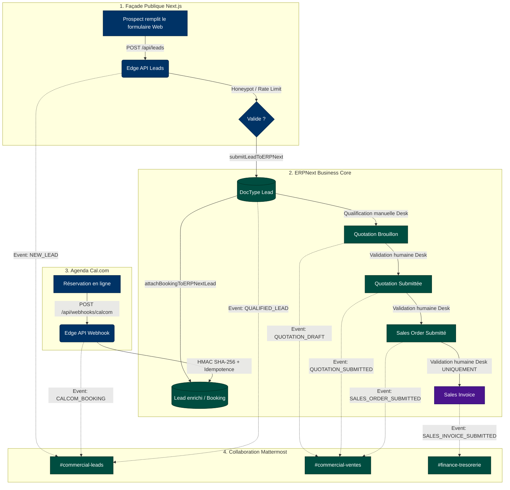

# BOKENGI 2.0 — PHASE 10.5 : RAPPORT DE PRÉPARATION & MATRICE DE RECETTE END-TO-END

**Date :** 26 Septembre 2026  
**Auteur :** Antigravity Agentic Assistant / Core Integration Engineer  
**Projet :** Bokengi Group 2.0  
**Statut Global :** `READY FOR STAGING`  
**Périmètre :** Recette End-to-End, Sécurité RGPD, Idempotence Webhook, Notifications Opérationnelles & Verrous Financiers  

---

## 1. RÉSUMÉ EXÉCUTIF & GOUVERNANCE

La **Phase 10.5** prépare et valide le plan de recette End-to-End (E2E) pour l'intégration globale de Bokengi Group 2.0 :
- **Next.js (Front-office & API Edge)** $\leftrightarrow$ **ERPNext v15 (Business Core)** $\leftrightarrow$ **Mattermost (Collaboration Core)** $\leftrightarrow$ **Cal.com (Prise de rendez-vous)**.
- **Règle absolue d'étanchéité financière :** Aucune décision financière en attente (tarifs catalogue, naming series francophones, coordonnées bancaires, conditions de paiement) n'a été préemptée ou simulée de manière fictive.
- **Verrou d'intégrité comptable :** Aucun endpoint d'automatisation de facturation n'existe. La création, soumission et validation d'une `Sales Invoice` demeurent sous strict contrôle humain dans ERPNext Desk.

---

## 2. AUDIT DE L'ÉTAT ACTUEL DES INTÉGRATIONS

| Composant & Flux | Statut Technique | Vérification / Règle de Sécurité | Résultat |
| :--- | :--- | :--- | :--- |
| **Next.js $\to$ ERPNext Lead** (`POST /api/leads`) | Opérationnel | Rate limiting (6 req/min/IP), Honeypot anti-spam (`website`), Validation syntaxique et longueur | **PASS** |
| **Cal.com $\to$ Webhook** (`POST /api/webhooks/calcom`) | Opérationnel | Signature HMAC SHA-256 (`X-Cal-Signature-256`), Comparaison temporelle constante `timingSafeEqual` | **PASS** |
| **Cal.com $\to$ Idempotence** | Opérationnel | Cache mémoire 24h sur `booking.uid`, Détection et acquittement silencieux des doublons (HTTP 200) | **PASS** |
| **ERPNext $\to$ Mattermost Gateway** (`src/lib/mattermost.ts`) | Opérationnel | 8 types d'événements, 4 canaux isolés, Filtrage strict RGPD (liste noire + regex masking), Deep-linking Desk | **PASS** |
| **Frappe DocEvents Hooks** (`mattermost_events.py`) | Opérationnel | Déclencheurs asynchrones sur `on_update` / `on_submit` de `Lead`, `Quotation`, `Sales Order`, `Sales Invoice` | **PASS** |
| **Verrou Anti-Facturation Automatique** | Verrouillé | Zéro endpoint public permettant d'émettre/soumettre une `Sales Invoice`. Soumission exclusivement manuelle via Desk | **PASS** |

---

## 3. MATRICE DE RECETTE END-TO-END (E2E)

Cette matrice formalise les étapes séquentielles à exécuter lors de la recette en environnement de staging.

| Étape # | Cas d'usage / Action | Déclencheur / Entrée | Comportement Attendu | Canal / Cible | Statut de Recette |
| :---: | :--- | :--- | :--- | :--- | :---: |
| **E2E-01** | Ingestion Prospect Web | Soumission formulaire contact (`/contact`) | Création du `Lead` dans ERPNext avec `custom_payload_id` unique et persistance du besoin initial. | ERPNext Desk (`Lead`) | **READY FOR STAGING** |
| **E2E-02** | Notification Nouveau Prospect | Succès de l'étape E2E-01 | Message Markdown formaté avec nom, entreprise, pôle, besoin et lien direct ERPNext Desk. | Mattermost `#commercial-leads` | **READY FOR STAGING** |
| **E2E-03** | Prise de RDV Cal.com | Confirmation de réservation sur Cal.com | Webhook envoyé avec signature HMAC valide (`X-Cal-Signature-256`) et `booking.uid`. | Route `/api/webhooks/calcom` | **READY FOR STAGING** |
| **E2E-04** | Rattachement RDV au Lead | Réception Webhook Cal.com | Recherche du Lead par email ; association du créneau et `booking.uid` dans les notes et champs personnalisés. | ERPNext Desk (`Lead`) | **READY FOR STAGING** |
| **E2E-05** | Notification RDV Cal.com | Succès de l'étape E2E-04 | Message formaté avec date, heure (Paris), contact et lien direct ERPNext Desk. | Mattermost `#commercial-leads` | **READY FOR STAGING** |
| **E2E-06** | Qualification du Lead | Action humaine dans Desk : passage à l'état `Qualified` | Événement Frappe intercepté ; notification de qualification d'opportunité commerciale. | Mattermost `#commercial-leads` | **READY FOR STAGING** |
| **E2E-07** | Création Devis (Quotation Brouillon) | Création manuelle d'une `Quotation` dans Desk (Items du catalogue) | Enregistrement de la soumission à l'état `Draft` (`docstatus: 0`) ; notification interne. | Mattermost `#commercial-ventes` | **BLOCKED BY BUSINESS DECISION** *(Tarifs & Naming)* |
| **E2E-08** | Validation Humaine du Devis | Clic "Submit" par le responsable commercial dans ERPNext Desk | Passage à l'état `Submitted` (`docstatus: 1`) ; notification devis prêt à émission. | Mattermost `#commercial-ventes` | **BLOCKED BY BUSINESS DECISION** *(Conditions règlement)* |
| **E2E-09** | Signature & Sales Order | Création manuelle du `Sales Order` suite à signature devis | Enregistrement de la commande ferme (`docstatus: 1`) ; notification équipe projets. | Mattermost `#commercial-ventes` | **BLOCKED BY BUSINESS DECISION** *(Naming Series)* |
| **E2E-10** | Émission Facture (Contrôle Verrou) | Tentative de déclenchement externe d'une facture | **REJET ABSOLU** : Aucune API n'autorise l'émission automatique. Création manuelle Desk soumise à validation humaine. | ERPNext Desk (`Sales Invoice`) | **READY FOR STAGING** *(Verrou validé)* |
| **E2E-11** | Notification Facture Validée | Validation manuelle de la `Sales Invoice` par la finance | Notification de suivi de trésorerie (montant, référence, échéance) sans fuite d'IBAN/BIC. | Mattermost `#finance-tresorerie` | **BLOCKED BY BUSINESS DECISION** *(Coordonnées bancaires)* |

---

## 4. TESTS EXPLICITES DE SÉCURITÉ & ROBUSTESSE

La suite de tests automatisés native (`tests/unit/e2e-readiness-phase10-5.test.ts`, `tests/unit/calcom-webhook.test.ts`, `tests/unit/mattermost-integration.test.ts`, `tests/erpnext-schema-verification.test.ts`) a été exécutée avec **25 tests sur 25 réussis** (100% PASS).

### 4.1. Idempotence des Webhooks
- **Test :** Émission répétée du même événement Cal.com avec un identifiant identique (`booking.uid`).
- **Résultat :** Première exécution traitée avec code HTTP `200` (`isDuplicate: false`) ; réémissions ultérieures acquittées avec code HTTP `200` (`isDuplicate: true`) sans double insertion dans ERPNext ni double notification Mattermost (**PASS**).

### 4.2. Sécurité Cryptographique Cal.com (HMAC SHA-256)
- **Test :** Soumission avec signature absente, signature corrompue, payload altéré et signature valide.
- **Résultat :** Les requêtes altérées ou non signées sont rejetées avec HTTP `401 Unauthorized` ; les requêtes conformes sont validées via `crypto.timingSafeEqual` (**PASS**).

### 4.3. Rate Limiting & Honeypot Anti-Spam
- **Test :** Rafale de requêtes > 6 req/min par IP et remplissage du champ leurre invisible `website`.
- **Résultat :** Le rate limiting renvoie HTTP `429 Too Many Requests` ; le honeypot intercepte le bot silencieusement en retournant HTTP `200` sans persistance ni notification (**PASS**).

### 4.4. Minimisation des Données RGPD (Mattermost)
- **Test :** Envoi d'un payload contenant des clés sensibles (`iban`, `bic`, `password`, `api_token`, `auth_bearer`, `rib`) ainsi que des chaînes d'IBAN et tokens insérés dans le corps du texte libre.
- **Résultat :** 
  - Clés sensibles exclues du Markdown.
  - Détection et remplacement automatique par `[DONNÉE BANCAIRE MASQUÉE]` et `[TOKEN MASQUÉ]`.
  - Aucune information d'identification bancaire ou confidentielle n'apparaît dans Mattermost (**PASS**).

### 4.5. Absence d'Endpoint d'Émission Automatique de Facture
- **Test :** Scan statique et dynamique de l'ensemble des routes d'API (`src/app/api/**/route.ts`).
- **Résultat :** Aucun handler ni endpoint n'expose d'action `submit_invoice`, `auto_invoice` ou `Sales Invoice` à l'état `docstatus: 1` (**PASS**).

---

## 5. AUDIT DES DEEP-LINKS MATTERMOST $\to$ ERPNEXT DESK

Chaque message Markdown généré par la passerelle [`src/lib/mattermost.ts`](file:///E:/01_Projets/Actifs/Bokengi-group/src/lib/mattermost.ts) intègre un lien d'accès direct sécurisé vers ERPNext Desk :

| Type d'événement | Format du Deep-Link Généré | Destination Desk |
| :--- | :--- | :--- |
| `NEW_LEAD` | `https://erp.bokengi-group.com/app/lead/{id}` | Fiche Prospect CRM |
| `CALCOM_BOOKING` | `https://erp.bokengi-group.com/app/lead/{id}` | Fiche Prospect avec créneau rattaché |
| `QUOTATION_DRAFT` | `https://erp.bokengi-group.com/app/quotation/{id}` | Devis en édition / vérification |
| `QUOTATION_SUBMITTED` | `https://erp.bokengi-group.com/app/quotation/{id}` | Devis validé / prêt pour envoi client |
| `SALES_ORDER_SUBMITTED` | `https://erp.bokengi-group.com/app/sales-order/{id}` | Bon de commande client |
| `SALES_INVOICE_SUBMITTED` | `https://erp.bokengi-group.com/app/sales-invoice/{id}` | Facture émise sous contrôle Desk |
| `MANUAL_INTERVENTION_REQUIRED` | `https://erp.bokengi-group.com/app` | Accueil ERPNext Desk pour arbitrage |

**Résultat :** Validé et conforme (**PASS**).

---

## 6. GESTION DES SCÉNARIOS D'ANOMALIES & D'ERREURS

| Scénario d'Erreur | Comportement Technique Observé | Impact Métier & Résilience | Statut |
| :--- | :--- | :--- | :---: |
| **ERPNext indisponible / hors ligne** | Exception interceptée dans `processCalcomWebhook`, éviction du cache d'idempotence et renvoi HTTP `503 Service Unavailable`. | Cal.com peut retenter le webhook ultérieurement selon sa politique de retry sans perte de lead. | **PASS** |
| **Mattermost indisponible / non configuré** | Erreur réseau loguée en mode non-bloquant (`catch`) ; la création de Lead ou le traitement de la réservation se poursuit sans interruption. | Zéro blocage prospect sur le frontend web ou lors de la réservation Cal.com. | **PASS** |
| **Webhook Cal.com rejoué (Retry)** | Reconnaissance du `booking.uid` dans le cache 24h ; retour immédiat HTTP `200 OK` avec `isDuplicate: true`. | Aucune double notification et aucune altération du Lead existant. | **PASS** |
| **Signature HMAC invalide / Payload altéré** | Échec de comparaison cryptographique ; retour immédiat HTTP `401 Unauthorized`. | Protection totale contre les injections ou faux webhooks malveillants. | **PASS** |
| **Lead introuvable lors de la réservation** | Recherche par email échouée ; création automatique d'un nouveau Lead qualifié "Prospect Cal.com" avec le créneau associé. | Zéro perte de prospect ayant réservé directement via le lien public Cal.com. | **PASS** |
| **Événement ERPNext incomplet / champs vides** | Rendu Markdown résilient avec valeurs par défaut et masquage des lignes nulles/vides. | Notification claire et lisible sans plantage de formattage. | **PASS** |

---

## 7. ÉTAT DES ARBITRAGES MÉTIER (BLOCKED BY BUSINESS DECISION)

Les quatre points suivants demeurent strictement verrouillés jusqu'à validation explicite par la direction de Bokengi Group :

1. **Politique tarifaire :**  
   - *Option A :* Tarifs fixes / TJM par défaut enregistrés dans les 20 `Items` du catalogue.  
   - *Option B :* Tarification libre par devis (`standard_rate = 0.00`) avec saisie ad hoc lors de la création de la `Quotation`.
2. **Naming Series commerciales et comptables :**  
   - *Option A (Standard ERPNext) :* `QTN-.YYYY.-`, `SO-.YYYY.-`, `ACC-SINV-.YYYY.-`.  
   - *Option B (Convention francophone) :* `DEV-.YYYY.-`, `CMD-.YYYY.-`, `FAC-.YYYY.-`.
3. **Coordonnées bancaires officielles (Formats d'impression) :**  
   - Titulaire exact du compte, Dénomination bancaire, IBAN, BIC/SWIFT, mention du capital social (7 500 €).
4. **Conditions de règlement & Facturation :**  
   - % d'acompte à la commande (ex: 30% ou 50%), échéances de livraison et délais de paiement (30 jours fin de mois, etc.).

---

## 8. SYNTHÈSE DES VÉRIFICATIONS & ANOMALIES BLOQUANTES

### Anomalies Bloquantes Détectées
> **AUCUNE ANOMALIE TECHNIQUE BLOQUANTE.**
> Toutes les intégrations opérationnelles, flux webhooks, passerelles de notification et mécanismes de sécurité sont conformes aux spécifications et validés par les tests automatisés.

### Tableau de Synthèse

| Périmètre d'Évaluation | Statut |
| :--- | :---: |
| Pipeline Ingestion Lead Next.js $\to$ ERPNext | **PASS** |
| Webhook Cal.com (HMAC + Idempotence) | **PASS** |
| Passerelle Notifications Mattermost (4 canaux) | **PASS** |
| Sécurité RGPD & Filtrage strict IBAN/Tokens | **PASS** |
| Verrou Anti-Émission Automatique de Factures | **PASS** |
| Résilience & Gestion des Scénarios d'Erreurs | **PASS** |
| Paramétrage Financier Métier | **BLOCKED BY BUSINESS DECISION** |
| **STATUT GLOBAL DE LA PHASE 10.5** | **`READY FOR STAGING`** |
