# BOKENGI 2.0 — PHASE 9.0 : AUDIT PRÉ-CONFIGURATION DU MODULE COMMERCIAL ERPNEXT
**Référence :** `PHASE9_0_ERPNEXT_PRE_CONFIGURATION_AUDIT.md`  
**Date :** 26 Septembre 2026  
**Commit de référence :** `e9d79ad`  
**Statut :** 🟢 **AUDIT PRÉALABLE RÉALISÉ — AUCUNE MODIFICATION NON AUTORISÉE EXÉCUTÉE**  

---

## 1. OBJECTIF & CADRAGE DE L'AUDIT

La présente phase 9.0 engage la préparation de la configuration métier d'**ERPNext Desk v15** pour le cycle commercial de Bokengi Group (*Lead → Qualification → Quotation → Sales Order → Sales Invoice → Payment Entry*).

Conformément aux règles strictes de gouvernance :
- **Le frontend Bokengi, le pipeline Cloudflare Workers, Cal.com, R2 et les contenus éditoriaux validés demeurent strictement intacts et inchangés.**
- **Aucune donnée commerciale, tarifaire, bancaire ou fiscale n'est inventée.**
- **Toute information non expressément arbitrée est formellement consignée sous le statut `À VALIDER PAR LE PROPRIÉTAIRE`.**
- **L'émission automatique de factures sans validation humaine préalable est strictement interdite.**

Cet audit établit la **photographie exacte de l'état actuel des schémas, scripts, fixtures et DocTypes ERPNext** afin d'éviter toute recréation, écrasement ou régression.

---

## 2. CLASSIFICATION SYNTHÉTIQUE DE L'ÉTAT ERPNEXT (A, B, C, D, E)

| Catégorie | Description & Périmètre | Éléments identifiés |
| :--- | :--- | :--- |
| **A. DÉJÀ EXISTANT ET CONFORME** | Éléments modélisés, testés et prêts dans la codebase. | • Ingestion des Leads CRM (`/api/leads` → DocType `Lead`) • Demandes d'accès sécurisées (`/api/access-requests` → DocType `Lead`) • Schéma des 20 services et 5 pôles dans la seed data et les DocTypes Headless (`frappe_apps/bokengi_erp`) • Définition des Custom Fields `custom_lead_link` et `custom_invoice_number` dans [`scripts/erpnext/custom_fields.json`](file:///E:/01_Projets/Actifs/Bokengi-group/scripts/erpnext/custom_fields.json) • Cadrage du flux commercial 7.7 ([`docs/PHASE7_7_COMMERCIAL_FLOW_ERPNEXT.md`](file:///E:/01_Projets/Actifs/Bokengi-group/docs/PHASE7_7_COMMERCIAL_FLOW_ERPNEXT.md)) |
| **B. MANQUANT** | Éléments devant être instanciés / créés dans l'instance ERPNext Desk. | • Enregistrement officiel de la Société `Bokengi Group` dans le DocType standard `Company` • Les 20 enregistrements `Item` de vente correspondant aux services Bokengi • Modèles d'impression PDF personnalisés (`Print Format`) pour `Quotation` et `Sales Invoice` • Plan de comptes (Chart of Accounts) rattaché à la société |
| **C. EXISTANT MAIS À VÉRIFIER** | Éléments standard Frappe/ERPNext nécessitant une confirmation d'activation sur l'instance live. | • Activation des devises `EUR`, `XAF`, `USD` dans le DocType standard `Currency` • Déploiement effectif des Custom Fields sur l'instance live via `deploy_to_erpnext.py` • Configuration du serveur SMTP sortant dans ERPNext pour l'envoi des devis |
| **D. À VALIDER PAR LE PROPRIÉTAIRE** | Décisions métier, tarifs, banques et séries légales ne devant JAMAIS être inventés. | • Tarifs / TJM ou prix forfaitaires des 20 services (`Item`) • Préfixes officiels des séries de numérotation (`Naming Series`) pour Devis et Factures • Coordonnées bancaires (Titulaire, Banque, IBAN, BIC/SWIFT) • Conditions de règlement et échéancier type |
| **E. AUCUNE ACTION À EFFECTUER** | Composants validés et clôturés ne devant pas être modifiés. | • Code source frontend Next.js 16 et routes API • Intégration Cal.com et observabilité (OpenStatus / Umami) • Pipeline GitHub Actions → Cloudflare Workers • Bucket Cloudflare R2 (`bokengi-media`) |

---

## 3. AUDIT DÉTAILLÉ PAR COMPOSANT DU PÉRIMÈTRE CIBLE

### 3.1. Société (Company)
- **Source de vérité validée :**
  - Dénomination : `Bokengi Group`
  - Forme juridique : `TPE`
  - Capital social : `7 500 €`
  - Siège social : `Paris, France`
  - Email officiel : `contact@bokengi-group.com`
  - Téléphone : `+33 7 58 88 84 34`
- **État dans la codebase :** Présent dans [`src/data/bokengi-seed-data.ts`](file:///E:/01_Projets/Actifs/Bokengi-group/src/data/bokengi-seed-data.ts), les pages légales et la documentation d'audit.
- **État dans ERPNext Desk :** L'enregistrement dans le DocType standard `Company` doit être initialisé avec ces valeurs exactes.
- **Statut :** **B. MANQUANT (À instancier dans ERPNext)**

---

### 3.2. Devises (Currencies)
- **Périmètre requis :**
  - `EUR` (Euro) — Devise par défaut de la société
  - `XAF` (Franc CFA CEMAC) — Marchés Afrique centrale
  - `USD` (Dollar US) — Projets internationaux
- **État dans ERPNext :** Frappe Framework inclut nativement la table des devises mondiales (`Currency`).
- **Action de configuration :** Activer explicitement `EUR`, `XAF` et `USD` avec leurs symboles respectifs et autoriser la facturation multi-devises dans les paramètres du module Ventes (*Accounts Settings / Selling Settings*).
- **Statut :** **C. EXISTANT MAIS À VÉRIFIER SUR L'INSTANCE**

---

### 3.3. Catalogue des Services & Articles (`Item`)
- **Périmètre des 20 services (référence [`src/data/bokengi-seed-data.ts`](file:///E:/01_Projets/Actifs/Bokengi-group/src/data/bokengi-seed-data.ts)) :**

| Code Article Cible | Intitulé Officiel du Service | Pôle | Catégorie Fonctionnelle | Prix / Tarif |
| :--- | :--- | :--- | :--- | :---: |
| `SRV-IT-01` | Cybersécurité & Résilience des Systèmes | Bokengi IT | Sécurité Offensive & Défensive | `À VALIDER PAR LE PROPRIÉTAIRE` |
| `SRV-IT-02` | Infrastructures Réseaux & Serveurs Cloud | Bokengi IT | Architecture Système | `À VALIDER PAR LE PROPRIÉTAIRE` |
| `SRV-IT-03` | Ingénierie Logicielle & Architectures API | Bokengi IT | Développement Backend | `À VALIDER PAR LE PROPRIÉTAIRE` |
| `SRV-IT-04` | Supervision & Maintenance IT (MCO) | Bokengi IT | Exploitation & Infogérance | `À VALIDER PAR LE PROPRIÉTAIRE` |
| `SRV-DIG-01` | Plateformes Web & Portails Haute Performance | Bokengi Digital | Ingénierie Web | `À VALIDER PAR LE PROPRIÉTAIRE` |
| `SRV-DIG-02` | E-Commerce & Intégration Mobile Money | Bokengi Digital | Commerce Numérique | `À VALIDER PAR LE PROPRIÉTAIRE` |
| `SRV-DIG-03` | Applications Mobiles & PWA Déconnectables | Bokengi Digital | Développement Mobile | `À VALIDER PAR LE PROPRIÉTAIRE` |
| `SRV-DIG-04` | Refonte Applicative & Audit d'Expérience (UX/UI) | Bokengi Digital | Design & Modernisation | `À VALIDER PAR LE PROPRIÉTAIRE` |
| `SRV-BUS-01` | Digitalisation des Processus & Zéro Papier | Bokengi Business | Automatisation | `À VALIDER PAR LE PROPRIÉTAIRE` |
| `SRV-BUS-02` | Intégration ERP & Outils de Gestion Commerciale | Bokengi Business | Gestion d'Entreprise | `À VALIDER PAR LE PROPRIÉTAIRE` |
| `SRV-BUS-03` | Tableaux de Bord Décisionnels & Reporting | Bokengi Business | Analyse & Pilotage | `À VALIDER PAR LE PROPRIÉTAIRE` |
| `SRV-BUS-04` | Conduite du Changement & Formation des Équipes | Bokengi Business | Accompagnement Humain | `À VALIDER PAR LE PROPRIÉTAIRE` |
| `SRV-CON-01` | Schéma Directeur & Audit de Maturité Numérique | Bokengi Consulting | Stratégie Numérique | `À VALIDER PAR LE PROPRIÉTAIRE` |
| `SRV-CON-02` | Souveraineté des Données & Conformité Réglementaire | Bokengi Consulting | Gouvernance & Droit | `À VALIDER PAR LE PROPRIÉTAIRE` |
| `SRV-CON-03` | Plans de Continuité d'Activité (PCA & PRA) | Bokengi Consulting | Gestion des Crises | `À VALIDER PAR LE PROPRIÉTAIRE` |
| `SRV-CON-04` | Assistance à Maîtrise d'Ouvrage (AMOA) | Bokengi Consulting | Pilotage de Projets | `À VALIDER PAR LE PROPRIÉTAIRE` |
| `SRV-EVT-01` | Captation Multi-Caméras & Régie Streaming HD | Bokengi Events | Technique Audiovisuelle | `À VALIDER PAR LE PROPRIÉTAIRE` |
| `SRV-EVT-02` | Coordination Technique d'Événements Hybrides | Bokengi Events | Logistique Événementielle | `À VALIDER PAR LE PROPRIÉTAIRE` |
| `SRV-EVT-03` | Plateformes Événementielles & Billetterie QR | Bokengi Events | Outils Numériques | `À VALIDER PAR LE PROPRIÉTAIRE` |
| `SRV-EVT-04` | Production de Contenus Média & Aftermovies | Bokengi Events | Communication Post-Event | `À VALIDER PAR LE PROPRIÉTAIRE` |

- **Règle absolue :** Les articles doivent être configurés comme articles de type *Service* (non stockés / *is_stock_item: 0*), avec prix unitaire initialement libre (`0.00` ou non renseigné), dans l'attente des arbitrages tarifaires.
- **Statut :** **B. MANQUANT (Articles à créer dans le DocType standard `Item`) + D. À VALIDER PAR LE PROPRIÉTAIRE (Prix)**

---

### 3.4. Custom Fields de Liaison Commerciale
- **Spécification dans [`scripts/erpnext/custom_fields.json`](file:///E:/01_Projets/Actifs/Bokengi-group/scripts/erpnext/custom_fields.json) :**
  - **Pour `Quotation` :**
    - `custom_payload_id` (Data, unique, read_only)
    - `custom_invoice_number` (Data, unique)
    - `custom_lead_link` (Link vers DocType `Lead`)
  - **Pour `Sales Invoice` :**
    - `custom_payload_id` (Data, unique, read_only)
    - `custom_invoice_number` (Data, unique)
    - `custom_lead_link` (Link vers DocType `Lead`)
- **Statut :** **A. DÉJÀ EXISTANT ET CONFORME (Spécifié dans la codebase) / C. À DÉPLOYER SUR L'INSTANCE LIVE**

---

### 3.5. Séries de Numérotation (`Naming Series`)
- **DocTypes concernés :**
  - `Quotation` (Devis)
  - `Sales Order` (Bon de commande)
  - `Sales Invoice` (Facture de vente)
- **Options standards et propositions techniques :**
  - Devis : `QTN-.YYYY.-.#####` (standard) ou `DEV-.YYYY.-.#####` (francophone)
  - Commande : `SO-.YYYY.-.#####` (standard) ou `CMD-.YYYY.-.#####` (francophone)
  - Facture : `ACC-SINV-.YYYY.-.#####` (standard) ou `FAC-.YYYY.-.#####` (francophone)
- **Règle de gouvernance :** Le choix des préfixes légaux officiels appartient au propriétaire.
- **Statut :** **D. À VALIDER PAR LE PROPRIÉTAIRE**

---

### 3.6. Modèles d'Impression PDF (`Print Formats`)
- **Modèles à créer :**
  1. `Modèle Devis Bokengi Group` (Quotation Print Format)
  2. `Modèle Facture Bokengi Group` (Sales Invoice Print Format)
- **Éléments graphiques & légaux validés à inclure :**
  - Logo officiel Bokengi Group (dark/light)
  - Dénomination : `Bokengi Group`
  - Siège : `Paris, France`
  - Forme juridique & Capital : `TPE — Capital : 7 500 €`
  - Coordonnées : `contact@bokengi-group.com` / `+33 7 58 88 84 34`
  - Zone d'intervention : `Afrique centrale & Projets internationaux à distance`
- **Éléments financiers et bancaires :**
  - Titulaire du compte bancaire : `À VALIDER PAR LE PROPRIÉTAIRE`
  - Établissement bancaire : `À VALIDER PAR LE PROPRIÉTAIRE`
  - IBAN : `À VALIDER PAR LE PROPRIÉTAIRE`
  - Code BIC / SWIFT : `À VALIDER PAR LE PROPRIÉTAIRE`
- **Statut :** **B. MANQUANT (Modèles PDF à concevoir dans ERPNext Desk) + D. À VALIDER PAR LE PROPRIÉTAIRE (Banque)**

---

### 3.7. Conditions Commerciales & Échéanciers
- **Durée de validité des devis :** 30 jours (standard documenté en Phase 7.7).
- **Modalités de règlement :** Échéancier d'acompte (ex: 40% commande, 30% étape intermédiaire, 30% solde) ou forfaitaire.
- **Statut :** **D. À VALIDER PAR LE PROPRIÉTAIRE**

---

## 4. RAPPEL STRICT DE LA SÉCURITÉ COMMERCIALE

Le tunnel commercial cible respecte le principe d'**immutabilité et de contrôle humain obligatoire** :

```mermaid
flowchart LR
    A["Lead Web (Contact / Devis)"] --> B["Qualification dans ERPDesk"]
    B --> C["Devis (Quotation Draft)"]
    C -->|Revue Commerciale & Approbation Humaine| D["Devis Validé (Submitted)"]
    D -->|Accord Client| E["Bon de Commande (Sales Order)"]
    E -->|Validation Financière Humaine| F["Facture Légale (Sales Invoice Submitted)"]
    F --> G["Encaissement (Payment Entry)"]
```

> **GARDE-FOU ABSOLU :** Aucune facture (`Sales Invoice`) ne peut être générée ou transmise automatiquement sans intervention, contrôle et soumission manuelle explicite par un chargé d'affaires ou responsable habilité dans ERPNext Desk.

---

## 5. POINTS EN ATTENTE D'ARBITRAGE DU PROPRIÉTAIRE

Avant toute application définitive des configurations dans ERPNext Desk, les points suivants sont en attente d'arbitrage :

1. **Tarification des services :** Fournir les prix / TJM de référence ou confirmer le mode "prix libre à la création du devis".
2. **Séries de numérotation officielles :** Confirmer les préfixes pour `Quotation`, `Sales Order`, `Sales Invoice`.
3. **Coordonnées bancaires pour factures :** Fournir Titulaire, Banque, IBAN, BIC/SWIFT officiels.
4. **Conditions de paiement :** Confirmer la politique standard d'acompte et d'échéances.

---

## 6. CONCLUSION & ARRÊT CONFORME

L'audit préalable de la Phase 9.0 est achevé. Aucune modification de code, aucune altération de production et aucune invention de données n'ont été effectuées.

L'environnement est prêt pour l'étape de configuration ERPNext Desk dès réception des arbitrages du propriétaire.
