# BOKENGI 2.0 — PHASE 9.1 : PLAN DE PRÉPARATION & READINESS DE LA CONFIGURATION ERPNext
**Référence :** `PHASE9_1_ERPNEXT_CONFIGURATION_READINESS.md`  
**Date :** 26 Septembre 2026  
**Commit de référence :** `e9d79ad`  
**Statut :** 🟢 **READINESS ÉTABLI — AUCUNE MODIFICATION DE PRODUCTION EXÉCUTÉE**  

---

## 1. OBJECTIF & CADRE DE GOUVERNANCE

La Phase 9.1 transforme l'audit préalable (Phase 9.0) en un **plan d'exécution ERPNext Desk déterministe et traçable**.

### Règles strictes appliquées lors de cet audit :
- **Aucune modification de code frontend** (Next.js 16, dictionnaires i18n et composants intacts).
- **Aucune modification d'infrastructure** (Cloudflare Workers, GitHub Actions, Cal.com, Cloudflare R2 inchangés).
- **Aucun déploiement de production déclenché.**
- **Aucune écriture ou altération de données dans l'instance ERPNext réelle sans validation humaine.**
- **Aucune donnée tarifaire, bancaire, fiscale ou juridique inventée.**
- **Aucune sélection unilatérale de préfixes de numérotation (`Naming Series`).**
- **Interdiction formelle de génération automatique de facture sans validation humaine préalable.**

---

## 2. CARTOGRAPHIE DÉTAILLÉE DE L'INSTANCE ERPNext

| Composant ERPNext | Statut Observé | Valeur / État Actuel | Emplacement / DocType | Action Nécessaire | Niveau de Risque |
| :--- | :---: | :--- | :--- | :--- | :---: |
| **Société `Bokengi Group`** | **ABSENT** *(dans Desk)* | Définie dans seed data & pages légales (`TPE`, 7 500 €, Paris) | DocType standard `Company` | Création contrôlée de l'enregistrement de la Société avec vérification d'homonymie | **Faible** |
| **Devises (`EUR`, `XAF`, `USD`)** | **PARTIAL** | Tables standard Frappe présentes ; activation statutaire requise | DocType standard `Currency` | Activer explicitement EUR, XAF et USD avec leurs symboles respectifs | **Faible** |
| **Option Multi-Devises** | **PARTIAL** | Paramètre standard Frappe désactivé par défaut | *Accounts Settings / Selling Settings* | Activer `allow_multi_currency` pour autoriser la facturation EUR/XAF/USD | **Faible** |
| **Catalogue des 20 Services** | **ABSENT** *(comme Items de vente)* | Présents dans DocType Headless `Bokengi Service` | DocType standard `Item` | Instancier les 20 codes `SRV-*` en type *Service* (non stocké) avec tarif libre | **Faible** |
| **Custom Field : `custom_lead_link`** | **ABSENT** *(sur instance live)* | Spécifié dans `scripts/erpnext/custom_fields.json` | DocTypes `Quotation` & `Sales Invoice` | Déployer via `deploy_to_erpnext.py` lors de la Phase 9.2 | **Faible** |
| **Custom Field : `custom_invoice_number`** | **ABSENT** *(sur instance live)* | Spécifié dans `scripts/erpnext/custom_fields.json` | DocTypes `Quotation` & `Sales Invoice` | Déployer via `deploy_to_erpnext.py` lors de la Phase 9.2 | **Faible** |
| **Plan de Comptes (Chart of Accounts)** | **ABSENT** *(non rattaché)* | Modèle français standard disponible dans ERPNext | DocType `Account` / `Company` | Rattacher le plan comptable de services standard lors de la création de la Company | **Moyen** |
| **Modèles d'Impression (Print Formats)** | **ABSENT** *(personnalisés Bokengi)* | Modèles Frappe génériques | DocType `Print Format` | Créer les formats PDF corporate pour `Quotation` et `Sales Invoice` | **Faible** |
| **Séries de Numérotation (Naming Series)** | **PARTIAL** | Séries par défaut Frappe actives (`QTN-...`, `ACC-SINV-...`) | *Naming Series Tool* | Configurer les préfixes officiels dès arbitrage du propriétaire | **Moyen** |

---

## 3. FICHE DE CONFIGURATION DE LA SOCIÉTÉ (COMPANY)

> **Règle préalable :** Avant toute création, exécuter un contrôle d'existence sur l'instance live :
> `frappe.db.exists("Company", "Bokengi Group")`. Si une entité existe déjà, ne rien écraser et consigner les différences.

### Paramètres de la Société Bokengi Group :
- **Company Name :** `Bokengi Group`
- **Domain :** `Services`
- **Legal Form / Structure :** `TPE`
- **Share Capital (Capital social) :** `7 500 €`
- **Headquarters (Siège social) :** `Paris, France`
- **Country (Pays) :** `France`
- **Default Currency (Devise par défaut) :** `EUR`
- **Official Email :** `contact@bokengi-group.com`
- **Official Phone :** `+33 7 58 88 84 34`
- **Website :** `https://bokengi-group.com`
- **Service Territory :** `Afrique centrale & Projets internationaux à distance`

---

## 4. MATRICE D'INSTANCIATION DES 20 SERVICES (`ITEM`)

Chaque prestation sera créée dans le DocType standard `Item` avec les propriétés techniques suivantes :
- `is_stock_item: 0` (Prestation intellectuelle non stockée)
- `is_sales_item: 1` (Éligible aux devis et factures de vente)
- `is_purchase_item: 0`
- `item_group: "Services"`
- `stock_uom: "Unit"` (ou "Jour / Heure" selon mission)
- `standard_rate: 0.00` *(Prix libre, aucun tarif inventé dans l'attente des arbitrages)*

### Liste officielle des 20 Articles de Prestations :

| Pôle d'Expertise | Code Item | Libellé Officiel de l'Article (FR) | Catégorie Fonctionnelle | Tarif Standard |
| :--- | :--- | :--- | :--- | :---: |
| **Bokengi IT** | `SRV-IT-01` | Cybersécurité & Résilience des Systèmes | Sécurité Offensive & Défensive | `À VALIDER PAR LE PROPRIÉTAIRE` |
| **Bokengi IT** | `SRV-IT-02` | Infrastructures Réseaux & Serveurs Cloud | Architecture Système | `À VALIDER PAR LE PROPRIÉTAIRE` |
| **Bokengi IT** | `SRV-IT-03` | Ingénierie Logicielle & Architectures API | Développement Backend | `À VALIDER PAR LE PROPRIÉTAIRE` |
| **Bokengi IT** | `SRV-IT-04` | Supervision & Maintenance IT (MCO) | Exploitation & Infogérance | `À VALIDER PAR LE PROPRIÉTAIRE` |
| **Bokengi Digital** | `SRV-DIG-01` | Plateformes Web & Portails Haute Performance | Ingénierie Web | `À VALIDER PAR LE PROPRIÉTAIRE` |
| **Bokengi Digital** | `SRV-DIG-02` | E-Commerce & Intégration Mobile Money | Commerce Numérique | `À VALIDER PAR LE PROPRIÉTAIRE` |
| **Bokengi Digital** | `SRV-DIG-03` | Applications Mobiles & PWA Déconnectables | Développement Mobile | `À VALIDER PAR LE PROPRIÉTAIRE` |
| **Bokengi Digital** | `SRV-DIG-04` | Refonte Applicative & Audit d'Expérience (UX/UI) | Design & Modernisation | `À VALIDER PAR LE PROPRIÉTAIRE` |
| **Bokengi Business** | `SRV-BUS-01` | Digitalisation des Processus & Zéro Papier | Automatisation | `À VALIDER PAR LE PROPRIÉTAIRE` |
| **Bokengi Business** | `SRV-BUS-02` | Intégration ERP & Outils de Gestion Commerciale | Gestion d'Entreprise | `À VALIDER PAR LE PROPRIÉTAIRE` |
| **Bokengi Business** | `SRV-BUS-03` | Tableaux de Bord Décisionnels & Reporting | Analyse & Pilotage | `À VALIDER PAR LE PROPRIÉTAIRE` |
| **Bokengi Business** | `SRV-BUS-04` | Conduite du Changement & Formation des Équipes | Accompagnement Humain | `À VALIDER PAR LE PROPRIÉTAIRE` |
| **Bokengi Consulting**| `SRV-CON-01`| Schéma Directeur & Audit de Maturité Numérique | Stratégie Numérique | `À VALIDER PAR LE PROPRIÉTAIRE` |
| **Bokengi Consulting**| `SRV-CON-02`| Souveraineté des Données & Conformité Réglementaire | Gouvernance & Droit | `À VALIDER PAR LE PROPRIÉTAIRE` |
| **Bokengi Consulting**| `SRV-CON-03`| Plans de Continuité d'Activité (PCA & PRA) | Gestion des Crises | `À VALIDER PAR LE PROPRIÉTAIRE` |
| **Bokengi Consulting**| `SRV-CON-04`| Assistance à Maîtrise d'Ouvrage (AMOA) | Pilotage de Projets | `À VALIDER PAR LE PROPRIÉTAIRE` |
| **Bokengi Events** | `SRV-EVT-01`| Captation Multi-Caméras & Régie Streaming HD | Technique Audiovisuelle | `À VALIDER PAR LE PROPRIÉTAIRE` |
| **Bokengi Events** | `SRV-EVT-02`| Coordination Technique d'Événements Hybrides | Logistique Événementielle | `À VALIDER PAR LE PROPRIÉTAIRE` |
| **Bokengi Events** | `SRV-EVT-03`| Plateformes Événementielles & Billetterie QR | Outils Numériques | `À VALIDER PAR LE PROPRIÉTAIRE` |
| **Bokengi Events** | `SRV-EVT-04`| Production de Contenus Média & Aftermovies | Communication Post-Event | `À VALIDER PAR LE PROPRIÉTAIRE` |

---

## 5. PROCÉDURE DE DÉPLOIEMENT DES CUSTOM FIELDS

Les définitions prêtes pour synchronisation via l'API REST Frappe sont extraites de `scripts/erpnext/custom_fields.json` :

### A. Champs personnalisés pour `Quotation` (Devis) :
```json
[
  { "fieldname": "custom_payload_id", "fieldtype": "Data", "label": "ID Payload d'origine", "unique": 1, "read_only": 1, "insert_after": "naming_series" },
  { "fieldname": "custom_invoice_number", "fieldtype": "Data", "label": "Numéro de pièce légal", "unique": 1, "insert_after": "custom_payload_id" },
  { "fieldname": "custom_lead_link", "fieldtype": "Link", "label": "Prospect d'origine", "options": "Lead", "insert_after": "party_name" }
]
```

### B. Champs personnalisés pour `Sales Invoice` (Facture de vente) :
```json
[
  { "fieldname": "custom_payload_id", "fieldtype": "Data", "label": "ID Payload d'origine", "unique": 1, "read_only": 1, "insert_after": "naming_series" },
  { "fieldname": "custom_invoice_number", "fieldtype": "Data", "label": "Numéro de facture légal", "unique": 1, "insert_after": "custom_payload_id" },
  { "fieldname": "custom_lead_link", "fieldtype": "Link", "label": "Prospect d'origine", "options": "Lead", "insert_after": "customer" }
]
```

> **Mécanisme d'exécution (prévu Phase 9.2) :** Utilisation du script idempotent `frappe_apps/bokengi_erp/scripts/deploy_to_erpnext.py` sous le contrôle des clés d'API administrateur.

---

## 6. SPÉCIFICATION DES MODÈLES D'IMPRESSION (PRINT FORMATS)

### 6.1. Modèle Devis (`Quotation Print Format`)
- **En-tête :** Logo Bokengi Group, Dénomination `Bokengi Group`, Siège `Paris, France`, Forme `TPE (Capital 7 500 €)`.
- **Coordonnées :** `contact@bokengi-group.com` / `+33 7 58 88 84 34`.
- **Bloc Client :** Raison sociale, Contact, Email, Adresse de facturation.
- **Corps :** Lignes d'articles `Item` (`SRV-*`), description de la mission, quantité, prix unitaire HT, total HT, taxes applicables, total TTC.
- **Validité :** 30 jours calendaires par défaut.
- **Bloc Signature & Bon pour accord :** Date, signature et cachet du client.

### 6.2. Modèle Facture (`Sales Invoice Print Format`)
- **Mentions légales obligatoires :** Toutes les mentions du devis + numérotation séquentielle légale + date d'émission + date d'échéance.
- **Lignes de facturation :** Prestations réalisées, acomptes déduits le cas échéant, solde exigible.
- **Bloc Règlement & Coordonnées Bancaires :**
  - Titulaire : `À VALIDER PAR LE PROPRIÉTAIRE`
  - Banque : `À VALIDER PAR LE PROPRIÉTAIRE`
  - IBAN : `À VALIDER PAR LE PROPRIÉTAIRE`
  - BIC/SWIFT : `À VALIDER PAR LE PROPRIÉTAIRE`
  - Conditions de paiement : `À VALIDER PAR LE PROPRIÉTAIRE`

---

## 7. OPTIONS DE SÉRIES DE NUMÉROTATION (NAMING SERIES)

Les options techniques identifiées sont présentées sans sélection unilatérale :

| Type de Document | Option A (Standard ERPNext) | Option B (Francophone / Corporate) | Statut de Décision |
| :--- | :--- | :--- | :---: |
| **Devis (`Quotation`)** | `QTN-.YYYY.-.#####` | `DEV-.YYYY.-.#####` | **À VALIDER PAR LE PROPRIÉTAIRE** |
| **Commande (`Sales Order`)** | `SO-.YYYY.-.#####` | `CMD-.YYYY.-.#####` | **À VALIDER PAR LE PROPRIÉTAIRE** |
| **Facture (`Sales Invoice`)** | `ACC-SINV-.YYYY.-.#####` | `FAC-.YYYY.-.#####` | **À VALIDER PAR LE PROPRIÉTAIRE** |

---

## 8. SÉCURITÉ COMMERCIALE & GARDE-FOUS STRICTS

```mermaid
flowchart LR
    A["Lead Web Ingesté"] --> B["Qualification dans Desk"]
    B --> C["Quotation (Devis Draft)"]
    C -->|Validation Humaine Responsable d'Affaires| D["Quotation (Submitted)"]
    D -->|Signature Client| E["Sales Order (Commande)"]
    E -->|Validation Humaine Responsable Financier| F["Sales Invoice (Facture Soumise)"]
    F --> G["Payment Entry (Règlement)"]
```



> **RÈGLE INVIOLABLE :** Aucune facture n'est générée de manière automatique par script ou API. Toute création de pièce comptable engageant la responsabilité légale de Bokengi Group nécessite une soumission manuelle explicite (`Submitted`) dans ERPNext Desk.

---

## 9. SYNTHÈSE DES POINTS EN ATTENTE D'ARBITRAGE DU PROPRIÉTAIRE

1. **Tarification des services :** Fournir les prix / TJM de base ou confirmer la tarification sur-mesure par devis.
2. **Choix des séries de numérotation :** Arbitrer entre Option A (standard international) et Option B (francophone).
3. **Coordonnées bancaires pour factures :** Fournir Titulaire, Établissement bancaire, IBAN, BIC/SWIFT.
4. **Conditions d'échéances et acomptes :** Confirmer le modèle type (ex: acompte 40%, 30%, 30%).

---

## 10. ACTIONS PROPOSÉES POUR LA PHASE 9.2 (EXÉCUTION)

Dès réception et validation des arbitrages ci-dessus, la **Phase 9.2** exécutera de manière séquentielle et contrôlée :
1. **Création de la Company `Bokengi Group`** dans ERPNext Desk avec devises `EUR`, `XAF`, `USD` et plan comptable.
2. **Déploiement des `Custom Fields`** (`custom_lead_link` et `custom_invoice_number`) sur `Quotation` et `Sales Invoice`.
3. **Création des 20 `Items` de services** (`SRV-IT-*`, `SRV-DIG-*`, `SRV-BUS-*`, `SRV-CON-*`, `SRV-EVT-*`).
4. **Configuration des `Naming Series`** selon les préfixes retenus par le propriétaire.
5. **Création des `Print Formats`** personnalisés pour Devis et Factures.
6. **Test de qualification et de transition de bout en bout** dans ERPNext Desk (*Lead → Quotation → Sales Invoice*).
