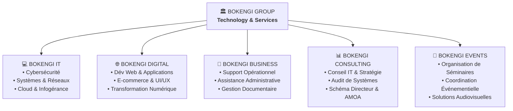

# Bokengi Group · Technology & Services

> Plateforme web institutionnelle officielle de **Bokengi Group**, groupe de services technologiques, numériques et professionnels.

[](https://kxlsys.github.io/Bokengi-Group/)
[](https://reactjs.org/)
[](https://vitejs.dev/)
[](https://kxlsys.github.io/Bokengi-Group/)
[](#)

---

## 🏛️ Présentation du Groupe

**Bokengi Group** fédère cinq expertises spécialisées et complémentaires pour concevoir, sécuriser et déployer les projets informatiques, opérationnels et organisationnels de ses clients (entreprises, PME, organisations et fondateurs) :



### Les 5 Pôles d'Expertise

1. **Bokengi IT** — Cœur technologique : Cybersécurité périmétrique, durcissement système, architecture réseaux, cloud et infogérance.
2. **Bokengi Digital** — Solutions web & produits : Développement full-stack moderne, plateformes sur mesure, refonte UX/UI et intégration d'automatisations.
3. **Bokengi Business** — Support opérationnel : Assistance administrative, secrétariat externalisé, gestion documentaire et aide au pilotage d'activités.
4. **Bokengi Consulting** — Conseil & gouvernance : Audit des systèmes d'information, schéma directeur, accompagnement stratégique et cadrage AMOA.
5. **Bokengi Events** — Événementiel professionnel : Conception, logistique, digitalisation et régie technique de séminaires et conférences d'entreprise.

---

## ⚡ Stack Technologique

- **Framework Frontend** : [React 18](https://reactjs.org/)
- **Bundler & Build Tool** : [Vite 5](https://vitejs.dev/)
- **Routage** : [React Router 7](https://reactrouter.com/) (HashRouter pour une robustesse totale sur tout hébergeur statique)
- **Design System V4** : CSS modulaire sur mesure sans dépendances lourdes (thème bicolore sombre & clair, palette soyeuse, ombres multicouches *Soft Depth*, grille de points cyan à fondu radial).
- **SEO & Performance** : Composant dynamique de métadonnées, structure sémantique Schema.org, temps de chargement ultra-rapide (CSS bundle < 28 kB, JS gzippé ~ 72 kB).

---

## 📁 Architecture du Projet

| Dossier / Fichier | Description & Rôle |
|---|---|
| `public/` | Assets statiques publics (favicons haute visibilité, logos officiels, `404.html` SPA) |
| `src/components/` | Composants UI transverses (`Navbar`, `Footer`, `SEO`, `PageHeader`, `CTASection`) |
| `src/context/` | Contextes d'état global (`ThemeContext` pour le mode Clair / Sombre) |
| `src/data/` | Données de contenu (`portfolio.js` pour les réalisations) |
| `src/lib/` | Utilitaires et connecteur d'envoi du formulaire de contact |
| `src/pages/` | Pages principales (`Home`, `Group`, `Expertises`, `Projects`, `ContactPage`) |
| `src/pages/expertises/` | Pages dédiées aux 5 pôles spécialisés (`BokengiIT`, `Digital`, `Business`...) |
| `src/bokengi-brand.css` | Design System V4 institutionnel unifié |
| `src/App.jsx` | Routeur central et mise en page principale |
| `src/main.jsx` | Point d'entrée de l'application React |
| `api/` | Endpoints serverless pour le formulaire de contact (Vercel) |
| `index.html` | Document racine avec balises SEO OpenGraph et Schema.org |
| `vite.config.js` | Configuration du bundler Vite |
| `package.json` | Manifeste des dépendances et commandes npm |

---

## 🚀 Démarrage & Développement Local

### Prérequis
- [Node.js](https://nodejs.org/) (version 18 ou supérieure recommandée)
- `npm` ou `yarn`

### Installation

```bash
# 1. Cloner le dépôt
git clone https://github.com/KxlSys/Bokengi-Group.git
cd Bokengi-Group

# 2. Installer les dépendances
npm install

# 3. Lancer le serveur de développement local
npm run dev
```

L'application sera accessible sur `http://localhost:3000` (ou le port indiqué par Vite).

### Build de Production

```bash
# Compiler le bundle de production optimisé
npm run build

# Prévisualiser le build localement
npm run preview
```

---

## 📬 Contact & Informations

- **Email officiel** : [bokengi.group@gmail.com](mailto:bokengi.group@gmail.com)
- **Site en ligne** : [https://kxlsys.github.io/Bokengi-Group/](https://kxlsys.github.io/Bokengi-Group/)
- **Zones d'intervention** : Afrique · Europe · À distance

---

## 📄 Propriété Intellectuelle

© 2026 Bokengi Group. Tous droits réservés.
