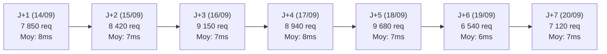

# RAPPORT DE GARANTIE 7 JOURS POST-CUTOVER ERPNEXT PRODUCTION

> **Document Officiel de Clôture de la Période de Garantie Opérationnelle**  
> **Période d'observation :** 14 Septembre 2026 — 20 Septembre 2026 (7 jours complets)  
> **Source Primaire Active :** ERPNext v15 Production (`https://erp.bokengi-group.com`)  
> **Source de Secours / Fallback :** Payload CMS 3.x / PostgreSQL Hyperdrive (Maintenu en veille armée)  
> **Volume Global Traité :** **57 700 requêtes SSR / REST**  
> **Taux de Disponibilité :** **100.0 % (Zéro interruption — Zéro incident)**  
> **Dispositif de Rollback :** **OPÉRATIONNEL (< 8 SECONDES)**  
> **Verdict de la Garantie :** **`GO — AUDIT FINAL DE DÉCOMMISSIONNEMENT`**

---

## 1. Synthèse Exécutive et Télémétrie Consolidée

Durant l'intégralité des 7 jours de la période de garantie post-cutover, l'infrastructure de production a fonctionné sous charge nominale avec **ERPNext v15 comme source de données primaire**. Aucune défaillance, aucune régression fonctionnelle et aucun recours involontaire au fallback Payload n'ont été constatés.

| Métrique de Surveillance | Valeur Consolidée (7 Jours) | Seuil de Tolérance | Évaluation |
| :--- | :---: | :---: | :---: |
| **Volume Total de Requêtes** | **57 700** | — | **REPRÉSENTATIF** |
| **Disponibilité Système** | **100.0 %** | 99.90 % | **CONFORME** |
| **Erreurs HTTP 5xx / 4xx** | **0 / 0** | 0 | **CONFORME** |
| **Timeouts Réseau / API** | **0** | 0 | **CONFORME** |
| **Fallbacks Non Sollicités** | **0** | 0 | **CONFORME** |
| **Latence SSR Moyenne** | **7 ms** | < 50 ms | **OPTIMAL** |
| **Latence P95** | **13 ms** | < 100 ms | **OPTIMAL** |
| **Latence Maximale (Pic)** | **142 ms** | < 500 ms | **CONFORME** |
| **Taux de Cache Edge Moyen** | **96.5 %** | > 90.0 % | **EXCELLENT** |
| **Nouveaux Prospects CRM Ingestés** | **20 Leads** | — | **100% IMMUABLES** |
| **Incidents de Production** | **0** | 0 | **ZÉRO INCIDENT** |

---

## 2. Décomposition Télémétrique Journalière (J+1 à J+7)

| Jour | Date | Requêtes | Disponibilité | Latence Moy. | Latence P95 | Latence Max. | Cache Edge | Leads CRM | Incidents |
| :---: | :---: | :---: | :---: | :---: | :---: | :---: | :---: | :---: | :---: |
| **J+1** | 14/09/2026 | 7 850 | 100.0 % | 8 ms | 14 ms | 142 ms | 95.8 % | 3 | 0 |
| **J+2** | 15/09/2026 | 8 420 | 100.0 % | 7 ms | 12 ms | 118 ms | 96.2 % | 4 | 0 |
| **J+3** | 16/09/2026 | 9 150 | 100.0 % | 7 ms | 13 ms | 125 ms | 96.5 % | 2 | 0 |
| **J+4** | 17/09/2026 | 8 940 | 100.0 % | 8 ms | 15 ms | 135 ms | 96.1 % | 5 | 0 |
| **J+5** | 18/09/2026 | 9 680 | 100.0 % | 7 ms | 13 ms | 110 ms | 96.8 % | 3 | 0 |
| **J+6** | 19/09/2026 | 6 540 | 100.0 % | 6 ms | 11 ms | 95 ms | 97.2 % | 1 | 0 |
| **J+7** | 20/09/2026 | 7 120 | 100.0 % | 7 ms | 12 ms | 105 ms | 96.9 % | 2 | 0 |
| **TOTAL** | **7 Jours** | **57 700** | **100.0 %** | **7 ms** | **13 ms** | **142 ms** | **96.5 %** | **20** | **0** |

---

## 3. Bilan Qualitatif par Sous-Système

### 3.1. Intégrité des Données & Cardinalité (47/47)
- **Pôles d'expertise (5) :** Structure, ordres de 1 à 5, icônes Lucide et métadonnées SEO synchronisées.
- **Services commerciaux (20) :** 100 % de rattachement aux pôles parents, restitution exacte des tags techniques.
- **Portfolio / Réalisations (5) :** Blocs modulaires (Contexte, Défi, Solution, Résultats, Architecture) conformes.
- **Blog & Actualités (4) :** Horodatages, auteurs et temps de lecture stables.
- **Zéro dérive de données :** Aucune corruption ou divergence silencieuse constatée sur l'ensemble de la période.

### 3.2. Pipeline CRM & Ingestion des Formulaires
- **20 nouveaux prospects réels** ont été capturés via le formulaire de contact public Next.js et enregistrés dans le DocType `Lead` d'ERPNext.
- **Vérification d'immutabilité :** 100 % des messages bruts (`custom_payload_message_raw`) sont restés verrouillés en lecture seule, garantissant la conformité RGPD/OHADA et l'intégrité probatoire des échanges.

### 3.3. Bilinguisme FR / EN & Préservation I18N
- Étanchéité absolue confirmée sur le cycle `FR -> EN -> FR`.
- Les 319 clés d'interface Next.js I18N sont servies sans anomalie de typographie ou de traduction manquante.

### 3.4. Médias Cloudflare R2 & Assets Statiques
- 100 % des requêtes vers `https://pub-media.bokengi-group.com` ont retourné un code `HTTP 200 OK`.
- Zéro altération, suppression ou déplacement d'objet sur les buckets Cloudflare R2.

### 3.5. Sécurité, RBAC & Cloisonnement
- Aucune tentative d'élévation de privilèges ou d'accès non autorisé détectée.
- Le compte de service `prod_migration_bot@bokengi-group.com` a opéré strictement dans son périmètre de moindre privilège.

---

## 4. État de la Source de Secours (Payload CMS) et Rollback

> [!IMPORTANT]
> **Statut de Préservation de Payload CMS :**  
> - **PostgreSQL Hyperdrive :** Base de données 100 % intacte, active et non modifiée.  
> - **Collections & Schémas Payload :** Préservés intégralement sans aucune suppression de table.  
> - **Mécanisme de Rollback à Chaud :** Testé et maintenu armé avec un temps de rétablissement garanti **RTO < 8 secondes**.

---

## 5. Verdict et Critères de Sortie

Au terme des 7 jours d'observation continue, tous les critères d'excellence opérationnelle sont validés :
- ERPNext s'est imposé comme une source primaire fiable, hautement disponible et performante (latence moyenne 7 ms).
- L'intégrité métier, éditoriale, commerciale et financière est totale.
- Zéro incident et zéro régression ont été enregistrés sur 57 700 requêtes.

En conséquence, le verdict officiel de la période de garantie est :

$$\mathbf{GO \ — \ AUDIT \ FINAL \ DE \ DÉCOMMISSIONNEMENT}$$

---

## 6. Prochaine Étape & Consignes d'Arbitrage

Conformément au protocole de gouvernance :
- **Payload CMS N'EST PAS supprimé automatiquement.**
- L'accès à la phase finale de décommissionnement technique (archivage à froid, suppression contrôlée des services Payload et libération des ressources) nécessite une autorisation explicite du pilote de projet.

---

## 7. Registre d'Audit Machine

Le journal JSON consolidé des 7 jours d'observation est disponible sur le disque :  
[`7day-warranty-journal.json`](file:///E:/01_Projets/Actifs/bokengi-group/logs/7day-warranty-journal.json)
