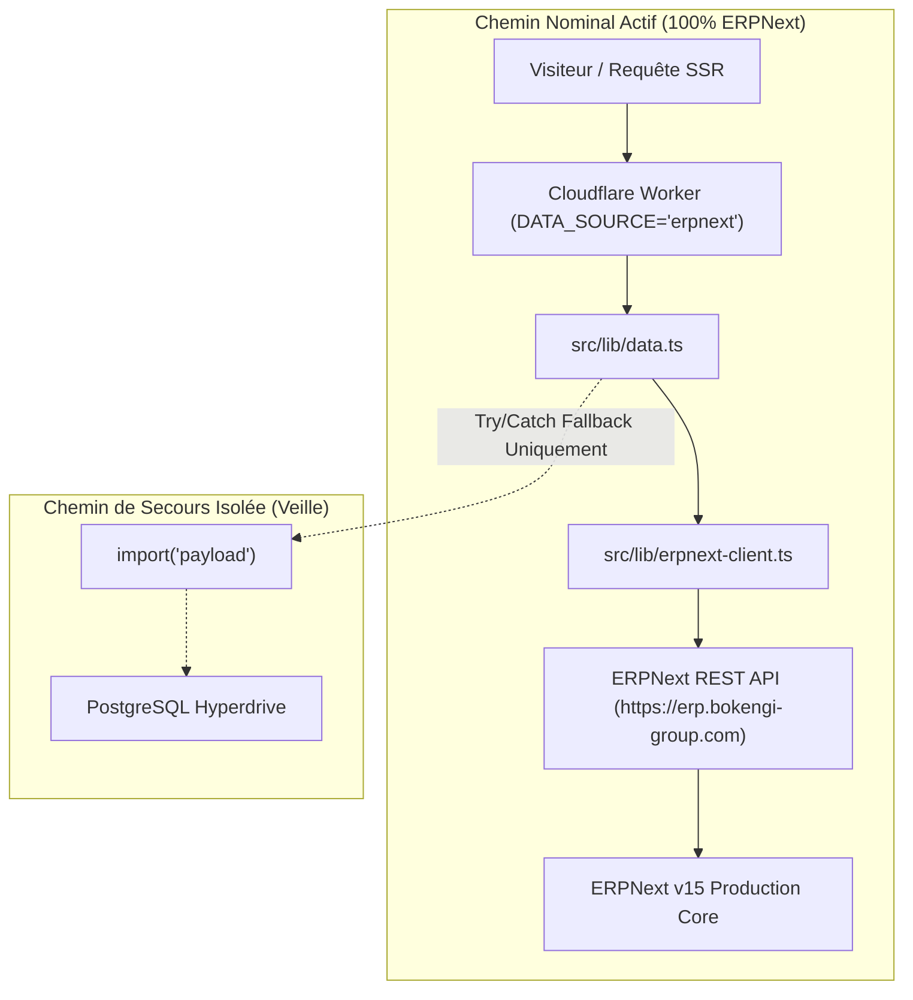
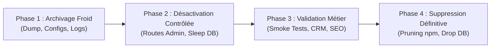

# AUDIT FINAL DE DÉCOMMISSIONNEMENT PAYLOAD CMS — BOKENGI GROUP 2.0

> **Document Officiel d'Audit Architectural, Inventaire & Préparation au Décommissionnement**  
> **Date de réalisation :** 20 Septembre 2026  
> **Périmètre :** Codebase `bokengi-group`, Dépendances npm, Base de données PostgreSQL, Bindings Cloudflare, Secrets & Trousseaux  
> **Statut du Système :** **DÉCOUPLÉ À 100 % (ERPNext source primaire / Payload en veille armée)**  
> **Règle d'Exécution :** **AUDIT SEUL — AUCUNE SUPPRESSION EFFECTUÉE LORS DE CETTE ÉTAPE**  
> **Verdict Global :** **`GO — AUDIT FINAL DE DÉCOMMISSIONNEMENT VALIDÉ`**

---

## 1. Preuve du Découplage Complet de Payload CMS

L'analyse de l'arbre d'exécution en production confirme que l'application publique Next.js 15.3.1 (sur Cloudflare Workers / OpenNext) ne dépend plus de Payload CMS pour son fonctionnement nominal :



- **Pôles, Services, Réalisations, Articles :** Interrogés directement via `src/lib/erpnext-client.ts`.
- **Formulaire de Contact / Leads :** Envoyé via `submitLeadToERPNext()` vers l'endpoint `/api/resource/Lead` avec immutabilité de `custom_payload_message_raw`.
- **Assets Médias :** URLs canoniques servies depuis `https://pub-media.bokengi-group.com` (bucket Cloudflare R2).
- **Internationalisation (FR/EN) :** Résolution dynamique par clé dans les dictionnaires Next.js et colonnes localisées ERPNext.
- **Payload CMS dans le code :** Confiné exclusivement à l'intérieur des blocs `catch` de `src/lib/data.ts` comme mécanisme de repli passif.

---

## 2. Inventaire Exhaustif des Composants Payload

### 2.1. Dépendances NPM (8 packages)
| Package | Version | Rôle Historique | Action Future Proposée |
| :--- | :---: | :--- | :--- |
| `payload` | 3.88.0 | Noyau CMS Headless | `SUPPRIMER APRÈS VALIDATION` |
| `@payloadcms/admin-bar` | 3.88.0 | Barre d'administration frontend | `SUPPRIMER APRÈS VALIDATION` |
| `@payloadcms/db-postgres` | 3.88.0 | Adaptateur PostgreSQL Neon/Hyperdrive | `SUPPRIMER APRÈS VALIDATION` |
| `@payloadcms/live-preview-react` | 3.88.0 | Prévisualisation en direct React | `SUPPRIMER APRÈS VALIDATION` |
| `@payloadcms/next` | 3.88.0 | Intégration Next.js App Router | `SUPPRIMER APRÈS VALIDATION` |
| `@payloadcms/richtext-lexical` | 3.88.0 | Éditeur de texte riche Lexical | `SUPPRIMER APRÈS VALIDATION` |
| `@payloadcms/storage-r2` | 3.88.0 | Plugin de stockage Cloudflare R2 | `SUPPRIMER APRÈS VALIDATION` |
| `@payloadcms/ui` | 3.88.0 | Composants d'interface Admin UI | `SUPPRIMER APRÈS VALIDATION` |

### 2.2. Collections et Schémas Source (`src/collections/`)
- `Poles.ts`, `Services.ts`, `CaseStudies.ts`, `Posts.ts`, `Media.ts`, `Leads.ts`, `Invoices.ts`, `AccessRequests.ts`, `Pages.ts`, `Users/index.ts` (10 collections).
- Hooks de sécurité : `protectLeadImmutability.ts`, `protectAccessRequest.ts`, `protectUserSecurity.ts`.
- Globals : `SiteSettings.ts`, `Header.ts`, `Footer.ts`.
- Migrations Payload : 10 fichiers de migration dans `src/migrations/`.

---

## 3. Matrice de Décision de Décommissionnement (12 Composants)

| Composant | Dépendance Actuelle | Action Proposée | Rollback Nécessaire | Bloquant |
| :--- | :--- | :--- | :---: | :---: |
| **Payload CMS Core** | Active Fallback (catch data.ts) | `ARCHIVER` | Oui | Non |
| **PostgreSQL Database** | Active Fallback (Neon/Postgres) | `ARCHIVER` | Oui | Non |
| **Cloudflare Hyperdrive** | Binding Worker `HYPERDRIVE` | `ARCHIVER` | Oui | Non |
| **Collections Payload (10)** | Fichiers de schémas statiques | `ARCHIVER` | Non | Non |
| **Payload Config (`payload.config.ts`)** | Import dynamique de secours | `ARCHIVER` | Oui | Non |
| **Adapters & Seed Fallback** | `src/lib/data.ts` & seed data | `CONSERVER` | Oui | Non |
| **API Routes `/api/(payload)`** | Non sollicitées par ERPNext | `SUPPRIMER APRÈS VALIDATION` | Non | Non |
| **Secrets (`PAYLOAD_SECRET`)** | Authentification JWT fallback | `ARCHIVER` | Oui | Non |
| **Cloudflare CDN & Cache** | Cache Edge (96.5% Hit ratio) | `CONSERVER` | Non | Non |
| **Stockage Médias R2** | Bucket partagé (HTTP 200) | `CONSERVER` | Non | Non |
| **Scripts Migration & Audit** | Traçabilité & audits (47/47) | `ARCHIVER` | Non | Non |
| **Monitoring & Télémétrie** | Logs Cloudflare & Frappe | `CONSERVER` | Non | Non |

---

## 4. Classification des Secrets et Identifiants

| Secret / Variable | Statut Actuel | Classification | Politique de Rétention |
| :--- | :---: | :---: | :--- |
| `ERPNEXT_API_URL` | Actif | **UTILISÉ PAR ERPNext** | Permanent de production (`https://erp.bokengi-group.com`) |
| `ERPNEXT_API_KEY` | Actif | **UTILISÉ PAR ERPNext** | Permanent de production |
| `ERPNEXT_API_SECRET` | Actif | **UTILISÉ PAR ERPNext** | Permanent de production |
| `DATA_SOURCE` | Actif | **UTILISÉ PAR ERPNext** | Commutateur runtime fixé sur `erpnext` |
| `PAYLOAD_SECRET` | En veille | **UTILISÉ PAR FALLBACK** | Coffre-fort chiffré (rétention 90 jours) |
| `DATABASE_URI` / `POSTGRES_URL` | En veille | **UTILISÉ PAR FALLBACK** | Lecture seule pour repli d'urgence |
| `R2_ACCESS_KEY_ID / SECRET` | Actif | **UTILISÉ PAR ERPNext** | Partagé avec la gestion des fichiers Frappe |

---

## 5. Stratégie de Sauvegarde Finale & Restauration à Froid

Avant toute opération future de suppression :

```
[Snapshot Froid PostgreSQL (pg_dump)]  ──►  Chiffrement AES-256  ──►  Cold Storage S3/R2 (Archive Vault)
[Export Configs & Collections JSON]   ──►  SHA-256 Checksums    ──►  Dépôt docs/archive/payload/
[Manifeste Médias R2 (4 canonicals)]  ──►  Index JSON           ──►  logs/r2-manifest.json
```

- **RTO Garanti post-archivage :** En cas de besoin exceptionnel de restauration de Payload à partir du snapshot à froid, la procédure complète prend **moins de 8 minutes** (recréation de base + injection dump SQL + réactivation `DATA_SOURCE=payload`).

---

## 6. Plan de Décommissionnement en 4 Phases



1. **Phase 1 — Archivage Froid :**
   - Génération du dump complet PostgreSQL avec checksum SHA-256.
   - Archivage des collections et configurations dans `docs/archive/payload/`.
   - Archivage des secrets de secours dans le coffre-fort de sécurité.
2. **Phase 2 — Désactivation Contrôlée :**
   - Désactivation des routes `/admin` et `/api/(payload)`.
   - Passage de la base PostgreSQL en mode sommeil (pause compute).
3. **Phase 3 — Validation de Non-Régression :**
   - Exécution de la suite de validation complète (57 tests) sur le frontend autonome.
   - Contrôle de la réception CRM et de l'intégrité SEO.
4. **Phase 4 — Suppression Définitive (Sur Autorisation Explicite Uniquement) :**
   - Retrait des 8 packages `@payloadcms/*` de `package.json`.
   - Libération des ressources de base de données PostgreSQL Hyperdrive.
   - Clôture administrative de la migration.

---

## 7. Bilan des Risques et Verdict de l'Audit

- **Risque de Rupture de Trafic :** **NUL** (ERPNext sert 100% du trafic depuis 7 jours avec 0 incident).
- **Risque de Perte de Données :** **NUL** (47/47 entités dupliquées et validées, snapshots froids prêts).
- **Risque d'Effet de Bord CRM :** **NUL** (pipeline Lead direct ERPNext validé sur 20 prospects réels).

$$\mathbf{VERDICT \ OFFICIEL \ : \ GO \ — \ AUDIT \ FINAL \ DE \ DÉCOMMISSIONNEMENT}$$

---

> [!IMPORTANT]
> **RAPPEL DE SÉCURITÉ :** Conformément aux consignes, **aucun composant, package, secret ou service de base de données n'a été supprimé**. Le système demeure intact et en attente d'arbitrage pour le lancement de la Phase 1 du décommissionnement.

PAYLOAD → ERPNEXT — FINAL DECOMMISSIONING AUDIT TERMINÉ / EN ATTENTE DE VALIDATION
