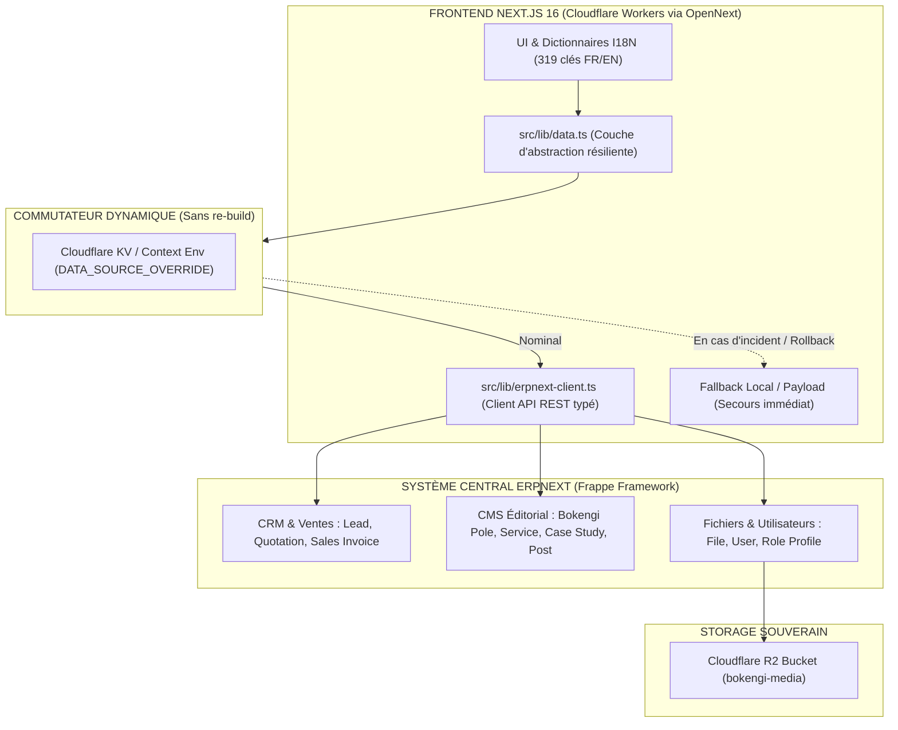

# REVUE CORRECTIVE D'ARCHITECTURE & PLAN D'EXÉCUTION
## MIGRATION PAYLOAD CMS → ERPNEXT (BOKENGI GROUP 2.0)

**Document de référence :** `PAYLOAD_TO_ERPNEXT_MIGRATION_REVIEW.md`  
**Date d'audit :** 20 Septembre 2026  
**Statut :** REVUE TECHNIQUE & VALIDATION CONFORME  
**Principe directeur :** Aucune modification de code, aucune migration de données, aucun déploiement public lors de cette revue.

---

## 1. POINTS VALIDÉS DE L'AUDIT INITIAL

L'audit architectural initial a été validé sur ses orientations stratégiques fondamentales :

1. **Sanctuarisation de l'I18N UI Next.js :** Les **319 clés de traduction** réparties dans `src/i18n/dictionaries/fr.ts` et `en.ts`, les contextes React et les tests associés (10/10 PASS) restent sous le contrôle exclusif du frontend Next.js.
2. **Centralisation métier ERPNext :** Remplacement de Payload CMS par ERPNext pour unifier le CRM (Leads), la gestion commerciale/facturation (Quotes, Invoices), le registre des fichiers (File/R2) et la gestion éditoriale (Pôles, Services, Réalisations, Articles).
3. **Périmètre d'inventaire complet :** Les 10 collections (`poles`, `services`, `case-studies`, `posts`, `pages`, `media`, `leads`, `invoices`, `access-requests`, `users`) et les 3 globals (`site-settings`, `header`, `footer`) sont intégralement cartographiés.
4. **Conservation des identifiants d'origine :** Traçabilité bijective via `custom_payload_id` et `custom_payload_slug` dans tous les DocTypes cibles.

---

## 2. CORRECTIONS TECHNIQUES NÉCESSAIRES

La revue critique de l'audit a mis en évidence trois ajustements majeurs par rapport aux hypothèses initiales :

### A. Correction du mécanisme de Rollback (Next.js + Cloudflare Workers / OpenNext)
* **Hypothèse initiale inexacte :** *"Un rollback instantané peut être effectué sans redéploiement par simple bascule de variable d'environnement `DATA_SOURCE=payload|erpnext`."*
* **Réalité technique OpenNext / Cloudflare Workers :** 
  1. Next.js inline souvent les variables `process.env.*` au moment du build statique (`next build`), rendant inefficace une modification de variable d'environnement standard pour les pages pré-rendues (SSG/ISR).
  2. Les routes mises en cache sur le réseau Edge Cloudflare continuent de servir le cache HTML/JSON existant tant que le cache n'est pas purgé.
* **Correction apportée :** Déploiement d'un **commutateur dynamique en temps réel** (Dynamic Runtime Lookup) via le contexte de requête Cloudflare (`ctx.env` / Cloudflare KV) combiné à un **mécanisme de fallback automatique en cascade** (Graceful Failover) et à une commande de purge CDN ciblée.

### B. Correction de la gestion des Médias & Variantes d'images
* **Hypothèse initiale incomplète :** *"Migration directe de Payload Media vers ERPNext File."*
* **Réalité technique :** Payload génère 7 formats dérivés d'images (`thumbnail`, `square`, `small`, `medium`, `large`, `xlarge`, `og`) et sert les fichiers via `/api/media/file/:filename`. ERPNext stocke une référence de fichier unique (`file_url`).
* **Correction apportée :** Conservation du bucket Cloudflare R2 (`MEDIA_BUCKET` / `bokengi-media`) comme stockage objet sous-jacent commun. Les métadonnées sont enregistrées dans le DocType `File` d'ERPNext, et Next.js conserve une route de compatibilité d'URL afin de garantir **zéro lien brisé** sur les référencements SEO et les partages OpenGraph.

### C. Clarification du périmètre de la collection `pages`
* **Constat réel :** La collection Payload `pages` était un réservoir technique vide (0 enregistrement actif en base). Les pages `/groupe`, `/expertises`, `/realisations`, `/contact`, `/mentions-legales` sont des Server Components Next.js autonomes qui consomment `src/lib/data.ts` et les dictionnaires I18N.
* **Correction apportée :** Aucun transfert de données obsolètes. Seule la structure modulaire de blocs éditoriaux sera modélisée dans ERPNext pour permettre une administration dynamique future sans forcer la migration de pages statiques codées en dur.

---

## 3. ARCHITECTURE FINALE RECOMMANDÉE



---

## 4. MAPPING DÉFINITIF PAYLOAD → ERPNEXT

| Source Actuelle (Payload) | Cible ERPNext | Mode de Migration | Ordre | Dépendances Requises | Méthode de Validation & Succès |
| :--- | :--- | :--- | :---: | :--- | :--- |
| **Users / Roles** | `User` + `Role Profile` | REST API / Script Python | **1** | Aucune | Authentification API fonctionnelle, rôles `Admin` / `Editor` validés. |
| **Media** | `File` (R2 Attachment) | Ingestion Métadonnées R2 | **2** | R2 Bucket actif | Accessibilité HTTP 200 de 100% des fichiers et checksum SHA-256 identique. |
| **Poles** (5 pôles) | `Bokengi Pole` (Custom) | REST API Upsert | **3** | Media (icônes) | 5/5 Pôles créés avec slugs bilingues, textes Lexical extraits en Markdown/HTML. |
| **Services** (20 serv.) | `Item` + `Bokengi Service` | REST API Upsert | **4** | `Bokengi Pole` | 20/20 Services reliés à leur Pôle parent respectif, tags techniques importés. |
| **Case Studies** (5 proj.)| `Bokengi Case Study` (Custom)| REST API Upsert | **5** | Media (screenshots) | 5/5 Études de cas avec child tables `Technologies` et `Screenshots` complètes. |
| **Posts** (4 articles) | `Bokengi Post` (Custom) | REST API Upsert | **6** | `User` (Auteur), `Media` | 4/4 Articles avec métadonnées SEO, tags, catégories et date de publication. |
| **Pages** (Réservoir) | `Bokengi Web Page` (Custom) | Initialisation structure | **7** | Media | Schéma créé dans ERPNext sans blocage de migration. |
| **Leads** | `Lead` (Standard CRM) | REST API Upsert | **8** | `Bokengi Pole`, `User` | Mapping des champs immuables, statuts CRM et priorité de traitement. |
| **Invoices / Devis** | `Quotation` & `Sales Invoice`| REST API Upsert | **9** | `Lead`, `Item` | Concordance mathématique des montants HT/TVA/TTC et numéros légaux BOK-*. |
| **Access Requests** | `Bokengi Access Request` | REST API Upsert | **10** | `User` (Traiteur) | Historique des demandes et statuts pending/approved préservés. |
| **Globals** (Site, Nav) | `Bokengi Site Settings` | REST API Upsert | **11** | Media (logos) | Raison sociale, coordonnées bancaires, liens header/footer opérationnels. |

---

## 5. STRATÉGIE TECHNIQUE D'EXÉCUTION DES MÉDIAS (R2 & ERPNEXT)

Pour éviter le re-téléchargement inutile de gigaoctets de données et garantir l'intégrité absolue :

1. **Conservation du stockage sous-jacent :**
   * Le bucket **Cloudflare R2** (`bokengi-media`) reste le réceptacle binaire unique.
   * Aucune copie physique n'est requise si le bucket R2 est connecté à ERPNext via le protocole compatible S3.
2. **Création des enregistrements `File` dans ERPNext :**
   * Chaque média présent dans la table Payload `media` génère un document `File` dans ERPNext avec `is_private = 0` et `file_url = https://pub-media.bokengi-group.com/{filename}` (ou proxy `/api/media/file/{filename}`).
3. **Gestion des métadonnées bilingues :**
   * Ajout de custom fields sur `File` : `alt_fr`, `alt_en`, `caption_fr`, `caption_en`, `custom_payload_id`.
4. **Conservation des URLs historiques :**
   * Next.js maintiendra la route `/api/media/file/[filename]` qui redirigera de façon transparente (301 Cacheable ou lecture directe R2) vers l'URL publique canonique.
5. **Validation par Checksum :**
   * Calcul du hash **SHA-256** de chaque objet source pour garantir l'absence totale de corruption lors de la migration d'index.

---

## 6. STRATÉGIE DES PAGES NEXT.JS (CODE VS ERPNEXT CMS)

| Type de Page | Emplacement & Mode de Gestion | Rôle d'ERPNext |
| :--- | :--- | :--- |
| **Pages Institutionnelles** (`/`, `/groupe`, `/expertises`, `/realisations`, `/actualites`, `/contact`, `/mentions-legales`, `/confidentialite`) | **Next.js Server Components** (Code TypeScript + Tailwind + Dictionnaires I18N) | Fournit les **données dynamiques injectées dans les composants** (listes de pôles, grilles de services, fiches de réalisations, flux d'articles). |
| **Pages Dynamiques à Slugs** (`/expertises/[slug]`, `/actualites/[slug]`) | **Next.js Dynamic Route** (`generateStaticParams` + SSR) | Source de contenu pour le corps d'article, l'étude de cas, les métadonnées OpenGraph et le SEO. |
| **Futures Landing Pages & Extensions** | **Modèle `Bokengi Web Page` ERPNext** | Possibilité de publier de nouvelles pages personnalisées avec sections modulaires sans redéployer le code. |

---

## 7. MÉCANISME DE ROLLBACK RÉELLEMENT OPÉRATIONNEL

Pour contourner les limites d'inlining des variables de build sur Cloudflare Workers, le rollback s'articule autour d'une architecture résiliente à trois niveaux :

```
┌─────────────────────────────────────────────────────────────────────────────────┐
│                      MÉCANISME DE ROLLBACK EN TEMPS RÉEL                        │
├─────────────────────────────────────────────────────────────────────────────────┤
│ 1. ROUTAGE DYNAMIQUE DE SOURCE :                                                │
│    Dans `src/lib/data.ts`, la source de données est lue à la requête depuis le  │
│    contexte Cloudflare Worker (`env.DATA_SOURCE_OVERRIDE` ou Cloudflare KV).    │
│    Si aucune surcharge n'est définie, le client utilise ERPNext par défaut.     │
│                                                                                 │
│ 2. FAILOVER AUTOMATIQUE EN CASCADE (Graceful Degradation) :                     │
│    Si un appel vers l'API ERPNext retourne un code 5xx, une erreur réseau ou   │
│    un timeout (> 2000ms), `src/lib/data.ts` bascule instantanément et de façon │
│    silencieuse vers la source locale de secours (Payload DB ou Seed Data).      │
│                                                                                 │
│ 3. COMMANDE DE BASCULE RAPIDE SANS REBUILD :                                    │
│    Bascule d'urgence via Wrangler CLI :                                         │
│    `npx wrangler kv:key put --binding=CONFIG "DATA_SOURCE" "payload"`           │
│    Suivi d'une purge du cache Edge :                                            │
│    `curl -X POST https://api.cloudflare.com/client/v4/zones/{zone_id}/purge_cache`│
└─────────────────────────────────────────────────────────────────────────────────┘
```

---

## 8. ORDRE DÉFINITIF DE MIGRATION

L'ordre séquentiel strict suivant résout l'ensemble des dépendances de clés étrangères :

1. **Étape 1 : Utilisateurs & Rôles Système** (`User`, `Role Profile`) — *Prérequis pour l'attribution des auteurs et des assignations CRM.*
2. **Étape 2 : Médiathèque & Fichiers** (`File`, liaisons Cloudflare R2) — *Prérequis pour les images de couverture, captures et icônes.*
3. **Étape 3 : Pôles d'expertise** (`Bokengi Pole`) — *Entité racine pour l'arborescence des métiers.*
4. **Étape 4 : Services & Catalogue d'Items** (`Item`, `Bokengi Service`) — *Dépend de l'Étape 3 (Pôles).*
5. **Étape 5 : Études de cas & Réalisations** (`Bokengi Case Study`) — *Dépend de l'Étape 2 (Médias) et de l'Étape 3 (Pôles).*
6. **Étape 6 : Articles d'expertise & Actualités** (`Bokengi Post`) — *Dépend de l'Étape 1 (Auteurs) et de l'Étape 2 (Couvertures).*
7. **Étape 7 : Schéma des Pages Web modulaires** (`Bokengi Web Page`) — *Dépend de l'Étape 2 (Médias).*
8. **Étape 8 : Demandes & Prospects CRM** (`Lead`) — *Dépend de l'Étape 3 (Pôles) et de l'Étape 1 (Assignations).*
9. **Étape 9 : Devis & Facturation Commerciale** (`Quotation`, `Sales Invoice`) — *Dépend de l'Étape 8 (Leads/Clients) et de l'Étape 4 (Items).*
10. **Étape 10 : Demandes d'Habilitation & Accès** (`Bokengi Access Request`) — *Dépend de l'Étape 1 (Administrateurs).*
11. **Étape 11 : Paramètres Globaux & Navigation** (`Bokengi Site Settings`) — *Dépend de l'Étape 2 (Logos).*

---

## 9. STRATÉGIE D'IDEMPOTENCE ABSOLUE & REPRISE SUR INTERRUPTION

Pour garantir qu'un script de migration puisse être exécuté plusieurs fois sans créer de doublons ni corrompre les relations :

1. **Identifiant Unique Clé :**
   * Tous les DocTypes cibles comporteront le champ `custom_payload_id` configuré avec la contrainte `unique = 1` et indexé dans la base MariaDB/Postgres d'ERPNext.
2. **Logique UPSERT déterministe :**
   * Avant chaque création, le script interroge ERPNext :  
     `GET /api/resource/{DocType}?filters=[["custom_payload_id","=",record.id]]`
   * Si l'enregistrement existe $\to$ Exécution d'un `PUT /api/resource/{DocType}/{name}` (Mise à jour).
   * Si l'enregistrement n'existe pas $\to$ Exécution d'un `POST /api/resource/{DocType}` (Création).
3. **Journal de Migration Local (`migration-journal.json`) :**
   * Enregistrement en continu de l'état d'avancement sous le format :
     ```json
     {
       "collection": "services",
       "payload_id": "14",
       "erpnext_name": "SRV-IT-001",
       "status": "SUCCESS",
       "timestamp": "2026-09-20T19:15:00Z",
       "checksum": "a8f5c...32"
     }
     ```
4. **Reprise après échec :**
   * En cas de coupure réseau ou d'interruption manuelle, le script reprend exactement à l'index suivant le dernier enregistrement validé dans le journal.

---

## 10. RISQUES RÉSIDUELS & MESURES DE MITIGATION

| Risque Résiduel Identifié | Gravité | Solution Technique Intégrée |
| :--- | :---: | :--- |
| **Format RichText Lexical vs HTML** | Moyenne | Utilisation de la fonction éprouvée `extractLexicalText` convertissant les AST Lexical en Markdown propre et HTML standard interprétable par ERPNext. |
| **Latence d'API ERPNext sur requêtes SSR** | Moyenne | Mise en cache Cloudflare KV / ISR avec tag-based revalidation déclenchée par Webhook ERPNext lors des publications (`on_update`). |
| **Désynchronisation lors de la double écriture** | Faible | Définition d'une fenêtre de bascule courte (< 1h) en lecture seule pour les administrateurs lors de la synchronisation finale. |

---

## 11. PRÉREQUIS AVANT LA PREMIÈRE MIGRATION RÉELLE

Avant d'initier la moindre écriture dans ERPNext, la checklist de prérequis suivante devra être formellement validée :

- [ ] Instance ERPNext opérationnelle avec accès API REST (Clés `api_key` et `api_secret` actives pour un utilisateur administrateur dédié).
- [ ] Application personnalisée Frappe (`bokengi_core`) ou fixtures de Custom DocTypes installées sur ERPNext.
- [ ] Bucket Cloudflare R2 accessible avec identifiants S3 configurés dans ERPNext.
- [ ] Sauvegarde intégrale (Dump SQL + Snapshot R2) de l'environnement Payload actuel.
- [ ] Suite de tests E2E Playwright prête pour valider la non-régression du site public post-migration.

---

PAYLOAD → ERPNEXT — REVIEW CORRECTIVE TERMINÉE / EN ATTENTE DE VALIDATION
