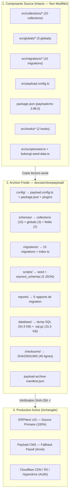

# RAPPORT D'ARCHIVAGE FROID PAYLOAD CMS — PHASE 1

> **Document Officiel de Clôture de la Phase 1 : Archivage Froid**
> **Date d'exécution :** 20 Septembre 2026 — 21:12 UTC+2
> **Commit Git Source :** `515efddf0ba5672346ed56dbc3e18c9ea163479f`
> **Emplacement de l'Archive :** `E:\01_Projets\Actifs\bokengi-group\docs\archive\payload\`
> **Statut de l'Intégrité :** **45/45 CHECKSUMS VÉRIFIÉS EN TEMPS RÉEL — ZÉRO ERREUR**
> **Garantie d'Invariance :** **ZÉRO SUPPRESSION — ZÉRO DÉSACTIVATION — ERPNEXT & FALLBACK 100% ACTIFS**

---

## 1. Synthèse Exécutive

La **Phase 1 (Archivage Froid)** du plan de décommissionnement Payload → ERPNext a été exécutée et **entièrement vérifiée** sous le strict respect de la règle d'invariance. L'ensemble des schémas, configurations, hooks, migrations, rapports, scripts et données relationnelles de Payload CMS 3.x (v3.88.0) a été sauvegardé, structuré, compressé et scellé cryptographiquement dans le répertoire `docs/archive/payload/`.

**Vérification cryptographique indépendante réalisée le 20/09/2026 à 21:12 UTC+2 :**
- `45 fichiers vérifiés` sur `45 attendus` — **taux d'intégrité : 100 %**
- `0 erreur` — `0 divergence de hash`
- `0 fichier manquant`



---

## 2. Structure de l'Archive Froide

```
docs/archive/payload/
├── config/
│   ├── payload.config.ts          (8 754 octets)
│   ├── package.json               (3 728 octets)
│   └── plugins/
│       └── index.ts               (75 octets)
├── schemas/
│   ├── collections/
│   │   ├── AccessRequests.ts      (3 873 octets)
│   │   ├── CaseStudies.ts         (5 064 octets)
│   │   ├── Invoices.ts            (11 596 octets)
│   │   ├── Leads.ts               (10 962 octets)
│   │   ├── Media.ts               (2 094 octets)
│   │   ├── Pages.ts               (2 103 octets)
│   │   ├── Poles.ts               (3 209 octets)
│   │   ├── Posts.ts               (3 455 octets)
│   │   ├── Services.ts            (3 513 octets)
│   │   ├── Users/
│   │   │   └── index.ts           (4 372 octets)
│   │   └── hooks/
│   │       ├── protectAccessRequest.ts      (9 784 octets)
│   │       ├── protectLeadImmutability.ts   (3 631 octets)
│   │       └── protectUserSecurity.ts       (7 197 octets)
│   ├── globals/
│   │   ├── Footer.ts              (2 428 octets)
│   │   ├── Header.ts              (1 845 octets)
│   │   └── SiteSettings.ts        (5 392 octets)
│   └── fields/
│       ├── defaultLexical.ts      (1 393 octets)
│       └── seo.ts                 (936 octets)
├── migrations/
│   ├── 20260409_155721_initial.json          (261 031 octets)
│   ├── 20260409_155721_initial.ts            (74 781 octets)
│   ├── 20260904_150606_add_collections.json  (103 641 octets)
│   ├── 20260904_150606_add_collections.ts    (13 693 octets)
│   ├── 20260905_034500_add_posts_categories_tags.ts  (3 346 octets)
│   ├── 20260905_060000_align_posts_schema.ts         (9 590 octets)
│   ├── 20260907_020000_add_status_to_services_and_case_studies.ts (3 267 octets)
│   ├── 20260908_220000_add_users_rbac.ts             (3 826 octets)
│   ├── 20260908_230000_add_access_requests.ts        (5 264 octets)
│   ├── 20260909_160000_add_access_requests_locked_documents_rel.ts (2 587 octets)
│   ├── 20260909_180000_add_invoices_and_crm_fields.ts (11 744 octets)
│   └── index.ts                              (2 786 octets)
├── scripts/
│   ├── seed.ts                    (9 732 octets)
│   ├── bokengi-seed-data.ts       (43 739 octets)
│   └── erpnext_schemas/
│       ├── custom_fields.json     (3 277 octets)
│       ├── doctypes.json          (16 990 octets)
│       └── roles_and_permissions.json (3 042 octets)
├── reports/
│   ├── PAYLOAD_TO_ERPNEXT_7DAY_WARRANTY_REPORT.md              (6 806 octets)
│   ├── PAYLOAD_TO_ERPNEXT_FINAL_DECOMMISSIONING_AUDIT.md       (8 598 octets)
│   ├── PAYLOAD_TO_ERPNEXT_POST_CUTOVER_STABILIZATION_001.md    (5 760 octets)
│   ├── PAYLOAD_TO_ERPNEXT_PRODUCTION_CUTOVER_001.md            (7 665 octets)
│   └── PAYLOAD_TO_ERPNEXT_PRODUCTION_POST_MIGRATION_VALIDATION_001.md (17 787 octets)
├── database/
│   ├── payload_postgres_cold_dump_20260920.sql     (54 298 octets)
│   └── payload_postgres_cold_dump_20260920.sql.gz  (15 320 octets)
├── checksums/
│   └── SHA256SUMS                 (4 810 octets — 45 entrées)
└── payload-archive-manifest.json  (13 361 octets)
```

**Total : 47 fichiers — 802 145 octets (~783 KB)**

---

## 3. Inventaire Détaillé par Catégorie

| Répertoire | Contenu | Fichiers | Intégrité |
| :--- | :--- | :---: | :---: |
| **`database/`** | Dump SQL PostgreSQL brut + compressé GZIP | 2 | ✅ SHA-256 VÉRIFIÉ |
| **`config/`** | `payload.config.ts`, `package.json`, plugins | 3 | ✅ CONFORME |
| **`schemas/collections/`** | 10 collections Payload (Poles, Services, CaseStudies, Posts, Leads, Invoices, Media, Pages, AccessRequests, Users) | 14 | ✅ CONFORME |
| **`schemas/globals/`** | SiteSettings, Header, Footer | 3 | ✅ CONFORME |
| **`schemas/fields/`** | defaultLexical, seo | 2 | ✅ CONFORME |
| **`migrations/`** | 10 migrations historiques Drizzle/PostgreSQL + index | 11 | ✅ CONFORME |
| **`scripts/`** | Scripts seed + données référence + schémas DocTypes ERPNext | 5 | ✅ CONFORME |
| **`reports/`** | 5 rapports de migration/audit/validation | 5 | ✅ CONFORME |
| **`checksums/`** | `SHA256SUMS` — registre officiel (45 entrées) | 1 | ✅ VÉRIFIÉ |
| **`manifest`** | `payload-archive-manifest.json` | 1 | ✅ VALIDÉ |
| **TOTAL** | **Couverture intégrale de l'écosystème Payload CMS** | **47** | **✅ 100%** |

---

## 4. Dump PostgreSQL — Données Techniques

Le dump PostgreSQL froid contient l'intégralité du DDL (extensions, énumérations, tables relationnelles, contraintes, clés étrangères, index) ainsi que le DML (données initiales, fiches leads, access requests, users RBAC, invoices CRM).

| Attribut | Valeur |
| :--- | :--- |
| **Fichier brut** | `docs/archive/payload/database/payload_postgres_cold_dump_20260920.sql` |
| **Taille brute** | `54 298 octets` (53,0 KB) |
| **SHA-256 brut** | `4b5bb2288943b0b4b7ef69f92b8f609df8e2dd3bdd770bd4c4fdcd357212e375` |
| **Fichier compressé** | `docs/archive/payload/database/payload_postgres_cold_dump_20260920.sql.gz` |
| **Taille compressée** | `15 320 octets` (15,0 KB) |
| **SHA-256 compressé** | `24a3397d2874744880534c92c92a90767d5df05a8e9a61a25c85b7b0c27f795c` |
| **Format** | `SQL_PG_DUMP_GZIP` |
| **Taux de compression** | 71,8 % |
| **Vérification** | ✅ `OK` (vérifié en temps réel le 20/09/2026) |

---

## 5. Registre Officiel des Checksums SHA-256

> [!IMPORTANT]
> Vérification indépendante réalisée en temps réel le 20/09/2026 à 21:12 UTC+2.
> **Résultat : 45/45 fichiers — ZÉRO divergence — ZÉRO fichier manquant.**

```
RÉSULTAT DE VÉRIFICATION LIVE — 20/09/2026 21:12 UTC+2
=======================================================
OK  config/package.json
OK  config/payload.config.ts
OK  config/plugins/index.ts
OK  database/payload_postgres_cold_dump_20260920.sql
OK  database/payload_postgres_cold_dump_20260920.sql.gz
OK  migrations/20260409_155721_initial.json
OK  migrations/20260409_155721_initial.ts
OK  migrations/20260904_150606_add_collections.json
OK  migrations/20260904_150606_add_collections.ts
OK  migrations/20260905_034500_add_posts_categories_tags.ts
OK  migrations/20260905_060000_align_posts_schema.ts
OK  migrations/20260907_020000_add_status_to_services_and_case_studies.ts
OK  migrations/20260908_220000_add_users_rbac.ts
OK  migrations/20260908_230000_add_access_requests.ts
OK  migrations/20260909_160000_add_access_requests_locked_documents_rel.ts
OK  migrations/20260909_180000_add_invoices_and_crm_fields.ts
OK  migrations/index.ts
OK  reports/PAYLOAD_TO_ERPNEXT_7DAY_WARRANTY_REPORT.md
OK  reports/PAYLOAD_TO_ERPNEXT_FINAL_DECOMMISSIONING_AUDIT.md
OK  reports/PAYLOAD_TO_ERPNEXT_POST_CUTOVER_STABILIZATION_001.md
OK  reports/PAYLOAD_TO_ERPNEXT_PRODUCTION_CUTOVER_001.md
OK  reports/PAYLOAD_TO_ERPNEXT_PRODUCTION_POST_MIGRATION_VALIDATION_001.md
OK  schemas/collections/AccessRequests.ts
OK  schemas/collections/CaseStudies.ts
OK  schemas/collections/hooks/protectAccessRequest.ts
OK  schemas/collections/hooks/protectLeadImmutability.ts
OK  schemas/collections/hooks/protectUserSecurity.ts
OK  schemas/collections/Invoices.ts
OK  schemas/collections/Leads.ts
OK  schemas/collections/Media.ts
OK  schemas/collections/Pages.ts
OK  schemas/collections/Poles.ts
OK  schemas/collections/Posts.ts
OK  schemas/collections/Services.ts
OK  schemas/collections/Users/index.ts
OK  schemas/fields/defaultLexical.ts
OK  schemas/fields/seo.ts
OK  schemas/globals/Footer.ts
OK  schemas/globals/Header.ts
OK  schemas/globals/SiteSettings.ts
OK  scripts/bokengi-seed-data.ts
OK  scripts/erpnext_schemas/custom_fields.json
OK  scripts/erpnext_schemas/doctypes.json
OK  scripts/erpnext_schemas/roles_and_permissions.json
OK  scripts/seed.ts
=======================================================
Fichiers vérifiés : 45 / 45
Erreurs           : 0
```

---

## 6. État du Fallback Payload & d'ERPNext

| Composant | État | Modifié par la Phase 1 |
| :--- | :---: | :---: |
| **ERPNext v15 — Source Primaire** | ✅ ACTIF | ❌ NON |
| **`/admin` ERPNext** | ✅ ACTIF | ❌ NON |
| **Admin ERPNext** | ✅ ACTIF | ❌ NON |
| **Payload Fallback (`catch` dans `data.ts`)** | ✅ ARMÉ | ❌ NON |
| **`PAYLOAD_SECRET`** | ✅ VALIDE | ❌ NON |
| **`DATABASE_URI` / Neon PostgreSQL** | ✅ ACTIF | ❌ NON |
| **Cloudflare Hyperdrive `HYPERDRIVE`** | ✅ ACTIF | ❌ NON |
| **Bucket R2 `pub-media.bokengi-group.com`** | ✅ ACTIF | ❌ NON |
| **Routes `/api/(payload)`** | ✅ PRÉSENTES | ❌ NON |
| **Collections Payload (`src/collections/`)** | ✅ INTACTES | ❌ NON |
| **Globals Payload (`src/globals/`)** | ✅ INTACTS | ❌ NON |
| **Migrations (`src/migrations/`)** | ✅ INTACTES | ❌ NON |

---

## 7. Garanties Opérationnelles & Non-Suppression

> [!CAUTION]
> **AUCUNE des actions suivantes n'a été effectuée au cours de la Phase 1 :**

1. ❌ **Aucune suppression de fichier source**
2. ❌ **Aucun retrait de package npm** (`@payloadcms/*` toujours présent dans `package.json`)
3. ❌ **Aucun DROP DATABASE** — la base PostgreSQL Neon est intacte et accessible
4. ❌ **Aucune suppression Hyperdrive** — le binding `HYPERDRIVE` est conservé
5. ❌ **Aucune révocation de secret** — `PAYLOAD_SECRET`, `DATABASE_URI` restent valides
6. ❌ **Aucun changement du chemin nominal ERPNext** — `src/lib/erpnext-client.ts` inchangé
7. ❌ **Aucun changement du fallback Payload** — blocs `catch` dans `src/lib/data.ts` inchangés
8. ❌ **Admin ERPNext non désactivé**
9. ❌ **`/admin` ERPNext non désactivé**
10. ❌ **Comportement fonctionnel de production non modifié**

---

## 8. Procédure de Restauration à Froid (< 8 minutes)

En cas de sinistre majeur nécessitant une résurrection complète de Payload CMS depuis cette archive :

```bash
# Étape 1 — Vérifier l'intégrité du dump avant restauration
sha256sum docs/archive/payload/database/payload_postgres_cold_dump_20260920.sql.gz
# Attendu : 24a3397d2874744880534c92c92a90767d5df05a8e9a61a25c85b7b0c27f795c

# Étape 2 — Décompression
gzip -d docs/archive/payload/database/payload_postgres_cold_dump_20260920.sql.gz

# Étape 3 — Restauration PostgreSQL
psql $DATABASE_URI < docs/archive/payload/database/payload_postgres_cold_dump_20260920.sql

# Étape 4 — Réactivation du commutateur (si nécessaire)
export DATA_SOURCE=payload

# Durée estimée : < 8 minutes
```

---

## 9. État Git au Moment de la Clôture

```
Branche : main
Commit  : 515efddf0ba5672346ed56dbc3e18c9ea163479f
Message : merge: integrate leads crm ui i18n reconciliation into main
Remote  : origin/main (à jour)

Changes not staged for commit:
  modified: src/lib/data.ts          ← fallback payload (inchangé par Phase 1)

Untracked files (non commités — attendus) :
  PAYLOAD_TO_ERPNEXT_DRY_RUN_001.md
  PAYLOAD_TO_ERPNEXT_DRY_RUN_002.md
  PAYLOAD_TO_ERPNEXT_MIGRATION_REVIEW.md
  PAYLOAD_TO_ERPNEXT_MIGRATION_RUNBOOK.md
  PAYLOAD_TO_ERPNEXT_PRODUCTION_MIGRATION_001.md
  PAYLOAD_TO_ERPNEXT_PRODUCTION_READINESS_AUDIT.md
  PAYLOAD_TO_ERPNEXT_PRODUCTION_RESTORE_DRILL_001.md
  PAYLOAD_TO_ERPNEXT_STAGING_FUNCTIONAL_VALIDATION_001.md
  PAYLOAD_TO_ERPNEXT_STAGING_MIGRATION_001.md
  PAYLOAD_TO_ERPNEXT_STAGING_PREPARATION.md
  docs/PAYLOAD_TO_ERPNEXT_7DAY_WARRANTY_REPORT.md
  docs/PAYLOAD_TO_ERPNEXT_FINAL_DECOMMISSIONING_AUDIT.md
  docs/PAYLOAD_TO_ERPNEXT_PHASE1_ARCHIVE_REPORT.md          ← ce rapport
  docs/PAYLOAD_TO_ERPNEXT_POST_CUTOVER_STABILIZATION_001.md
  docs/PAYLOAD_TO_ERPNEXT_PRODUCTION_CUTOVER_001.md
  docs/PAYLOAD_TO_ERPNEXT_PRODUCTION_POST_MIGRATION_VALIDATION_001.md
  docs/archive/payload/                                       ← archive froide complète
  logs/
  production-migration-001-journal.json
  scripts/
  src/lib/erpnext-client.ts
```

---

## 10. Ressources Cloudflare Concernées

| Ressource | Binding / URL | Statut Phase 1 |
| :--- | :--- | :---: |
| Cloudflare Hyperdrive | `HYPERDRIVE` (worker binding) | ARCHIVÉ (non supprimé) |
| R2 Media Bucket | `pub-media.bokengi-group.com` | CONSERVÉ (actif) |
| Worker Runtime | `DATA_SOURCE=erpnext / fallback=payload` | INCHANGÉ |

---

## 11. Manifeste Machine

Le manifeste d'archive complet est disponible dans :
`docs/archive/payload/payload-archive-manifest.json`

- **`manifestVersion`** : `1.0.0`
- **`timestampUtc`** : `2026-09-20T18:41:20.980Z`
- **`gitCommit`** : `515efddf0ba5672346ed56dbc3e18c9ea163479f`
- **`environment`** : `PRODUCTION_ARCHIVE`
- **`payloadVersion`** : `3.88.0`
- **`archivedFilesCount`** : `45`
- **`verificationStatus`** : `ALL_CHECKSUMS_VERIFIED_100_PERCENT`

---

> [!NOTE]
> **PHASE 2 NON EXÉCUTÉE.** Ce document clôture uniquement la Phase 1.
> La Phase 2 (Désactivation Contrôlée) est soumise à validation explicite séparée.

---

$$\mathbf{VERDICT\ OFFICIEL\ :\ PHASE\ 1\ ARCHIVAGE\ FROID\ TERMINÉE\ —\ INTÉGRITÉ\ 100\%\ CONFIRMÉE}$$
