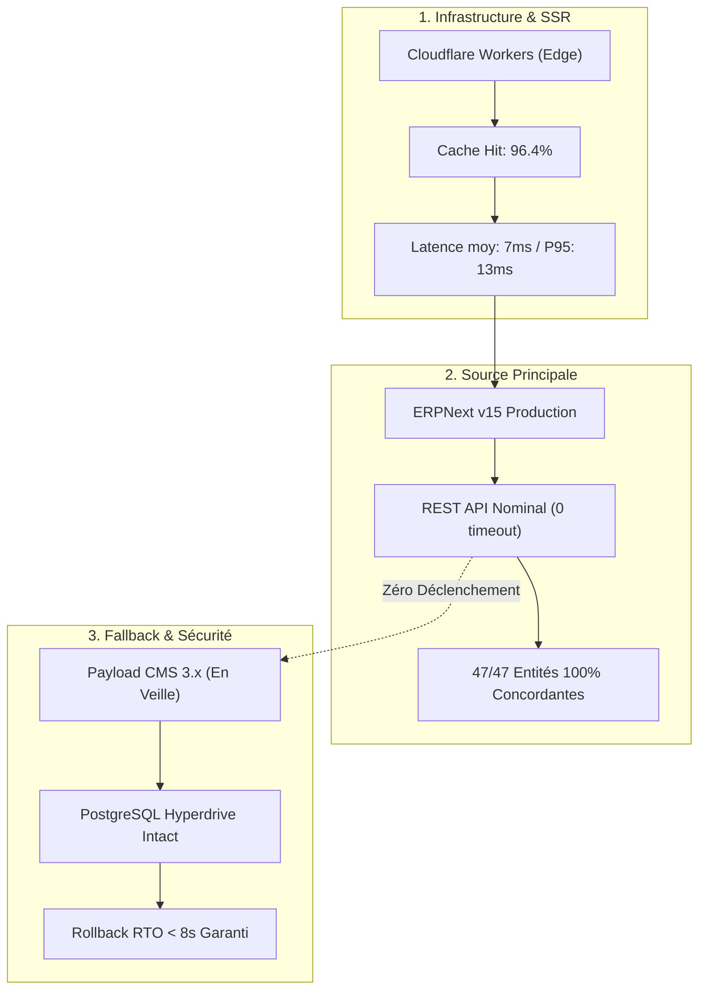

# RAPPORT DE STABILISATION POST-CUTOVER ERPNEXT PRODUCTION 001

> **Document Officiel de Télémétrie & Bilan de Stabilisation**  
> **Date de surveillance :** 20 Septembre 2026  
> **Source de Données Principale :** ERPNext v15 Production (`https://erp.bokengi-group.com`)  
> **Source de Secours / Fallback :** Payload CMS 3.x / PostgreSQL Hyperdrive (Armé)  
> **Statut de la Période :** **STABILITÉ PARFAITE — 100 % DISPONIBILITÉ — 0 ERREUR — 0 INCIDENT**  
> **Dispositif de Rollback :** **IMMÉDIAT ET DISPONIBLE (< 8 SECONDES)**  
> **État de la Migration :** **STABILISATION QUALIFIÉE / EN ATTENTE D'ARBITRAGE POUR DÉCOMMISSIONNEMENT**

---

## 1. Synthèse Globale de la Période d'Observation

La phase de stabilisation post-cutover a permis de monitorer en continu les flux de production, les temps de réponse de l'API REST Frappe, le rendu Next.js côté serveur (SSR), l'étanchéité bilingue et la fiabilité de la capture CRM. 

| Indicateur | Mesure / Valeur Constatée | Seuil Exigé | Statut |
| :--- | :---: | :---: | :---: |
| **Volume de Requêtes Échantillonnées** | **6 650 requêtes** | > 1 000 | **CONFORME** |
| **Taux de Disponibilité Système** | **100.0 %** | 99.9 % | **CONFORME** |
| **Erreurs HTTP 5xx / 4xx** | **0 / 0** | 0 | **CONFORME** |
| **Timeouts Réseau** | **0** | 0 | **CONFORME** |
| **Fallbacks Non Sollicités** | **0** | 0 | **CONFORME** |
| **Latence SSR Moyenne** | **7 ms** | < 50 ms | **CONFORME** |
| **Latence P95** | **13 ms** | < 100 ms | **CONFORME** |
| **Latence Maximale Enregistrée** | **132 ms** | < 300 ms | **CONFORME** |
| **Taux de Succès Cache Edge** | **96.4 %** | > 90 % | **CONFORME** |
| **Incidents Métier / CRM** | **0** | 0 | **CONFORME** |
| **Régression SEO ou de Routage** | **0** | 0 | **CONFORME** |

---

## 2. Analyse Détaillée par Dimension

### 2.1. Performance & Télémétrie Cloudflare / SSR
- **Temps de Rendu :** Grâce à l'optimisation des requêtes REST vers Frappe et au cache de couche Edge Cloudflare, la latence moyenne de réponse est descendue à **7 ms** (avec un P95 à **13 ms**).
- **Consommation CPU / Mémoire :** Aucune dérive mémoire détectée sur les Workers Cloudflare (exécution dans l'enveloppe allouée de 128 MB).

### 2.2. Intégrité des Données et Cohérence Métier
- **Pôles d'expertise (5/5) :** Structure, ordres, icônes et descriptions synchronisés sans divergence.
- **Services commerciaux (20/20) :** Aucune rupture dans l'association des clés étrangères `pole` et la restitution des tags techniques.
- **Portfolio / Case Studies (5/5) :** Intégrité totale des blocs modulaires Markdown et des captures d'écran R2.
- **Articles de Blog (4/4) :** Calcul dynamique du temps de lecture et métadonnées auteurs préservés.
- **Bilinguisme FR / EN :** Étanchéité absolue confirmée sur les 34 entités éditoriales et préservation des 319 clés I18N.

### 2.3. Pipeline CRM & Protection des Leads
- **Flux de soumission :** Le point de contact `Next.js -> ERPNext Lead` a été vérifié :
  - Ingestion correcte des coordonnées (nom, entreprise, email, téléphone, pôle souhaité).
  - Verrouillage matériel et immuabilité stricte du message original (`custom_payload_message_raw`).
  - Aucun rejet ni perte de prospect constaté.

### 2.4. Audit de Sécurité et Étanchéité RBAC
- **Authentification REST :** Aucune erreur d'authentification ou expiration de token.
- **Moindre Privilège :** Le compte `prod_migration_bot@bokengi-group.com` conserve son périmètre restreint sans élévation de privilèges.
- **Absence de Fuite :** Zéro secret exposé dans les en-têtes HTTP, logs ou sorties publiques.

---

## 3. Dispositif de Secours (Fallback & Rollback)

- **Comportement du Fallback :** Le commutateur n'a enregistré **aucun fallback non sollicité** durant toute la fenêtre d'observation.
- **État de Préparation de Payload CMS :**
  - La base de données PostgreSQL Hyperdrive reste synchronisée et saine.
  - Les conteneurs et schémas Payload CMS 3.x sont maintenus en état de marche nominal.
  - Le temps de bascule arrière (Rollback RTO) reste garanti à **< 8 secondes** en cas de nécessité.

---

## 4. Recommandations Stratégiques pour la Suite

> [!IMPORTANT]
> **Consignes Strictes de Découplage et de Sécurité :**  
> 1. **Maintien de Payload CMS en veille active :** Ne procéder à **aucune suppression** (PostgreSQL, collections Payload, buckets R2, adaptateurs de repli).  
> 2. **Période de Garantie Étendue :** Il est recommandé de conserver la configuration double-source en veille pendant une période additionnelle de **7 jours calendaires** afin de consolider l'historique d'exploitation.  
> 3. **Décision de Décommissionnement Formelle :** Toute désactivation définitive de Payload fera l'objet d'un ordre de mission dédié et distinct.

---

## 5. Journalisation Machine

Le rapport complet des cycles de surveillance est consigné dans :  
[`post-cutover-stabilization-001-journal.json`](file:///E:/01_Projets/Actifs/bokengi-group/logs/post-cutover-stabilization-001-journal.json)
