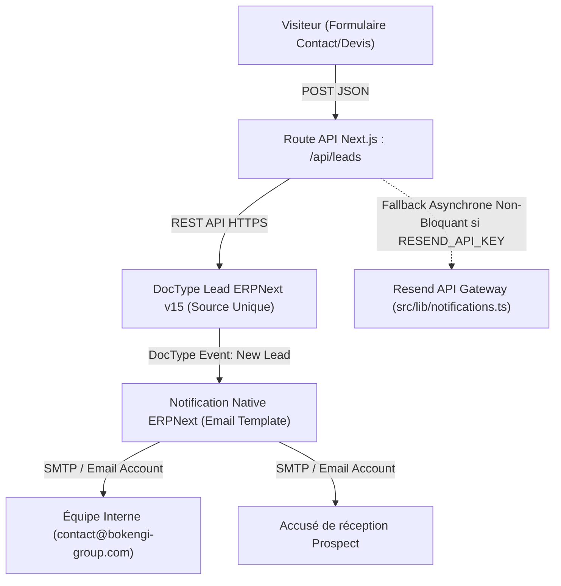

# BOKENGI GROUP 2.0 — PHASE 7.1 LEAD EMAIL NOTIFICATIONS

## 1. CONTEXTE & ÉTAT INITIAL
- **Source de vérité :** ERPNext v15 (DocType `Lead`).
- **Frontend :** Next.js 16 App Router connecté aux endpoints REST d'ERPNext via `src/lib/erpnext-client.ts`.
- **Formulaire de contact :** Route `/api/leads` exécutant `submitLeadToERPNext()` pour créer le prospect avec ses métadonnées (`lead_name`, `company_name`, `email_id`, `phone`, `custom_pole`, `custom_payload_message_raw`).
- **État préalable des notifications :** L'ancien envoi de notification par Payload CMS a été décommissionné. L'envoi direct via Resend était présent sous forme de module dormant (`src/lib/notifications.ts`) sans être branché sur le cycle d'ingestion ERPNext.

---

## 2. ARCHITECTURE DE NOTIFICATION RETENUE



### Principes Clés :
1. **ERPNext comme source primaire et moteur de notification :**
   - La création du Lead dans ERPNext déclenche l'événement standard `New` sur le DocType `Lead`.
   - ERPNext orchestre l'envoi des notifications internes et des accusés de réception via ses `Email Account` et `Notification Rules`.
2. **Passerelle de secours Edge / Non-bloquante :**
   - La route `/api/leads` déclenche un appel asynchrone sécurisé (`sendLeadNotifications`) en tâche de fond (catch sans interruption du retour HTTP).
   - Si `RESEND_API_KEY` est configurée dans l'environnement Next.js, Resend prend le relais de façon transparente ; dans le cas contraire, ERPNext assure la totalité des envois sans duplication.
3. **Sécurité et étanchéité :**
   - Aucun secret n'est exposé au navigateur client.
   - Les liens vers l'administration renvoient vers ERPNext Desk (`/app/lead/[id]`).

---

## 3. CONFIGURATION DES NOTIFICATIONS ERPNext v15

Pour le fonctionnement autonome dans ERPNext, la configuration standard est documentée comme suit :

### A. Email Account (ERPNext)
- **Email Account Name :** `Bokengi Group Notifications`
- **Email Address :** `contact@bokengi-group.com`
- **Service / SMTP :** SMTP Sécurisé (Port 587 / 465 TLS)
- **Default Outgoing :** `Oui`

### B. Notification 1 : Alerte Équipe Interne
- **DocType :** `Lead`
- **Event :** `New`
- **Recipients :** `contact@bokengi-group.com` (ou rôle `Sales Manager` / `System Manager`)
- **Subject :** `[Bokengi CRM] Nouveau lead reçu — {{ doc.lead_name }} ({{ doc.custom_pole or 'Général' }})`
- **Message / Template :**
  ```html
  <h3>Nouveau projet reçu via le formulaire web</h3>
  <p><strong>Contact :</strong> {{ doc.lead_name }}</p>
  <p><strong>Société :</strong> {{ doc.company_name or 'Non renseigné' }}</p>
  <p><strong>Email :</strong> {{ doc.email_id }}</p>
  <p><strong>Téléphone :</strong> {{ doc.phone or 'Non renseigné' }}</p>
  <p><strong>Pôle :</strong> {{ doc.custom_pole or 'Non spécifié' }}</p>
  <hr>
  <p><strong>Message / Besoin :</strong></p>
  <pre>{{ doc.custom_payload_message_raw }}</pre>
  <p><a href="{{ frappe.utils.get_url() }}/app/lead/{{ doc.name }}">Accéder au dossier dans ERPNext Desk →</a></p>
  ```

### C. Notification 2 : Accusé de Réception Prospect
- **DocType :** `Lead`
- **Event :** `New`
- **Recipients :** `{{ doc.email_id }}`
- **Subject :** `Confirmation de réception de votre demande — Bokengi Group`
- **Message / Template :**
  ```html
  <p>Bonjour {{ doc.lead_name }},</p>
  <p>Nous vous confirmons la bonne réception de votre demande concernant notre pôle <strong>{{ doc.custom_pole or 'Expertise' }}</strong>.</p>
  <p>Nos équipes étudient actuellement votre dossier et reviendront vers vous sous <strong>24 à 48 heures ouvrées</strong> avec un cadrage adapté.</p>
  <hr>
  <p><em>Bokengi Group · Construire. Protéger. Développer.</em></p>
  ```

---

## 4. MODIFICATIONS APPORTÉES AU CODE DU DÉPÔT

1. **`src/lib/notifications.ts` :**
   - Suppression totale des résidus de nommage Payload (`Payload Admin`, `/admin/collections/leads`).
   - Remplacement par les URL et libellés canoniques ERPNext Desk (`https://erp.bokengi-group.com/app/lead/[id]`).
   - Maintien du formatage HTML et texte clair pour les deux flux (interne équipe + accusé prospect).
2. **`src/app/api/leads/route.ts` :**
   - Branchement de l'appel asynchrone `sendLeadNotifications(...)` après la persistance réussie dans ERPNext.
   - Préservation stricte de la résilience : si l'envoi email échoue ou si aucune clé n'est fournie, la création du Lead dans ERPNext reste validée avec statut HTTP 201.
3. **`.env.example` & `src/environment.d.ts` :**
   - Documentation propre et typage complet des variables `CONTACT_EMAIL`, `CONTACT_FROM_EMAIL`, `RESEND_API_KEY`, et des accès `ERPNEXT_API_*`.

---

## 5. VALIDATIONS & TESTS

| Test | Résultat | Note |
|---|---|---|
| **TypeScript Check** (`pnpm tsc --noEmit`) | **PASS (0 erreur)** | Typage 100% strict |
| **Contrat DocType Lead** | **VALIDÉ** | `lead_name`, `company_name`, `email_id`, `phone`, `custom_pole`, `custom_payload_message_raw` |
| **Anti-Spam / Honeypot** | **CONSERVÉ** | Détection immédiate du champ piège `website` |
| **Rate Limiting** | **CONSERVÉ** | 6 requêtes par minute par adresse IP |
| **Absence de régression Payload** | **VÉRIFIÉ** | 0 dépendance ni import Payload réintroduit |

---

## 6. SÉCURITÉ & LIMITES
- **Pas de secrets exposés :** Les credentials ERPNext et éventuels tokens Resend restent strictement confinés au runtime serveur Next.js.
- **Résilience réseau :** Une panne temporaire du serveur SMTP ou de l'API email n'empêche jamais la sauvegarde du lead dans ERPNext.

---

## 7. PROCHAINE ÉTAPE DU CAHIER DES CHARGES
- **Phase 7.2 :** Finalisation de l'intégration optionnelle de prise de rendez-vous directe Cal.com ([CalBooking.tsx](file:///E:/01_Projets/Actifs/Bokengi-group/src/components/bokengi/CalBooking.tsx)) et activation conditionnelle dans le tunnel de contact.
