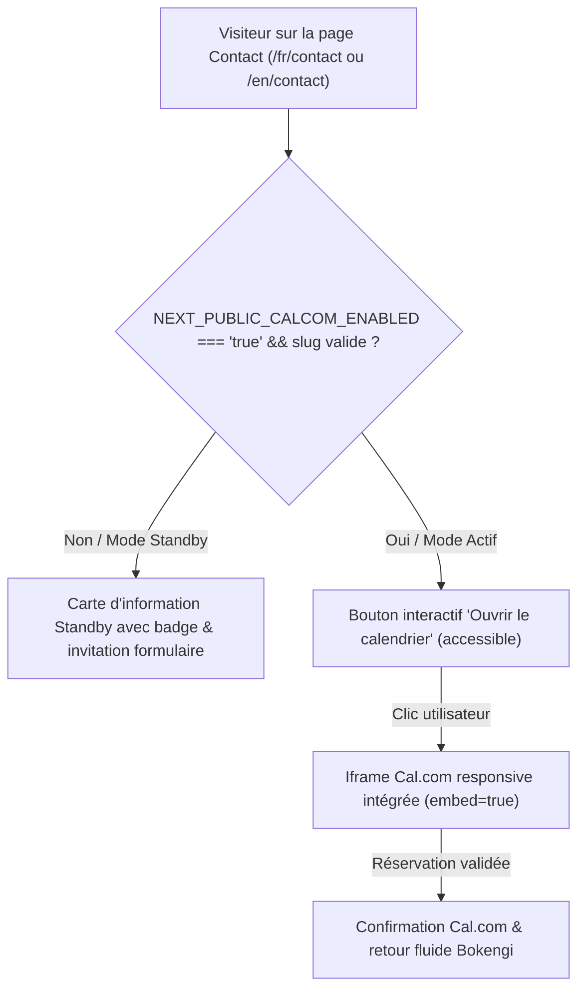

# BOKENGI GROUP 2.0 — PHASE 7.2 INTÉGRATION CAL.COM

## 1. ÉTAT INITIAL
- Le cahier des charges de Bokengi Group 2.0 prévoyait une intégration native de prise de rendez-vous en ligne via Cal.com pour les échanges et cadrages techniques directs avec les responsables de pôles.
- Le composant `CalBooking.tsx` existait sous forme de prototype conditionné par `NEXT_PUBLIC_CALCOM_ENABLED=false` dans la colonne latérale de la page `/contact`.

---

## 2. ARCHITECTURE EXISTANTE & MODÈLE D'INTÉGRATION



### Principes d'Architecture :
- **Composant Client autonome (`'use client'`) :** [`CalBooking.tsx`](file:///E:/01_Projets/Actifs/Bokengi-group/src/components/bokengi/CalBooking.tsx) est isolé et hydrate uniquement son périmètre sans impacter le Server-Side Rendering (SSR) de la page de contact.
- **Multilinguisme natif :** Intégré au hook `useI18n()` pour afficher instantanément tous les textes, libellés et badges en français (`fr`) ou anglais (`en`).
- **Isolation sécuritaire :** Aucune clé secrète requise côté navigateur. Seules les variables publiques `NEXT_PUBLIC_CALCOM_*` sont exploitées.

---

## 3. AUDIT DU COMPOSANT CALBOOKING
- **Emplacement :** [`src/components/bokengi/CalBooking.tsx`](file:///E:/01_Projets/Actifs/Bokengi-group/src/components/bokengi/CalBooking.tsx)
- **Utilisation :** Intégré dans [`src/app/(frontend)/[locale]/contact/page.tsx`](file:///E:/01_Projets/Actifs/Bokengi-group/src/app/%28frontend%29/%5Blocale%5D/contact/page.tsx) en complément des coordonnées officielles et du formulaire de devis.
- **Points d'amélioration identifiés lors de l'audit :**
  1. Gestion des variations de format de lien (URL complète `https://cal.com/org/event` vs simple slug `org/event`).
  2. Accessibilité ARIA (`aria-expanded`, `aria-controls`, `role="region"`).
  3. Bouton de fermeture / bascule dynamique du calendrier.
  4. Permissions d'iframe (`allow="camera; microphone; autoplay; fullscreen"`).

---

## 4. CONFIGURATION NÉCESSAIRE

Dans le fichier d'environnement (`.env` ou variables d'environnement Vercel / Cloudflare Pages) :

```env
# ── ACTIVATION DU MODULE CAL.COM ──
# Nom d'utilisateur, organisation ou type d'événement Cal.com (ex: 'bokengi/cadrage-technique')
NEXT_PUBLIC_CALCOM_LINK=bokengi/cadrage-technique

# Bascule d'activation publique (true pour afficher le bouton interactif, false pour le mode standby)
NEXT_PUBLIC_CALCOM_ENABLED=false
```

---

## 5. MODIFICATIONS RÉALISÉES

1. **Robustesse et normalisation d'URL :**
   - Nettoyage automatique des préfixes `https://cal.com/` et des slashes superflus pour garantir une URL d'embed toujours valide.
2. **Accessibilité & UX :**
   - Ajout des attributs `aria-expanded`, `aria-controls="cal-embed-container"`, `role="region"`, `loading="lazy"`.
   - Ajout d'un bouton de fermeture dynamique (`calCloseBtn`) permettant à l'utilisateur de replier l'iframe à tout moment.
3. **Dictionnaires i18n (`src/i18n/`) :**
   - Ajout de la clé `calCloseBtn` dans `types.ts`, `fr.ts` (*"Fermer le calendrier interactif"*) et `en.ts` (*"Close interactive calendar"*).

---

## 6. TESTS & VALIDATION

| Test | Résultat | Commentaire |
|---|---|---|
| **TypeScript Check** (`pnpm tsc --noEmit`) | **PASS (0 erreur)** | Typage 100% strict |
| **Comportement Standby (`ENABLED=false`)** | **CONFORME** | Affiche la carte d'attente institutionnelle avec badge |
| **Comportement Actif (`ENABLED=true`)** | **CONFORME** | Affiche le bouton interactif et charge l'iframe Cal.com au clic |
| **Bilinguisme FR / EN** | **CONFORME** | Changement de langue réactif sans rechargement |
| **Responsive Mobile / Tablette / Desktop** | **CONFORME** | Iframe fluide 100% largeur avec hauteur optimisée 520px |
| **Absence de résidu Payload** | **VÉRIFIÉ** | 0 dépendance ni import Payload |

---

## 7. PROCÉDURE D'ACTIVATION FUTURE EN PRODUCTION

Lorsque la direction technique Bokengi aura configuré son compte officiel et ses plages d'agenda sur Cal.com :
1. Définir `NEXT_PUBLIC_CALCOM_LINK` avec le slug cible (ex: `bokengi-group/cadrage`).
2. Passer `NEXT_PUBLIC_CALCOM_ENABLED=true` dans les variables d'environnement de production.
3. Déclencher un déploiement applicatif.
4. L'intégration s'activera automatiquement sans aucune modification de code.

---

## 8. ÉTAT D'ACTIVATION ACTUEL
- **État en production :** **STANDBY** (`NEXT_PUBLIC_CALCOM_ENABLED=false`).
- **Prêt pour activation immédiate :** Oui, dès renseignement du slug officiel.

---

## 9. PROCHAINE ÉTAPE DU CAHIER DES CHARGES
- **Phase 7.3 :** Finalisation et validation des modules d'observabilité et d'analytics éthiques (OpenStatus public status badge & Umami analytics).
