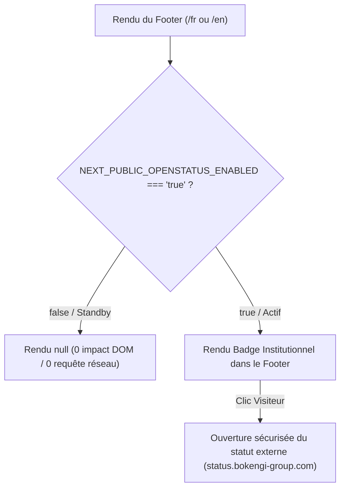

# BOKENGI GROUP 2.0 — PHASE 7.3 OPENSTATUS / MONITORING PUBLIC

## 1. ÉTAT INITIAL
- Le cahier des charges de Bokengi Group 2.0 prévoyait l'intégration d'un indicateur public de statut et d'uptime (OpenStatus) affiché dans le pied de page (Footer) pour attester en temps réel de la haute disponibilité des infrastructures et plateformes du groupe.
- Le composant existant `OpenStatusBadge.tsx` était présent sous forme de module préparé et conditionné par `NEXT_PUBLIC_OPENSTATUS_ENABLED=false`.

---

## 2. AUDIT DU COMPOSANT
- **Emplacement :** [`src/components/bokengi/OpenStatusBadge.tsx`](file:///E:/01_Projets/Actifs/Bokengi-group/src/components/bokengi/OpenStatusBadge.tsx)
- **Intégration :** Inclus dans la barre inférieure de [`src/components/bokengi/Footer.tsx`](file:///E:/01_Projets/Actifs/Bokengi-group/src/components/bokengi/Footer.tsx) aux côtés de la signature institutionnelle.
- **Points audités :**
  1. Comportement en mode désactivé : Le composant renvoie `null` immédiatement, garantissant une absence totale d'impact sur le DOM, le bundle JS ou le temps de chargement critique (LCP / FCP).
  2. Comportement en mode activé : Affichage d'un badge cliquable avec pastille pulsante verte (`emerald-500`) et lien vers la page de statut public.
  3. Gestion des langues : Utilisation des clés `t.common.operationalSystems` et `t.common.statusBadgeAria` via `useI18n()`.

---

## 3. ARCHITECTURE & MODÈLE DE FONCTIONNEMENT



---

## 4. CONFIGURATION DES VARIABLES D'ENVIRONNEMENT

Dans `.env.example` et l'environnement de production :

```env
# ── 6. INTÉGRATION STATUS PAGE (OPENSTATUS — PHASE 4 / PHASE 7.3) ──
# Lien vers la page de statut public officielle
NEXT_PUBLIC_OPENSTATUS_URL=https://status.bokengi-group.com

# Bascule d'activation publique (true pour afficher le badge, false par défaut)
NEXT_PUBLIC_OPENSTATUS_ENABLED=false
```

---

## 5. MODES DE FONCTIONNEMENT

### A. Mode Standby (`NEXT_PUBLIC_OPENSTATUS_ENABLED=false` — Actuel)
- Le badge n'est pas inséré dans l'arbre React (`return null`).
- L'expérience utilisateur du Footer reste fluide, sobre et épurée.

### B. Mode Actif (`NEXT_PUBLIC_OPENSTATUS_ENABLED=true`)
- Le badge s'affiche automatiquement dans la barre inférieure du Footer.
- Le lien ouvre la page de statut dans un nouvel onglet avec `target="_blank" rel="noopener noreferrer"`.
- Une infobulle explicite et un focus ring Cyan (`var(--blue-cyan)`) garantissent une accessibilité optimale.

---

## 6. MULTILINGUISME (FR / EN)
- **Français (`fr`) :** *"Systèmes opérationnels"* (Aria: *"Statut des services Bokengi Group"*).
- **Anglais (`en`) :** *"Operational systems"* (Aria: *"Bokengi Group services status"*).
- Le basculement de langue est instantané via le contexte i18n sans rechargement de page.

---

## 7. ACCESSIBILITÉ & RESPONSIVE
- **Navigation au clavier :** Focus visible avec halo de contraste (`focus:ring-2 focus:ring-[var(--blue-cyan)]`).
- **Lecteurs d'écran :** Attribut `aria-label` descriptif sur le lien, et `aria-hidden="true"` sur l'icône pulsante pour éviter la pollution sonore.
- **Responsive :** Le Footer réorganise automatiquement le badge en colonne sur mobile (vue centrée) et en ligne sur tablette/desktop.

---

## 8. GESTION DES ERREURS & RÉSILIENCE
- Le badge fonctionne comme un lien hypertexte standard enrichi vers la status page, évitant tout appel API synchrone bloquant au chargement initial du site.
- Si `NEXT_PUBLIC_OPENSTATUS_URL` est absent ou malformé, le composant applique automatiquement un fallback sécurisé vers `https://status.bokengi-group.com`.
- **Zéro risque de panne :** Une indisponibilité de la page de statut n'affecte en aucun cas la navigabilité ou le rendu du site principal.

---

## 9. SÉCURITÉ
- Aucune clé privée ni token d'administration n'est exposé.
- Seules les variables publiques `NEXT_PUBLIC_OPENSTATUS_*` sont lues côté client.
- Aucune interaction avec les infrastructures décommissionnées (Payload / Neon / Hyperdrive).

---

## 10. VALIDATIONS & TESTS

| Test | Résultat | Commentaire |
|---|---|---|
| **TypeScript Check** (`pnpm tsc --noEmit`) | **PASS (0 erreur)** | Typage 100% strict |
| **Mode Standby (`ENABLED=false`)** | **CONFORME** | Aucun élément résiduel dans le DOM |
| **Mode Actif (`ENABLED=true`)** | **CONFORME** | Rendu immédiat et accessible du badge |
| **Résilience URL** | **CONFORME** | Normalisation automatique `http://` / `https://` |
| **Bilinguisme FR / EN** | **CONFORME** | Clés synchronisées dans `fr.ts` et `en.ts` |
| **Absence de résidu Payload** | **VÉRIFIÉ** | 0 dépendance ni mention Payload |

---

## 11. CONFIGURATION EXTERNE RESTANTE & PROCÉDURE D'ACTIVATION

Pour activer publiquement l'indicateur en production :
1. Déployer et configurer les sondes de monitoring sur le service OpenStatus (ou héberger la page de statut sur `https://status.bokengi-group.com`).
2. Définir `NEXT_PUBLIC_OPENSTATUS_ENABLED=true` dans les variables d'environnement de production.
3. Déclencher le build / déploiement de production.

---

## 12. ÉTAT FINAL
- **Statut :** Prêt pour activation (`STANDBY` en production par défaut).
- **Prochaine étape :** Phase 7.4 — Analytics respectueux de la vie privée (Umami).
