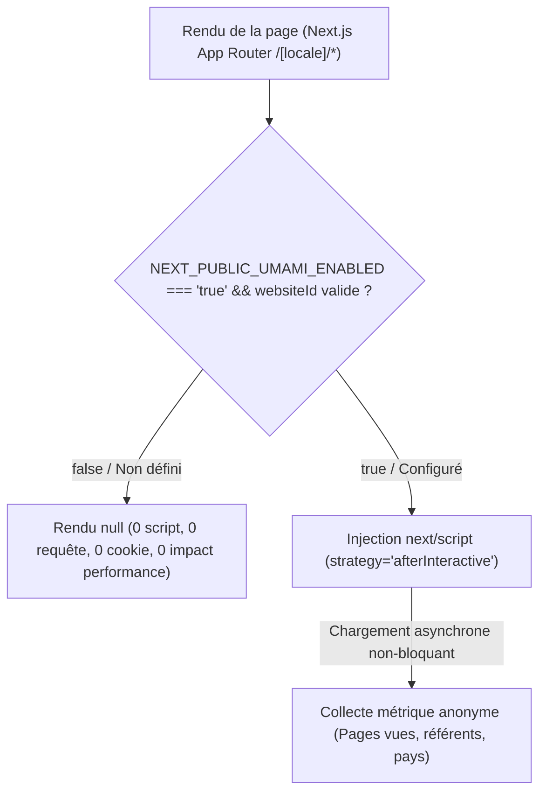

# BOKENGI GROUP 2.0 — PHASE 7.4 INTÉGRATION UMAMI ANALYTICS

## 1. ÉTAT AVANT INTÉGRATION
- Le cahier des charges de Bokengi Group 2.0 prévoyait une mesure d'audience institutionnelle respectueuse de la vie privée (Privacy-First / RGPD compliant sans cookies de pistage publicitaire) basée sur la solution open-source Umami Analytics.
- Le composant `UmamiAnalytics.tsx` était positionné dans le layout racine bilingue `src/app/(frontend)/[locale]/layout.tsx`, conditionné par `NEXT_PUBLIC_UMAMI_ENABLED=false`.

---

## 2. ARCHITECTURE RETENUE



### Principes Clés :
1. **Zéro injection en mode Standby :** Si `NEXT_PUBLIC_UMAMI_ENABLED` est à `false` ou non défini, le composant retourne `null`. Aucun script n'est téléchargé ni exécuté.
2. **Chargement non-bloquant :** En mode actif, le script est injecté via `next/script` avec la stratégie `afterInteractive`, garantissant que le chargement et le rendu initial du contenu critique (LCP/FCP) restent prioritaires.
3. **Compatibilité App Router & i18n :** Intégré au niveau de `LocaleLayout`, Umami suit les transitions de routes (`/fr/*`, `/en/*`) de façon transparente avec `data-auto-track="true"`.
4. **Découplage total :** Aucune interaction avec ERPNext, les DocTypes CRM ou le bucket Cloudflare R2.

---

## 3. VARIABLES D'ENVIRONNEMENT

Documentées dans `.env.example` et typées dans `src/environment.d.ts` :

```env
# ── 7. MESURE D'AUDIENCE & ANALYTICS (UMAMI — PHASE 4 / PHASE 7.4) ──
# Identifiant unique de site généré par l'instance Umami
NEXT_PUBLIC_UMAMI_WEBSITE_ID=

# URL du script tracker (par défaut : instance cloud Umami ou instance auto-hébergée)
NEXT_PUBLIC_UMAMI_SRC=https://analytics.umami.is/script.js

# URL hôte pour collecteur personnalisé / proxy (optionnel)
NEXT_PUBLIC_UMAMI_HOST_URL=

# Bascule d'activation publique (true pour charger le tracker, false par défaut)
NEXT_PUBLIC_UMAMI_ENABLED=false
```

---

## 4. MODES DE FONCTIONNEMENT

### A. Mode Standby (`NEXT_PUBLIC_UMAMI_ENABLED=false` — Actuel)
- **0 script Umami injecté**.
- **0 requête réseau** vers les serveurs analytics.
- **0 cookie déposé** sur le terminal du visiteur.
- **0 impact** sur les performances de chargement.

### B. Mode Actif (`NEXT_PUBLIC_UMAMI_ENABLED=true`)
- Injection sécurisée du tag script avec attributs sanitizés :
  - `src` nettoyé (URL sécurisée HTTPS)
  - `data-website-id` (identifiant public Umami)
  - `data-auto-track="true"` (suivi automatique des vues d'écran Next.js)
  - `data-host-url` (support de proxy personnalisé si renseigné)

---

## 5. RESPECT DE LA VIE PRIVÉE & CONFORMITÉ RGPD
- **Zéro donnée personnelle collectée :** Umami ne collecte aucune adresse IP nominative, aucun identifiant persistant, et ne dépose aucun cookie de profilage.
- **Étanchéité totale :** Les contenus de formulaires de contact (`/api/leads`), les demandes d'accès et les échanges API ERPNext ne transitent à aucun moment par la couche analytics.

---

## 6. VALIDATIONS & TESTS

| Test | Résultat | Note |
|---|---|---|
| **TypeScript Check** (`pnpm tsc --noEmit`) | **PASS (0 erreur)** | Typage 100% strict |
| **Validation Mode Standby** | **CONFORME** | 0 script chargé, `return null` |
| **Validation Mode Actif** | **CONFORME** | Script `afterInteractive` prêt pour activation |
| **Routage bilingue FR / EN** | **CONFORME** | Intégration dans `LocaleLayout` sans double injection |
| **Absence de régression Payload** | **VÉRIFIÉ** | 0 dépendance ni mention Payload |
| **Étanchéité ERPNext & R2** | **VÉRIFIÉ** | Flux analytics 100% isolé |

---

## 7. CONFIGURATION RESTANTE & PROCÉDURE D'ACTIVATION

Pour activer le suivi d'audience lors de la mise en service officielle :
1. Créer le site sur l'instance Umami officielle de Bokengi Group (ou Cloud Umami) pour obtenir le `Website ID`.
2. Définir dans les variables d'environnement de production :
   - `NEXT_PUBLIC_UMAMI_WEBSITE_ID=<votre-website-id>`
   - `NEXT_PUBLIC_UMAMI_ENABLED=true`
3. Déclencher un déploiement applicatif.

---

## 8. CONCLUSION
L'intégration du module Umami Analytics est finalisée, résiliente et parfaitement découplée. Le mode Standby par défaut est validé.
