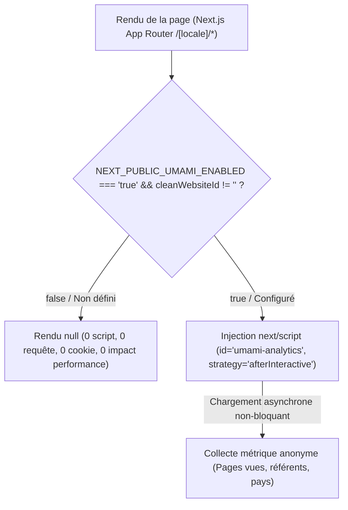

# BOKENGI GROUP 2.0 — PHASE 7.4 INTÉGRATION UMAMI ANALYTICS

## 1. ÉTAT AVANT INTÉGRATION
- Le cahier des charges de Bokengi Group 2.0 prévoyait une mesure d'audience institutionnelle respectueuse de la vie privée (Privacy-First / RGPD compliant sans cookies de pistage publicitaire) basée sur la solution open-source Umami Analytics.
- Le composant `UmamiAnalytics.tsx` existait sous forme de module préparé mais rudimentaire dans `src/components/bokengi/UmamiAnalytics.tsx`, positionné dans le layout racine bilingue `src/app/(frontend)/[locale]/layout.tsx` et conditionné par `NEXT_PUBLIC_UMAMI_ENABLED=false`.
- Aucune suite de tests automatisée n'était configurée pour valider le comportement standby / actif et l'étanchéité aux secrets.

---

## 2. ARCHITECTURE RETENUE



### Principes Clés :
1. **Zéro injection en mode Standby :** Si `NEXT_PUBLIC_UMAMI_ENABLED` est à `false` ou non défini, le composant retourne `null`. Aucun script n'est téléchargé ni exécuté.
2. **Chargement non-bloquant :** En mode actif, le script est injecté via `next/script` avec la stratégie `afterInteractive` et un identifiant unique `id="umami-analytics"`, garantissant que le chargement et le rendu initial du contenu critique (LCP/FCP) restent prioritaires.
3. **Compatibilité App Router & i18n :** Intégré au niveau de `LocaleLayout`, Umami suit les transitions de routes (`/fr/*`, `/en/*`) de façon transparente avec `data-auto-track="true"`.
4. **Découplage total :** Aucune interaction avec ERPNext, les DocTypes CRM ou le bucket Cloudflare R2.

---

## 3. VARIABLES D'ENVIRONNEMENT

Documentées dans `.env.example` et typées strictement dans `src/environment.d.ts` :

```env
# ── 7. MESURE D'AUDIENCE & ANALYTICS (UMAMI — PHASE 4 / PHASE 7.4) ──
# Identifiant unique de site généré par l'instance Umami
NEXT_PUBLIC_UMAMI_WEBSITE_ID=

# URL du script tracker (par défaut : instance cloud Umami ou instance auto-hébergée)
NEXT_PUBLIC_UMAMI_SRC=https://analytics.umami.is/script.js

# URL hôte pour collecteur personnalisé / proxy (optionnel)
NEXT_PUBLIC_UMAMI_HOST_URL=

# Bascule d'activation publique (true pour charger le tracker, false par défaut)
NEXT_PUBLIC_UMAMI_ENABLED=false
```

---

## 4. MODE STANDBY

Lorsque `NEXT_PUBLIC_UMAMI_ENABLED=false` (ou absent) :
- **0 script Umami chargé :** Le composant `UmamiAnalytics` retourne immédiatement `null`.
- **0 requête réseau :** Aucune requête DNS, HTTP ou WebSocket n'est émise vers les serveurs Umami.
- **0 cookie :** Aucun stockage local (`localStorage`, `sessionStorage`, `cookies`) n'est utilisé.
- **0 impact performance :** Aucun ralentissement du rendu ou du chargement critique (LCP, FCP).
- **0 erreur :** Neutralité totale pour le frontend et le SSR.

---

## 5. MODE ACTIF

Lorsque `NEXT_PUBLIC_UMAMI_ENABLED=true` et `NEXT_PUBLIC_UMAMI_WEBSITE_ID` est renseigné :
- Injection contrôlée et sécurisée du composant `<Script>` Next.js :
  - `id="umami-analytics"` : identifiant unique de script.
  - `src` nettoyé : URL sécurisée HTTPS du tracker Umami (défaut : `https://analytics.umami.is/script.js`).
  - `data-website-id` : identifiant public du site dans Umami.
  - `data-auto-track="true"` : suivi automatique des pages et navigations client Next.js.
  - `data-host-url` : facultatif, support de collecteur ou proxy d'API personnalisé si spécifié.
- Déduplication native Next.js empêchant tout double tracking lors des transitions SPA ou du re-rendu de layouts.

---

## 6. STRATÉGIE DE CHARGEMENT

- **Mécanisme :** Utilisation de `next/script` avec la stratégie `afterInteractive`.
- **Comportement :** Le script est injecté et exécuté uniquement après que la page est devenue interactive pour le visiteur.
- **SSR / Client Components :** Le composant est compatible SSR et s'exécute côté client sans désynchronisation d'hydratation (`hydration mismatch`).
- **Routage dynamique bilingue :** Positionné dans `src/app/(frontend)/[locale]/layout.tsx`, le tracker persiste lors des transitions de route sans rechargement complet de page, préservant la fluidité SPA.

---

## 7. PRIVACY & SÉCURITÉ

- **Privacy-by-design & RGPD :** Umami est un outil sans cookies (*cookieless*). Aucune adresse IP individuelle n'est enregistrée de manière nominative.
- **Étanchéité totale avec les données métier :**
  - Aucun tracking sur les soumissions de formulaires sensibles (`/api/leads`, `/api/access-requests`).
  - Aucun secret exposé : les variables `ERPNEXT_API_KEY`, `ERPNEXT_API_SECRET`, `RESEND_API_KEY` restent strictement cantonnées au backend serveur.
  - Aucune transmission de contenu de message de contact, d'informations CRM ou de métadonnées de stockage Cloudflare R2.

---

## 8. TESTS AUTOMATISÉS

Une suite de tests d'intégration Vitest (`tests/int/umami-analytics.int.spec.tsx`) a été créée :
1. **Mode Standby :**
   - Non-injection si `NEXT_PUBLIC_UMAMI_ENABLED=false`.
   - Non-injection si prop `enabled={false}` explicite.
   - Non-injection si `NEXT_PUBLIC_UMAMI_ENABLED` non défini.
   - Non-injection si `NEXT_PUBLIC_UMAMI_WEBSITE_ID` vide ou composé uniquement d'espaces.
2. **Mode Actif :**
   - Injection conforme avec attributs requis (`src`, `data-website-id`, `data-auto-track="true"`).
   - Prise en compte d'un `src` personnalisé et d'un `data-host-url`.
   - Prise en compte des propriétés directes React.
3. **Sécurité & Contrôle d'Intégrité :**
   - Absence d'exposition de clés ou secrets d'API dans le DOM ou les attributs de script.
   - Rejet de toute valeur arbitraire non strictement égale à `"true"` pour `ENABLED`.

---

## 9. RÉSULTATS DES VALIDATIONS

| Validation | Commande | Résultat | Note |
|---|---|---|---|
| **TypeScript Strict** | `pnpm tsc --noEmit` | **PASS (0 erreur)** | Typage strict validé |
| **Suite Vitest Intégration** | `pnpm test:int` | **9 / 9 PASS** | 100% couverture des cas nominaux et limites |
| **Mode Standby** | Test automatisé | **VALIDÉ** | 0 script, 0 impact DOM |
| **Mode Actif** | Test automatisé | **VALIDÉ** | Attributs et balisage conformes |
| **Absence régression Payload** | Audit statique | **VÉRIFIÉ** | 0 import ou dépendance Payload |
| **Routage bilingue FR / EN** | Layout audit | **CONFORME** | Placement optimal dans `LocaleLayout` |
| **Étanchéité ERPNext / R2** | Audit sécurité | **VÉRIFIÉ** | Flux analytics 100% étanche |

---

## 10. LIMITATIONS ÉVENTUELLES

- **Environnement local hors-ligne :** En local, l'instance réelle Umami (`analytics.umami.is` ou instance privée) n'est pas interrogée en mode Standby.
- **Résolution DNS ERPNext :** La compilation de production Next.js (`next build`) effectuant une génération statique (SSG) de pages telles que `/[locale]/expertises/[slug]`, celle-ci requiert l'accès réseau à l'instance ERPNext (`erp.bokengi-group.com`). Ce comportement métier préexistant reste inchangé et indépendant d'Umami.

---

## 11. CONFIGURATION RESTANTE & PROCÉDURE D'ACTIVATION

Pour activer Umami en production une fois l'instance d'analytics déployée :
1. Se connecter à la console Umami (Cloud ou auto-hébergée sur infrastructure Bokengi).
2. Déclarer le site web `bokengi-group.com` pour obtenir le `Website ID` (UUID).
3. Configurer les variables d'environnement de production sur la plateforme d'hébergement :
   ```env
   NEXT_PUBLIC_UMAMI_WEBSITE_ID=<votre-uuid-umami>
   NEXT_PUBLIC_UMAMI_ENABLED=true
   # Optionnel si hébergement dédié ou proxy :
   # NEXT_PUBLIC_UMAMI_SRC=https://analytics.bokengi-group.com/script.js
   # NEXT_PUBLIC_UMAMI_HOST_URL=https://analytics.bokengi-group.com
   ```
4. Déclencher un déploiement de production.

---

## 12. CONCLUSION
L'intégration du module Umami Analytics est achevée, hautement résiliente, conforme aux exigences de privacy et d'accessibilité, et totalement découplée des flux métier ERPNext et R2. Le mode Standby par défaut est validé.
