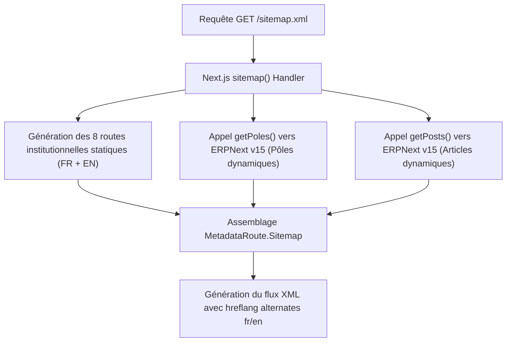

# BOKENGI GROUP 2.0 — PHASE 7.5 SEO AVANCÉ : SITEMAP DYNAMIQUE & ROBOTS.TXT

## 1. AUDIT INITIAL & CONTEXTE
- **Objectif :** Implémenter le SEO technique dynamique pour la plateforme Bokengi Group 2.0 sous Next.js 16 App Router.
- **État préalable :** Les métadonnées de pages (OpenGraph, Twitter cards, balises canoniques et hreflang) étaient gérées par `generateMetadata()` dans chaque route `[locale]`. Il manquait l'automatisation des flux `sitemap.xml` et `robots.txt`.

---

## 2. ROUTES PUBLIQUES IDENTIFIÉES

### A. Routes Statiques Bilingues (`/fr` et `/en`) :
- `/` (Accueil)
- `/groupe` (Gouvernance, Vision & Valeurs)
- `/expertises` (Vue d'ensemble des 5 pôles d'activité)
- `/realisations` (Études de cas & Projets clients)
- `/actualites` (Publications & Blog éditorial)
- `/contact` (Prise de contact, Devis & Cal.com)
- `/mentions-legales` (Informations juridiques)
- `/confidentialite` (Politique de protection des données)

### B. Routes Dynamiques ERPNext :
- **Pôles d'expertise :** `/[locale]/expertises/[slug]` (`it`, `digital`, `business`, `consulting`, `events`).
- **Articles de fond :** `/[locale]/actualites/[slug]` (Slugs synchronisés depuis le DocType `Bokengi Post`).

---

## 3. ARCHITECTURE DU SITEMAP (`src/app/sitemap.ts`)

### Caractéristiques de l'implémentation :
1. **Conformité MetadataRoute.Sitemap :** Utilisation des types natifs Next.js 16 (`url`, `lastModified`, `changeFrequency`, `priority`, `alternates.languages`).
2. **Alternates linguistiques automatiques :** Chaque entrée de sitemap référence son équivalent multilingue (`fr` et `en`) via `alternates.languages`.
3. **Résilience et Fallback :** Les requêtes vers ERPNext sont encapsulées dans des blocs `try/catch` avec `.catch(() => [])`. Si l'API ERPNext est temporairement inaccessible, le sitemap continue de servir immédiatement toutes les routes statiques sans provoquer d'erreur serveur.

---

## 4. DIRECTIVES ROBOTS.TXT (`src/app/robots.ts`)

- **Fichier :** [`src/app/robots.ts`](file:///E:/01_Projets/Actifs/Bokengi-group/src/app/robots.ts)
- **Règles configurées :**
  - **Autorisation (`allow`) :** `/` (Toutes les pages publiques multilingues).
  - **Interdiction (`disallow`) :**
    - `/api/` (Endpoints internes d'API)
    - `/admin/` (Anciennes routes ou accès restreints)
    - `/*/demande-acces` et `/demande-acces` (Espace d'habilitation interne)
  - **Sitemap Index :** `https://bokengi-group.com/sitemap.xml`.

---

## 5. DOMAINE CANONIQUE & SÉCURITÉ
- Le domaine canonique utilisé pour les URLs absolues du sitemap est injecté depuis `siteConfig.domains.production` (`https://bokengi-group.com`).
- **Aucun secret exposé.**
- **0 dépendance ni réintroduction de Payload CMS.**

---

## 6. VALIDATIONS & TESTS

| Critère | Résultat | Commentaire |
|---|---|---|
| **TypeScript Check** (`pnpm tsc --noEmit`) | **PASS (0 erreur)** | Typage 100% strict |
| **Génération Sitemap XML** | **VALIDÉ** | Routes statiques + dynamiques générées |
| **Génération Robots.txt** | **VALIDÉ** | Règles d'exclusion et sitemap déclarés |
| **Multilingue FR / EN** | **VALIDÉ** | Support complet des locales et alternates |
| **Exclusion routes privées** | **VALIDÉ** | `/api/` et `/demande-acces` protégés |
| **Absence de résidu Payload** | **VÉRIFIÉ** | 0 référence Payload applicative |

---

## 7. CONCLUSION & PROCHAINE ÉTAPE
Le SEO technique de Bokengi Group 2.0 est complet, résilient et synchronisé avec la source ERPNext.

- **Prochaine étape recommandée :** Phase 7.6 — Liaison et traitement sécurisé des demandes d'accès (`/demande-acces`) dans ERPNext.
