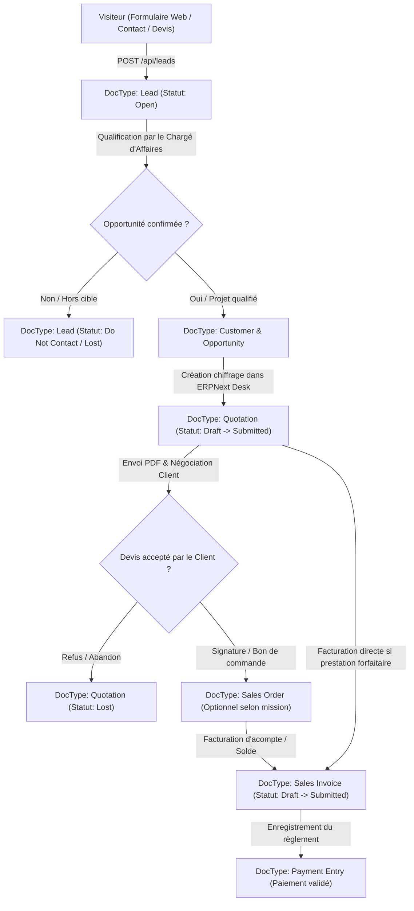

# BOKENGI GROUP 2.0 — PHASE 7.7 CADRAGE DU TUNNEL COMMERCIAL ERPNext : QUOTATION → SALES INVOICE

## 1. CONTEXTE & OBJECTIF

La plateforme **Bokengi Group 2.0** a migré l'intégralité de sa persistance vers **ERPNext v15**.
Le frontend Next.js 16 agit en tant que portail institutionnel d'acquisition de prospects, transmettant les demandes de devis, cadrages et sollicitations vers le DocType `Lead` d'ERPNext.

L'objectif de cette phase 7.7 est de **cadrer, documenter et verrouiller le processus commercial opérationnel** permettant à l'équipe commerciale et technique de Bokengi Group de convertir un `Lead` en Devis officiel (`Quotation`), puis en Commande (`Sales Order`) et Facture de vente (`Sales Invoice`) dans ERPNext Desk, **sans aucune génération automatique non supervisée**.

---

## 2. ARCHITECTURE COMMERCIALE CIBLE

---

## 3. INVENTAIRE DES DOCTYPES ERPNext CONCERNÉS

| DocType | Rôle dans Bokengi Group | Standard / Custom | Utilisation |
|---|---|---|---|
| `Lead` | Réception initiale du prospect depuis le site web | Standard + Custom Fields | Source unique du prospect |
| `Opportunity` | Qualification fine du besoin et estimation budgétaire | Standard | Optionnel (projets complexes > 10k€) |
| `Customer` | Tiers légal (Société / Institution / Particulier) | Standard | Obligatoire avant émission de facture |
| `Contact` | Personne physique interlocutrice (Email, Téléphone) | Standard | Relié au Customer |
| `Address` | Adresse de facturation et de siège social | Standard | Relié au Customer |
| `Item` | Catalogue des prestations et services du Groupe | Standard | Lignes de devis (Bokengi IT, Digital, etc.) |
| `Quotation` | Devis officiel chiffré avec validité et conditions | Standard + `custom_lead_link` | Devis transmis au prospect |
| `Sales Order` | Bon de commande engageant les livrables | Standard | Validation avant démarrage projet |
| `Sales Invoice`| Facture légale (Acompte, Échéance, Solde) | Standard + `custom_lead_link` | Pièce comptable émise |
| `Payment Entry`| Rapprochement du virement / encaissement | Standard | Comptabilité et trésorerie |

---

## 4. MATRICE DE TRANSITION : LEAD → QUOTATION → INVOICE

| Étape | Transition | Acteur | Déclencheur | Données Transférées | Saisie Manuelle Requise | Validation Humaine |
|---|---|---|---|---|---|---|
| **1** | `Web → Lead` | Système | Soumission formulaire | Nom, Email, Téléphone, Pôle, Message brut | Aucune (Automatique) | Non (Capture brute) |
| **2** | `Lead → Customer` | Chargé d'Affaires | Premier contact positif | Raison sociale, Contact, Email, Téléphone | SIRET/RCS, Adresse complète, Forme juridique | **OBLIGATOIRE** |
| **3** | `Customer → Quotation` | Resp. Pôle / Commercial | Cadrage technique validé | Identité client, Devise, Pôle référent | Lignes `Item`, Tarifs, Remises, Délais, Validité | **OBLIGATOIRE** |
| **4** | `Quotation → Sales Order` | Direction Commerciale | Accord client / Signature | Lignes de commande, Montant négocié | Date de début de mission, Échéancier de livraison | **OBLIGATOIRE** |
| **5** | `Order/Quote → Invoice` | Responsable Comptable | Ordre de facturation / Acompte | Données client, Montants, Taxes | Compte de revenu, Conditions de paiement, Date d'exigibilité | **OBLIGATOIRE** |

---

## 5. RÈGLES DE GESTION DEVIS (QUOTATION) DANS ERPNEXT DESK

1. **Items & Prestations :**
   - Les devis s'appuient sur des codes articles (`Item`) regroupés par Pôle :
     - `SRV-IT-*` (Audit sécurité, Infogérance, Architecture cloud)
     - `SRV-DIG-*` (Développement Next.js, API, E-commerce, Refonte UX)
     - `SRV-BUS-*` (Assistance opérationnelle, Gestion documentaire)
     - `SRV-CON-*` (Schéma directeur, Audit SI, AMOA)
     - `SRV-EVT-*` (Régie technique, Conférences, Digitalisation)
2. **Devises & Multi-devises :**
   - Prise en charge native dans ERPNext du **Franc CFA (XAF)** pour les marchés CEMAC / République du Congo, de l'**Euro (EUR)** et du **Dollar US (USD)** pour les projets internationaux.
3. **Validité & Conditions :**
   - Durée de validité standard fixée à **30 jours**.
   - Conditions de règlement standard : *Acompte de 40% à la commande, 30% à mi-parcours, solde 30% à la recette définitive*.

---

## 6. RÈGLES DE FACTURATION (SALES INVOICE)

1. **Conditions d'émission :**
   - Un `Customer` validé avec adresse fiscale valide est strictement requis.
   - Les comptes de taxes (TVA locale) et le compte de produit (Ventes de prestations de services) doivent être configurés dans la société ERPNext par défaut.
2. **Immutabilité comptable :**
   - Une fois soumise (`Submitted`), une facture ne peut être modifiée : toute régularisation nécessite une note de crédit (`Credit Note`) ou un avenant.

---

## 7. PRINCIPES D'AUTOMATISATION & GARDE-FOUS

### A. Ce qui est automatisé :
- La capture du Lead depuis `/api/leads` avec rattachement au pôle.
- L'envoi immédiat de l'accusé de réception et l'alerte à l'équipe commerciale (Phase 7.1).
- La traçabilité du lien d'origine (`custom_lead_link`) conservée sur le devis et la facture.

### B. Ce qui reste STRICTEMENT MANUEL (Interdiction d'automatisation) :
- **AUCUNE FACTURE GÉNÉRÉE AUTOMATIQUEMENT :** Le chiffrage, l'émission de devis et la facturation nécessitent obligatoirement l'approbation d'un ingénieur d'affaires ou d'un responsable financier dans ERPNext Desk.
- L'évaluation des risques et la vérification juridique du tiers.

---

## 8. SÉCURITÉ & NON-EXPOSITION CÔTÉ FRONTEND

- Aucun tarif, grille de remise interne ou compte bancaire n'est présent dans le code source Next.js.
- Aucun endpoint public ne permet d'initier ou d'altérer un document comptable.
- Toutes les opérations de devis/facturation s'exécutent dans l'espace authentifié sécurisé d'ERPNext Desk (`https://erp.bokengi-group.com/app`).

---

## 9. VALIDATION & TESTS STATIQUES

| Contrôle | Résultat | Commentaire |
|---|---|---|
| **TypeScript Check** (`pnpm tsc --noEmit`) | **PASS (0 erreur)** | Code applicatif intact |
| **Absence de régression Payload** | **PASS** | 0 référence Payload |
| **Audit des formulaires web** | **PASS** | Seul le DocType `Lead` est alimenté |
| **Absence de secrets exposés** | **PASS** | Aucune clé privée dans le frontend |

---

## 10. RECOMMANDATION POUR LA PHASE SUIVANTE (PHASE 7.8 / 8.0)

Le cadrage commercial ERPNext étant acté et les intégrations applicatives étant complètes (7.1 à 7.7) :

> **PHASE 8.0 — PRÉPARATION FINALE AU DÉPLOIEMENT & CHECK-LIST DE PRODUCTION (BOKENGI 2.0)**  
> *Objectif : Vérifier l'ensemble des variables d'environnement de production, la configuration DNS officielle (`https://bokengi-group.com`) et préparer la procédure de bascule définitive sans interruption de service.*
