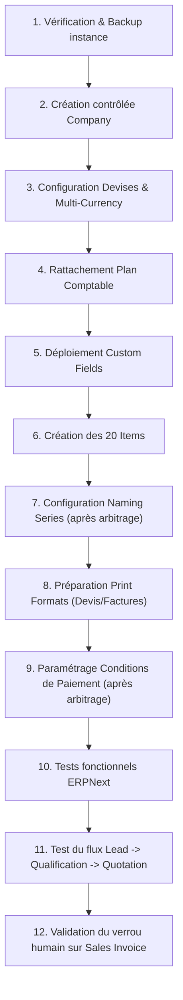

# BOKENGI 2.0 — PHASE 9.2 : PLAN D'EXÉCUTION DÉTAILLÉ DE LA CONFIGURATION ERPNext
**Référence :** `docs/PHASE9_2_ERPNEXT_EXECUTION_PLAN.md`  
**Date :** 26 Septembre 2026  
**Commit de référence :** `e9d79ad`  
**Statut :** 🟢 **PLAN D'EXÉCUTION PRÊT — AUCUNE ÉCRITURE EFFECTUÉE SUR ERPNEXT**  

---

## 1. GOUVERNANCE ABSOLUE & CADRE DE PRÉPARATION

La présente Phase 9.2 constitue le **plan d'exécution formel, ordonné et déterministe** pour la configuration du module commercial dans ERPNext Desk.

### Règles d'Inviolabilité :
- **AUCUNE modification n'est encore appliquée à l'instance ERPNext.**
- **AUCUNE donnée n'est écrite en base de données.**
- **AUCUN tarif, coordonnée bancaire ou condition de paiement n'est inventé.**
- **AUCUNE série de numérotation n'est sélectionnée unilatéralement.**
- **Le frontend Next.js 16, Cloudflare Workers, Cal.com, R2 et le pipeline GitHub Actions restent STRICTEMENT GELÉS.**
- **L'émission automatique de factures sans validation humaine préalable est strictement interdite.**

---

## 2. DONNÉES VALIDÉES CONSERVÉES (SOURCES DE VÉRITÉ)

### 2.1. Société Bokengi Group
- **Dénomination :** `Bokengi Group`
- **Forme juridique :** `TPE`
- **Capital social :** `7 500 €`
- **Siège social :** `Paris, France`
- **Email de contact officiel :** `contact@bokengi-group.com`
- **Téléphone officiel :** `+33 7 58 88 84 34`
- **Site web public :** `https://bokengi-group.com`
- **Territoire d'intervention :** `Afrique centrale & Projets internationaux à distance`

### 2.2. Catalogue des 20 Services Bokengi Group

| Pôle | Code Article | Libellé Officiel du Service | Statut Technique |
| :--- | :--- | :--- | :---: |
| **Bokengi IT** | `SRV-IT-01` | Cybersécurité & Résilience des Systèmes | Service non stocké (`is_stock_item: 0`) |
| **Bokengi IT** | `SRV-IT-02` | Infrastructures Réseaux & Serveurs Cloud | Service non stocké (`is_stock_item: 0`) |
| **Bokengi IT** | `SRV-IT-03` | Ingénierie Logicielle & Architectures API | Service non stocké (`is_stock_item: 0`) |
| **Bokengi IT** | `SRV-IT-04` | Supervision & Maintenance IT (MCO) | Service non stocké (`is_stock_item: 0`) |
| **Bokengi Digital** | `SRV-DIG-01` | Plateformes Web & Portails Haute Performance | Service non stocké (`is_stock_item: 0`) |
| **Bokengi Digital** | `SRV-DIG-02` | E-Commerce & Intégration Mobile Money | Service non stocké (`is_stock_item: 0`) |
| **Bokengi Digital** | `SRV-DIG-03` | Applications Mobiles & PWA Déconnectables | Service non stocké (`is_stock_item: 0`) |
| **Bokengi Digital** | `SRV-DIG-04` | Refonte Applicative & Audit d'Expérience (UX/UI) | Service non stocké (`is_stock_item: 0`) |
| **Bokengi Business** | `SRV-BUS-01` | Digitalisation des Processus & Zéro Papier | Service non stocké (`is_stock_item: 0`) |
| **Bokengi Business** | `SRV-BUS-02` | Intégration ERP & Outils de Gestion Commerciale | Service non stocké (`is_stock_item: 0`) |
| **Bokengi Business** | `SRV-BUS-03` | Tableaux de Bord Décisionnels & Reporting | Service non stocké (`is_stock_item: 0`) |
| **Bokengi Business** | `SRV-BUS-04` | Conduite du Changement & Formation des Équipes | Service non stocké (`is_stock_item: 0`) |
| **Bokengi Consulting**| `SRV-CON-01` | Schéma Directeur & Audit de Maturité Numérique | Service non stocké (`is_stock_item: 0`) |
| **Bokengi Consulting**| `SRV-CON-02` | Souveraineté des Données & Conformité Réglementaire | Service non stocké (`is_stock_item: 0`) |
| **Bokengi Consulting**| `SRV-CON-03` | Plans de Continuité d'Activité (PCA & PRA) | Service non stocké (`is_stock_item: 0`) |
| **Bokengi Consulting**| `SRV-CON-04` | Assistance à Maîtrise d'Ouvrage (AMOA) | Service non stocké (`is_stock_item: 0`) |
| **Bokengi Events** | `SRV-EVT-01` | Captation Multi-Caméras & Régie Streaming HD | Service non stocké (`is_stock_item: 0`) |
| **Bokengi Events** | `SRV-EVT-02` | Coordination Technique d'Événements Hybrides | Service non stocké (`is_stock_item: 0`) |
| **Bokengi Events** | `SRV-EVT-03` | Plateformes Événementielles & Billetterie QR | Service non stocké (`is_stock_item: 0`) |
| **Bokengi Events** | `SRV-EVT-04` | Production de Contenus Média & Aftermovies | Service non stocké (`is_stock_item: 0`) |

---

## 3. PRÉPARATION DU DÉPLOIEMENT DES CUSTOM FIELDS

Les définitions techniques de `scripts/erpnext/custom_fields.json` sont figées et validées :

- **Sur `Quotation` (Devis) :**
  - `custom_payload_id` (Data, read_only, unique)
  - `custom_invoice_number` (Data, unique)
  - `custom_lead_link` (Link vers `Lead`)
- **Sur `Sales Invoice` (Facture) :**
  - `custom_payload_id` (Data, read_only, unique)
  - `custom_invoice_number` (Data, unique)
  - `custom_lead_link` (Link vers `Lead`)

> **Mécanisme :** Déploiement prévu via le script idempotent `frappe_apps/bokengi_erp/scripts/deploy_to_erpnext.py` lors de l'exécution (Phase 9.3).

---

## 4. LES 4 ARBITRAGES BLOQUANTS REQUIS DU PROPRIÉTAIRE

Avant toute opération d'écriture sur l'instance ERPNext Desk, les **quatre décisions métier suivantes doivent être expressément fournies par le propriétaire** :

### Arbitrage 1 : Politique Tarifaire des Services
*Options documentées :*
1. **Option 1.A :** Définir un tarif / Taux Journalier Moyen (TJM) ou forfait standard de référence par article `Item`.
2. **Option 1.B :** Conserver le principe du tarif libre (`standard_rate = 0.00`), le montant étant négocié et fixé sur-mesure lors de l'établissement de chaque devis.

### Arbitrage 2 : Séries de Numérotation Légale (`Naming Series`)
*Options techniques :*
- **Devis (`Quotation`) :** `QTN-.YYYY.-.#####` (standard international) **OU** `DEV-.YYYY.-.#####` (format français).
- **Bon de commande (`Sales Order`) :** `SO-.YYYY.-.#####` (standard international) **OU** `CMD-.YYYY.-.#####` (format français).
- **Facture de vente (`Sales Invoice`) :** `ACC-SINV-.YYYY.-.#####` (standard international) **OU** `FAC-.YYYY.-.#####` (format français).

### Arbitrage 3 : Coordonnées Bancaires Officielles
*Informations à fournir pour figurer sur les modèles d'impression des factures :*
- **Titulaire du compte :** `[À fournir]`
- **Établissement bancaire :** `[À fournir]`
- **IBAN :** `[À fournir]`
- **Code BIC / SWIFT :** `[À fournir]`

### Arbitrage 4 : Conditions & Échéancier de Paiement
*Modalités officielles à paramétrer :*
- Pourcentage de l'acompte exigible à la commande (le cas échéant).
- Modalités de facturation intermédiaire / jalons de livraison.
- Exigibilité du solde (à la recette définitive).
- Délai de paiement légal (ex: à réception, 30 jours net).

---

## 5. ORDRE D'EXÉCUTION RECOMMANDÉ (12 ÉTAPES SÉQUENTIELLES)

### Détail des 12 étapes :
1. **Étape 1 — Vérification de l'instance & Point de sauvegarde :** Contrôle de l'accessibilité HTTPS et création d'un backup Frappe préalable (`bench backup`).
2. **Étape 2 — Création contrôlée de la Company `Bokengi Group` :** Création du document avec contrôle strict d'absence d'homonymie préalable.
3. **Étape 3 — Configuration des Devises & Multi-Devises :** Activation formelle d'`EUR`, `XAF`, `USD` et du drapeau `allow_multi_currency`.
4. **Étape 4 — Rattachement du Plan de Comptes :** Affectation du plan comptable général adapté aux prestations intellectuelles.
5. **Étape 5 — Déploiement des Custom Fields :** Exécution du script de déploiement pour `custom_lead_link` et `custom_invoice_number`.
6. **Étape 6 — Création des 20 Articles `Item` :** Instanciation des codes `SRV-IT-*`, `SRV-DIG-*`, `SRV-BUS-*`, `SRV-CON-*`, `SRV-EVT-*` en articles de services non stockés.
7. **Étape 7 — Configuration des Naming Series :** Paramétrage des séries de numérotation selon l'arbitrage du propriétaire.
8. **Étape 8 — Préparation des Print Formats :** Intégration des modèles PDF corporate pour Devis et Factures avec mentions légales et espace bancaire.
9. **Étape 9 — Configuration des Conditions de Paiement :** Paramétrage du modèle de conditions de règlement selon l'arbitrage du propriétaire.
10. **Étape 10 — Tests Fonctionnels ERPNext :** Contrôle de non-régression sur les DocTypes créés et les permissions.
11. **Étape 11 — Test du flux Commercial :** Simulation *Lead web ingesté → Qualification manuelle → Création d'une Quotation (Draft) → Soumission (Submitted)*.
12. **Étape 12 — Vérification de Sécurité Commerciale :** Confirmation stricte qu'aucune facture `Sales Invoice` ne peut être générée ou émise sans validation humaine préalable.

---

## 6. TABLEAU DE READINESS POUR LA PHASE 9.3

| Élément | Prêt | Bloquant | Décision requise | Action Phase 9.3 |
| :--- | :---: | :---: | :--- | :--- |
| **Société Bokengi Group** | ✅ OUI | ❌ NON | Aucune (Données validées) | Création dans DocType `Company` (Étape 2) |
| **Devises (EUR/XAF/USD)** | ✅ OUI | ❌ NON | Aucune (Périmètre validé) | Activation statutaire & multi-devises (Étape 3) |
| **Plan Comptable** | ✅ OUI | ❌ NON | Aucune (Modèle services standard) | Rattachement à la Société (Étape 4) |
| **Custom Fields** | ✅ OUI | ❌ NON | Aucune (Payloads prêts) | Exécution `deploy_to_erpnext.py` (Étape 5) |
| **Catalogue 20 Services** | ✅ OUI | ⚠️ OUI *(prix)* | **Arbitrage 1 : Tarif fixe vs Prix libre** | Création des 20 DocTypes `Item` (Étape 6) |
| **Naming Series** | ✅ OUI | ⚠️ OUI | **Arbitrage 2 : Préfixes QTN/SO/ACC vs DEV/CMD/FAC** | Paramétrage *Naming Series Tool* (Étape 7) |
| **Coordonnées Bancaires** | ✅ OUI *(layout)* | ⚠️ OUI *(données)* | **Arbitrage 3 : Titulaire, Banque, IBAN, BIC** | Injection dans le Print Format Facture (Étape 8) |
| **Conditions de Paiement** | ✅ OUI *(structure)* | ⚠️ OUI *(politique)*| **Arbitrage 4 : Acomptes, délais, solde** | Paramétrage Payment Terms Template (Étape 9) |
| **Tests de Sécurité Flux** | ✅ OUI | ❌ NON | Aucune (Règle d'or verrouillée) | Exécution des tests & contrôle humain (Étapes 10-12) |

---

## 7. CONCLUSION & ARRÊT CONFORME

La Phase 9.2 de préparation est close :
- Le plan d'exécution est complet et découpé en 12 étapes strictes.
- Les 4 arbitrages nécessaires sont isolés et présentés.
- Aucune écriture n'a été effectuée sur l'instance ERPNext.
- Le frontend et la production restent gelés.

**En attente explicite des 4 décisions du propriétaire pour engager la Phase 9.3 (Exécution).**
