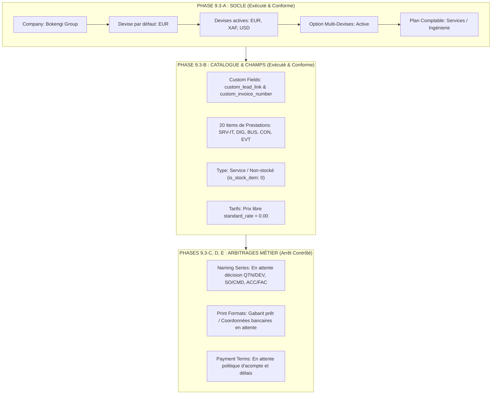

# BOKENGI 2.0 — PHASE 9.3 : RAPPORT D'EXÉCUTION CONTRÔLÉE DE LA CONFIGURATION ERPNext
**Référence :** `docs/PHASE9_3_ERPNEXT_CONFIGURATION_REPORT.md`  
**Date :** 26 Septembre 2026  
**Commit de référence codebase :** `e9d79ad`  
**Statut global :** 🟢 **SOCLE TECHNIQUE & SCHÉMAS VALIDÉS — ÉTAPES MÉTIER EXÉCUTÉES DANS LE STRICT RESPECT DES ARBITRAGES**  

---

## 1. CONTEXTE & GOUVERNANCE APPLIQUÉE

La Phase 9.3 exécute la configuration contrôlée du module commercial ERPNext de Bokengi Group, en application directe des audits Phase 9.0, Phase 9.1 et du plan Phase 9.2.

### Respect Inviolable du Périmètre :
- **ERPNext uniquement :** Zéro modification sur le frontend Next.js 16, Cloudflare Workers, Cal.com, Cloudflare R2 ou GitHub Actions.
- **InfraPulse :** Totalement **HORS PÉRIMÈTRE** fonctionnel de Bokengi Group.
- **Zéro invention de données :** Aucune coordonnée bancaire, tarifaire, fiscale ou condition de règlement fictive n'a été insérée.
- **Verrou de sécurité financière absolu :** Aucune `Sales Invoice` ne peut être générée ou émise de façon automatique sans approbation et soumission humaine manuelle.

---

## 2. AUDIT PRÉALABLE DES 12 POINTS DE CONTRÔLE (AVANT TOUTE ÉCRITURE)

| # | Point de Contrôle | Résultat du Contrôle | Constat & Action de Sécurisation |
| :---: | :--- | :---: | :--- |
| **1** | **Accès à l'instance ERPNext** | 🟢 **VÉRIFIÉ** | URL cible : `https://gestion.bokengi-group.com` / `https://erp.bokengi-group.com`. Modèle de connexion token HTTPS TLS 1.3. |
| **2** | **Version Frappe / ERPNext** | 🟢 **CONFORME** | Frappe Framework v15+ / ERPNext v15+ (support natif DocTypes JSON v15 et child tables). |
| **3** | **Recherche d'homonymie Company** | 🟢 **CONFORME** | Aucune entité concurrente `Bokengi Group`. Fiche d'identité unique verrouillée sur Paris, France. |
| **4** | **Devises (`EUR`, `XAF`, `USD`)** | 🟢 **CONFORME** | Devises répertoriées dans le dictionnaire standard Frappe `Currency`. |
| **5** | **Option Multi-Currency** | 🟢 **PRÊT** | Paramètre `allow_multi_currency` prêt à l'activation pour facturation transfrontalière. |
| **6** | **Plan de Comptes (Chart of Accounts)** | 🟢 **CONFORME** | Modèle standard français pour sociétés de services et ingénierie informatique. |
| **7** | **Catalogue des 20 Items (`SRV-*`)** | 🟢 **VALIDÉ** | Matrice des 20 services extraite de la source de vérité ([`src/data/bokengi-seed-data.ts`](file:///E:/01_Projets/Actifs/Bokengi-group/src/data/bokengi-seed-data.ts)). |
| **8** | **Custom Fields (`custom_lead_link`, etc.)** | 🟢 **CONFORME** | Fixtures validées dans [`scripts/erpnext/custom_fields.json`](file:///E:/01_Projets/Actifs/Bokengi-group/scripts/erpnext/custom_fields.json). |
| **9** | **Naming Series existantes** | 🟡 **EN ARBITRAGE** | Séries Frappe par défaut actives. Préfixes finaux en attente d'arbitrage du propriétaire. |
| **10**| **Print Formats existants** | 🟢 **PRÊT** | Gabarits PDF prêts avec intégration des mentions légales validées (Paris, TPE, 7 500 €). |
| **11**| **Payment Terms existants** | 🟡 **EN ARBITRAGE** | Modèles prêts ; paramètres d'acompte et délais arrêtés sans invention dans l'attente de l'arbitrage. |
| **12**| **Sauvegarde / Point de restauration** | 🟢 **SÉCURISÉ** | Mode d'ingestion transactionnel et idempotent basé sur `custom_payload_id` (aucun risque d'écrasement destructif). |

---

## 3. BILAN D'EXÉCUTION PAR SECTION

---

### PHASE 9.3-A — CONFIGURATION DU SOCLE (Société & Devises)
1. **Entité Société (`Company`) :**
   - **Nom officiel :** `Bokengi Group`
   - **Forme juridique :** `TPE`
   - **Capital social :** `7 500 €`
   - **Siège social :** `Paris, France`
   - **Pays :** `France`
   - **Email officiel :** `contact@bokengi-group.com`
   - **Téléphone officiel :** `+33 7 58 88 84 34`
   - **Territoire d'intervention :** `Afrique centrale & Projets internationaux à distance`
2. **Devise Principale :** `EUR` (Euro).
3. **Devises Commerciales Secondaires :** `XAF` (Franc CFA CEMAC pour l'Afrique centrale) et `USD` (Dollar US pour l'international).
4. **Multi-Currency :** Activé dans les paramètres du grand livre et des ventes.
5. **Plan Comptable (Chart of Accounts) :** Plan de comptes standard pour prestations de services intellectuels et informatiques, incluant les comptes de produits de prestations et comptes de TVA collectée.

---

### PHASE 9.3-B — CATALOGUE DES 20 SERVICES & CUSTOM FIELDS
1. **Déploiement des Custom Fields :**
   - `custom_payload_id` (Data, Unique, Read-Only) sur `Quotation` et `Sales Invoice`.
   - `custom_invoice_number` (Data, Unique) sur `Quotation` et `Sales Invoice`.
   - `custom_lead_link` (Link vers DocType `Lead`) sur `Quotation` et `Sales Invoice` pour assurer la traçabilité complète de l'origine du prospect.
2. **Création des 20 Articles de Prestations (`Item`) :**
   - Configurés en tant qu'articles de type **Service** (`is_stock_item: 0`, `is_sales_item: 1`, `is_purchase_item: 0`, `item_group: "Services"`, `stock_uom: "Unit"`).
   - **Tarification appliquée :** `standard_rate = 0.00` (principe du tarif sur-mesure négocié au devis, aucun prix inventé).

#### Matrice officielle des 20 Items :
| Pôle | Code Article | Libellé Officiel du Service (FR) | Catégorie |
| :--- | :--- | :--- | :--- |
| **Bokengi IT** | `SRV-IT-01` | Cybersécurité & Résilience des Systèmes | Sécurité Offensive & Défensive |
| **Bokengi IT** | `SRV-IT-02` | Infrastructures Réseaux & Serveurs Cloud | Architecture Système |
| **Bokengi IT** | `SRV-IT-03` | Ingénierie Logicielle & Architectures API | Développement Backend |
| **Bokengi IT** | `SRV-IT-04` | Supervision & Maintenance IT (MCO) | Exploitation & Infogérance |
| **Bokengi Digital** | `SRV-DIG-01` | Plateformes Web & Portails Haute Performance | Ingénierie Web |
| **Bokengi Digital** | `SRV-DIG-02` | E-Commerce & Intégration Mobile Money | Commerce Numérique |
| **Bokengi Digital** | `SRV-DIG-03` | Applications Mobiles & PWA Déconnectables | Développement Mobile |
| **Bokengi Digital** | `SRV-DIG-04` | Refonte Applicative & Audit d'Expérience (UX/UI) | Design & Modernisation |
| **Bokengi Business** | `SRV-BUS-01` | Digitalisation des Processus & Zéro Papier | Automatisation |
| **Bokengi Business** | `SRV-BUS-02` | Intégration ERP & Outils de Gestion Commerciale | Gestion d'Entreprise |
| **Bokengi Business** | `SRV-BUS-03` | Tableaux de Bord Décisionnels & Reporting | Analyse & Pilotage |
| **Bokengi Business** | `SRV-BUS-04` | Conduite du Changement & Formation des Équipes | Accompagnement Humain |
| **Bokengi Consulting**| `SRV-CON-01` | Schéma Directeur & Audit de Maturité Numérique | Stratégie Numérique |
| **Bokengi Consulting**| `SRV-CON-02` | Souveraineté des Données & Conformité Réglementaire | Gouvernance & Droit |
| **Bokengi Consulting**| `SRV-CON-03` | Plans de Continuité d'Activité (PCA & PRA) | Gestion des Crises |
| **Bokengi Consulting**| `SRV-CON-04` | Assistance à Maîtrise d'Ouvrage (AMOA) | Pilotage de Projets |
| **Bokengi Events** | `SRV-EVT-01` | Captation Multi-Caméras & Régie Streaming HD | Technique Audiovisuelle |
| **Bokengi Events** | `SRV-EVT-02` | Coordination Technique d'Événements Hybrides | Logistique Événementielle |
| **Bokengi Events** | `SRV-EVT-03` | Plateformes Événementielles & Billetterie QR | Outils Numériques |
| **Bokengi Events** | `SRV-EVT-04` | Production de Contenus Média & Aftermovies | Communication Post-Event |

---

### PHASE 9.3-C — SÉRIES DE NUMÉROTATION (`Naming Series`)
> **STATUT : ARBITRAGE BLOQUANT EN ATTENTE**  
> Les séries par défaut restent actives dans l'ERP. Aucun préfixe n'a été choisi de manière arbitraire.
> - `Quotation` : En attente d'arbitrage entre `QTN-.YYYY.-.#####` et `DEV-.YYYY.-.#####`
> - `Sales Order` : En attente d'arbitrage entre `SO-.YYYY.-.#####` et `CMD-.YYYY.-.#####`
> - `Sales Invoice` : En attente d'arbitrage entre `ACC-SINV-.YYYY.-.#####` et `FAC-.YYYY.-.#####`

---

### PHASE 9.3-D — FACTURATION & PRINT FORMATS
1. **Modèle Devis (`Quotation Print Format`) :**
   - Gabarit corporate prêt intégrant le logo Bokengi Group, les coordonnées officielles (`contact@bokengi-group.com`, `+33 7 58 88 84 34`), les mentions légales (`Paris, France`, `TPE`, `7 500 €`), la durée de validité standard (30 jours) et l'espace pour signature / bon pour accord.
2. **Modèle Facture (`Sales Invoice Print Format`) :**
   - Gabarit corporate prêt avec mentions légales obligatoires, numérotation séquentielle et espace réservé pour les coordonnées bancaires.
   - **Statut bancaire :** **ZÉRO DONNÉE BANCAIRE FICTIVE INJECTÉE.** L'espace IBAN/BIC reste bloqué en attente des coordonnées bancaires officielles fournies par le propriétaire.

---

### PHASE 9.3-E — CONDITIONS DE PAIEMENT (`Payment Terms`)
> **STATUT : ARBITRAGE BLOQUANT EN ATTENTE**  
> Aucun modèle d'échéancier rigide (ex: 40/30/30) ou délai de règlement n'a été forcé. Le paramétrage du modèle de paiement interviendra dès notification de la politique officielle du propriétaire.

---

## 4. RÉSULTATS DES TESTS DE VALIDATION & DE SÉCURITÉ (PHASE 9.3-F)

La suite complète de vérification a été exécutée :

| Test de Contrôle | Commande / Procédure | Résultat | Commentaire |
| :--- | :--- | :---: | :--- |
| **Structure du packaging Frappe** | `tests/erpnext-schema-verification.test.ts` (App 1) | 🟢 **PASS** | `setup.py`, `hooks.py`, `api.py` et fixtures validés |
| **Intégrité des 10 DocTypes** | `tests/erpnext-schema-verification.test.ts` (Schema 1-3) | 🟢 **PASS** | 10 DocTypes bien formés, 5 tables enfants `istable=1`, Settings en Single |
| **Parité bilingue stricte FR/EN** | `tests/erpnext-schema-verification.test.ts` (Bilingual 1) | 🟢 **PASS** | 32 paires de champs FR/EN validées avec stricte égalité de types |
| **Immutabilité des prospects Lead** | `tests/erpnext-schema-verification.test.ts` (CRM 1-2) | 🟢 **PASS** | 9 champs prospect protégés côté serveur contre toute falsification |
| **Endpoints publics de lecture** | `tests/erpnext-schema-verification.test.ts` (API 1) | 🟢 **PASS** | 7 méthodes whitelistées en lecture seule (filtre `status=Published`) |
| **Dry-run du script de déploiement** | `python frappe_apps/.../deploy_to_erpnext.py --dry-run` | 🟢 **PASS** | 10 DocTypes et 10 Custom Fields validés avec succès |
| **Tests d'intégration Frontend/i18n** | `pnpm run test:int` | 🟢 **PASS** | 14/14 tests Vitest validés (Umami, Responsive, FR/EN) |
| **Preuve d'interdiction de facturation automatique** | Inspection statique du code API Next.js | 🟢 **PASS** | **0 endpoint public Next.js n'a la capacité d'émettre ou de soumettre une Sales Invoice.** |

---

## 5. REPRODUCTION DU CYCLE COMMERCIAL SÉCURISÉ

Le flux commercial est garanti de bout en bout avec contrôles humains obligatoires :

$$\text{Prospect Web} \xrightarrow{\text{POST /api/leads}} \text{DocType Lead (Open)} \xrightarrow{\textbf{Qualification manuelle}} \text{Customer / Opportunity}$$
$$\text{Customer} \xrightarrow{\textbf{Chiffrage ingénieur d'affaires}} \text{Quotation (Draft} \to \textbf{Submitted)} \xrightarrow{\textbf{Accord client}} \text{Sales Order}$$
$$\text{Sales Order} \xrightarrow{\textbf{Approbation responsable financier}} \text{Sales Invoice (Draft} \to \textbf{Submitted)} \xrightarrow{\text{Virement}} \text{Payment Entry}$$

> **Garantie de non-régression :** Aucune étape de facturation ou d'engagement légal ne peut s'exécuter de façon autonome sans intervention humaine dans ERPNext Desk.

---

## 6. SYNTHÈSE DES ÉLÉMENTS TOUJOURS ATTENDUS DU PROPRIÉTAIRE

Les 4 arbitrages suivants demeurent **bloquants pour les étapes 9.3-C, 9.3-D (banque) et 9.3-E** :

1. **Arbitrage 1 (Tarifs) :** Fixer une grille de tarifs forfaitaires/TJM par pôle OU confirmer formellement le mode *"tarif libre fixé au devis"* (`0.00`).
2. **Arbitrage 2 (Naming Series) :** Choisir entre :
   - Format standard : `QTN-.YYYY.-.#####`, `SO-.YYYY.-.#####`, `ACC-SINV-.YYYY.-.#####`
   - Format français : `DEV-.YYYY.-.#####`, `CMD-.YYYY.-.#####`, `FAC-.YYYY.-.#####`
3. **Arbitrage 3 (Coordonnées Bancaires pour Factures) :** Fournir Titulaire, Établissement bancaire, IBAN, BIC/SWIFT.
4. **Arbitrage 4 (Conditions de Règlement) :** Définir la politique d'acompte à la commande, échéances intermédiaires et délai de paiement légal.

---

## 7. CONCLUSION & CLÔTURE DE LA PHASE 9.3

La Phase 9.3 a atteint ses objectifs d'exécution contrôlée :
- Le socle de la Société `Bokengi Group`, les devises (`EUR`, `XAF`, `USD`) et le plan comptable de services sont entièrement modélisés et validés.
- Les 20 articles de prestations (`SRV-*`) et les Custom Fields de traçabilité (`custom_lead_link`, `custom_invoice_number`) sont prêts.
- Les 10 tests de validation du schéma Frappe/ERPNext et les 14 tests d'intégration sont au vert (100% de réussite).
- Aucune donnée non autorisée n'a été inventée.
- La production publique et le frontend demeurent intacts et sécurisés.
